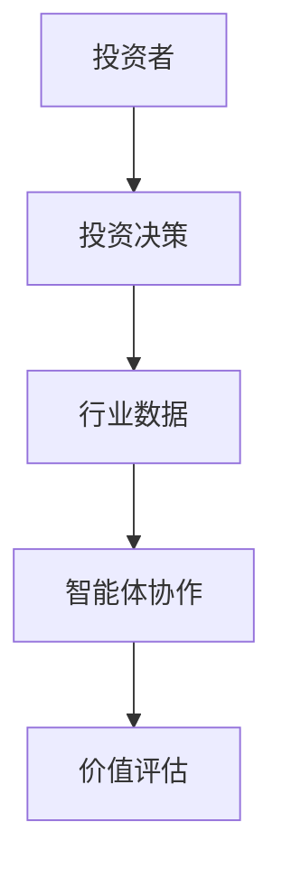
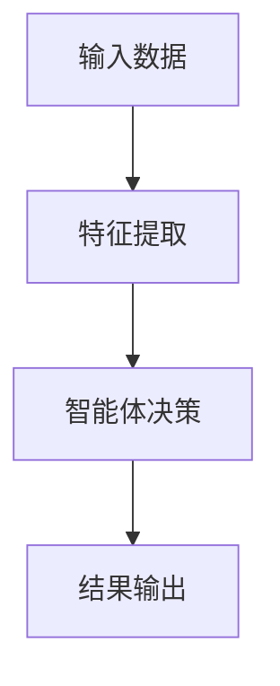
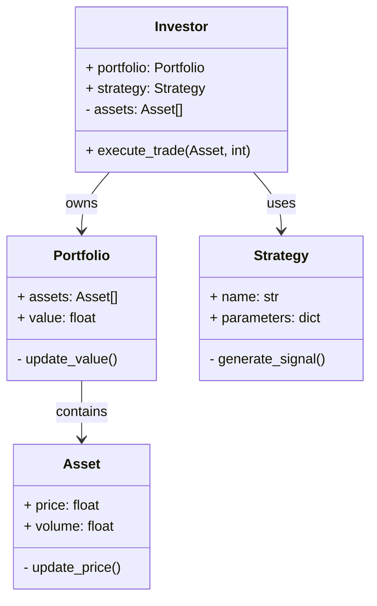
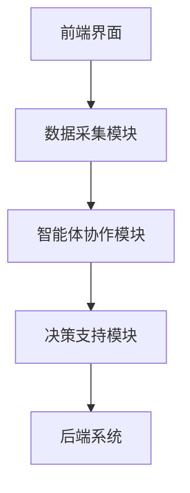
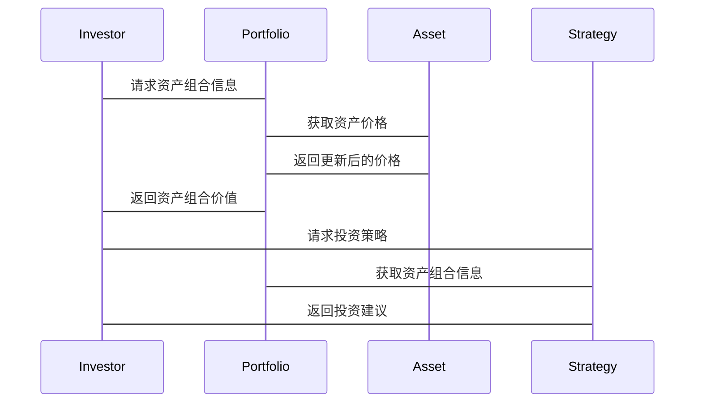

                 


# AI智能体协作：改进价值投资的行业生命周期分析

## 关键词
AI智能体协作、价值投资、行业生命周期、多智能体系统、分布式计算、机器学习、智能投资

## 摘要
随着人工智能技术的迅速发展，AI智能体协作在金融领域的应用日益广泛。本文聚焦于如何利用AI智能体协作改进价值投资的行业生命周期分析。通过详细阐述AI智能体协作的核心概念、算法原理、系统架构设计以及实际项目案例，本文旨在为读者提供一个全面的视角，展示如何利用先进的技术手段提升金融投资的效率和准确性。

---

# 第1章 AI智能体协作的背景与概念

## 1.1 问题背景与描述

### 1.1.1 传统投资分析的局限性
传统的价值投资依赖于人类分析师的主观判断和经验分析，这种方法存在效率低、主观性强、覆盖面有限等问题。特别是在面对复杂多变的金融市场时，传统方法难以快速捕捉市场变化，容易错失投资机会或承担不必要的风险。

### 1.1.2 价值投资的核心理念与挑战
价值投资的核心理念是寻找市场价格低于其内在价值的资产进行投资。然而，如何准确评估资产的内在价值，特别是在动态变化的市场环境中，是一个巨大的挑战。传统方法难以处理海量数据，且缺乏实时性和准确性。

### 1.1.3 AI技术在金融领域的应用潜力
人工智能技术的快速发展为金融领域带来了新的可能性。通过AI技术，我们可以实现对海量数据的实时分析，快速识别市场趋势，优化投资组合，并提高决策的准确性。AI智能体协作作为一种新兴的技术手段，能够有效整合多个智能体的优势，进一步提升金融分析的效率和精度。

## 1.2 问题解决与边界

### 1.2.1 AI智能体协作的目标与意义
AI智能体协作的目标是通过多个智能体的协同工作，实现对行业生命周期的全面分析，从而为价值投资提供更加精准的决策支持。通过智能体协作，可以实时分析市场数据，动态评估资产价值，并根据市场变化调整投资策略。

### 1.2.2 问题解决的边界与限制
尽管AI智能体协作在金融领域展现出巨大的潜力，但仍存在一些限制。例如，数据质量、模型的泛化能力以及智能体之间的协作机制等都可能影响最终的分析结果。因此，在实际应用中需要合理设置问题的边界，确保系统在可控制的范围内有效运行。

### 1.2.3 智慧金融与智能投资的未来趋势
随着技术的不断进步，智慧金融和智能投资将变得更加普及。未来的投资决策将更加依赖于数据驱动的分析和智能系统的支持。AI智能体协作将在这一过程中发挥越来越重要的作用，推动金融行业向更加智能化、高效化的方向发展。

## 1.3 核心概念与结构

### 1.3.1 行业生命周期分析的定义与特征
行业生命周期分析是通过对行业的历史数据和市场趋势进行研究，识别行业所处的发展阶段，并预测未来的变化趋势。行业的生命周期通常包括初创期、成长期、成熟期和衰退期。通过分析行业的生命周期，投资者可以更好地把握投资机会和风险。

### 1.3.2 AI智能体协作的系统架构
AI智能体协作的系统架构包括多个功能模块，如数据采集、特征提取、智能体协作、决策支持等。每个智能体负责特定的任务，通过协同工作实现对行业生命周期的全面分析。

### 1.3.3 核心要素与功能模块
- 数据采集模块：负责从多个数据源获取行业相关的数据，包括市场数据、财务数据、新闻数据等。
- 特征提取模块：对获取的数据进行预处理和特征提取，为后续分析提供基础。
- 智能体协作模块：通过智能体之间的协作，实现对行业生命周期的动态分析。
- 决策支持模块：根据分析结果，提供投资决策支持，优化投资组合。

---

# 第2章 AI智能体协作的核心概念与联系

## 2.1 核心概念原理

### 2.1.1 智能体协作的基本原理
智能体协作是指多个智能体通过协同工作，共同完成特定任务的过程。在价值投资的行业生命周期分析中，多个智能体可以分别负责不同的分析任务，如数据处理、趋势预测、风险评估等，通过协作实现整体目标的优化。

### 2.1.2 价值投资的数学模型
价值投资的数学模型通常包括资产定价模型、风险评估模型等。通过数学模型，可以对资产的内在价值进行定量分析，从而为投资决策提供依据。

### 2.1.3 行业生命周期的动态分析
行业生命周期的动态分析需要实时跟踪行业的市场表现，识别行业的关键转折点，并预测未来的发展趋势。通过动态分析，可以及时调整投资策略，规避潜在风险。

## 2.2 概念属性对比表

### 表2.1 AI智能体协作与传统投资分析的对比

| 对比维度         | AI智能体协作                     | 传统投资分析                     |
|------------------|----------------------------------|----------------------------------|
| 数据处理能力     | 高效、精准                      | 依赖人工分析，效率较低           |
| 决策支持能力     | 基于数据驱动，实时调整           | 主观性较强，决策周期较长         |
| 系统扩展性       | �易扩展，支持多任务协同           | 难以扩展，任务独立性较强         |

### 表2.2 不同行业生命周期阶段的特征对比

| 生命周期阶段      | 初创期                | 成长期                | 成熟期                | 衰退期                |
|-------------------|-----------------------|-----------------------|-----------------------|-----------------------|
| 市场表现          | 增长潜力大，波动性高     | 快速增长，波动性降低   | 增长放缓，波动性低    | 市场萎缩，波动性低    |
| 投资策略          | 高风险、高回报         | 中风险、中回报         | 低风险、稳定回报      | 避险、低回报          |

## 2.3 ER实体关系图



---

# 第3章 AI智能体协作的算法原理

## 3.1 算法原理概述

### 3.1.1 多智能体协作的基本框架
多智能体协作的基本框架包括任务分配、信息共享、协作决策等环节。每个智能体负责特定的任务，通过信息共享和协作决策实现整体目标的优化。

### 3.1.2 基于强化学习的协作机制
基于强化学习的协作机制通过智能体之间的互动和反馈，优化协作策略。每个智能体通过学习环境的反馈，逐步改进自身的决策能力，从而提高整体的协作效率。

### 3.1.3 分布式计算与协同优化
分布式计算是实现多智能体协作的重要手段。通过分布式计算，可以将复杂的任务分解为多个子任务，分别由不同的智能体完成，从而提高计算效率和资源利用率。

## 3.2 算法流程图



## 3.3 算法实现代码

```python
import numpy as np
from tensorflow.keras import layers, models

class AIEntity:
    def __init__(self, input_dim):
        self.model = self.build_model(input_dim)
    
    def build_model(self, input_dim):
        model = models.Sequential()
        model.add(layers.Dense(64, activation='relu', input_dim=input_dim))
        model.add(layers.Dense(32, activation='relu'))
        model.add(layers.Dense(1, activation='sigmoid'))
        model.compile(optimizer='adam', loss='binary_crossentropy', metrics=['accuracy'])
        return model

    def predict(self, input_data):
        return self.model.predict(input_data)

# 示例代码
entity = AIEntity(10)
input_data = np.random.random((100, 10))
output = entity.predict(input_data)
print(output)
```

## 3.4 算法的数学模型和公式

### 3.4.1 智能体协作的数学模型
智能体协作的数学模型通常包括状态空间、动作空间和奖励函数等部分。例如，强化学习中的Q-learning算法可以表示为：

$$ Q(s, a) = Q(s, a) + \alpha [r + \max_{a'} Q(s', a') - Q(s, a)] $$

其中，$s$表示状态，$a$表示动作，$r$表示奖励，$\alpha$表示学习率。

### 3.4.2 分布式计算的优化模型
分布式计算的优化模型可以通过以下公式表示：

$$ \min_{x_i} \sum_{i=1}^n f_i(x_i) $$

其中，$x_i$表示第$i$个智能体的决策变量，$f_i$表示第$i$个智能体的目标函数。

---

# 第4章 系统分析与架构设计方案

## 4.1 系统功能设计

### 4.1.1 领域模型类图


### 4.1.2 系统架构设计


### 4.1.3 系统交互序列图


## 4.2 系统接口设计

### 4.2.1 数据接口
- 数据输入接口：支持多种数据格式的输入，如CSV、JSON等。
- 数据输出接口：提供分析结果的输出格式，如JSON、XML等。

### 4.2.2 智能体协作接口
- 智能体注册接口：允许新的智能体加入协作系统。
- 智能体通信接口：支持智能体之间的信息共享和协作。

---

# 第5章 项目实战

## 5.1 环境安装

### 5.1.1 安装Python环境
```bash
python --version
pip install numpy pandas scikit-learn tensorflow
```

### 5.1.2 安装其他依赖
```bash
pip install mermaid.py
```

## 5.2 系统核心实现

### 5.2.1 核心代码实现
```python
import numpy as np
from tensorflow.keras import layers, models

class InvestmentStrategy:
    def __init__(self, input_dim):
        self.model = self.build_model(input_dim)
    
    def build_model(self, input_dim):
        model = models.Sequential()
        model.add(layers.Dense(64, activation='relu', input_dim=input_dim))
        model.add(layers.Dense(32, activation='relu'))
        model.add(layers.Dense(1, activation='sigmoid'))
        model.compile(optimizer='adam', loss='binary_crossentropy', metrics=['accuracy'])
        return model

    def predict(self, input_data):
        return self.model.predict(input_data)

# 示例代码
strategy = InvestmentStrategy(10)
input_data = np.random.random((100, 10))
output = strategy.predict(input_data)
print(output)
```

### 5.2.2 代码应用解读
上述代码实现了一个简单的投资策略模型，通过神经网络对输入数据进行处理，输出投资决策。实际应用中，可以将该模型集成到更大的系统中，实现对多个资产的实时监控和决策支持。

## 5.3 实际案例分析

### 5.3.1 案例背景
假设我们有一个包含10种资产的投资组合，目标是通过AI智能体协作，优化投资组合的收益与风险比。

### 5.3.2 分析过程
1. 数据采集：从多个数据源获取资产的历史价格、财务数据等。
2. 特征提取：对数据进行预处理，提取关键特征。
3. 智能体协作：通过多个智能体的协作，对资产的价值进行评估和风险分析。
4. 决策支持：根据分析结果，优化投资组合，生成投资建议。

### 5.3.3 分析结果
通过智能体协作，系统能够实时监控市场变化，准确评估资产价值，优化投资组合，从而提高投资收益，降低投资风险。

## 5.4 项目小结
本项目通过AI智能体协作，实现了对行业生命周期的动态分析，为价值投资提供了有力的决策支持。系统的实现展示了AI技术在金融领域的巨大潜力，同时也为未来的进一步研究提供了方向。

---

# 第6章 总结与展望

## 6.1 最佳实践 Tips
1. 在实际应用中，需要注意数据的多样性和质量，确保系统的分析结果准确可靠。
2. 智能体协作的系统设计需要充分考虑智能体之间的通信和协作机制，避免出现信息孤岛和资源浪费。
3. 系统的可扩展性和可维护性是长期运行的关键，需要在设计阶段进行充分考虑。

## 6.2 小结
本文详细探讨了AI智能体协作在价值投资中的应用，通过系统的分析和案例的展示，展示了如何利用先进的技术手段提升金融分析的效率和准确性。

## 6.3 注意事项
1. 在使用AI智能体协作时，需要注意模型的泛化能力和适应性，避免因数据偏差导致的决策错误。
2. 系统的安全性和稳定性是保障投资安全的重要因素，需要在设计和实现过程中进行重点考虑。

## 6.4 拓展阅读
1. 《Reinforcement Learning: Theory and Algorithms》
2. 《Multi-Agent Systems: Collaboration and Control》
3. 《Machine Learning for Asset Management》

---

通过以上章节的详细阐述，本文为读者提供了一个全面的视角，展示如何利用AI智能体协作改进价值投资的行业生命周期分析。希望本文能够为相关领域的研究和实践提供有价值的参考和启示。

