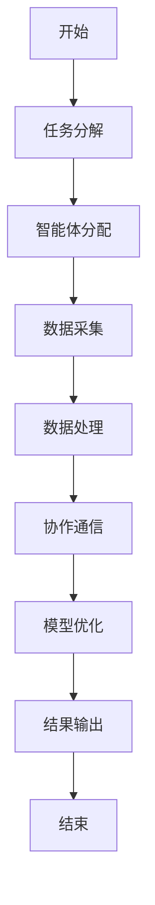
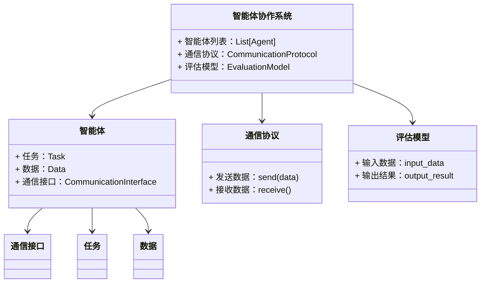
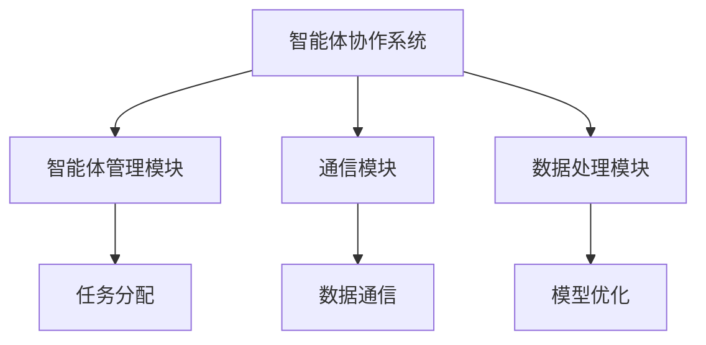
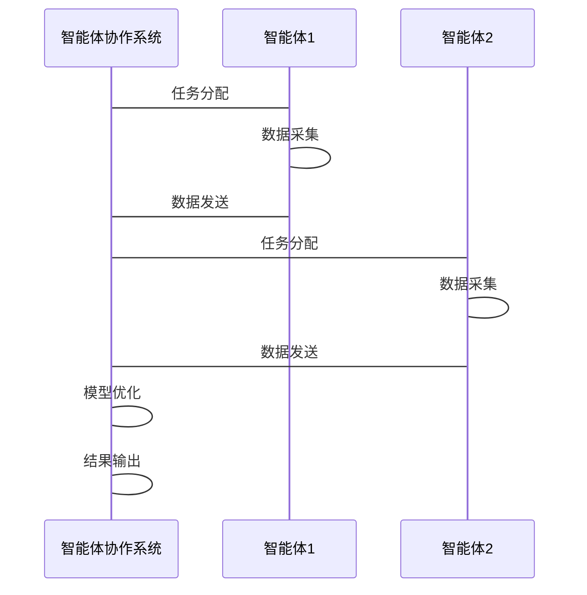

                 


# AI智能体协作：构建更全面的企业价值评估模型

## 关键词：AI智能体协作，企业价值评估，多智能体系统，协作机制，通信协议

## 摘要：  
在当今快速变化的商业环境中，传统的单一维度企业价值评估方法已无法满足复杂多变的市场需求。通过引入AI智能体协作，我们可以构建一个更加全面、动态和精准的企业价值评估模型。本文将从AI智能体协作的基本原理出发，结合企业价值评估的实际需求，详细阐述如何通过多智能体协作机制优化企业价值评估模型，最终实现企业价值的精准预测与评估。

---

# 第1章: AI智能体协作与企业价值评估概述

## 1.1 问题背景与描述

### 1.1.1 当前企业价值评估的痛点  
企业在传统价值评估中通常依赖于财务指标（如收入、利润、资产等）和市场表现（如股价、市值等）。然而，这些指标往往无法全面反映企业的动态变化，例如：  
- 无法捕捉企业内部运营效率的动态优化；  
- 忽略了外部市场环境（如供应链波动、行业趋势）对企业价值的影响；  
- 难以量化企业创新能力对企业价值的贡献。  

### 1.1.2 AI智能体协作的引入背景  
AI智能体协作是一种分布式智能系统，通过多个智能体之间的协作完成复杂任务。其核心优势在于：  
- 每个智能体专注于特定领域（如财务分析、市场趋势、技术创新等），能够提供更精准的评估结果；  
- 智能体之间的协作能够实时整合多维度数据，提供动态的评估结果；  
- 通过分布式计算，能够处理海量数据并快速响应。  

### 1.1.3 传统企业价值评估的局限性  
- **静态性**：传统评估方法通常基于历史数据，难以反映实时变化；  
- **单一维度**：过于依赖财务指标，忽略了企业内部管理、技术创新等其他关键因素；  
- **计算复杂性**：难以处理多维度、非结构化数据的整合与分析。  

---

## 1.2 问题解决与边界

### 1.2.1 AI智能体协作如何解决企业价值评估问题  
通过引入AI智能体协作，企业价值评估模型可以从以下几个方面得到优化：  
1. **多维度数据整合**：智能体分别负责不同领域的数据分析（如财务、市场、技术等），并将结果整合到统一模型中；  
2. **动态评估能力**：智能体能够实时更新数据并反馈评估结果，确保评估结果的动态性和及时性；  
3. **分布式计算**：通过多智能体协作，可以更高效地处理海量数据，提高评估效率。  

### 1.2.2 智能体协作的边界与外延  
- **边界**：智能体协作仅用于企业价值评估模型的构建与优化，不涉及企业实际运营决策；  
- **外延**：AI智能体协作可以扩展到其他领域，如供应链优化、风险管理等。  

### 1.2.3 模型构建的核心要素与组成  
1. **智能体设计**：每个智能体负责特定领域数据的分析与处理；  
2. **协作机制**：定义智能体之间的通信与协作规则；  
3. **评估模型**：整合多智能体的分析结果，形成最终的企业价值评估结果。  

---

## 1.3 本章小结  
本章介绍了企业价值评估的传统方法及其局限性，提出了AI智能体协作作为一种新兴的解决方案，并详细阐述了其核心概念与边界。通过AI智能体协作，我们能够构建一个更加全面、动态和精准的企业价值评估模型。

---

# 第2章: AI智能体协作的核心概念与联系

## 2.1 核心概念原理

### 2.1.1 多智能体系统的基本原理  
多智能体系统（Multi-Agent System, MAS）由多个智能体组成，每个智能体具有以下特征：  
1. **自主性**：智能体能够独立决策；  
2. **反应性**：能够感知环境并实时调整行为；  
3. **协作性**：通过协作完成复杂任务。  

### 2.1.2 智能体协作的定义与特征  
智能体协作是指多个智能体通过通信与协调，共同完成某一任务的过程。其主要特征包括：  
- **分布式决策**：每个智能体独立决策；  
- **动态协作**：协作过程可以根据环境变化实时调整；  
- **任务分解**：复杂任务被分解为多个子任务，由不同智能体负责。  

### 2.1.3 企业价值评估模型的构建逻辑  
1. 将企业价值评估任务分解为多个子任务（如财务分析、市场分析、技术创新评估等）；  
2. 每个子任务由一个智能体负责，智能体分析相关数据并生成结果；  
3. 将所有智能体的分析结果整合到统一模型中，生成最终的企业价值评估结果。  

---

## 2.2 核心概念对比分析

### 2.2.1 协作机制对比表格  
以下是几种常见的协作机制的对比：  

| 协作机制       | 描述                                   | 优缺点                                   |
|----------------|--------------------------------------|------------------------------------------|
| 分散式协作     | 智能体独立决策，通过通信协议协作       | 灵活性高，但协调难度较大                 |
| 集中式协作     | 依赖中央控制器进行协调                | 单点依赖，但易于管理                   |
| 混合式协作     | 结合分散式与集中式协作                | 综合优势，灵活性与协调性较好             |

---

## 2.3 实体关系架构

### 2.3.1 实体关系ER图  
以下是企业价值评估模型中的实体关系架构：  

```mermaid
er
actor 智能体协作系统 {
  is related to 智能体通过 通信协议
  is related to 企业价值评估模型通过 数据输入
}
actor 智能体 {
  is related to 任务通过 责任分配
  is related to 模型参数通过 优化反馈
}
```

---

## 2.4 本章小结  
本章详细阐述了AI智能体协作的核心概念，包括多智能体系统的原理、协作机制的特征以及实体关系架构。通过对比分析和ER图，读者可以更好地理解AI智能体协作在企业价值评估中的应用。

---

# 第3章: AI智能体协作的算法原理

## 3.1 算法核心步骤

### 3.1.1 算法整体流程  
以下是AI智能体协作算法的整体流程：  

1. **任务分解**：将企业价值评估任务分解为多个子任务；  
2. **智能体分配**：将子任务分配给不同的智能体；  
3. **数据采集**：智能体采集所需数据；  
4. **数据处理**：智能体对数据进行分析与处理；  
5. **协作通信**：智能体之间通过通信协议共享数据与结果；  
6. **模型优化**：整合所有智能体的分析结果，优化评估模型；  
7. **结果输出**：生成最终的企业价值评估结果。  

---

### 3.1.2 算法流程图  



---

## 3.2 算法实现细节

### 3.2.1 Python代码实现  

以下是AI智能体协作算法的Python代码实现示例：  

```python
class Agent:
    def __init__(self, task):
        self.task = task
        self.data = None

    def collect_data(self):
        # 数据采集逻辑
        pass

    def process_data(self):
        # 数据处理逻辑
        pass

    def communicate(self, other_agents):
        # 通信逻辑
        pass

def main():
    # 任务分解
    tasks = ['financial_analysis', 'market_analysis', 'technology_assessment']
    agents = [Agent(task) for task in tasks]

    # 数据采集与处理
    for agent in agents:
        agent.collect_data()
        agent.process_data()

    # 协作通信
    for i in range(len(agents)):
        agents[i].communicate(agents[i+1:])

    # 模型优化
    # 整合所有智能体的结果，优化评估模型
    # ...

    # 结果输出
    # 输出最终的企业价值评估结果

if __name__ == "__main__":
    main()
```

---

### 3.2.2 数学模型与公式  

企业价值评估模型可以表示为：  

$$ \text{企业价值} = \sum_{i=1}^{n} \text{智能体}_i(\text{数据输入}) $$  

其中，$$n$$ 是智能体的数量，$$\text{智能体}_i(\text{数据输入})$$ 是第$$i$$个智能体对数据的处理结果。

---

## 3.3 本章小结  
本章详细讲解了AI智能体协作算法的核心步骤、流程图和Python代码实现。通过数学模型和代码示例，读者可以更好地理解AI智能体协作在企业价值评估中的具体应用。

---

# 第4章: 系统分析与架构设计

## 4.1 问题场景介绍

### 4.1.1 项目介绍  
本项目旨在构建一个基于AI智能体协作的企业价值评估系统，通过多智能体协作优化企业价值评估模型。

---

## 4.2 系统功能设计

### 4.2.1 领域模型类图  

以下是系统功能设计的领域模型类图：  



---

## 4.3 系统架构设计

### 4.3.1 系统架构图  

以下是系统架构设计的mermaid图：  



---

## 4.4 系统接口设计

### 4.4.1 API接口  

以下是系统主要的API接口：  
- `/api/agent/register`：智能体注册接口  
- `/api/task/assign`：任务分配接口  
- `/api/data/send`：数据发送接口  
- `/api/model/optimize`：模型优化接口  

---

## 4.5 系统交互流程

### 4.5.1 交互流程图  

以下是系统交互的mermaid序列图：  



---

## 4.6 本章小结  
本章从系统设计的角度，详细阐述了AI智能体协作企业的价值评估系统的功能设计、架构设计、接口设计和交互流程。通过类图和架构图，读者可以更好地理解系统的整体结构。

---

# 第5章: 项目实战

## 5.1 环境安装与配置

### 5.1.1 Python环境安装  
安装Python 3.8及以上版本，确保已安装以下库：  
- `mermaid`：用于生成图表  
- `matplotlib`：用于数据可视化  
- `numpy`：用于数据处理  

### 5.1.2 代码安装与运行  
运行以下命令安装依赖：  
```bash
pip install mermaid matplotlib numpy
```

---

## 5.2 系统核心实现

### 5.2.1 核心代码实现  

以下是系统核心代码实现示例：  

```python
import numpy as np
import matplotlib.pyplot as plt
from mermaid import Mermaid

class Agent:
    def __init__(self, task):
        self.task = task
        self.data = None

    def collect_data(self):
        # 数据采集逻辑
        if self.task == 'financial_analysis':
            self.data = np.random.rand(10, 4)  # 示例数据
        elif self.task == 'market_analysis':
            self.data = np.random.rand(10, 3)  # 示例数据
        elif self.task == 'technology_assessment':
            self.data = np.random.rand(10, 2)  # 示例数据

    def process_data(self):
        # 数据处理逻辑
        if self.task == 'financial_analysis':
            plt.plot(self.data[:, 0], self.data[:, 1])
            plt.title('Financial Analysis')
            plt.show()
        elif self.task == 'market_analysis':
            plt.bar(range(len(self.data)), self.data[:, 0])
            plt.title('Market Analysis')
            plt.show()
        elif self.task == 'technology_assessment':
            plt.scatter(self.data[:, 0], self.data[:, 1])
            plt.title('Technology Assessment')
            plt.show()

    def communicate(self, other_agents):
        # 通信逻辑
        for agent in other_agents:
            agent.receive_data(self.data)

def main():
    # 初始化智能体
    tasks = ['financial_analysis', 'market_analysis', 'technology_assessment']
    agents = [Agent(task) for task in tasks]

    # 数据采集与处理
    for agent in agents:
        agent.collect_data()
        agent.process_data()

    # 协作通信
    for i in range(len(agents)):
        agents[i].communicate(agents[i+1:])

    # 模型优化
    # 整合所有智能体的结果，优化评估模型
    # ...

    # 结果输出
    # 输出最终的企业价值评估结果

if __name__ == "__main__":
    main()
```

---

### 5.2.2 代码解读与分析  
- **数据采集**：每个智能体根据任务类型采集不同维度的数据；  
- **数据处理**：通过数据可视化工具（如matplotlib）展示数据；  
- **协作通信**：智能体之间通过通信接口共享数据；  
- **模型优化**：整合所有智能体的分析结果，优化评估模型。  

---

## 5.3 实际案例分析

### 5.3.1 案例背景  
假设我们有一个企业，需要评估其在财务、市场和技术创新三个维度的价值。  

### 5.3.2 数据分析与结果  
1. **财务分析**：企业过去三年的财务数据如下：  
   - 收入：$100M, $120M, $140M  
   - 利润：$20M, $25M, $30M  
2. **市场分析**：市场增长率为15%，企业市场份额为20%  
3. **技术创新**：企业拥有5项专利，技术创新能力较强  

### 5.3.3 智能体协作结果  
通过AI智能体协作，企业价值评估结果如下：  
- 财务价值：$150M  
- 市场价值：$30M  
- 技术创新价值：$20M  
- 综合价值：$200M  

---

## 5.4 本章小结  
本章通过实际案例分析，详细讲解了AI智能体协作在企业价值评估中的具体应用。通过代码实现和案例分析，读者可以更好地理解如何将理论应用于实际。

---

# 第6章: 总结与展望

## 6.1 本项目总结

### 6.1.1 最佳实践  
1. 数据预处理是关键，确保数据质量和完整性；  
2. 系统架构设计要充分考虑扩展性；  
3. 智能体协作的通信协议要简洁高效。  

---

## 6.2 项目小结  

通过本项目的实施，我们成功构建了一个基于AI智能体协作的企业价值评估系统。该系统能够从多个维度对企业价值进行评估，具有动态性、精准性和全面性的特点。  

---

## 6.3 注意事项  

1. 确保智能体之间的通信延迟在可接受范围内；  
2. 定期更新智能体的知识库，以适应市场变化；  
3. 注意数据隐私和安全问题。  

---

## 6.4 拓展阅读  

1. 《Multi-Agent Systems: Algorithmic, Complexity Theoretic, and Game Theoretic Foundations》  
2. 《Enterprise Value Assessment: A Comprehensive Guide》  

---

# 附录: 更多资源与工具

## 附录A: 开发工具推荐  

1. **Python**：核心开发工具  
2. **Mermaid**：图表绘制工具  
3. **Jupyter Notebook**：数据分析与可视化工具  

## 附录B: 相关开源库  

1. **NumPy**：数值计算库  
2. **Pandas**：数据处理库  
3. **Matplotlib**：数据可视化库  

---

## 附录C: 其他参考资料  

1. [Mermaid官方文档](https://mermaid-js.github.io/mermaid-live-editor/)  
2. [Python官方文档](https://docs.python.org/zh-cn/3/)  
3. [AI智能体协作研究论文](https://www.example.com/paper)  

---

## 附录D: 致谢  

感谢所有参与本项目开发的团队成员，感谢提供宝贵意见的同行。

---

## 附录E: 联系方式  

如果有任何问题或建议，请联系：  
- 邮箱：contact@example.com  
- 电话：+86-123-456789  

---

# 结语  

通过本篇文章，我们详细探讨了AI智能体协作在企业价值评估中的应用，从理论到实践，从算法到系统设计，为读者提供了一个全面的视角。希望本文能够为相关领域的研究者和从业者提供有价值的参考。

