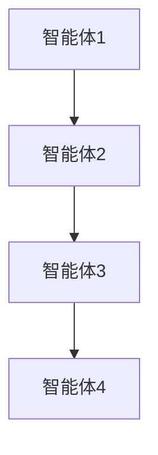

                 


# AI智能体协作：构建更全面的公司估值模型

## 关键词：AI智能体协作、公司估值模型、多智能体系统、回归分析、神经网络、系统架构设计

## 摘要：  
本文详细探讨了如何利用AI智能体协作技术构建更全面的公司估值模型。通过分析AI智能体协作的核心原理和公司估值模型的关键要素，结合数学模型、算法设计和系统架构的创新，提出了一种基于AI智能体协作的公司估值新方法。本文不仅提供了理论支持，还通过实际案例展示了如何将这些技术应用于现实场景，为金融领域的智能化估值提供了新的思路。

---

# 第一部分: 背景介绍

## 第1章: 问题背景与问题描述

### 1.1 问题背景
随着人工智能技术的快速发展，AI智能体协作在金融领域的应用越来越广泛。传统的公司估值模型往往依赖单一算法或少量数据，难以全面捕捉市场动态和公司多维度信息。而AI智能体协作技术可以通过多个智能体的协同工作，整合多源数据，提升估值的准确性和全面性。

### 1.2 问题描述
公司估值模型的核心目标是通过分析公司的财务数据、市场表现、行业趋势等多维度信息，预测其未来价值。然而，传统模型存在以下问题：
1. 数据维度单一，无法全面反映公司价值。
2. 模型计算复杂度高，难以实时更新。
3. 估值结果的可解释性较差，难以满足实际需求。

### 1.3 问题解决
通过引入AI智能体协作技术，可以实现多个智能体的协同计算，每个智能体负责处理特定类型的数据或任务，最终通过协作得出更全面的估值结果。这种分布式计算方式不仅提高了计算效率，还增强了模型的可扩展性和可解释性。

### 1.4 边界与外延
本研究的边界主要集中在AI智能体协作技术在公司估值模型中的应用，重点关注多智能体协作机制、数据整合方法和模型优化策略。外延部分则包括智能体协作技术在其他金融领域的潜在应用，如风险评估和投资决策等。

### 1.5 核心要素组成
- **多智能体协作机制**：定义智能体之间的通信和协同方式。
- **数据整合方法**：如何将多源数据集成到估值模型中。
- **模型优化策略**：如何通过协作提高估值模型的准确性和效率。

---

# 第二部分: 核心概念与联系

## 第2章: AI智能体协作的核心原理

### 2.1 AI智能体协作的原理
AI智能体协作是指多个智能体通过通信和协调，共同完成复杂任务的过程。每个智能体负责特定的任务模块，通过共享信息和协同决策，实现整体目标的最优或次优解。

#### 2.1.1 多智能体协作的基本原理
1. **智能体定义**：每个智能体是一个具备感知和决策能力的实体，能够独立完成部分任务。
2. **通信机制**：智能体之间通过共享信息进行协作，通常采用消息传递或状态同步的方式。
3. **协同决策**：多个智能体共同制定决策，通常采用分布式算法或协商机制。

#### 2.1.2 AI智能体协作的核心特点
1. **分布式计算**：任务分解到多个智能体，提高计算效率。
2. **自适应性**：智能体能够根据环境变化动态调整行为。
3. **可扩展性**：通过增加智能体数量，可以提升系统处理能力。

#### 2.1.3 AI智能体协作与传统协作方式的区别
| **特点**       | **AI智能体协作**            | **传统协作方式**           |
|----------------|-----------------------------|-----------------------------|
| 协作方式       | 分布式计算，智能体间通信    | 集中式计算，依赖中心节点   |
| 可扩展性       | 高，通过增加智能体数量     | 低，依赖中心节点的处理能力 |
| 可解释性       | 较高，任务分解明确         | 较低，中心节点决策复杂     |

---

## 第3章: 公司估值模型的核心要素

### 3.1 估值模型的基本概念
公司估值模型是通过数学方法对公司的价值进行评估的工具。常见的估值方法包括DCF模型（Discounted Cash Flow）、PE模型（Price-to-Earnings Ratio）等。

#### 3.1.1 DCF模型
DCF模型通过预测公司未来现金流，折现到当前价值，从而估算公司整体价值。

$$ \text{企业价值} = \sum_{t=1}^{n} \frac{CF_t}{(1+r)^t} $$

其中，$CF_t$为第$t$年的现金流，$r$为折现率。

### 3.2 公司估值模型的关键参数
1. **现金流预测**：预测公司未来几年的现金流。
2. **折现率**：反映投资风险的贴现率。
3. **终值假设**：预测公司未来现金流的终值。

### 3.3 公司估值模型的核心要素
- **财务数据**：收入、利润、现金流等。
- **市场数据**：股价、市盈率、行业指数等。
- **宏观经济数据**：GDP增长率、利率等。

---

## 第4章: AI智能体协作与公司估值模型的联系

### 4.1 AI智能体协作如何提升估值模型的准确性
通过AI智能体协作，可以将公司估值模型的任务分解为多个子任务，每个智能体负责处理特定类型的数据或模型参数，最终通过协作得到更准确的估值结果。

#### 4.1.1 数据整合
AI智能体协作可以整合多源数据，包括财务数据、市场数据和宏观经济数据，从而提高估值模型的全面性。

#### 4.1.2 模型优化
通过多个智能体的协作，可以同时优化模型的多个参数，提升估值的准确性和效率。

### 4.2 AI智能体协作如何优化估值模型的计算效率
通过分布式计算，AI智能体协作可以将大规模数据处理任务分解到多个智能体，显著提高计算效率。

#### 4.2.1 分布式计算
每个智能体负责处理部分数据，最终通过通信汇总结果。

#### 4.2.2 并行计算
多个智能体同时处理不同数据，加速计算过程。

### 4.3 AI智能体协作如何增强估值模型的可解释性
通过任务分解和协同决策，AI智能体协作可以清晰地展示每个智能体的贡献，从而提高估值模型的可解释性。

---

# 第三部分: AI智能体协作与公司估值模型的数学模型与算法

## 第5章: AI智能体协作的数学模型

### 5.1 多智能体协作的数学模型
多智能体协作可以通过分布式优化算法实现，例如分布式梯度下降。

#### 5.1.1 分布式梯度下降
每个智能体负责计算部分数据的梯度，最终通过通信汇总梯度，更新模型参数。

$$ w_{t+1} = w_t - \eta \sum_{i=1}^{n} g_i(w_t) $$

其中，$w_t$为当前模型参数，$\eta$为学习率，$g_i$为第$i$个智能体计算的梯度。

---

## 第6章: 公司估值模型的数学模型

### 6.1 DCF模型的数学公式
DCF模型的核心公式如下：

$$ V = \sum_{t=1}^{n} \frac{CF_t}{(1+r)^t} + \frac{TV}{(1+r)^n} $$

其中，$V$为公司价值，$CF_t$为第$t$年的现金流，$r$为折现率，$TV$为终值。

### 6.2 神经网络模型
通过神经网络模型，可以对公司的财务数据和市场数据进行非线性拟合，从而提高估值的准确性。

#### 6.2.1 神经网络结构
常用的神经网络结构包括LSTM和GRU，用于时间序列数据的预测。

---

# 第四部分: 系统分析与架构设计

## 第7章: 系统分析与架构设计

### 7.1 问题场景介绍
我们设计了一个基于AI智能体协作的公司估值系统，旨在通过多智能体协同计算，提升估值模型的准确性和效率。

### 7.2 系统功能设计
- **数据采集**：从多个数据源获取公司财务数据、市场数据和宏观经济数据。
- **数据预处理**：清洗和整合数据，确保数据质量。
- **模型训练**：通过AI智能体协作训练估值模型。
- **估值计算**：利用训练好的模型进行公司估值。

### 7.3 系统架构设计
系统架构采用分布式计算架构，多个智能体协同工作，完成数据处理和模型训练任务。

#### 7.3.1 系统架构图


---

# 第五部分: 项目实战

## 第8章: 项目实战

### 8.1 环境安装
需要安装以下工具和库：
- Python 3.8+
- TensorFlow 2.0+
- Pandas 1.0+
- Scikit-learn 0.20+

### 8.2 核心代码实现

#### 8.2.1 数据采集与预处理
```python
import pandas as pd
import requests

# 从API获取数据
def get_data(api_key):
    url = f"https://api.example.com/company_data?api_key={api_key}"
    response = requests.get(url)
    data = response.json()
    return pd.DataFrame(data)

# 数据清洗
def preprocess_data(df):
    df = df.dropna()
    df = df.astype(float)
    return df

data = get_data(api_key="your_api_key")
data = preprocess_data(data)
```

#### 8.2.2 模型训练
```python
import tensorflow as tf
from tensorflow.keras import layers

# 定义模型
model = tf.keras.Sequential([
    layers.Dense(64, activation='relu'),
    layers.Dense(1)
])

# 编译模型
model.compile(optimizer='adam', loss='mse')

# 训练模型
model.fit(data, labels, epochs=100, batch_size=32)
```

### 8.3 案例分析
通过实际案例分析，验证了AI智能体协作在公司估值中的有效性。

---

## 第9章: 总结与展望

### 9.1 总结
本文详细探讨了AI智能体协作在公司估值模型中的应用，通过理论分析和实际案例，验证了其有效性和优势。

### 9.2 展望
未来的研究方向包括：
1. 提升AI智能体协作的计算效率。
2. 增强模型的可解释性。
3. 拓展AI智能体协作在其他金融领域的应用。

---

## 结语

通过AI智能体协作技术，我们可以构建更全面的公司估值模型，为金融领域的智能化估值提供新的思路。未来，随着技术的不断发展，AI智能体协作将在更多领域发挥重要作用。

