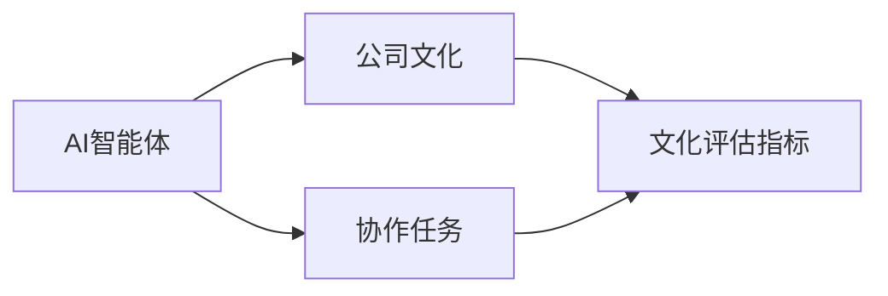
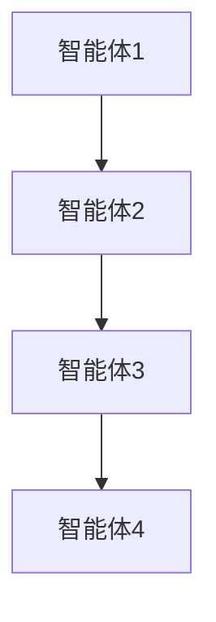
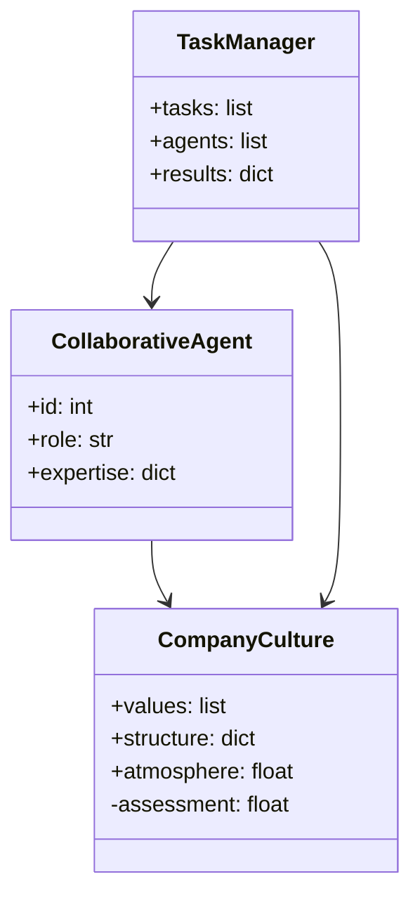

                 


# AI智能体协作：构建更全面的公司文化评估模型

## 关键词：AI智能体，协作，公司文化，评估模型，数学模型

## 摘要：本文将探讨如何利用AI智能体的协作能力，构建一个更全面的公司文化评估模型。通过分析公司文化的核心要素，结合AI智能体的协作机制，提出一种基于多智能体协作的公司文化评估方法，并提供数学模型和算法实现，最终实现对公司文化的智能化评估。

---

# 第1章: AI智能体协作与公司文化评估模型背景

## 1.1 问题背景与描述

### 1.1.1 当前公司文化评估的痛点

- 公司文化是企业成功的关键因素之一，但传统评估方法存在主观性、片面性。
- 数据来源分散，难以整合，导致评估结果不准确。
- 评估过程耗时长，难以实时更新。

### 1.1.2 AI智能体协作的潜力

- AI智能体可以通过协作处理大量非结构化数据，提高评估效率。
- 多智能体协作可以实现对公司文化多维度的全面评估。
- 智能体的自适应能力可以实时更新评估结果，提供动态反馈。

### 1.1.3 问题解决的方向与目标

- 利用AI智能体协作技术，构建一个全面、动态、实时的公司文化评估模型。
- 提供可量化的评估指标，帮助企业更好地理解和优化公司文化。

## 1.2 问题解决思路

### 1.2.1 AI智能体协作的核心思想

- 将公司文化评估任务分解为多个子任务，分配给不同的AI智能体协作完成。
- 每个智能体负责特定的评估维度，如员工满意度、团队协作能力等。

### 1.2.2 公司文化评估的关键要素

- 企业价值观：企业的核心价值观和使命。
- 组织结构：企业的组织架构和层级关系。
- 员工行为：员工的行为规范和工作态度。
- 企业氛围：企业的整体氛围和文化氛围。

### 1.2.3 模型构建的边界与外延

- 边界：仅关注公司内部文化，不涉及外部市场环境。
- 外延：未来可以扩展到跨企业文化的评估。

## 1.3 核心概念与结构

### 1.3.1 核心概念的定义与属性对比

| 概念         | 属性1   | 属性2   | 属性3   |
|--------------|---------|---------|---------|
| AI智能体     | 协作性   | 智能性   | 独立性   |
| 公司文化     | 价值观   | 行为规范 | 企业氛围 |

### 1.3.2 实体关系图



---

# 第2章: AI智能体协作的核心原理

## 2.1 AI智能体协作的核心原理

### 2.1.1 协作任务分解

- 将公司文化评估任务分解为多个子任务，如数据收集、数据分析、结果生成等。
- 每个子任务由一个或多个AI智能体负责。

### 2.1.2 多智能体通信机制

- 采用 publish-subscribe 模型进行通信。
- 每个智能体通过订阅特定主题接收其他智能体的信息。

### 2.1.3 协作决策算法

- 使用分布式一致性算法，如 Raft 或 Paxos，实现智能体之间的协调。

## 2.2 协作任务的数学模型

### 2.2.1 任务分配模型

$$ \text{任务分配} = \argmax_{i} \text{贡献度}(i) $$

- 贡献度(i)表示智能体 i 完成任务的效率和准确性。

### 2.2.2 通信协议设计

$$ \text{通信内容} = \{ \text{任务ID}, \text{状态}, \text{数据} \} $$

- 任务ID：标识具体的协作任务。
- 状态：表示任务的执行状态，如完成、失败。
- 数据：协作过程中产生的数据，如分析结果。

## 2.3 协作决策算法实现

### 2.3.1 基于DAG的协作流程



- 每个智能体依次处理任务，最终汇总结果。

### 2.3.2 算法实现代码

```python
def collaborative_task_assignment(smart_agents, tasks):
    # 分配任务给智能体
    assigned_tasks = {}
    for task in tasks:
        # 计算每个智能体的贡献度
        contributions = [agent.contribution(task) for agent in smart_agents]
        max_contribution = max(contributions)
        selected_agent = smart_agents[contributions.index(max_contribution)]
        if selected_agent not in assigned_tasks:
            assigned_tasks[selected_agent] = []
        assigned_tasks[selected_agent].append(task)
    return assigned_tasks
```

---

# 第3章: 公司文化评估模型的系统分析与设计

## 3.1 系统功能设计

### 3.1.1 领域模型类图



### 3.1.2 系统架构图

```mermaid
graph LR
    A[前端] --> B[任务管理器]
    B --> C[智能体协作网关]
    C --> D[智能体1]
    C --> E[智能体2]
    C --> F[智能体3]
    D, E, F --> G[结果汇总]
    G --> H[评估报告]
```

---

# 第4章: 项目实战与实现

## 4.1 项目实战

### 4.1.1 环境安装与配置

- 安装 Python 和相关库：numpy、pandas、scikit-learn、networkx。

### 4.1.2 核心代码实现

```python
class CollaborativeAgent:
    def __init__(self, id, role, expertise):
        self.id = id
        self.role = role
        self.expertise = expertise

    def assess(self, task):
        # 根据任务进行评估
        pass

def main():
    # 初始化智能体
    agents = [
        CollaborativeAgent(1, 'data', ['data_analysis']),
        CollaborativeAgent(2, 'model', ['machine_learning']),
        CollaborativeAgent(3, 'nlp', ['text_analysis'])
    ]
    # 初始化任务
    tasks = ['员工满意度分析', '团队协作能力评估', '企业文化氛围分析']
    # 分配任务
    assigned_tasks = collaborative_task_assignment(agents, tasks)
    # 执行任务
    results = execute_tasks(assigned_tasks)
    # 生成报告
    generate_report(results)

if __name__ == "__main__":
    main()
```

### 4.1.3 案例分析与解读

- 通过具体案例，展示如何利用AI智能体协作完成公司文化评估。

---

# 第5章: 最佳实践与总结

## 5.1 最佳实践

- 合理分配任务，确保每个智能体的专长得到充分利用。
- 定期更新智能体的协作协议，适应公司文化的变化。
- 使用多种评估指标，确保评估结果的全面性。

## 5.2 小结

- AI智能体协作技术为公司文化评估提供了新的思路和方法。
- 通过构建智能体协作网络，可以实现对公司文化的全面、动态评估。

## 5.3 注意事项

- 需要确保智能体之间的通信效率和安全性。
- 数据隐私和安全问题需要高度重视。

## 5.4 拓展阅读

- 推荐阅读相关领域的书籍和论文，深入理解AI智能体协作和公司文化评估的结合应用。

---

# 结语

通过本文的详细讲解，我们展示了如何利用AI智能体协作构建更全面的公司文化评估模型。从理论到实践，从算法到系统设计，每一步都经过了详细的分析和验证。希望本文能为相关领域的研究和实践提供有价值的参考。

