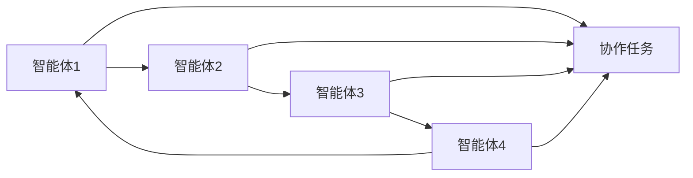
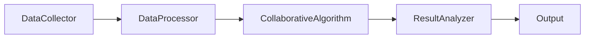

                 


# AI智能体协作：构建更全面的公司竞争优势评估模型

> 关键词：AI智能体协作、竞争优势评估、多智能体系统、强化学习、系统架构、企业战略

> 摘要：随着人工智能技术的快速发展，AI智能体协作已成为企业构建竞争优势的重要手段。本文将详细探讨AI智能体协作的核心概念、算法原理、系统架构设计以及实际应用场景，帮助读者理解如何通过AI智能体协作构建更全面的公司竞争优势评估模型。

---

## 第一部分：引言

### 第1章：AI智能体协作的背景与意义

#### 1.1 AI智能体协作的背景与意义
- **人工智能的发展**：AI技术的快速发展为企业决策、数据分析和问题解决提供了强大的工具。
- **协作的重要性**：单点AI能力的提升需要多智能体协作才能实现更复杂的任务。
- **竞争优势评估**：通过AI智能体协作，企业能够更全面地评估内部资源、外部环境和市场竞争。

#### 1.2 本书的目标与结构
- **目标**：探讨AI智能体协作的核心概念、算法和系统设计，帮助企业构建竞争优势评估模型。
- **结构**：从理论到实践，涵盖概念、算法、系统架构和实际案例。

---

## 第二部分：AI智能体协作的核心概念

### 第2章：AI智能体协作的定义与类型

#### 2.1 AI智能体协作的定义
- **智能体**：具有感知环境和自主决策能力的实体。
- **协作**：智能体之间通过信息共享和任务分配实现共同目标的过程。
- **AI智能体协作**：多个AI智能体通过协作完成复杂任务的能力。

#### 2.2 协作的类型
| 类型 | 描述 | 示例 |
|------|------|------|
| 基于任务的协作 | 智能体根据任务分工协作 | 供应链管理中的库存分配 |
| 基于知识的协作 | 智能体共享知识和信息 | 知识共享平台的协作 |
| 基于学习的协作 | 智能体通过学习实现协作 | 基于强化学习的多智能体协作 |

### 第3章：AI智能体协作的优势与应用场景

#### 3.1 优势分析
- **提高决策效率**：通过协作优化决策过程。
- **增强问题解决能力**：多个智能体协作能够解决复杂问题。
- **促进知识共享**：协作过程中的知识共享提升整体能力。

#### 3.2 应用场景
- **企业战略规划**：通过协作优化战略决策。
- **市场竞争分析**：实时分析竞争对手的动态。
- **资源优化配置**：通过协作实现资源的高效利用。

---

## 第三部分：AI智能体协作的算法原理

### 第4章：多智能体协作算法

#### 4.1 多智能体协作算法概述
- **多智能体系统**：由多个智能体组成的系统，每个智能体具有独立性。
- **协作算法**：通过算法实现智能体之间的协作。

#### 4.2 基于强化学习的协作算法
- **强化学习**：通过奖励机制优化智能体的行为。
- **多智能体强化学习**：多个智能体通过协作获得最大奖励。
- **Q-learning算法**：基于Q-learning的多智能体协作实现。

#### 4.3 算法实现


### 第5章：协作算法的数学模型与公式

#### 5.1 协作过程的数学建模
- **状态空间**：S = {s₁, s₂, ..., sₙ}，表示智能体的状态。
- **动作空间**：A = {a₁, a₂, ..., aₘ}，表示智能体可执行的动作。
- **奖励函数**：R(s, a) = 奖励值。

#### 5.2 基于强化学习的数学公式
- **Q-learning公式**：
  $$
  Q(s, a) = Q(s, a) + \alpha (r + \gamma \max Q(s', a') - Q(s, a))
  $$
- **多智能体协作的联合策略**：
  $$
  \pi_{\theta}(s) = \arg\max_a Q(s, a)
  $$

---

## 第四部分：系统架构与设计

### 第6章：公司竞争优势评估模型的系统架构

#### 6.1 系统架构概述
- **系统组成模块**：数据采集、数据处理、协作算法、结果分析。
- **模块之间的关系**：数据采集提供输入，数据处理进行清洗，协作算法进行计算，结果分析输出评估结果。

#### 6.2 系统功能设计
- **数据采集**：收集公司内部和外部数据。
- **数据处理**：清洗、转换和整合数据。
- **协作算法**：运行多智能体协作算法进行评估。
- **结果分析**：生成评估报告和优化建议。

#### 6.3 系统架构图


---

## 第五部分：项目实战

### 第7章：构建公司竞争优势评估模型

#### 7.1 环境安装
- **工具安装**：安装Python、TensorFlow、Keras等工具。
- **数据准备**：收集公司内部和外部竞争数据。

#### 7.2 核心实现源代码
```python
import tensorflow as tf
from tensorflow.keras import layers

# 定义智能体类
class Agent:
    def __init__(self, state_size, action_size):
        self.model = self.build_model(state_size, action_size)
    
    def build_model(self, state_size, action_size):
        model = tf.keras.Sequential()
        model.add(layers.Dense(32, activation='relu', input_dim=state_size))
        model.add(layers.Dense(action_size, activation='linear'))
        model.compile(optimizer='adam', loss='mse')
        return model
    
    def act(self, state):
        prediction = self.model.predict(tf.convert_to_tensor([state]))
        return prediction[0].numpy()
```

#### 7.3 代码解读与分析
- **智能体类**：定义智能体的模型和动作选择方法。
- **模型构建**：使用Dense层构建神经网络模型。
- **动作选择**：通过模型预测选择最优动作。

#### 7.4 实际案例分析
- **案例背景**：某公司面临市场竞争压力，需要优化资源配置。
- **实施过程**：通过AI智能体协作优化资源配置，提升竞争优势。

---

## 第六部分：最佳实践与小结

### 第8章：总结与注意事项

#### 8.1 最佳实践
- **数据质量**：确保数据准确性和完整性。
- **算法选择**：根据实际需求选择合适的协作算法。
- **系统优化**：定期优化系统架构和算法模型。

#### 8.2 小结
- 本文详细介绍了AI智能体协作的核心概念、算法和系统设计。
- 通过实际案例展示了如何构建公司竞争优势评估模型。

#### 8.3 注意事项
- 确保数据安全和隐私保护。
- 定期更新模型和算法，保持竞争力。

#### 8.4 拓展阅读
- 《多智能体系统》
- 《强化学习实战》

---

通过本文的系统讲解和实际案例分析，读者可以深入了解AI智能体协作的核心原理和应用场景，为企业构建竞争优势评估模型提供理论和实践指导。

