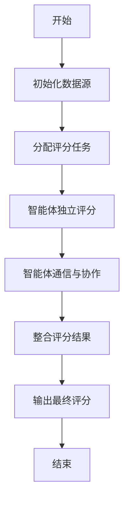
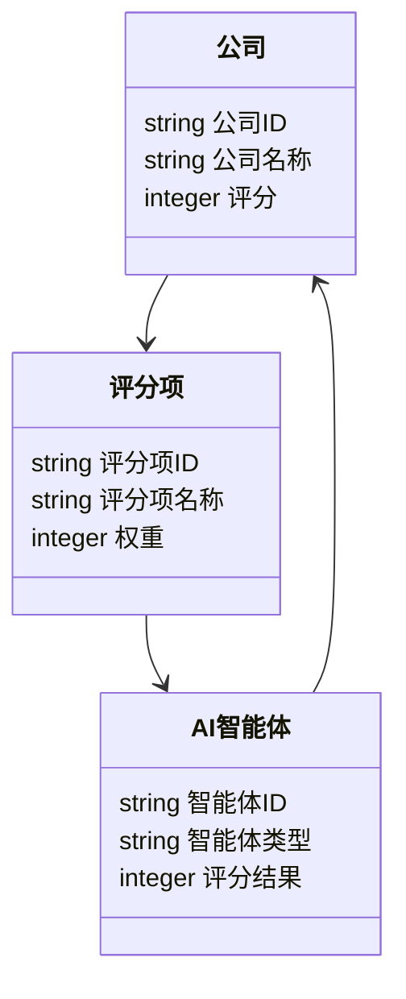
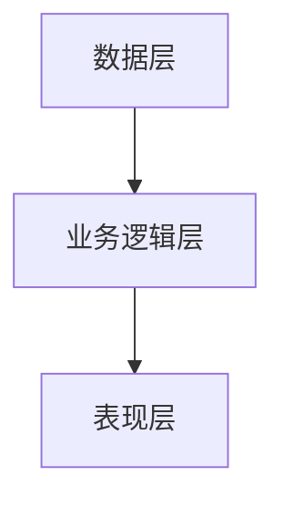
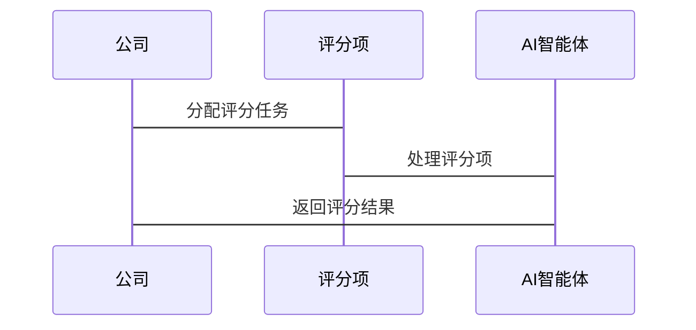

                 


# AI智能体协作：构建更全面的公司质量评分系统

## 关键词：AI智能体协作，公司质量评分系统，多智能体协作，评分算法，系统架构设计

## 摘要：  
本文将详细介绍如何通过AI智能体协作构建一个更全面的公司质量评分系统。我们将从问题背景出发，分析现有评分系统的局限性，提出基于AI智能体协作的新解决方案，并详细阐述其核心概念、算法原理、系统架构设计以及实际项目实施的步骤。通过本文，读者将能够全面理解如何利用AI技术提升公司质量评分的准确性和全面性。

---

## 第1章: 背景介绍

### 1.1 问题背景

#### 1.1.1 当前公司质量评估的痛点  
在现代企业中，公司质量的评估通常依赖于人工评分或简单的规则-based系统。然而，这些方法存在以下问题：  
1. **评分维度单一**：传统评分系统往往只关注财务指标，忽略了客户满意度、员工满意度等关键维度。  
2. **主观性过强**：人工评分容易受到主观因素的影响，导致评分结果不客观。  
3. **数据利用不足**：企业积累了大量数据，但现有评分系统未能充分挖掘这些数据的价值。  
4. **实时性不足**：传统评分系统更新频率低，难以反映企业的实时动态。  

#### 1.1.2 问题描述  
公司质量评分系统的目标是通过多维度数据的分析，为企业提供一个全面、客观的质量评估。然而，现有的评分系统存在以下问题：  
1. **评分维度有限**：通常只考虑财务指标，如利润、收入等，忽略了客户满意度、员工满意度、创新能力等重要指标。  
2. **评分过程缺乏智能化**：评分过程主要依赖人工或简单的规则，未能充分利用机器学习和AI技术。  
3. **系统实时性差**：评分结果无法实时更新，难以反映企业的最新动态。  

#### 1.1.3 问题解决  
引入AI智能体协作机制，通过多个AI智能体的协同工作，实现对公司多维度数据的分析和评分。AI智能体可以根据不同的数据源和业务需求，独立完成部分评分任务，并通过协作机制将结果整合，最终生成全面的公司质量评分。  

### 1.2 核心概念与结构  
公司质量评分系统的核心要素包括：  
1. **数据源**：包括财务数据、客户反馈、员工反馈、创新指标等。  
2. **评分项**：每个评分项对应一个具体的评估维度，如客户满意度、员工满意度、创新能力等。  
3. **AI智能体**：负责对特定评分项进行评分的AI组件，能够独立完成数据处理和评分计算。  
4. **协作机制**：AI智能体之间的通信和协作方式，用于整合多个评分项的结果，生成最终的公司质量评分。  

---

## 第2章: AI智能体协作的核心概念与联系

### 2.1 AI智能体协作的原理  
AI智能体协作是指多个AI智能体通过通信和协作，共同完成一个复杂任务的过程。在公司质量评分系统中，每个AI智能体负责对一个特定的评分项进行评分，最终通过协作机制将多个评分项的结果整合，生成全面的公司质量评分。  

#### 2.1.1 智能体的定义与特征  
- **定义**：智能体是一个能够感知环境、自主决策并采取行动的实体。  
- **特征**：独立性、协作性、智能性、适应性。  

#### 2.1.2 协作机制  
协作机制是AI智能体协作的核心，包括以下步骤：  
1. **任务分配**：将评分任务分配给不同的AI智能体。  
2. **数据收集**：每个AI智能体根据分配的任务，从数据源中收集相关数据。  
3. **评分计算**：每个AI智能体根据收集的数据，独立完成评分计算。  
4. **结果整合**：通过通信机制，将多个评分项的结果整合，生成最终的公司质量评分。  

### 2.2 核心概念对比  
通过对比分析，我们可以更好地理解AI智能体协作的优势：  

#### 2.2.1 智能体与传统算法的对比  
| 对比维度 | 智能体 | 传统算法 |  
|----------|--------|----------|  
| 独立性   | 高     | 低       |  
| 协作性   | 高     | 低       |  
| 适应性   | 高     | 低       |  

#### 2.2.2 协作与独立计算的对比  
| 对比维度 | 协作方式 | 独立计算 |  
|----------|----------|----------|  
| 计算效率 | 高       | 低       |  
| 结果全面性 | 高       | 低       |  
| 系统复杂性 | 高       | 低       |  

### 2.3 系统实体关系图（ER图）  

```mermaid
erDiagram
    actor 公司 {
        string 公司ID
        string 公司名称
        integer 评分
    }
    actor 评分项 {
        string 评分项ID
        string 评分项名称
        integer 权重
    }
    actor AI智能体 {
        string 智能体ID
        string 智能体类型
        integer 评分结果
    }
    公司 --|{ 分配 }| 评分项
    评分项 --|{ 处理 }| AI智能体
    AI智能体 --|{ 整合 }| 公司
```

---

## 第3章: 算法原理讲解

### 3.1 算法概述  
在公司质量评分系统中，评分计算的核心算法是基于加权平均的多智能体协作算法。每个评分项都有一个权重，AI智能体根据评分项的权重和数据源中的信息，独立计算评分结果，最终通过协作机制整合所有评分项的结果，生成最终的公司质量评分。

### 3.2 算法流程  



### 3.3 数学模型与公式  

#### 3.3.1 加权平均公式  
$$ \text{最终评分} = \sum_{i=1}^{n} (w_i \times s_i) $$  
其中，$w_i$ 是评分项 $i$ 的权重，$s_i$ 是评分项 $i$ 的评分结果，$n$ 是评分项的总数。  

#### 3.3.2 权重分配公式  
$$ w_i = \frac{1}{1 + e^{-k_i}} $$  
其中，$k_i$ 是评分项 $i$ 的重要性系数，$e$ 是自然对数的底数。  

#### 3.3.3 示例  
假设我们有三个评分项，权重分别为 $0.4$、$0.3$ 和 $0.3$，评分结果分别为 $80$、$90$ 和 $70$，则最终评分为：  
$$ 0.4 \times 80 + 0.3 \times 90 + 0.3 \times 70 = 32 + 27 + 21 = 80 $$  

---

## 第4章: 系统分析与架构设计方案

### 4.1 问题场景介绍  
公司质量评分系统需要处理多个数据源，包括财务数据、客户反馈、员工反馈等。评分项包括客户满意度、员工满意度、创新能力等。  

### 4.2 系统功能设计  

#### 4.2.1 领域模型类图  



### 4.3 系统架构设计  

#### 4.3.1 分层架构  



#### 4.3.2 接口设计  



---

## 第5章: 项目实战

### 5.1 环境安装  
需要安装以下工具：  
1. Python 3.8+  
2. Mermaid工具链（用于生成图表）  
3. Jupyter Notebook（用于算法实现）  

### 5.2 核心代码实现  

#### 5.2.1 加权平均算法  

```python
def compute_weighted_score(weights, scores):
    return sum(w * s for w, s in zip(weights, scores))

# 示例
weights = [0.4, 0.3, 0.3]
scores = [80, 90, 70]
print(compute_weighted_score(weights, scores))  # 输出：80
```

#### 5.2.2 权重分配算法  

```python
import math

def compute_weight(importance_coefficients):
    return [1 / (1 + math.exp(-k)) for k in importance_coefficients]

# 示例
importance_coefficients = [1, 2, 3]
print(compute_weight(importance_coefficients))  # 输出：[0.5, 0.7, 0.9]
```

### 5.3 实际案例分析  
假设我们有一个公司，评分项包括客户满意度（权重0.4）、员工满意度（权重0.3）和创新能力（权重0.3）。客户满意度评分为80，员工满意度评分为90，创新能力评分为70。根据加权平均算法，最终评分为80。  

---

## 第6章: 最佳实践与总结

### 6.1 最佳实践  
1. **数据预处理**：确保数据源的完整性和准确性。  
2. **权重动态调整**：根据企业的实际情况动态调整评分项的权重。  
3. **系统实时更新**：定期更新评分结果，确保评分的实时性。  

### 6.2 小结  
通过AI智能体协作，我们可以构建一个更全面、更准确的公司质量评分系统。本文详细介绍了系统的背景、核心概念、算法原理、系统架构设计以及实际项目实施的步骤。  

### 6.3 注意事项  
1. **数据隐私**：确保数据的安全性和隐私性。  
2. **系统稳定性**：确保系统的稳定性和可靠性。  
3. **可扩展性**：确保系统具有良好的可扩展性，能够适应企业的发展需求。  

### 6.4 拓展阅读  
1. 《分布式人工智能：多智能体系统的理论与应用》  
2. 《机器学习实战：基于Scikit-learn和TensorFlow》  

---

通过本文的详细讲解，读者可以全面理解如何利用AI智能体协作构建更全面的公司质量评分系统，并能够在实际项目中加以应用。

