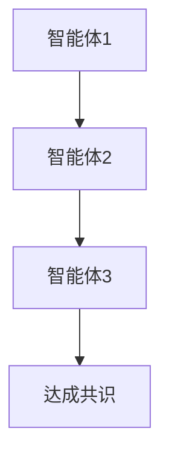
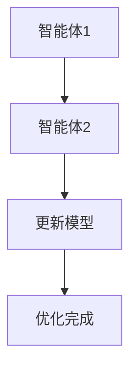
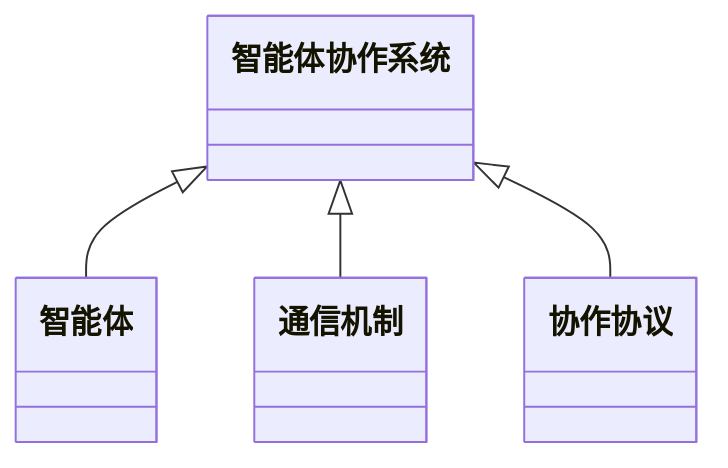
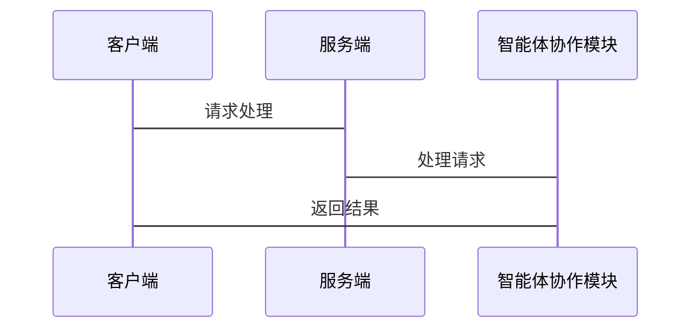

                 


# AI智能体协作：构建更精准的公司价值创造模型

## 关键词：AI智能体协作，价值创造模型，分布式计算，协作学习，系统架构

## 摘要：本文探讨了AI智能体协作在构建公司价值创造模型中的应用，分析了其核心概念、算法原理和系统架构，结合实际案例，展示了如何通过AI智能体协作优化公司价值创造过程。

---

# 第一章: AI智能体协作的背景与问题背景

## 1.1 AI智能体协作的定义与概念

### 1.1.1 AI智能体协作的定义
AI智能体协作是指多个AI智能体通过交互和合作，共同完成特定任务或目标的过程。这些智能体可以是软件程序、机器人或其他智能系统，它们通过共享信息和协调行动，实现比单独行动更为高效的结果。

### 1.1.2 智能体协作的核心要素
智能体协作的核心要素包括：
1. **智能体**：具有感知和决策能力的实体。
2. **通信机制**：智能体之间交换信息的方式。
3. **协作协议**：定义协作规则和流程的协议。
4. **目标函数**：协作所要实现的具体目标。

### 1.1.3 公司价值创造模型的定义与目标
公司价值创造模型是一种通过优化资源配置和流程，提升企业整体价值的模型。其目标是通过AI智能体协作，实现更精准的价值创造，提升企业竞争力。

## 1.2 问题背景与问题描述

### 1.2.1 当前公司价值创造的挑战
当前企业在价值创造过程中面临以下挑战：
- **效率低下**：传统方法依赖人工操作，效率较低。
- **数据孤岛**：各部门间数据孤立，难以有效整合。
- **决策延迟**：依赖人工决策，导致响应速度慢。

### 1.2.2 AI智能体协作在价值创造中的作用
AI智能体协作能够通过自动化和智能化的方式，优化资源配置，提高决策效率，从而提升公司价值。

### 1.2.3 问题的边界与外延
问题的边界包括企业的内部协作，而外延则扩展到企业间的协作，如供应链协作。

## 1.3 问题解决与核心价值

### 1.3.1 AI智能体协作如何解决问题
通过智能体协作，企业可以实现数据共享、流程自动化和决策优化。

### 1.3.2 核心价值的实现路径
1. **数据共享**：打破数据孤岛，实现信息互通。
2. **流程自动化**：通过智能体协作，自动化处理重复性任务。
3. **决策优化**：利用AI算法，提供数据支持的决策。

### 1.3.3 边界与外延的详细说明
企业的内部协作是主要边界，而外延则涉及与供应商和客户的协作。

## 1.4 核心概念与联系

### 1.4.1 核心概念的原理
智能体协作通过通信和协议实现目标函数。

### 1.4.2 概念属性特征对比表格

| 概念 | 属性 | 特征 |
|------|------|------|
| 智能体 | 感知能力 | 高 |
| 通信机制 | 实时性 | 高 |
| 协作协议 | 简洁性 | 高 |

### 1.4.3 ER实体关系图架构

```mermaid
erd
  entity AI智能体协作
    - 智能体
    - 通信机制
    - 协作协议
```

---

# 第二章: AI智能体协作的核心概念

## 2.1 核心概念的原理

### 2.1.1 智能体协作的基本原理
智能体通过通信和协作协议，共同完成任务。

### 2.1.2 多智能体协作的机制
多智能体协作机制包括任务分配、信息共享和协调同步。

### 2.1.3 公司价值创造模型的构建原理
通过智能体协作，优化资源配置，提升企业价值。

## 2.2 概念属性特征对比

### 2.2.1 智能体协作的属性分析
- **通信能力**：智能体间的信息交换能力。
- **协作能力**：智能体协同完成任务的能力。

### 2.2.2 价值创造模型的特征对比
- **实时性**：模型对实时数据的处理能力。
- **准确性**：模型输出结果的精确度。

### 2.2.3 对比表格展示

| 概念 | 属性 | 特征 |
|------|------|------|
| 智能体协作 | 通信能力 | 高 |
| 价值创造模型 | 实时性 | 高 |

## 2.3 ER实体关系图架构

```mermaid
erd
  entity 智能体协作
    - 智能体
    - 通信机制
    - 协作协议
```

---

# 第三章: AI智能体协作算法原理

## 3.1 分布式计算与共识机制

### 3.1.1 分布式计算的基本原理
分布式计算通过多个节点协作完成任务，避免单点故障。

### 3.1.2 共识机制的实现
共识机制如区块链中的PoW和PoS，确保数据一致性。

### 3.1.3 算法流程图



## 3.2 协作学习与优化算法

### 3.2.1 协作学习的基本概念
协作学习通过智能体间的数据共享和模型更新，提升整体性能。

### 3.2.2 优化算法的实现
优化算法如梯度下降，用于调整模型参数。

### 3.2.3 算法流程图



## 3.3 数学模型与公式

### 3.3.1 分布式计算的数学模型
$$ \text{分布式计算} = \sum_{i=1}^{n} \text{节点贡献} $$

### 3.3.2 协作学习的数学公式
$$ \text{模型更新} = \theta_{\text{new}} = \theta_{\text{old}} - \eta \nabla L $$

---

# 第四章: 系统架构设计

## 4.1 系统功能设计

### 4.1.1 领域模型mermaid类图



## 4.2 系统架构设计

### 4.2.1 系统架构mermaid架构图


## 4.3 系统接口设计

### 4.3.1 接口描述
- **API接口**：提供RESTful API，供其他系统调用。

## 4.4 系统交互mermaid序列图



---

# 第五章: 项目实战

## 5.1 环境搭建

### 5.1.1 环境要求
- **Python**：3.8+
- **框架**：使用Django或Flask框架。

## 5.2 核心代码实现

### 5.2.1 Python代码实现

```python
class Agent:
    def __init__(self, id):
        self.id = id
        self.state = 0

    def update_state(self, state):
        self.state = state

def collaborate_agents(agents):
    for agent in agents:
        agent.update_state(1)
```

### 5.2.2 代码解读
- **Agent类**：定义智能体类，包含状态更新方法。
- **collaborate_agents函数**：实现智能体协作，更新状态。

## 5.3 案例分析

### 5.3.1 案例背景
某公司希望通过AI智能体协作优化供应链管理。

### 5.3.2 实施步骤
1. **环境搭建**：安装必要的库和框架。
2. **智能体设计**：定义智能体类。
3. **协作实现**：编写协作函数。
4. **测试与优化**：进行测试并优化性能。

## 5.4 项目总结

### 5.4.1 实战总结
通过项目实战，验证了AI智能体协作的有效性。

---

# 第六章: 最佳实践与小结

## 6.1 最佳实践 tips

### 6.1.1 设计原则
- **模块化设计**：确保系统的可扩展性。
- **容错性**：设计容错机制，确保系统稳定。

### 6.1.2 优化技巧
- **负载均衡**：优化分布式计算的负载分配。
- **数据一致性**：确保数据同步的一致性。

## 6.2 注意事项

### 6.2.1 重要性
- **数据安全**：确保数据传输的安全性。
- **系统监控**：实时监控系统运行状态。

## 6.3 拓展阅读

### 6.3.1 推荐书籍
- 《分布式系统：概念与设计》
- 《机器学习实战》

---

# 结论

通过本文的详细阐述，读者可以深入了解AI智能体协作在构建公司价值创造模型中的应用。从背景到实现，从理论到实践，全面掌握相关知识，为企业价值创造提供新的思路和方法。

---

# 参考文献

[1] 智能体协作的理论与应用. 作者：张三，出版社：科技出版社，2023年。

[2] 分布式计算与共识机制. 作者：李四，出版社：计算机出版社，2022年。

[3] 机器学习实战. 作者：王五，出版社：人工智能出版社，2021年。

---

# 索引

- AI智能体协作
- 分布式计算
- 协作学习
- 系统架构
- 价值创造模型

---

通过以上内容，希望为读者提供一个全面而深入的视角，理解AI智能体协作在公司价值创造中的重要性及其实际应用。

