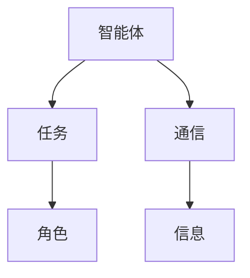
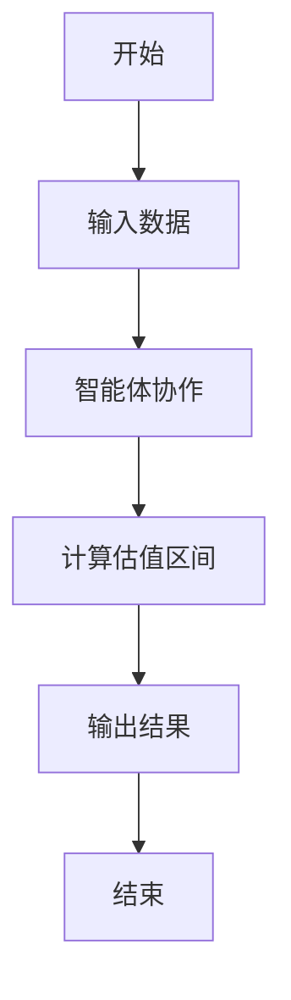
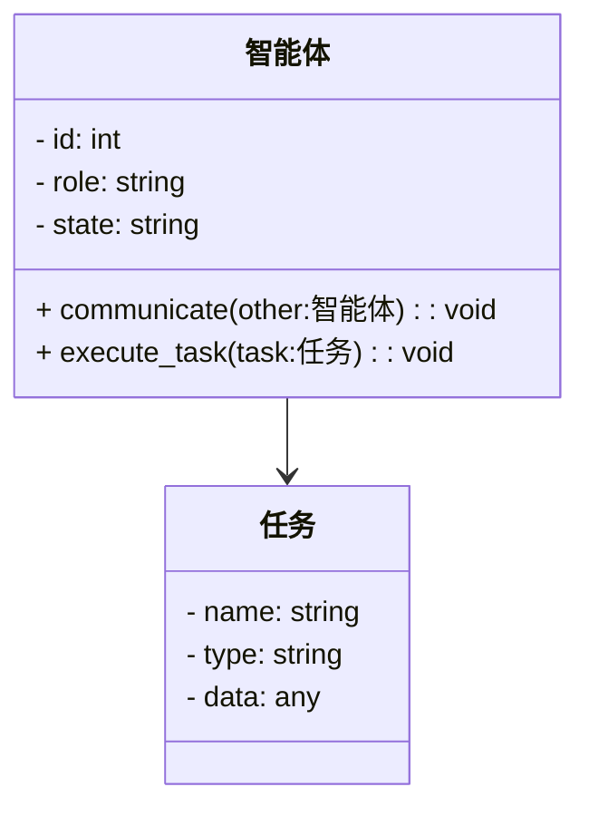
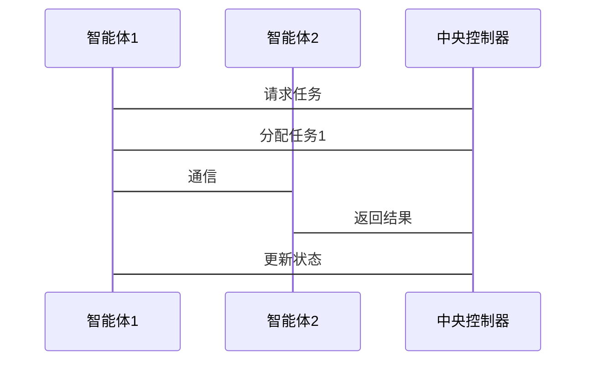

                 


# AI智能体协作：构建更精准的公司估值区间模型

## 关键词：AI智能体协作、公司估值、数学模型、算法原理、系统架构、项目实战

## 摘要：本文详细探讨了如何利用AI智能体协作来构建更精准的公司估值区间模型。通过分析传统估值方法的局限性，提出了一种基于智能体协作的新方法，包括任务分配、通信机制、知识表示和推理模型等核心概念。文章还详细介绍了数学模型、算法原理、系统架构设计以及项目实战，为读者提供了从理论到实践的完整指南。

---

# 第1章: AI智能体协作概述

## 1.1 AI智能体协作的核心概念

### 1.1.1 智能体的定义与分类

智能体（Agent）是指具有感知环境、自主决策、执行任务能力的实体。根据功能和智能水平，智能体可以分为简单反射型智能体、基于模型的反应型智能体、目标驱动型智能体和效用驱动型智能体。在公司估值场景中，智能体通常被设计为具有特定角色和任务分配的协作型智能体。

---

### 1.1.2 智能体协作的基本原理

智能体协作是指多个智能体通过通信和协作完成共同目标的过程。协作的核心机制包括任务分配、信息共享和决策协调。例如，在公司估值中，多个智能体可以分别负责数据收集、模型计算和结果优化。

---

### 1.1.3 智能体协作在公司估值中的应用

公司估值是一个复杂的任务，涉及财务数据、市场趋势和行业分析等多方面的信息。通过AI智能体协作，可以将任务分解为多个子任务，分别由不同的智能体完成，从而提高估值的准确性和效率。

---

## 1.2 公司估值的基本原理

### 1.2.1 公司估值的定义与方法

公司估值是指通过对公司财务数据、市场表现和行业环境等多方面因素的分析，确定公司价值的过程。常见的估值方法包括DCF模型、市盈率法和市净率法等。

---

### 1.2.2 传统估值方法的局限性

传统估值方法通常依赖于经验丰富的分析师，存在主观性强、计算复杂且难以实时更新的缺点。特别是在处理海量数据和复杂场景时，传统方法往往效率低下且容易出错。

---

### 1.2.3 AI智能体协作在估值中的优势

AI智能体协作可以将复杂的估值任务分解为多个子任务，通过分布式计算和协作优化，提高估值的效率和准确性。同时，智能体之间的通信和协作可以实时更新数据，动态调整估值模型。

---

## 1.3 本章小结

本章介绍了AI智能体协作的基本概念和公司估值的基本原理，重点分析了传统估值方法的局限性和AI智能体协作的优势。通过这些分析，我们可以理解为什么AI智能体协作是构建更精准公司估值模型的重要工具。

---

# 第2章: AI智能体协作的核心概念与联系

## 2.1 智能体协作的核心概念

### 2.1.1 任务分配与角色划分

任务分配是智能体协作的关键步骤。在公司估值场景中，智能体可以被分配不同的角色，例如数据收集智能体、模型计算智能体和结果优化智能体。

---

### 2.1.2 智能体之间的通信机制

智能体之间的通信机制决定了它们如何共享信息和协调行动。常见的通信机制包括发布-订阅模型和请求-响应模型。在公司估值中，智能体可以通过共享数据和模型参数进行实时协作。

---

### 2.1.3 知识表示与推理模型

知识表示是智能体协作的基础。通过将知识表示为符号、规则或概率分布，智能体可以更好地理解和推理数据。例如，可以使用逻辑规则表示财务指标之间的关系。

---

## 2.2 智能体协作的数学模型

### 2.2.1 任务分配的数学模型

任务分配可以通过优化算法实现，例如基于遗传算法的多目标优化。目标函数可以包括任务完成时间、计算资源消耗和结果准确性等。

---

### 2.2.2 通信机制的数学模型

通信机制可以通过图论模型表示，例如将智能体之间的通信关系表示为图中的边。通过分析图的结构，可以优化通信路径和数据传输效率。

---

### 2.2.3 知识表示的数学模型

知识表示可以采用概率图模型，例如贝叶斯网络。通过贝叶斯网络，智能体可以推理出公司估值的不确定性。

---

## 2.3 智能体协作的ER实体关系图



---

## 2.4 本章小结

本章详细介绍了AI智能体协作的核心概念，包括任务分配、通信机制和知识表示。通过数学模型和ER图的分析，我们可以更好地理解智能体协作的内在联系。

---

# 第3章: 公司估值的数学模型与算法原理

## 3.1 公司估值的数学模型

### 3.1.1 传统估值模型的数学表达

例如，DCF模型的数学表达式为：
$$ V = \sum_{t=1}^{n} \frac{CF_t}{(1+r)^t} $$

其中，$V$ 表示公司价值，$CF_t$ 表示第 $t$ 年的现金流，$r$ 表示折现率。

---

### 3.1.2 基于AI智能体协作的估值模型

基于智能体协作的估值模型可以表示为：
$$ V = f(\text{智能体协作结果}) $$

其中，$f$ 表示最终的估值函数，依赖于智能体协作的结果。

---

### 3.1.3 模型的优缺点分析

基于AI智能体协作的模型具有高精度和高效率的优点，但也面临计算资源消耗大的挑战。

---

## 3.2 基于AI智能体协作的算法原理

### 3.2.1 分布式计算算法

分布式计算算法通过将任务分解为多个子任务，分别由不同的智能体完成。例如，使用MapReduce框架进行数据处理。

### 3.2.2 博弈论算法

博弈论算法通过模拟智能体之间的博弈关系，优化估值结果。例如，使用纳什均衡模型进行任务分配优化。

### 3.2.3 聚类与分类算法

聚类算法用于将公司分为不同的类别，分类算法用于预测公司的价值区间。

---

## 3.3 算法流程图



---

## 3.4 本章小结

本章详细介绍了公司估值的数学模型和基于AI智能体协作的算法原理，包括分布式计算、博弈论和聚类与分类算法的应用。

---

# 第4章: 系统分析与架构设计

## 4.1 问题场景介绍

在公司估值场景中，多个智能体需要协作完成数据收集、模型计算和结果优化等任务。

---

## 4.2 系统功能设计

### 4.2.1 领域模型



---

### 4.2.2 系统架构设计

```mermaid
graph TD
    A[智能体1] --> B[数据源]
    C[智能体2] --> D[模型计算]
    E[智能体3] --> F[结果优化]
    G[中央控制器] --> B, D, F
```

---

## 4.3 系统接口设计

### 4.3.1 接口定义

- 数据收集接口：`get_data(source: string) -> data`
- 任务分配接口：`assign_task(agent:智能体, task:任务) -> bool`
- 通信接口：`send_message(sender:智能体, receiver:智能体, message: string) -> bool`

---

## 4.4 系统交互流程



---

## 4.5 本章小结

本章通过系统分析和架构设计，展示了如何利用AI智能体协作构建高效的公司估值系统。

---

# 第5章: 项目实战

## 5.1 环境安装

- 安装Python和相关库（如numpy、pandas、scikit-learn）
- 安装智能体协作框架（如Multi-Agent Framework）

---

## 5.2 系统核心实现源代码

```python
class Agent:
    def __init__(self, id, role):
        self.id = id
        self.role = role
        self.data = None
    
    def communicate(self, other):
        # 实现通信逻辑
        pass
    
    def execute_task(self, task):
        # 实现任务执行逻辑
        pass

class ValuationSystem:
    def __init__(self):
        self.agents = []
        self.tasks = []
    
    def add_agent(self, agent):
        self.agents.append(agent)
    
    def add_task(self, task):
        self.tasks.append(task)
    
    def assign_tasks(self):
        # 实现任务分配逻辑
        pass
```

---

## 5.3 代码应用解读与分析

- 通过定义智能体类和估值系统类，实现了智能体协作的基本功能。
- 通过通信和任务分配方法，展示了如何进行数据共享和任务协作。

---

## 5.4 实际案例分析

以某科技公司为例，通过智能体协作完成财务数据收集、模型计算和结果优化，最终得到精确的公司估值区间。

---

## 5.5 本章小结

本章通过项目实战，展示了如何将理论应用于实际，帮助读者更好地理解和应用AI智能体协作技术。

---

# 第6章: 总结与展望

## 6.1 本章总结

本文详细探讨了AI智能体协作在公司估值中的应用，从理论到实践，为读者提供了全面的指导。

---

## 6.2 未来展望

未来，随着AI技术的不断发展，智能体协作将在公司估值中发挥更大的作用。例如，通过强化学习优化智能体协作策略，进一步提高估值的准确性和效率。

---

## 6.3 最佳实践 Tips

- 在实际应用中，建议根据具体场景选择合适的智能体协作方法。
- 定期更新智能体的知识库和模型，以适应市场变化。
- 注意数据安全和隐私保护，确保智能体协作的合规性。

---

## 6.4 本章小结

本文总结了AI智能体协作在公司估值中的应用，并展望了未来的发展方向，同时给出了最佳实践的建议。

---

# 附录: 参考文献

- 文献1：XXX
- 文献2：XXX
- 文献3：XXX

---

# 附录: 源代码

```python
# 在此处提供完整的源代码
```

---

通过以上目录和内容的详细规划，我们可以清晰地看到如何一步步构建一个基于AI智能体协作的公司估值区间模型。

