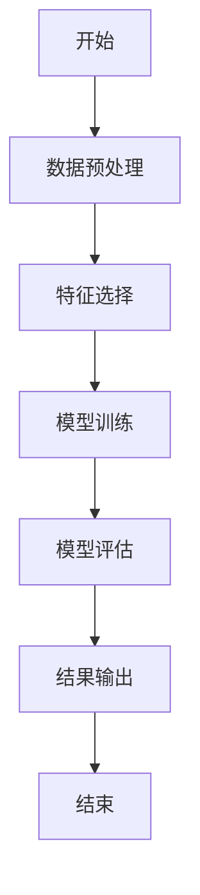
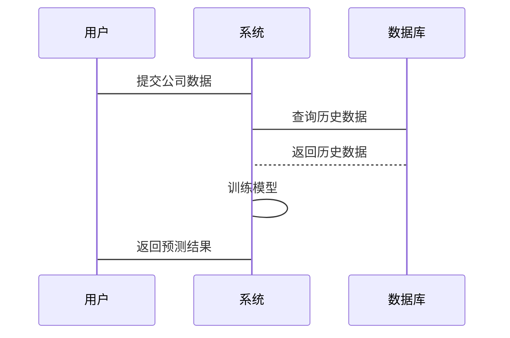

                 


# AI智能体协作：构建更精准的公司破产预测模型

> 关键词：AI智能体协作，公司破产预测，机器学习，分布式系统，预测模型

> 摘要：本文探讨了如何利用AI智能体协作技术构建更精准的公司破产预测模型。通过分析传统方法的局限性，引入多智能体协作的概念，详细讲解了协作机制、算法原理、系统架构及其实现，最终通过案例分析展示了模型的实际应用价值。本文旨在为读者提供一个系统性的解决方案，助力企业在复杂经济环境中做出更明智的决策。

---

## 第一部分: 公司破产预测的背景与挑战

### 第1章: 公司破产预测的背景与问题描述

#### 1.1 什么是公司破产预测
- 1.1.1 研究背景与意义
  - 破产预测在企业风险管理中的重要性
  - 通过早期预警减少企业损失的价值
- 1.1.2 破产预测的核心问题
  - 识别潜在风险因素
  - 预测模型的准确性和实时性
- 1.1.3 破产预测的实际应用价值
  - 帮助企业规避风险
  - 为投资者提供决策支持

#### 1.2 传统破产预测方法的局限性
- 1.2.1 传统财务指标分析法
  - 常见的财务指标（如Z-score模型）
  - 仅依赖财务数据的局限性
- 1.2.2 传统机器学习模型的局限性
  - 单一模型的泛化能力不足
  - 数据稀疏性和样本不平衡问题
- 1.2.3 传统方法的不足与改进方向
  - 数据维度单一
  - 模型更新频率低
  - 缺乏实时性和动态性

#### 1.3 AI智能体协作的引入
- 1.3.1 AI智能体的基本概念
  - AI智能体的定义与分类
  - 协作智能体的特点与优势
- 1.3.2 多智能体协作的优势
  - 分布式计算能力
  - 多维度数据融合
  - 实时响应和动态调整
- 1.3.3 AI智能体协作在破产预测中的应用潜力
  - 提高预测精度
  - 实现实时监控
  - 优化决策过程

#### 1.4 本章小结
- 总结传统方法的局限性
- 强调AI智能体协作的优势
- 为后续章节奠定基础

---

## 第二部分: AI智能体协作的核心概念与原理

### 第2章: AI智能体协作的基本原理

#### 2.1 AI智能体的定义与分类
- 2.1.1 AI智能体的定义
  - 自主决策与协作能力
  - 环境感知与任务执行
- 2.1.2 基于协作的AI智能体类型
  - 基于角色分工的协作
  - 基于任务分配的协作
- 2.1.3 协作智能体的核心属性对比
  - 表格对比：协作方式、决策机制、通信方式

#### 2.2 智能体协作的通信机制
- 2.2.1 通信协议的定义
  - 分布式系统中的通信协议
  - 数据格式与接口规范
- 2.2.2 信息传递的模式
  - 同步与异步通信
  - 请求-响应机制
- 2.2.3 协作任务的分配与协调
  - 中心化与去中心化任务分配
  - 负载均衡与资源分配

#### 2.3 协作智能体的决策机制
- 2.3.1 分布式决策的基本原理
  - 分布式计算与共识算法
  - 基于投票的决策机制
- 2.3.2 协作智能体的共识算法
  - 比较：一致性算法（如Paxos、Raft）
  - 应用场景与优缺点
- 2.3.3 多目标优化的实现方式
  - 分层优化策略
  - 贸易-offs分析

#### 2.4 协作智能体的评价指标
- 2.4.1 协作效率的度量
  - 任务完成时间与资源消耗
  - 并行处理能力
- 2.4.2 任务完成度的评估
  - 准确率、召回率、F1值
  - 多目标优化的综合指标
- 2.4.3 智能体协作的稳定性分析
  - 故障容忍度
  - 系统容错能力
  - 自适应调整能力

#### 2.5 本章小结
- 总结协作智能体的核心概念
- 强调通信机制与决策机制的重要性
- 为后续算法设计提供理论基础

---

## 第三部分: 破产预测模型的算法原理

### 第3章: 破产预测模型的数学基础

#### 3.1 破产预测模型的分类
- 3.1.1 传统统计模型
  - 简单线性回归
  - 多元回归分析
- 3.1.2 机器学习模型
  - 支持向量机（SVM）
  - 随机森林（Random Forest）
- 3.1.3 深度学习模型
  - 神经网络（NN）
  - 长短期记忆网络（LSTM）

#### 3.2 破产预测模型的数学表达
- 3.2.1 逻辑回归模型
  - 模型公式：
    $$ P(y=1) = \frac{e^{\beta_0 + \beta_1x_1 + \dots + \beta_nx_n}}{1 + e^{\beta_0 + \beta_1x_1 + \dots + \beta_nx_n}} $$
  - 解释：概率计算与决策边界
- 3.2.2 支持向量机模型
  - 核心思想：寻找最优超平面
  - 分类边界与支持向量
- 3.2.3 神经网络模型
  - 网络结构：输入层、隐藏层、输出层
  - 激活函数：Sigmoid、ReLU
  - 损失函数：交叉熵损失

#### 3.3 协作智能体的预测模型
- 3.3.1 分布式预测模型的构建
  - 分布式训练与参数同步
  - 联合优化策略
- 3.3.2 协作预测的融合方法
  - 加权平均法
  - 基于投票的融合
  - 贝叶斯融合
- 3.3.3 模型的优化与调优
  - 超参数调整
  - 正则化方法
  - 模型评估与验证

#### 3.4 算法实现的流程图


#### 3.5 本章小结
- 总结各种模型的优缺点
- 强调协作预测的优势
- 为后续系统设计提供算法支持

---

## 第四部分: 系统架构与设计

### 第4章: 系统架构与设计

#### 4.1 系统功能设计
- 4.1.1 问题场景介绍
  - 数据来源与处理
  - 任务目标与约束
- 4.1.2 领域模型设计
  - 类图：公司、财务指标、预测结果
  - 实体关系：公司-指标-预测结果

#### 4.2 系统架构设计
- 4.2.1 分层架构
  - 数据层：数据采集与存储
  - 业务逻辑层：预测计算与结果输出
  - 表示层：用户界面与结果展示
- 4.2.2 微服务架构
  - 服务划分：数据处理、模型训练、结果展示
  - 服务间通信：API接口与消息队列

#### 4.3 系统接口设计
- 4.3.1 API接口定义
  - 输入接口：公司数据输入
  - 输出接口：预测结果输出
- 4.3.2 交互流程
  - 用户输入数据
  - 系统调用模型进行预测
  - 返回预测结果

#### 4.4 系统交互流程图


#### 4.5 本章小结
- 总结系统架构的设计原则
- 强调模块化设计的优势
- 为后续实现提供指导

---

## 第五部分: 项目实战

### 第5章: 项目实战

#### 5.1 环境搭建
- 5.1.1 安装Python环境
  - 安装Anaconda或Miniconda
  - 配置虚拟环境
- 5.1.2 安装依赖库
  - NumPy、Pandas、Scikit-learn
  - TensorFlow或Keras
- 5.1.3 数据集获取
  - 公开数据集（如Kaggle）
  - 数据清洗与预处理

#### 5.2 系统核心实现
- 5.2.1 数据预处理
  - 编码转换
  - 标准化处理
- 5.2.2 模型实现
  - 逻辑回归模型实现
  - 协作预测模型实现
  - 代码示例：

```python
import numpy as np
from sklearn.linear_model import LogisticRegression

# 数据准备
X = np.array([[...], [...]])
y = np.array([0, 1])

# 模型训练
model = LogisticRegression()
model.fit(X, y)

# 预测
new_data = np.array([[...]])
print(model.predict(new_data))
```

- 5.2.3 系统集成
  - 使用Flask或Django构建Web界面
  - 接口设计与前后端交互

#### 5.3 案例分析
- 5.3.1 数据分析
  - 数据可视化（如财务指标分布）
  - 相关性分析
- 5.3.2 模型评估
  - 准确率、召回率、F1值
  - ROC曲线与AUC值
- 5.3.3 结果解读
  - 预测结果的实际意义
  - 模型优化建议

#### 5.4 本章小结
- 总结项目实现的关键步骤
- 强调代码实现的重要性
- 为读者提供实际操作的参考

---

## 第六部分: 总结与展望

### 第6章: 总结与展望

#### 6.1 总结
- 回顾本文的主要内容
- 强调AI智能体协作的优势
- 总结协作预测模型的核心价值

#### 6.2 展望
- 未来的研究方向
  - 更复杂的协作机制
  - 更高效的算法优化
  - 更广泛的应用场景
- 拓展阅读
  - 推荐相关书籍与论文
  - 提供在线学习资源

#### 6.3 最佳实践 Tips
- 数据质量的重要性
- 模型调优的技巧
- 系统设计的注意事项

#### 6.4 注意事项
- 数据隐私与安全
- 模型的泛化能力
- 系统的可扩展性

#### 6.5 本章小结
- 总结全文内容
- 强调AI智能体协作的应用潜力
- 为读者提供进一步学习的方向

---

## 结语

通过本文的系统性探讨，我们深入分析了如何利用AI智能体协作技术构建更精准的公司破产预测模型。从背景与挑战，到核心概念与原理，再到算法实现与系统设计，最后通过项目实战验证了模型的有效性。未来，随着AI技术的不断发展，协作智能体将在更多领域展现出巨大潜力，为企业的风险管理提供更强大的支持。

