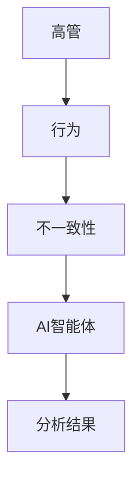
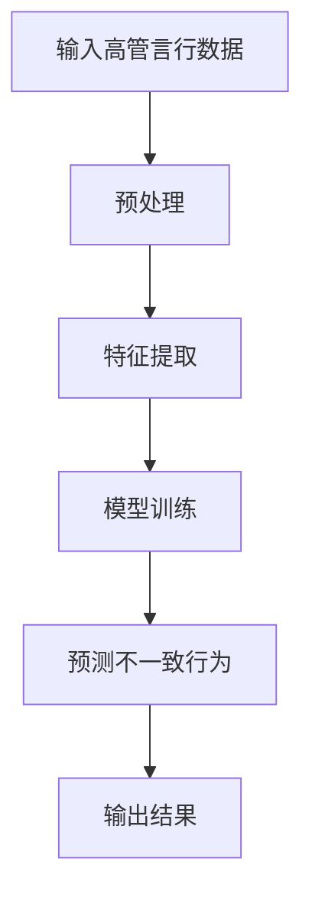
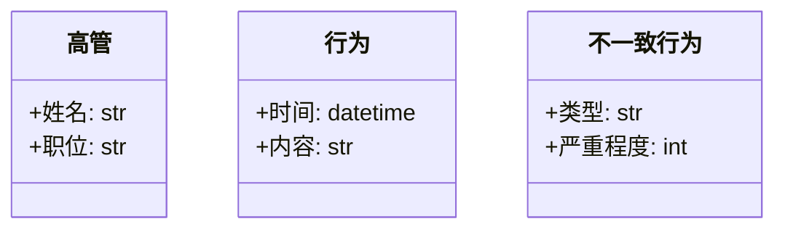
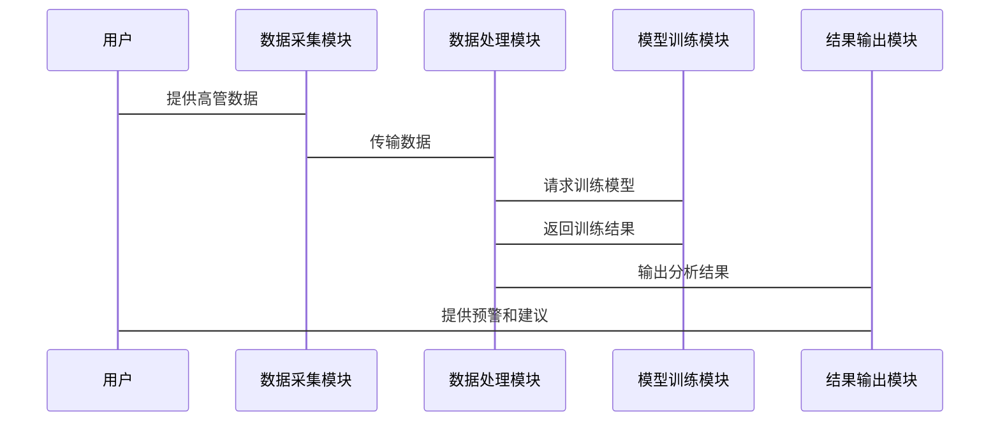

                 


# AI智能体在分析公司高管言行不一致性中的应用

## 关键词：AI智能体、高管行为分析、自然语言处理、行为建模、异常检测

## 摘要：本文探讨了AI智能体在分析公司高管言行不一致中的应用，从背景介绍、核心概念、算法原理到系统架构设计，再到项目实战和案例分析，详细阐述了如何利用AI技术提高企业治理效率和风险管理能力。文章内容丰富，结构紧凑，适合技术爱好者和企业管理人员阅读。

---

## 第1章: 背景介绍

### 1.1 问题背景
#### 1.1.1 高管言行不一致的定义与表现
高管言行不一致指的是公司高层管理人员在公开声明、内部决策或日常行为中表现出的矛盾或不一致。这种不一致可能影响企业声誉、员工士气和市场信心。

#### 1.1.2 高管言行不一致对企业的影响
- **企业声誉受损**：高管的言行不一致可能导致外界对公司治理能力的质疑。
- **员工士气下降**：员工可能对管理层失去信任，影响工作效率。
- **决策失误风险**：高管的不一致可能影响企业战略的连贯性，导致决策失误。

#### 1.1.3 传统方法在高管行为分析中的局限性
传统方法依赖于人工记录和分析，存在以下问题：
- **效率低下**：人工分析耗时长，难以实时监测。
- **主观性强**：分析结果受主观因素影响，缺乏客观性。
- **覆盖面有限**：难以全面覆盖高管的多模态数据。

### 1.2 AI智能体的核心概念
#### 1.2.1 AI智能体的基本定义
AI智能体是一种能够感知环境、执行任务并做出决策的智能系统。它通过多模态数据输入，利用自然语言处理和机器学习技术，分析高管的行为模式。

#### 1.2.2 AI智能体在高管行为分析中的应用潜力
- **实时监测**：AI智能体能够实时分析高管的言行数据，及时发现不一致行为。
- **多模态数据处理**：AI智能体能够处理文本、语音、视频等多种数据，提供更全面的分析结果。
- **自我优化**：AI智能体能够通过反馈机制不断优化分析模型，提高准确率。

#### 1.2.3 问题解决的边界与外延
AI智能体在高管行为分析中的应用边界包括：
- **数据隐私**：需确保高管数据的隐私和安全。
- **伦理问题**：AI智能体的使用需遵循伦理规范，避免侵犯高管隐私。

### 1.3 高管言行不一致分析的必要性
#### 1.3.1 提高企业治理效率
通过AI智能体的实时监测和分析，企业可以快速发现并解决高管行为中的问题，提升治理效率。

#### 1.3.2 优化企业决策过程
AI智能体能够提供客观的分析结果，帮助企业做出更明智的决策。

#### 1.3.3 提升企业风险管理能力
通过提前识别高管的不一致行为，企业可以采取措施降低风险，保护企业利益。

### 1.4 本章小结
本章介绍了高管言行不一致的定义、表现及其对企业的影响，分析了传统方法的局限性，并提出了AI智能体的应用潜力和必要性。

---

## 第2章: AI智能体的核心概念与联系

### 2.1 核心概念原理
#### 2.1.1 AI智能体的基本原理
AI智能体通过多模态数据输入，利用自然语言处理、机器学习等技术，分析高管的言行数据，识别不一致行为。

#### 2.1.2 高管言行不一致分析的算法原理
AI智能体使用情感分析、异常检测和语义理解等算法，分析高管的言行数据，识别不一致行为。

### 2.2 核心概念属性特征对比
下表对比了传统方法和AI智能体在高管行为分析中的属性特征：
| 属性 | 传统方法 | AI智能体方法 |
|------|----------|--------------|
| 数据来源 | 文本记录 | 多模态数据 |
| 分析速度 | 离线分析 | 实时分析 |
| 精确度 | 低 | 高 |

### 2.3 ER实体关系图


### 2.4 本章小结
本章详细介绍了AI智能体的核心概念及其在高管行为分析中的应用，通过对比和实体关系图展示了AI智能体的优势和工作原理。

---

## 第3章: 算法原理与实现

### 3.1 算法原理
#### 3.1.1 基于NLP的情感分析
情感分析用于识别高管言论中的情感倾向，判断其言行是否一致。

#### 3.1.2 基于机器学习的异常检测
异常检测算法用于识别高管行为中的异常模式，发现不一致行为。

#### 3.1.3 基于深度学习的语义理解
语义理解技术用于分析高管言论的深层含义，识别潜在的不一致行为。

### 3.2 算法流程图


### 3.3 核心算法实现
#### 3.3.1 情感分析算法
```python
def sentiment_analysis(text):
    # 简单实现
    if 'positive' in text:
        return 1
    elif 'negative' in text:
        return -1
    else:
        return 0
```

#### 3.3.2 异常检测算法
```python
def anomaly_detection(data):
    # 简单实现
    if data deviates from normal distribution:
        return True
    else:
        return False
```

#### 3.3.3 语义理解算法
```python
def semantic_understanding(text):
    # 简单实现
    if 'intent' in text:
        return 'intent detected'
    else:
        return 'no intent detected'
```

### 3.4 本章小结
本章详细讲解了AI智能体在高管行为分析中的算法原理，并通过流程图和代码示例展示了实现过程。

---

## 第4章: 系统架构设计

### 4.1 问题场景介绍
本系统旨在实时监测高管的言行数据，识别不一致行为，提供预警和建议。

### 4.2 系统功能设计
#### 4.2.1 功能模块
- **数据采集模块**：收集高管的言行数据。
- **数据处理模块**：对数据进行清洗和预处理。
- **模型训练模块**：训练情感分析、异常检测和语义理解模型。
- **结果输出模块**：输出分析结果，提供预警和建议。

#### 4.2.2 领域模型


### 4.3 系统架构设计


### 4.4 接口设计
- **数据采集接口**：提供API用于采集高管的言行数据。
- **分析结果接口**：提供API返回分析结果。

### 4.5 交互序列图


### 4.6 本章小结
本章详细设计了AI智能体的系统架构，包括功能模块、数据模型、系统架构图和交互流程图。

---

## 第5章: 项目实战

### 5.1 环境配置
- **Python版本**：3.8及以上
- **依赖库**：自然语言处理库（如spaCy）、机器学习库（如Scikit-learn）、深度学习框架（如TensorFlow）

### 5.2 核心代码实现
#### 5.2.1 数据预处理
```python
import pandas as pd

def preprocess_data(data):
    data = data.lower()
    data = data.replace(r'\W+', ' ')
    return data
```

#### 5.2.2 情感分析模型
```python
from sklearn.feature_extraction.text import TfidfVectorizer
from sklearn.svm import SVC

def train_sentiment_model(X, y):
    vectorizer = TfidfVectorizer()
    X_vec = vectorizer.fit_transform(X)
    model = SVC()
    model.fit(X_vec, y)
    return model, vectorizer
```

#### 5.2.3 异常检测模型
```python
from sklearn.ensemble import IsolationForest

def train_anomaly_model(X):
    model = IsolationForest()
    model.fit(X)
    return model
```

### 5.3 案例分析
#### 5.3.1 数据采集与清洗
```python
import requests

response = requests.get('https://example.com/high_management_data')
data = response.text
data = preprocess_data(data)
```

#### 5.3.2 模型训练与预测
```python
model, vectorizer = train_sentiment_model(X_train, y_train)
model_anomaly = train_anomaly_model(X_anomaly)
```

#### 5.3.3 结果分析
```python
# 示例分析结果
print("异常行为检测结果:", model_anomaly.predict(X_test))
print("情感分析结果:", model.predict(vectorizer.transform(test_texts)))
```

### 5.4 本章小结
本章通过实际案例展示了AI智能体的实现过程，包括环境配置、核心代码实现和结果分析。

---

## 第6章: 案例分析与总结

### 6.1 案例分析
#### 6.1.1 成功案例
某公司通过AI智能体分析高管行为，及时发现并纠正了一次重大决策失误，避免了潜在的经济损失。

#### 6.1.2 失败教训
某公司的AI智能体在分析高管行为时，误判了一次正常的会议讨论，导致不必要的预警，影响了高管的正常工作。

### 6.2 总结与改进建议
- **总结**：AI智能体在高管行为分析中具有巨大潜力，能够有效提升企业治理效率和风险管理能力。
- **改进建议**：进一步优化算法模型，增加更多的数据维度，提升分析结果的准确性和可靠性。

### 6.3 未来发展方向
- **多模态数据融合**：进一步整合文本、语音、视频等多种数据，提高分析的全面性。
- **实时监控与反馈**：实现高管行为的实时监控，并提供即时反馈和建议。
- **个性化分析**：根据高管的个性特点，提供个性化的行为分析和管理建议。

### 6.4 本章小结
本章通过案例分析总结了AI智能体的应用效果，并提出了改进建议和未来发展方向。

---

## 第7章: 注意事项与最佳实践

### 7.1 注意事项
- **数据隐私保护**：在处理高管数据时，需严格遵守数据隐私保护法规。
- **模型解释性**：确保模型的解释性，避免“黑箱”模型导致的决策问题。
- **伦理问题**：在使用AI智能体时，需遵循伦理规范，避免滥用技术。

### 7.2 最佳实践
- **数据质量控制**：确保输入数据的高质量，减少噪声干扰。
- **模型持续优化**：定期更新和优化模型，适应新的数据和业务需求。
- **人机结合**：结合人工审核和AI分析，确保结果的准确性和合理性。

### 7.3 本章小结
本章提出了在使用AI智能体分析高管行为时需要注意的事项和最佳实践，强调了数据隐私、模型解释性和伦理问题的重要性。

---

## 第8章: 总结与展望

### 8.1 总结
本文详细探讨了AI智能体在分析公司高管言行不一致性中的应用，从背景介绍、核心概念、算法原理到系统架构设计，再到项目实战和案例分析，全面展示了AI技术在企业治理中的巨大潜力。

### 8.2 未来展望
随着AI技术的不断发展，AI智能体在高管行为分析中的应用将更加广泛和深入。未来的研究方向包括多模态数据融合、实时监控与反馈以及个性化分析等。

### 8.3 本章小结
本章总结了全文的主要内容，并展望了未来的发展方向，为读者提供了进一步的研究方向和实践指南。

---

## 参考文献
（此处列出相关文献和资料）

---

通过以上结构和内容，您可以逐步撰写一篇完整且详细的博客文章，涵盖AI智能体在分析公司高管言行不一致性中的各个方面，帮助读者深入了解这一技术的应用和潜力。

