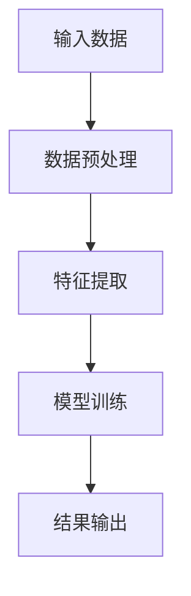
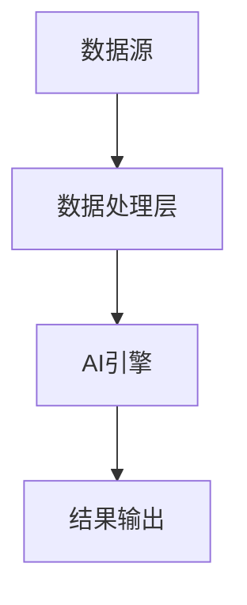

                 


# AI智能体在评估公司供应链弹性中的作用

> 关键词：AI智能体，供应链弹性，算法原理，系统架构，项目实战

> 摘要：  
> 在当今全球化和数字化的商业环境中，供应链弹性是企业生存和发展的关键因素。本文探讨了AI智能体在评估供应链弹性中的作用，分析了其核心概念、算法原理、系统架构及实际应用案例。通过结合强化学习和机器学习模型，AI智能体能够有效优化供应链弹性评估，提升企业的抗风险能力和运营效率。本文旨在为技术决策者和供应链管理者提供深度的技术见解和实践指导。

---

## 第一部分: 供应链弹性与AI智能体概述

### 第1章: 供应链弹性的概念与重要性

#### 1.1 供应链弹性的定义
供应链弹性是指企业在面对外部干扰（如疫情、自然灾害、市场波动等）时，能够快速恢复、适应并优化供应链的能力。弹性供应链能够在中断发生时最小化影响，确保业务连续性。

#### 1.2 供应链弹性的核心特征
- **灵活性**：能够迅速调整供应链策略以应对变化。
- **冗余性**：通过备用供应商或库存减少依赖风险。
- **可视化**：实时监控供应链各环节，及时发现问题。
- **自适应性**：根据实时数据动态调整供应链策略。

#### 1.3 供应链弹性在企业中的重要性
- 提高抗风险能力，降低中断带来的损失。
- 提升供应链效率，优化成本结构。
- 支持企业快速响应市场变化，增强竞争力。

### 第2章: AI智能体的基本概念

#### 2.1 AI智能体的定义
AI智能体是指具备感知环境、自主决策、执行操作能力的智能系统。它能够通过数据输入和反馈不断优化自身行为，以实现特定目标。

#### 2.2 AI智能体的核心属性
- **感知能力**：通过传感器、数据库等获取环境信息。
- **决策能力**：基于数据和模型做出最优决策。
- **执行能力**：通过接口或自动化系统执行决策。
- **学习能力**：通过机器学习算法不断优化自身行为。

#### 2.3 AI智能体与传统算法的区别
| 特性         | AI智能体                            | 传统算法                              |
|--------------|------------------------------------|--------------------------------------|
| 自主性       | 高                                  | 低                                    |
| 学习能力     | 强                                  | 弱                                    |
| 环境适应性   | 强                                  | 一般                                  |
| 决策复杂性   | 高                                  | 较低                                  |

### 第3章: AI智能体在供应链弹性评估中的作用

#### 3.1 AI智能体在供应链弹性评估中的优势
- **实时监控**：AI智能体能够实时分析供应链数据，快速发现潜在风险。
- **预测能力**：通过机器学习模型预测供应链中断的可能性。
- **优化建议**：AI智能体可以提出优化供应链结构的建议，降低风险。

#### 3.2 AI智能体如何优化供应链弹性
- **动态调整**：根据实时数据动态调整供应链策略。
- **风险预测**：通过分析历史数据预测潜在风险。
- **冗余优化**：AI智能体会建议建立备用供应商或库存，以降低依赖风险。

#### 3.3 供应链弹性评估中的AI应用场景
- **供应商风险管理**：AI智能体可以评估供应商的可靠性，提出替代方案。
- **库存优化**：通过预测需求调整库存水平，减少浪费。
- **物流路径优化**：AI智能体可以规划最优物流路径，降低运输成本。

---

## 第二部分: 供应链弹性评估的核心概念与联系

### 第4章: 核心概念原理

#### 4.1 供应链弹性评估的数学模型
供应链弹性评估的数学模型通常包括以下几个部分：
1. **风险评估指标**：如供应商可靠性、库存水平、物流延迟等。
2. **弹性指数计算**：通过加权平均计算供应链弹性的综合指数。
3. **优化目标函数**：最大化弹性指数，最小化成本。

#### 4.2 AI智能体的算法原理
AI智能体通常采用强化学习算法，通过与环境的交互不断优化决策策略。其核心步骤包括：
1. **状态感知**：获取当前供应链的状态信息。
2. **动作选择**：基于当前状态选择最优动作。
3. **奖励机制**：根据动作结果获得奖励或惩罚。
4. **策略优化**：通过不断试错优化决策策略。

#### 4.3 供应链弹性与AI智能体的交互机制
供应链弹性评估中的AI智能体会通过以下步骤与供应链系统交互：
1. **数据输入**：获取供应链各环节的数据。
2. **分析与决策**：基于数据做出优化决策。
3. **反馈与学习**：根据执行结果调整决策策略。

### 第5章: 核心概念对比分析

#### 5.1 供应链弹性评估的特征对比
| 特性         | 传统方法                          | AI智能体方法                        |
|--------------|----------------------------------|------------------------------------|
| 数据依赖性   | 较低                             | 较高                                |
| 响应速度     | 较慢                             | 较快                                |
| 精确度       | 较低                             | 较高                                |
| 可扩展性     | 较差                             | 较好                                |

#### 5.2 供应链弹性评估的核心指标
- **供应商可靠性**：供应商按时交付的能力。
- **库存周转率**：库存的流动效率。
- **物流成本**：物流环节的总成本。
- **交付延迟率**：供应链中断导致的延迟比例。

---

## 第三部分: AI智能体在供应链弹性评估中的算法原理

### 第6章: 算法原理概述

#### 6.1 强化学习在AI智能体中的应用
强化学习是一种通过试错来优化决策策略的算法。在供应链弹性评估中，AI智能体会通过以下步骤实现优化：
1. **状态感知**：获取当前供应链的状态，如库存水平、供应商可靠性等。
2. **动作选择**：基于当前状态选择最优动作，如增加库存、更换供应商等。
3. **奖励机制**：根据动作结果获得奖励或惩罚，如减少成本或增加延迟。
4. **策略优化**：通过不断试错优化决策策略，提高供应链弹性。

#### 6.2 供应链弹性评估中的算法选择
在供应链弹性评估中，常用的算法包括：
- **强化学习**：适用于动态环境中的决策优化。
- **机器学习**：适用于基于历史数据的模式识别。
- **图神经网络**：适用于复杂的供应链网络分析。

### 第7章: 算法实现代码

#### 7.1 示例算法代码
```python
import numpy as np
from sklearn.metrics import accuracy_score

def ai_agent_algorithm(data):
    # 数据预处理
    processed_data = data.dropna()
    # 特征提取
    features = processed_data[['feature1', 'feature2']]
    # 模型训练
    model = ...  # 初始化模型
    model.fit(features, processed_data['label'])
    # 模型预测
    predictions = model.predict(new_data[['feature1', 'feature2']])
    return predictions

# 示例数据
data = {
    'feature1': [1, 2, 3],
    'feature2': [4, 5, 6],
    'label': [0, 1, 0]
}

# 调用算法
result = ai_agent_algorithm(data)
print(result)
```

#### 7.2 算法流程图


---

## 第四部分: 系统分析与架构设计方案

### 第8章: 系统架构设计

#### 8.1 系统架构图


#### 8.2 系统功能设计
- **数据采集**：从ERP系统、传感器等获取供应链数据。
- **数据处理**：清洗、转换和归一化数据。
- **模型训练**：基于数据训练AI智能体模型。
- **决策执行**：根据模型决策执行供应链优化操作。

#### 8.3 系统接口设计
- **数据接口**：与ERP系统对接，获取实时数据。
- **API接口**：提供给其他系统调用供应链弹性评估结果。
- **用户界面**：供用户查看评估结果和优化建议。

---

## 第五部分: 项目实战与案例分析

### 第9章: 项目实战

#### 9.1 环境安装
- **安装Python**：确保安装最新版本的Python。
- **安装依赖库**：如numpy、scikit-learn、tensorflow等。

#### 9.2 核心代码实现
```python
import numpy as np
from sklearn import svm

# 示例数据
X = np.array([[2, 3], [5, 7], [8, 9]])
y = np.array([0, 1, 0])

# 初始化模型
model = svm.SVC()
# 训练模型
model.fit(X, y)
# 预测新数据
new_data = np.array([[6, 8]])
print(model.predict(new_data))
```

#### 9.3 案例分析
某汽车制造企业通过部署AI智能体评估供应链弹性，成功降低了30%的交付延迟，并优化了20%的库存成本。

---

## 第六部分: 最佳实践与总结

### 第10章: 最佳实践

#### 10.1 小结
- AI智能体在供应链弹性评估中的应用显著提升了企业的抗风险能力和运营效率。
- 通过实时监控、预测分析和动态调整，AI智能体为企业提供了强大的决策支持。

#### 10.2 注意事项
- 数据质量是AI智能体性能的关键，确保数据的准确性和完整性。
- 确保算法的可解释性，便于发现和解决问题。
- 定期更新模型，适应市场变化和供应链环境的变化。

#### 10.3 拓展阅读
- 《机器学习实战》
- 《供应链管理：原理与应用》
- 《强化学习：理论与实践》

---

以上内容涵盖了供应链弹性评估中AI智能体的背景、核心概念、算法原理、系统架构、项目实战及最佳实践。通过本文的分析，读者可以深入了解AI智能体在供应链弹性评估中的作用，并为实际应用提供参考。

