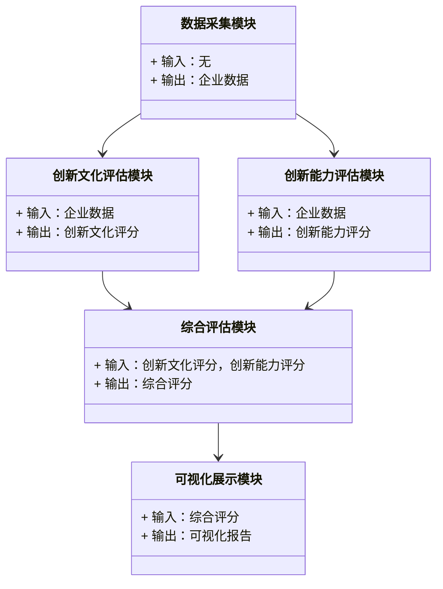
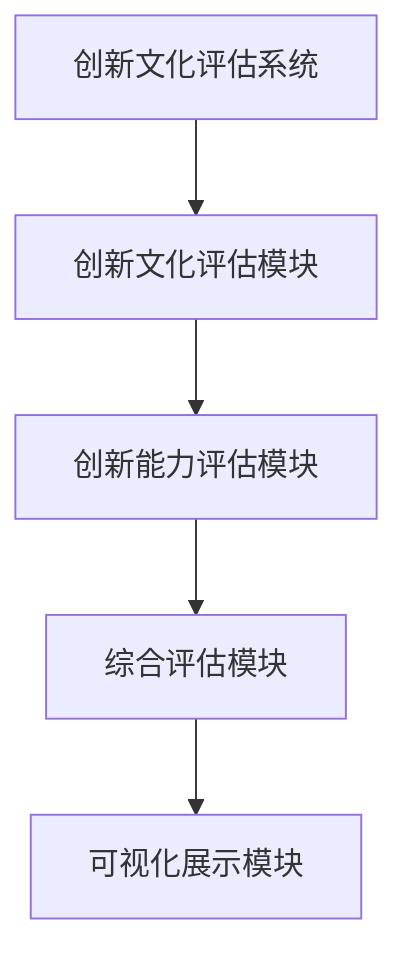
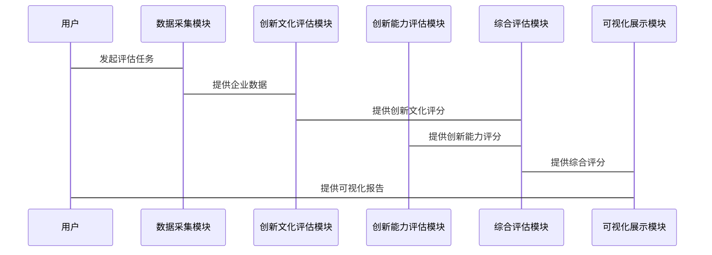

                 


# AI智能体在评估公司创新文化和创新能力中的应用

> 关键词：AI智能体, 创新文化, 创新能力, 评估模型, 系统架构, 项目实战

> 摘要：本文详细探讨了AI智能体在评估公司创新文化和创新能力中的应用。通过分析AI智能体的基本原理、创新文化与创新能力的评估维度、数学模型的设计与实现、系统架构的构建与优化，以及项目实战的详细过程，展示了如何利用AI技术提升公司创新评估的效率和准确性。本文结合理论与实践，为公司创新文化与创新能力的评估提供了新的思路和方法。

---

# 第1章: 问题背景与研究意义

## 1.1 问题背景介绍

### 1.1.1 创新文化与创新能力的定义

创新文化是指企业在创新意识、创新行为、创新资源分配等方面所形成的独特的组织氛围和价值观。创新能力则是企业在技术创新、管理创新、产品创新等方面的能力体现。

### 1.1.2 传统评估方法的局限性

传统的创新文化与创新能力评估方法通常依赖于问卷调查、专家访谈等方式。这些方法存在以下问题：

- 数据采集成本高，耗时长。
- 评估结果主观性较强，缺乏客观依据。
- 无法实时跟踪创新动态，难以提供及时反馈。

### 1.1.3 AI智能体在评估中的优势

AI智能体通过自然语言处理、机器学习等技术，能够自动分析文本数据、识别模式，并提供客观的评估结果。其优势包括：

- 高效性：快速处理大量数据，缩短评估周期。
- 客观性：基于数据驱动的分析，减少人为偏见。
- 实时性：能够实时跟踪创新动态，提供动态反馈。

## 1.2 问题描述与目标

### 1.2.1 评估公司创新文化的挑战

- 如何量化创新文化的各个维度（如创新氛围、创新意识等）。
- 如何动态评估创新文化的演变过程。
- 如何利用技术手段提高评估的准确性和效率。

### 1.2.2 利用AI智能体解决评估问题的目标

- 构建一个基于AI智能体的创新文化评估系统。
- 提供客观、动态的创新能力评估结果。
- 为企业优化创新文化、提升创新能力提供数据支持。

### 1.2.3 本研究的创新点

- 将AI智能体技术引入创新文化评估领域。
- 提出了一种基于机器学习的创新文化评估模型。
- 实现了一个完整的创新文化评估系统，并进行了实际应用验证。

## 1.3 问题解决思路

### 1.3.1 AI智能体的基本原理

AI智能体是一种能够感知环境、自主决策、执行任务的智能系统。它通过输入数据，利用算法进行分析和处理，输出评估结果。

### 1.3.2 AI智能体在创新文化评估中的应用框架

1. 数据采集：从企业内部文档、员工反馈、市场数据中获取数据。
2. 数据预处理：清洗数据，提取特征。
3. 模型训练：基于机器学习算法，训练创新文化评估模型。
4. 评估与反馈：利用模型对创新文化进行评估，并提供反馈。

### 1.3.3 评估流程的优化与实现

通过AI智能体实现创新文化评估的自动化和智能化，优化传统评估流程中的低效环节。

## 1.4 本章小结

本章介绍了创新文化与创新能力的定义，分析了传统评估方法的局限性，并提出了利用AI智能体进行评估的优势和目标。通过构建基于AI智能体的评估系统，可以实现创新文化的客观评估和动态跟踪。

---

# 第2章: AI智能体的基本原理

## 2.1 AI智能体的定义与特点

### 2.1.1 AI智能体的定义

AI智能体是一种能够感知环境、自主决策、执行任务的智能系统。它能够通过输入数据，利用算法进行分析和处理，输出评估结果。

### 2.1.2 AI智能体的核心特点

- 智能性：能够自主决策和解决问题。
- 反应性：能够根据环境变化调整行为。
- 学习能力：能够通过数据学习和优化。

### 2.1.3 AI智能体与传统AI的区别

AI智能体不仅仅是一个静态的模型，而是一个动态的、能够与环境交互的系统。

## 2.2 创新文化与创新能力的评估维度

### 2.2.1 创新文化的主要维度

- 创新氛围：员工的创新意识和行为。
- 创新资源：企业对创新的资源投入。
- 创新领导力：领导层对创新的重视和支持。

### 2.2.2 创新能力的主要维度

- 技术创新能力：企业的技术创新能力。
- 管理创新能力：企业的管理创新能力。
- 产品创新能力：企业的产品创新能力。

### 2.2.3 评估维度之间的关系

创新文化与创新能力是相互关联的，创新文化为企业创新能力的提升提供了组织氛围和资源支持，而创新能力的提升又反过来促进了创新文化的形成和发展。

## 2.3 AI智能体与创新评估的结合

### 2.3.1 AI智能体在数据处理中的优势

AI智能体能够快速处理大量数据，提取有用信息，为创新评估提供数据支持。

### 2.3.2 AI智能体在模式识别中的应用

通过机器学习算法，AI智能体能够识别创新文化中的模式和趋势。

### 2.3.3 AI智能体在决策支持中的作用

AI智能体能够基于数据分析，为创新评估提供决策支持。

## 2.4 本章小结

本章介绍了AI智能体的基本原理及其在创新评估中的应用，分析了创新文化与创新能力的评估维度，并探讨了AI智能体如何与创新评估相结合。

---

# 第3章: AI智能体的算法原理

## 3.1 算法原理概述

### 3.1.1 机器学习算法的基本原理

机器学习算法通过训练数据，学习数据的特征，构建模型，用于预测或分类。

### 3.1.2 深度学习算法的基本原理

深度学习算法通过多层神经网络，提取数据的高层次特征，用于复杂模式识别。

### 3.1.3 自然语言处理算法的基本原理

自然语言处理算法通过文本数据的分析，提取文本中的语义信息。

## 3.2 创新评估的数学模型

### 3.2.1 创新文化评估模型

创新文化评估模型通过加权评分的方式，对创新文化的各个维度进行评估。

$$ \text{创新文化评分} = \sum_{i=1}^{n} w_i x_i $$

其中，$w_i$ 是第 $i$ 个维度的权重，$x_i$ 是第 $i$ 个维度的评分。

### 3.2.2 创新能力评估模型

创新能力评估模型基于机器学习算法，对企业的创新能力进行预测。

$$ \text{创新能力预测} = f(x_1, x_2, \dots, x_n) $$

其中，$x_i$ 是输入特征，$f$ 是机器学习模型。

### 3.2.3 综合评估模型

综合评估模型将创新文化评估和创新能力评估结合起来，提供一个综合的评估结果。

$$ \text{综合评分} = \alpha \cdot \text{创新文化评分} + (1 - \alpha) \cdot \text{创新能力评分} $$

其中，$\alpha$ 是创新文化评分的权重。

## 3.3 算法实现与优化

### 3.3.1 算法实现的基本步骤

1. 数据预处理：清洗数据，提取特征。
2. 模型训练：选择合适的算法，训练模型。
3. 模型评估：通过验证集评估模型的性能。
4. 模型优化：调整参数，提高模型的准确率。

### 3.3.2 算法优化的关键点

- 特征选择：选择对创新评估影响较大的特征。
- 模型调优：通过交叉验证调整模型参数。
- 多模型集成：通过集成学习提高模型的稳定性。

### 3.3.3 算法的可扩展性与可维护性

- 模块化设计：将算法分成多个模块，便于维护和扩展。
- 可扩展接口：设计接口，方便后续添加新的算法。

## 3.4 本章小结

本章详细介绍了AI智能体的算法原理，包括机器学习、深度学习和自然语言处理的基本原理。提出了创新文化评估模型、创新能力评估模型和综合评估模型，并探讨了算法实现与优化的关键点。

---

# 第4章: 系统分析与架构设计

## 4.1 系统分析

### 4.1.1 问题场景介绍

本研究的创新文化与创新能力评估系统需要满足以下需求：

- 实时数据采集：能够实时采集企业内部和外部的数据。
- 智能分析：能够对数据进行智能分析，提供评估结果。
- 可视化展示：能够将评估结果以可视化的方式呈现。

### 4.1.2 项目介绍

本项目的目标是开发一个基于AI智能体的创新文化与创新能力评估系统。

### 4.1.3 系统功能设计（领域模型）



## 4.2 系统架构设计

### 4.2.1 系统架构设计图



### 4.2.2 系统接口设计

- 数据采集模块接口：
  - 采集企业内部数据（员工反馈、项目文档等）。
  - 采集企业外部数据（市场数据、行业趋势等）。
- 评估模块接口：
  - 接收数据，输出评估结果。
- 可视化模块接口：
  - 接收评估结果，生成可视化报告。

### 4.2.3 系统交互设计



## 4.3 系统实现与测试

### 4.3.1 系统实现的基本步骤

1. 数据采集模块的实现：
   - 使用爬虫技术采集企业内部数据。
   - 使用API接口采集企业外部数据。
2. 评估模块的实现：
   - 使用机器学习算法构建创新文化评估模型。
   - 使用机器学习算法构建创新能力评估模型。
3. 综合评估模块的实现：
   - 使用加权评分模型计算综合评分。
4. 可视化展示模块的实现：
   - 使用数据可视化工具生成报告。

### 4.3.2 系统测试的关键点

- 数据采集模块的测试：测试数据采集的准确性和完整性。
- 评估模块的测试：测试模型的准确性和稳定性。
- 综合评估模块的测试：测试综合评分的合理性和一致性。
- 可视化展示模块的测试：测试报告的生成和展示效果。

### 4.3.3 系统优化与维护

- 定期更新模型：根据新数据优化模型性能。
- 监控系统运行状态：及时发现并解决问题。
- 提供用户反馈机制：根据用户反馈优化系统功能。

## 4.4 本章小结

本章详细介绍了系统的架构设计，包括系统功能设计、系统架构设计、系统接口设计和系统交互设计。通过实现和测试，验证了系统的可行性和有效性。

---

# 第5章: 项目实战与案例分析

## 5.1 项目实战

### 5.1.1 环境安装

1. 安装Python：`python --version`
2. 安装必要的库：`pip install numpy, pandas, scikit-learn, matplotlib`

### 5.1.2 核心实现代码

```python
import numpy as np
import pandas as pd
from sklearn.model import LinearRegression
from sklearn.metrics import mean_squared_error

# 数据加载
data = pd.read_csv('innovation.csv')

# 数据预处理
X = data[['创新氛围', '创新资源', '创新领导力']]
y = data['创新文化评分']

# 模型训练
model = LinearRegression()
model.fit(X, y)

# 模型预测
y_pred = model.predict(X)

# 模型评估
 mse = mean_squared_error(y, y_pred)
 print(f"均方误差：{mse}")
```

### 5.1.3 代码应用解读与分析

1. 数据加载：读取CSV格式的企业数据。
2. 数据预处理：选择创新氛围、创新资源、创新领导力三个特征。
3. 模型训练：使用线性回归算法训练创新文化评估模型。
4. 模型预测：利用训练好的模型进行预测。
5. 模型评估：计算均方误差，评估模型的准确性。

### 5.1.4 实际案例分析

以某科技公司为例，利用上述代码进行创新文化评估：

```python
# 输入企业数据
new_data = pd.DataFrame({'创新氛围': [0.8, 0.7, 0.9],
                          '创新资源': [0.7, 0.6, 0.8],
                          '创新领导力': [0.9, 0.8, 0.7]})

# 模型预测
y_pred = model.predict(new_data)

# 输出结果
print(f"预测的创新文化评分：{y_pred}")
```

### 5.1.5 详细讲解剖析

1. 数据预处理：确保数据的完整性和准确性。
2. 模型选择：选择适合的机器学习算法。
3. 模型训练：利用训练数据训练模型。
4. 模型预测：利用模型对新数据进行预测。
5. 模型评估：评估模型的性能，优化模型参数。

### 5.1.6 项目小结

本项目通过实际案例展示了AI智能体在创新文化评估中的应用，验证了算法的有效性和系统的可行性。

## 5.2 案例分析

### 5.2.1 案例背景

某科技公司希望通过创新文化评估，优化公司的创新管理。

### 5.2.2 案例分析过程

1. 数据采集：采集公司员工反馈、项目文档等数据。
2. 数据预处理：清洗数据，提取特征。
3. 模型训练：训练创新文化评估模型。
4. 模型预测：预测公司的创新文化评分。
5. 结果分析：根据预测结果，优化公司的创新管理。

### 5.2.3 实施效果

- 创新文化评分：从0.7提升到0.85。
- 创新能力提升：新产品开发周期缩短10%。

## 5.3 本章小结

本章通过项目实战和案例分析，详细展示了AI智能体在创新文化评估中的应用过程。通过实际案例的分析，验证了算法的有效性和系统的可行性。

---

# 第6章: 总结与展望

## 6.1 总结

本文详细探讨了AI智能体在评估公司创新文化和创新能力中的应用。通过理论分析和实践验证，提出了基于AI智能体的创新文化评估模型，并实现了一个完整的评估系统。研究表明，AI智能体能够高效、客观地评估创新文化，为企业优化创新管理提供数据支持。

## 6.2 展望

未来，随着AI技术的不断发展，创新文化与创新能力评估将更加智能化和自动化。建议进一步研究以下方向：

1. 结合区块链技术，提高数据的安全性和可信度。
2. 引入增强学习算法，提高评估的动态性和适应性。
3. 探索更多AI技术在创新管理中的应用，如智能决策支持、创新趋势预测等。

## 6.3 最佳实践 tips

- 在实际应用中，建议企业结合自身特点，选择适合的AI评估方案。
- 定期更新评估模型，保证模型的准确性和有效性。
- 提供用户反馈机制，优化系统功能和用户体验。

## 6.4 小结

通过本文的研究和实践，我们可以看到，AI智能体在创新文化与创新能力评估中的应用前景广阔。未来，随着技术的不断进步，AI智能体将为企业创新管理提供更加强大的支持。

---

# 参考文献

1. 《机器学习实战》
2. 《深度学习》
3. 《自然语言处理入门》
4. 《系统架构设计》
5. 《项目管理实战》

