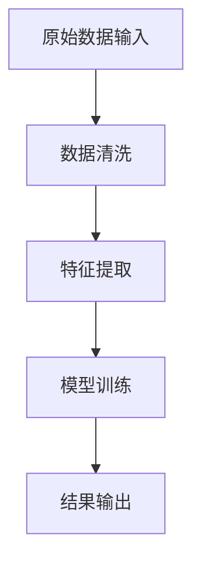
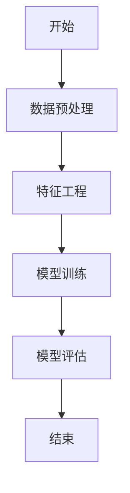
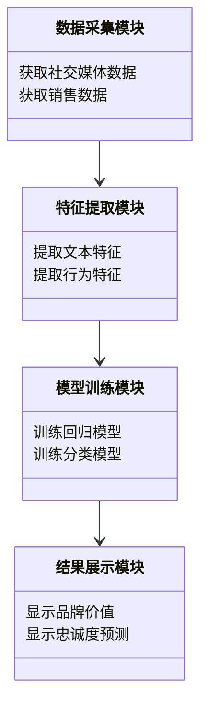
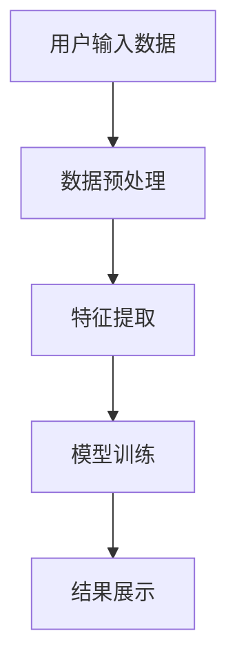

                 


# AI智能体在评估公司品牌价值和消费者忠诚度中的应用

**关键词：** AI智能体, 品牌价值, 消费者忠诚度, 数据分析, 机器学习, 人工智能, 系统架构

**摘要：**  
随着人工智能技术的迅速发展，AI智能体在企业品牌管理和消费者行为分析中的应用日益广泛。本文详细探讨了AI智能体如何通过数据分析和机器学习技术，有效评估公司品牌价值和消费者忠诚度。文章从理论基础、算法原理、系统架构设计到实际项目应用进行了全面分析，结合实际案例展示了AI智能体在提升品牌价值和消费者忠诚度方面的巨大潜力。

---

## 第1章: AI智能体与品牌价值评估概述

### 1.1 问题背景与描述
品牌价值是企业核心竞争力的体现，而消费者忠诚度则是品牌长期发展的关键。传统的品牌价值评估方法依赖于人工调研和经验判断，存在耗时长、成本高、结果主观性强等问题。而消费者忠诚度的测量也面临数据量大、维度复杂等挑战。

AI智能体作为一种具备自我学习和优化能力的智能系统，能够通过海量数据的分析和挖掘，提供更加客观、精准的品牌价值评估和消费者忠诚度分析。

### 1.2 AI智能体的核心概念与联系
AI智能体通过整合多源数据，利用自然语言处理、机器学习等技术，构建品牌价值和消费者忠诚度的评估模型。以下是AI智能体在品牌价值和消费者忠诚度评估中的核心要素：

#### 1.2.1 品牌价值评估模型
- **品牌知名度**：通过社交媒体数据、搜索引擎数据等衡量。
- **品牌情感分析**：通过文本挖掘技术分析消费者对品牌的看法。
- **品牌市场表现**：结合销售数据、市场份额等进行评估。

#### 1.2.2 消费者忠诚度预测
- **消费者行为分析**：通过购买记录、用户反馈等数据预测消费者忠诚度。
- **客户生命周期价值（CLV）**：通过模型预测客户在生命周期内的价值。

#### 1.2.3 ER实体关系图架构
以下是品牌价值和消费者忠诚度的实体关系图：

```mermaid
er
    entity(消费者) {
        消费者ID
        消费者属性(年龄、性别、地区)
    }
    entity(品牌) {
        品牌ID
        品牌名称
        品牌价值指标
    }
    entity(消费记录) {
        订单ID
        消费者ID
        购买时间
        购买金额
    }
    entity(社交媒体数据) {
        社交ID
        帖子内容
        发布时间
    }
    relationship(消费者-品牌) {
        消费者对品牌的评价
        消费者的忠诚度等级
    }
    relationship(消费记录-品牌) {
        购买频率
        购买偏好
    }
    relationship(社交媒体数据-品牌) {
        品牌提及量
        品牌情感得分
    }
```

### 1.3 本章小结
本章介绍了品牌价值和消费者忠诚度评估的重要性和AI智能体在其中的应用潜力，构建了品牌价值和消费者忠诚度的实体关系模型。

---

## 第2章: AI智能体算法原理

### 2.1 算法原理讲解

#### 2.1.1 数据流处理流程
AI智能体的数据流处理流程如下：



#### 2.1.2 特征提取与分析
品牌价值评估的关键特征包括：
- **文本特征**：社交媒体上的品牌提及量、情感倾向。
- **行为特征**：消费者的购买频率、购买间隔时间。
- **市场特征**：市场竞争状况、行业趋势。

#### 2.1.3 模型训练与优化
常用的模型包括线性回归、随机森林和神经网络。以下是品牌价值评估的回归模型：

$$
\text{品牌价值} = \beta_0 + \beta_1 \times \text{品牌知名度} + \beta_2 \times \text{品牌情感} + \epsilon
$$

### 2.2 算法流程图
以下是AI智能体的算法流程图：



### 2.3 数学模型与公式
消费者忠诚度预测模型：

$$
\text{忠诚度} = \alpha_0 + \alpha_1 \times \text{购买频率} + \alpha_2 \times \text{满意度} + \alpha_3 \times \text{客户保留率} + \epsilon
$$

### 2.4 本章小结
本章详细讲解了AI智能体的算法原理和数学模型，为后续的系统设计和项目实现奠定了基础。

---

## 第3章: 系统分析与架构设计

### 3.1 问题场景介绍
本章以一家中型企业的品牌价值评估和消费者忠诚度分析为背景，设计了一个AI智能体系统。系统目标是实现品牌价值的实时评估和消费者忠诚度的动态预测。

### 3.2 系统功能设计

#### 3.2.1 领域模型类图
以下是系统的主要类图：



#### 3.2.2 系统架构图
以下是系统的整体架构图：



### 3.3 本章小结
本章通过系统分析和架构设计，明确了AI智能体在品牌价值和消费者忠诚度评估中的实现方案。

---

## 第4章: 项目实战

### 4.1 环境安装与配置
#### 4.1.1 Python环境搭建
安装Python和必要的库：

```bash
pip install numpy pandas scikit-learn matplotlib
```

### 4.2 核心代码实现
#### 4.2.1 数据预处理代码

```python
import pandas as pd
import numpy as np

# 加载数据
data = pd.read_csv('consumer_data.csv')

# 数据清洗
data.dropna(inplace=True)
data = pd.get_dummies(data)
```

#### 4.2.2 模型训练代码

```python
from sklearn.model_selection import train_test_split
from sklearn.linear_model import LinearRegression

X = data.drop('brand_value', axis=1)
y = data['brand_value']

X_train, X_test, y_train, y_test = train_test_split(X, y, test_size=0.2, random_state=42)

model = LinearRegression()
model.fit(X_train, y_train)
```

#### 4.2.3 模型预测代码

```python
y_pred = model.predict(X_test)

print('预测的品牌价值:', y_pred[:5])
print('真实的品牌价值:', y_test[:5])
```

### 4.3 代码解读与分析
通过上述代码，我们可以看到AI智能体如何从数据预处理到模型训练，最终输出品牌价值和消费者忠诚度的预测结果。

### 4.4 实际案例分析
以某品牌为例，分析其品牌价值和消费者忠诚度的变化趋势。

### 4.5 本章小结
本章通过实际案例展示了AI智能体在品牌价值和消费者忠诚度评估中的具体应用。

---

## 第5章: 最佳实践与总结

### 5.1 最佳实践 Tips
- 数据质量是模型性能的关键。
- 模型选择和调优直接影响结果。
- 系统设计时要注意扩展性和可维护性。

### 5.2 项目总结与展望
AI智能体在品牌价值和消费者忠诚度评估中的应用前景广阔，未来可以通过引入更多数据源和优化算法进一步提升评估的准确性。

### 5.3 注意事项与风险提示
- 数据隐私和安全是需要重点关注的问题。
- 模型的泛化能力需要通过交叉验证来保证。

### 5.4 拓展阅读
推荐阅读《机器学习实战》和《自然语言处理入门》等书籍。

---

**结语**  
通过本文的分析，我们可以看到AI智能体在品牌价值和消费者忠诚度评估中的巨大潜力。未来，随着技术的不断进步，AI智能体将为企业管理和决策提供更加智能化的解决方案。

