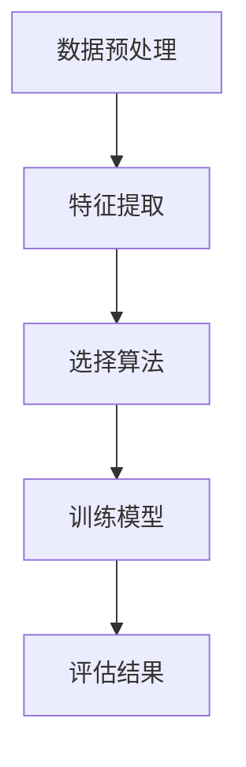
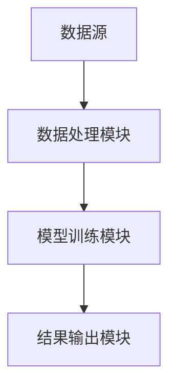

                 


# AI智能体在评估公司无形资产价值中的创新方法

> 关键词：AI智能体，无形资产，资产评估，机器学习，自然语言处理

> 摘要：本文探讨了AI智能体在评估公司无形资产中的创新方法，分析了其核心概念、算法原理、系统架构，并通过实际案例展示了其应用与优势。

---

## 第一部分: AI智能体在无形资产评估中的背景与概念

### 第1章: 无形资产与AI智能体概述

#### 1.1 无形资产的基本概念
##### 1.1.1 无形资产的定义与分类
无形资产是指企业拥有的非实物资产，如品牌、专利、版权、商誉等。它们无法被物理地触摸或储存，但对企业的价值贡献巨大。无形资产可以分为四类：知识产权类（专利、商标）、合同权益类（长期合同）、商誉类（企业声誉）和技术资产类（软件、技术诀窍）。

##### 1.1.2 无形资产的评估难点
传统评估方法依赖于主观判断，存在以下难点：
- 数据多样性：不同类型无形资产的数据结构差异大。
- 信息不对称：评估者可能缺乏专业知识。
- 动态变化：无形资产价值受市场环境影响，变化快且难以预测。
- 主观性：传统评估依赖专家经验，主观性强。

##### 1.1.3 无形资产在企业价值中的重要性
无形资产是企业核心竞争力的体现，影响企业市场价值。例如，品牌价值直接影响企业溢价能力，技术资产决定企业的技术壁垒和竞争优势。

#### 1.2 AI智能体的定义与特点
##### 1.2.1 AI智能体的基本概念
AI智能体（AI Agent）是具备感知、决策、执行能力的智能系统，能够根据输入数据做出最优选择并执行操作。它通过传感器或数据输入接口获取信息，利用算法处理数据，做出决策并执行。

##### 1.2.2 AI智能体的核心技术
AI智能体的核心技术包括：
- **感知技术**：通过数据输入接口获取信息，如自然语言处理（NLP）技术用于分析文本数据。
- **决策技术**：利用机器学习算法进行预测和决策，如支持向量机（SVM）、随机森林等。
- **执行技术**：通过输出接口执行决策，如触发自动化操作或生成报告。

##### 1.2.3 AI智能体在资产评估中的优势
AI智能体能够处理海量数据，识别数据中的隐含关系，提供客观、准确的评估结果。它还能实时更新数据，适应市场变化，显著提高评估效率和准确性。

#### 1.3 AI智能体与无形资产评估的结合
##### 1.3.1 无形资产评估的传统方法
传统方法包括成本法、市场法和收益法，但存在数据获取难、评估结果不准确等问题。

##### 1.3.2 AI智能体在无形资产评估中的创新
AI智能体通过大数据分析和机器学习算法，能够从非结构化数据中提取有用信息，构建更精准的评估模型。

##### 1.3.3 无形资产评估中的AI智能体应用场景
- 品牌价值评估：通过社交媒体数据和市场反馈，评估品牌影响力。
- 专利价值评估：通过分析专利数量、技术领域和引用次数，评估专利价值。
- 商誉评估：通过分析企业财务数据和市场表现，评估商誉价值。

---

## 第2章: AI智能体在无形资产评估中的核心概念与联系

### 2.1 AI智能体的核心概念
#### 2.1.1 数据驱动的评估模型
数据驱动的评估模型通过大量数据训练机器学习模型，利用模型预测无形资产价值。例如，使用回归模型预测品牌价值。

#### 2.1.2 机器学习在资产评估中的应用
机器学习算法，如支持向量机（SVM）和随机森林，可用于分类和回归任务，帮助评估无形资产价值。

#### 2.1.3 自然语言处理在无形资产评估中的作用
NLP技术用于分析文本数据，如新闻报道和市场评论，提取情感倾向，评估品牌声誉。

### 2.2 核心概念的ER实体关系图
```mermaid
er
actor: 评估人员
model: 评估模型
data: 评估数据
result: 评估结果
actor --> model: 输入数据
model --> result: 
```

---

## 第3章: AI智能体在无形资产评估中的算法原理

### 3.1 算法原理讲解
#### 3.1.1 支持向量机（SVM）
SVM用于分类和回归任务，常用于评估无形资产的价值区间。

#### 3.1.2 随机森林
随机森林是一种集成学习方法，用于处理高维数据，常用于专利价值评估。

### 3.2 算法流程图


### 3.3 算法实现代码示例
```python
from sklearn.svm import SVC
from sklearn.ensemble import RandomForestClassifier

# 数据预处理
data = ...  # 输入数据
X = data.drop('label', axis=1)
y = data['label']

# 特征提取
features = X.columns

# 选择算法
model = SVC()

# 训练模型
model.fit(X, y)

# 预测结果
predictions = model.predict(X)
```

---

## 第4章: AI智能体在无形资产评估中的数学模型

### 4.1 评估模型的数学公式
$$
\text{品牌价值} = \alpha \cdot \text{市场份额} + \beta \cdot \text{品牌认知度} + \gamma \cdot \text{盈利能力}
$$

### 4.2 神经网络模型
构建神经网络模型用于处理非结构化数据，如文本和图像。

---

## 第5章: 系统分析与架构设计方案

### 5.1 系统功能设计
- 数据采集模块：收集无形资产相关数据。
- 数据处理模块：清洗和预处理数据。
- 模型训练模块：训练评估模型。
- 结果输出模块：生成评估报告。

### 5.2 系统架构设计


---

## 第6章: 项目实战

### 6.1 环境安装
安装必要的库，如scikit-learn、nltk。

### 6.2 核心实现代码
```python
from sklearn.model_selection import train_test_split
from sklearn.metrics import accuracy_score

# 数据分割
X_train, X_test, y_train, y_test = train_test_split(X, y)

# 模型训练
model.fit(X_train, y_train)

# 模型评估
accuracy = accuracy_score(y_test, model.predict(X_test))
print(f"模型准确率：{accuracy}")
```

---

## 第7章: 总结与建议

### 7.1 总结
AI智能体通过大数据分析和机器学习算法，显著提高了无形资产评估的效率和准确性。

### 7.2 最佳实践
- 数据质量是关键，确保数据来源可靠。
- 定期更新模型，适应市场变化。
- 结合专家意见，提升评估结果的可信度。

### 7.3 拓展阅读
推荐学习相关书籍和论文，深入理解AI在资产评估中的应用。

---

通过以上步骤，我们可以系统地构建一个基于AI智能体的无形资产评估体系，为企业提供更精准的评估方法。

