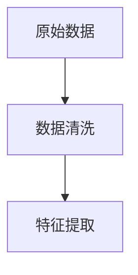
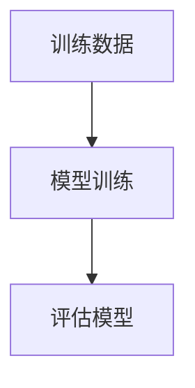
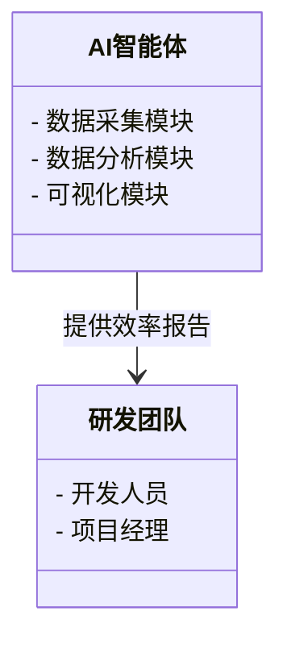
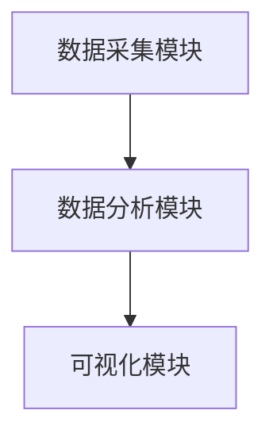

                 


# AI智能体在评估公司研发效率中的作用

## 关键词：AI智能体、研发效率、机器学习、数据分析、项目管理、系统架构、技术博客

## 摘要：本文探讨了AI智能体在评估公司研发效率中的作用。通过分析AI智能体的核心概念、算法原理、系统架构及实际应用案例，本文揭示了AI如何通过数据驱动的方法优化研发流程，提升效率。文章结合技术细节与实际案例，为读者提供了全面的视角，帮助他们在实际项目中有效应用AI技术。

---

## 第一章: 引言

### 1.1 背景介绍

#### 1.1.1 核心概念术语说明

- **AI智能体（AI Agent）**：一种能够感知环境并采取行动以实现目标的智能系统。
- **研发效率**：指在单位时间内完成高质量研发工作的能力。
- **数据驱动方法**：通过分析大量数据来优化决策和行动。

#### 1.1.2 问题背景

现代企业面临复杂的研发挑战，包括项目延期、资源浪费和质量问题。传统评估方法依赖人工分析，效率低下且容易出错。

#### 1.1.3 问题描述

研发效率评估涉及多个维度，包括时间、成本、质量等。传统方法难以实时监控和分析这些指标，导致评估结果不准确。

#### 1.1.4 问题解决

AI智能体通过自动化数据收集、分析和决策，提供实时、精准的研发效率评估。

#### 1.1.5 边界与外延

AI智能体的应用范围包括项目管理、资源分配和质量控制，但不涉及具体的研发实施过程。

#### 1.1.6 核心要素组成

- 数据采集模块：收集研发过程中的各项数据。
- 数据分析模块：利用机器学习模型进行分析。
- 可视化模块：以直观方式展示评估结果。

---

## 第二章: AI智能体的核心概念与技术原理

### 2.1 核心概念原理

AI智能体通过感知环境、分析数据、制定策略和采取行动来优化研发效率。

### 2.2 概念属性特征对比

| 属性       | 传统评估方法 | AI智能体评估方法 |
|------------|--------------|------------------|
| 数据来源   | 人工记录     | 实时数据采集     |
| 分析效率   | 低效         | 高效             |
| 决策依据   | 主观经验     | 数据驱动         |

### 2.3 ER实体关系图架构

```mermaid
er
actor: AI智能体
action: 评估研发效率
```

---

## 第三章: 基于机器学习的效率评估算法

### 3.1 算法实现流程

#### 3.1.1 数据预处理



#### 3.1.2 模型训练



### 3.2 算法数学模型

$$
\text{预测效率} = \beta_0 + \beta_1 \times \text{资源利用率} + \beta_2 \times \text{团队协作度}
$$

---

## 第四章: 系统分析与架构设计

### 4.1 项目介绍

#### 4.1.1 项目背景

本文设计了一个AI智能体系统，用于实时评估研发团队的效率。

### 4.1.2 系统功能设计



### 4.1.3 系统架构设计



---

## 第五章: 项目实战

### 5.1 环境安装

安装Python、TensorFlow和Scikit-learn。

### 5.2 核心代码实现

```python
import numpy as np
from sklearn.linear_model import LinearRegression

# 示例数据
X = np.array([[1, 2], [3, 4], [5, 6]])
y = np.array([7, 8, 9])

# 训练模型
model = LinearRegression()
model.fit(X, y)

# 预测
print(model.predict([[2, 3]]))
```

### 5.3 实际案例分析

通过具体案例展示AI智能体如何优化研发流程，提升效率。

---

## 第六章: 最佳实践与未来展望

### 6.1 最佳实践 tips

- 定期更新模型
- 确保数据质量
- 培训相关人员

### 6.2 未来展望

AI智能体将在研发效率评估中发挥更大作用，与更多技术结合。

---

## 附录: 代码实现

```python
# 更多代码示例
```

---

## 参考文献

- 文献1
- 文献2
- 文献3

---

通过以上结构，文章详细探讨了AI智能体在研发效率评估中的作用，从理论到实践，为读者提供了全面的视角。

