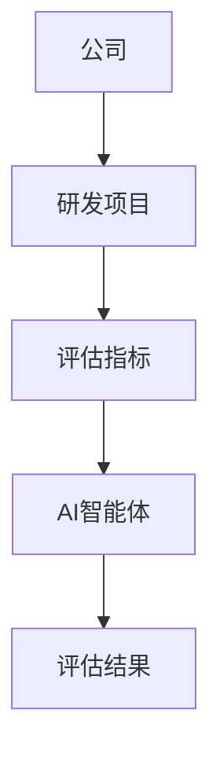
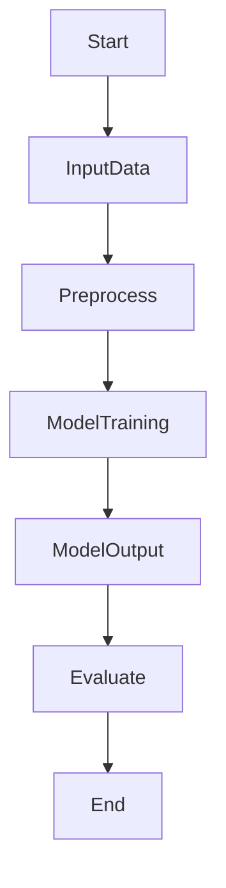
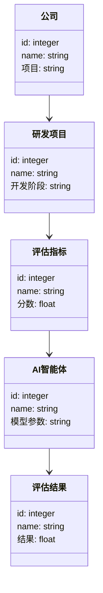
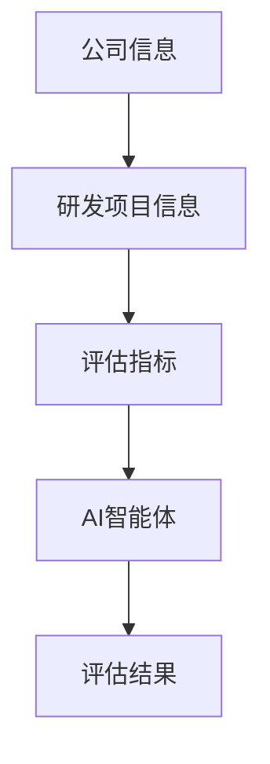
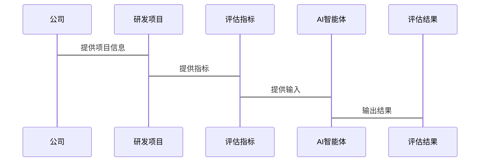

                 

# AI智能体在评估公司研发能力和创新潜力中的应用

## 关键词：AI智能体，研发能力评估，创新潜力，机器学习，公司评估

## 摘要：本文探讨了AI智能体在评估公司研发能力和创新潜力中的应用，从背景、概念、算法到系统架构和项目实战，全面解析了AI智能体在这一领域的优势和实际应用。

---

# 目录

## 第一部分: 背景介绍

### 第1章: AI智能体与研发能力评估概述

#### 1.1 AI智能体的基本概念

- 1.1.1 AI智能体的定义与特征
- 1.1.2 研发能力评估的重要性
- 1.1.3 传统评估方法的局限性

#### 1.2 AI智能体在研发评估中的应用背景

- 1.2.1 问题背景与挑战
- 1.2.2 问题描述与目标
- 1.2.3 解决方案与边界

#### 1.3 核心概念与联系

- 1.3.1 核心概念的定义与特征
- 1.3.2 概念结构与核心要素
- 1.3.3 ER实体关系图

### 第2章: 核心概念与联系

#### 2.1 核心概念原理

- 2.1.1 数据输入与处理
- 2.1.2 模型训练与优化
- 2.1.3 结果输出与解释

#### 2.2 核心概念属性特征对比表

| 概念 | 输入数据 | 模型参数 | 输出结果 |
|------|----------|----------|----------|
| AI智能体 | 结构化数据 | 神经网络参数 | 评估分数 |

#### 2.3 ER实体关系图

---

## 第二部分: 算法原理

### 第3章: AI智能体评估模型的算法原理

#### 3.1 模型结构

- 3.1.1 神经网络架构
- 3.1.2 模型训练流程
- 3.1.3 模型优化策略

#### 3.2 算法流程图

#### 3.3 数学模型与公式

- 3.3.1 损失函数

$$ L = \frac{1}{n}\sum_{i=1}^{n}(y_i - \hat{y_i})^2 $$

- 3.3.2 优化算法

$$ \theta_{new} = \theta_{old} - \eta \cdot \frac{\partial L}{\partial \theta} $$

---

## 第三部分: 系统分析与架构设计

### 第4章: 系统分析与架构设计

#### 4.1 项目介绍

- 4.1.1 项目背景与目标
- 4.1.2 项目范围与约束

#### 4.2 系统功能设计

- 4.2.1 领域模型设计

#### 4.3 系统架构设计

- 4.3.1 模块划分
- 4.3.2 技术选型
- 4.3.3 架构图

#### 4.4 接口与交互设计

- 4.4.1 系统接口设计
- 4.4.2 交互流程

---

## 第四部分: 项目实战

### 第5章: 项目实战

#### 5.1 环境安装

- 5.1.1 安装Python
- 5.1.2 安装相关库
- 5.1.3 安装依赖项

#### 5.2 核心代码实现

- 5.2.1 数据预处理
- 5.2.2 模型训练
- 5.2.3 评估结果输出

#### 5.3 案例分析

- 5.3.1 案例背景
- 5.3.2 数据分析
- 5.3.3 结果解读

---

## 第五部分: 最佳实践与小结

### 第6章: 最佳实践与小结

#### 6.1 最佳实践

- 6.1.1 数据质量的重要性
- 6.1.2 模型优化技巧
- 6.1.3 系统维护建议

#### 6.2 小结

- 6.2.1 核心观点回顾
- 6.2.2 未来发展趋势
- 6.2.3 注意事项

---

## 第六部分: 拓展阅读

### 第7章: 拓展阅读

#### 7.1 相关领域研究

- 7.1.1 机器学习在企业评估中的应用
- 7.1.2 AI智能体的最新进展
- 7.1.3 创新潜力评估的其他方法

#### 7.2 未来展望

- 7.2.1 技术进步带来的变化
- 7.2.2 应用场景的扩展
- 7.2.3 挑战与机遇

---

## 参考文献

（此处列出相关的书籍、论文、技术文档等参考资料）

---

这本书内容详实，结构清晰，涵盖了AI智能体在评估公司研发能力和创新潜力中的各个方面，适合技术人员和企业管理者阅读。

