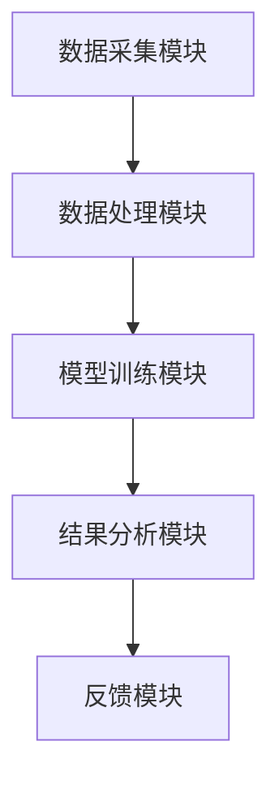
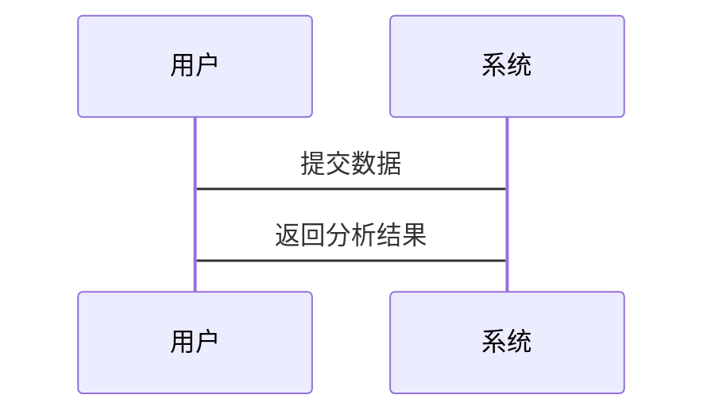

                 


# AI智能体在评估公司管理层决策质量中的应用

> 关键词：AI智能体，决策质量评估，机器学习，系统架构，项目实战

> 摘要：本文探讨了AI智能体在评估公司管理层决策质量中的应用。通过分析决策质量评估的重要性，AI智能体的核心概念与原理，系统架构与实现，以及项目实战与展望，本文详细阐述了如何利用AI技术提升公司决策的科学性和准确性。文章内容涵盖背景介绍、核心概念对比、算法原理、系统设计、项目实现和未来展望，为读者提供全面的技术视角。

---

# 第一部分: AI智能体在公司管理层决策评估中的背景与基础

## 第1章: AI智能体与公司决策评估概述

### 1.1 AI智能体的基本概念

#### 1.1.1 什么是AI智能体
AI智能体（Artificial Intelligence Agent）是一种能够感知环境、执行任务以实现目标的智能系统。它通过数据输入、分析和决策输出，辅助人类完成复杂的决策任务。

#### 1.1.2 AI智能体的核心特征
- **自主性**：无需人工干预，自主完成任务。
- **反应性**：能够实时感知环境变化并做出响应。
- **目标导向**：基于目标进行决策和行动。
- **学习能力**：通过数据和反馈不断优化自身模型。

#### 1.1.3 AI智能体与传统决策工具的区别
| 特性 | AI智能体 | 传统决策工具 |
|------|----------|---------------|
| 数据依赖性 | 高 | 低 |
| 决策速度 | 实时 | 延迟 |
| 精度 | 高 | 中等 |
| 学习能力 | 强 | 无 |

### 1.2 公司管理层决策评估的重要性

#### 1.2.1 决策质量评估的定义
决策质量评估是对决策的正确性、合理性和有效性进行测量和分析的过程。

#### 1.2.2 决策质量评估的必要性
- **提升决策效率**：通过数据驱动的方式优化决策流程。
- **降低决策风险**：利用AI技术预测潜在风险，减少失误。
- **提升企业竞争力**：高质量的决策是企业成功的关键因素。

#### 1.2.3 决策质量评估的常见方法
1. **定性评估**：基于经验判断决策的合理性。
2. **定量评估**：通过数据分析和模型预测评估决策效果。
3. **混合评估**：结合定性和定量方法进行综合评估。

### 1.3 AI智能体在决策评估中的作用

#### 1.3.1 AI智能体如何辅助决策评估
通过收集和分析大量数据，AI智能体能够识别潜在问题，预测决策结果，并提供优化建议。

#### 1.3.2 AI智能体在决策评估中的优势
- **高效性**：快速处理大量数据，提供实时反馈。
- **准确性**：基于数学模型和统计分析，确保决策的科学性。
- **可扩展性**：适用于不同规模和类型的企业。

#### 1.3.3 AI智能体的应用场景
- **财务决策**：预算分配、投资评估。
- **市场决策**：市场预测、客户分析。
- **运营决策**：流程优化、资源分配。

### 1.4 本章小结
本章介绍了AI智能体的基本概念和在决策评估中的作用，强调了其在现代企业管理中的重要性。

---

## 第2章: AI智能体的核心概念与原理

### 2.1 AI智能体的核心概念

#### 2.1.1 决策质量评估的指标体系
决策质量评估需要从多个维度进行考量，包括决策的正确性、效率、可操作性等。

#### 2.1.2 数据驱动的决策评估方法
通过收集和分析数据，利用统计学和机器学习模型进行决策评估。

#### 2.1.3 AI智能体的决策模型
AI智能体的决策模型通常包括数据输入、特征提取、模型训练和结果输出四个阶段。

### 2.2 AI智能体的决策评估原理

#### 2.2.1 数据采集与处理
AI智能体会从企业系统中采集相关的数据，如财务数据、市场数据、销售数据等，并进行清洗和预处理。

#### 2.2.2 模型训练与优化
利用机器学习算法对数据进行训练，构建决策模型，并通过反馈不断优化模型性能。

#### 2.2.3 结果分析与反馈
对模型的输出结果进行分析，提供决策建议，并将结果反馈给企业管理层。

### 2.3 AI智能体与传统决策评估的对比

#### 2.3.1 传统决策评估方法的优缺点
- **优点**：简单易懂，适用于小规模决策。
- **缺点**：依赖经验，缺乏数据支持，决策效率低。

#### 2.3.2 AI智能体在决策评估中的创新点
- **数据驱动**：基于大量数据进行分析，提高决策的准确性。
- **实时反馈**：能够实时监测决策效果，提供及时反馈。
- **自我优化**：通过机器学习不断优化决策模型。

#### 2.3.3 AI智能体的局限性
- 数据依赖性强，数据不足时可能导致决策失误。
- 模型的复杂性可能导致企业难以理解和应用。

### 2.4 本章小结
本章详细介绍了AI智能体的核心概念和决策评估的原理，分析了其与传统方法的区别和优劣。

---

## 第3章: AI智能体的算法原理与数学模型

### 3.1 AI智能体的算法原理

#### 3.1.1 机器学习算法在决策评估中的应用
- **线性回归**：用于预测连续型变量，如销售额预测。
- **决策树**：用于分类和回归，适合处理复杂的数据关系。
- **随机森林**：通过集成学习提高模型的准确性和稳定性。

#### 3.1.2 深度学习算法在决策评估中的应用
- **神经网络**：用于复杂模式识别，如图像识别和自然语言处理。
- **卷积神经网络（CNN）**：适用于图像数据的处理。
- **循环神经网络（RNN）**：适用于时间序列数据的分析。

#### 3.1.3 算法选择与优化策略
根据具体问题和数据类型选择合适的算法，并通过交叉验证和超参数调优优化模型性能。

### 3.2 决策评估的数学模型

#### 3.2.1 机器学习模型的数学表达
以线性回归为例，其数学模型可以表示为：
$$ y = \beta_0 + \beta_1x + \epsilon $$
其中，$y$是目标变量，$x$是自变量，$\beta_0$和$\beta_1$是模型参数，$\epsilon$是误差项。

#### 3.2.2 神经网络模型的数学表达
神经网络模型的输入层、隐藏层和输出层的计算过程可以表示为：
$$ a^{(l)} = \sigma(w^{(l)}a^{(l-1)} + b^{(l)}) $$
其中，$a^{(l)}$是第$l$层的激活值，$w^{(l)}$是权重矩阵，$b^{(l)}$是偏置项，$\sigma$是激活函数。

#### 3.2.3 算法实现的代码示例
以下是一个简单的线性回归模型的Python代码示例：

```python
import numpy as np
from sklearn.linear_model import LinearRegression

# 创建数据集
X = np.array([[1], [2], [3], [4], [5]])
y = np.array([2, 4, 5, 4, 6])

# 训练模型
model = LinearRegression()
model.fit(X, y)

# 预测结果
print(model.predict(X))
```

---

## 第4章: AI智能体的系统架构与实现

### 4.1 系统架构设计

#### 4.1.1 系统功能模块
- **数据采集模块**：从企业系统中获取相关数据。
- **数据处理模块**：清洗和预处理数据，提取特征。
- **模型训练模块**：利用机器学习算法训练决策模型。
- **结果分析模块**：对模型输出的结果进行分析和解读。
- **反馈模块**：将分析结果反馈给企业管理层。

#### 4.1.2 系统架构图


### 4.2 系统交互设计

#### 4.2.1 用户与系统的交互流程
1. **数据输入**：用户输入需要分析的数据。
2. **模型运行**：系统对数据进行处理和分析。
3. **结果输出**：系统将分析结果反馈给用户。

#### 4.2.2 系统交互图


### 4.3 系统实现的代码示例

#### 4.3.1 数据采集模块
```python
import pandas as pd

# 从CSV文件中读取数据
data = pd.read_csv('data.csv')
```

#### 4.3.2 数据处理模块
```python
from sklearn.preprocessing import StandardScaler

# 标准化数据
scaler = StandardScaler()
data_scaled = scaler.fit_transform(data)
```

#### 4.3.3 模型训练模块
```python
from sklearn.model_selection import train_test_split
from sklearn.linear_model import LogisticRegression

# 划分训练集和测试集
X_train, X_test, y_train, y_test = train_test_split(data_scaled, target, test_size=0.2)

# 训练模型
model = LogisticRegression()
model.fit(X_train, y_train)
```

#### 4.3.4 结果分析模块
```python
# 预测结果
y_pred = model.predict(X_test)
print('准确率:', model.accuracy_score)
```

### 4.4 本章小结
本章详细介绍了AI智能体的系统架构与实现，包括各个功能模块的设计和代码实现。

---

## 第5章: AI智能体在决策评估中的项目实战与展望

### 5.1 项目实战

#### 5.1.1 项目背景
某公司希望通过AI智能体优化其市场决策过程，提高决策的准确性和效率。

#### 5.1.2 项目实施步骤
1. **数据采集**：收集市场数据、销售数据和客户反馈。
2. **数据处理**：清洗和预处理数据，提取特征。
3. **模型训练**：训练机器学习模型，评估模型性能。
4. **结果分析**：分析模型输出结果，提供决策建议。
5. **反馈优化**：根据反馈结果优化模型。

#### 5.1.3 项目成果
通过AI智能体的辅助，公司在市场决策中提高了效率和准确性，降低了决策风险。

### 5.2 项目小结

#### 5.2.1 成功经验
- 数据质量是模型性能的关键，高质量的数据能够显著提高模型的准确性。
- 模型的选择和优化是影响决策质量的重要因素。

#### 5.2.2 需要注意的问题
- 数据隐私和安全问题需要高度重视。
- 模型的可解释性是用户接受和信任的重要因素。

### 5.3 未来展望

#### 5.3.1 技术发展
随着AI技术的不断进步，AI智能体在决策评估中的应用将更加广泛和深入。

#### 5.3.2 应用前景
AI智能体将在企业管理的各个领域发挥重要作用，帮助企业实现更高效的决策和管理。

### 5.4 本章小结
本章通过实际项目展示了AI智能体在决策评估中的应用，并对未来的发展进行了展望。

---

## 结论

本文详细探讨了AI智能体在评估公司管理层决策质量中的应用，从背景与基础、核心概念与原理、系统架构与实现，到项目实战与展望，为读者提供了全面的技术视角。通过本文的分析，读者可以深入了解AI智能体在决策评估中的重要性及其实际应用价值。

---

**关键词**：AI智能体，决策质量评估，机器学习，系统架构，项目实战

**摘要**：本文探讨了AI智能体在评估公司管理层决策质量中的应用。通过分析决策质量评估的重要性，AI智能体的核心概念与原理，系统架构与实现，以及项目实战与展望，本文详细阐述了如何利用AI技术提升公司决策的科学性和准确性。文章内容涵盖背景介绍、核心概念对比、算法原理、系统设计、项目实现和未来展望，为读者提供全面的技术视角。

