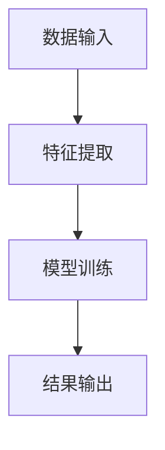
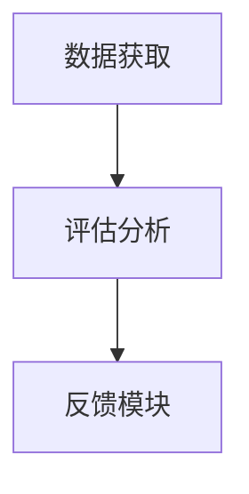

                 


# AI智能体在评估公司管理层执行力和战略规划能力中的应用

> 关键词：AI智能体，管理层评估，执行力，战略规划，数据分析，机器学习，企业架构

> 摘要：本文探讨了AI智能体在评估公司管理层执行力和战略规划能力中的应用。通过分析传统评估方法的局限性，结合AI技术的优势，提出了一种基于机器学习的智能评估系统，详细介绍了其算法原理、系统架构、项目实现和实际案例，为企业优化管理层评估提供了新的思路和解决方案。

---

## 目录大纲

### 第一部分：背景介绍

#### 第1章：问题背景与描述

##### 1.1 传统管理层评估的挑战
- 传统评估方法的局限性：主观性、不一致性和低效性
- 管理层执行力与战略规划对企业的影响
- 传统评估工具的不足：数据分散、分析复杂、反馈延迟

##### 1.2 AI智能体的应用背景
- 企业对智能化评估工具的需求
- AI技术在企业管理中的应用现状
- AI智能体在提升评估效率和准确性中的作用

##### 1.3 问题解决与边界
- AI智能体如何解决传统评估问题
- 评估的边界与适用范围
- 相关概念的外延与限制

### 第二部分：核心概念与联系

#### 第2章：AI智能体的核心原理

##### 2.1 核心概念解析
- AI智能体的定义与组成：数据处理、算法选择、结果分析
- 智能体与传统评估工具的对比：属性特征对比表格

##### 2.2 核心要素对比
- 传统评估 vs AI评估：数据来源与处理方式的差异
- 评估结果的客观性与可解释性

#### 第3章：系统架构与实体关系

##### 3.1 实体关系图
- 用mermaid绘制的ER图，展示管理层、评估指标、AI智能体等实体及其关系
```mermaid
er
actor: 管理层
goal: 评估指标
tool: AI智能体
actor --> goal: 提供数据
tool --> goal: 分析评估
tool --> actor: 提供反馈
```

### 第三部分：算法原理讲解

#### 第4章：评估模型的算法原理

##### 4.1 算法选择与流程
- 机器学习算法：线性回归、随机森林、神经网络
- 数据预处理：特征选择、数据清洗、标准化
- 模型训练：监督学习、无监督学习
- 结果预测：回归分析、分类分析、聚类分析

##### 4.2 数学模型与公式
- 评估指标的加权公式：$$\text{总分} = \sum (\text{权重}_i \times \text{指标}_i)$$
- 算法流程：数据输入、特征提取、模型训练、结果输出
- 用mermaid绘制的算法流程图


### 第四部分：系统分析与架构设计

#### 第5章：系统架构设计

##### 5.1 系统功能设计
- 数据获取模块：数据采集、存储和预处理
- 评估分析模块：模型训练、结果分析
- 反馈模块：生成报告、提供改进建议

##### 5.2 系统架构图
- 用mermaid绘制的系统架构图，展示各模块之间的关系


#### 第6章：系统接口与交互设计

##### 6.1 接口设计
- 数据接口：REST API定义
- 用户接口：可视化界面设计

##### 6.2 交互流程图
- 用mermaid绘制的交互序列图，展示用户与系统之间的互动
```mermaid
sequence
    用户 --> 系统: 提供数据
    系统 --> 用户: 返回评估结果
```

### 第五部分：项目实战

#### 第7章：项目环境与安装

##### 7.1 环境配置
- Python版本要求：Python 3.8+
- 库的安装：numpy、pandas、scikit-learn、matplotlib

#### 第8章：核心代码实现

##### 8.1 数据预处理代码
```python
import pandas as pd
import numpy as np

# 加载数据
data = pd.read_csv('management_data.csv')

# 数据清洗
data.dropna(inplace=True)
data = data[~data.duplicated()]
```

##### 8.2 模型训练代码
```python
from sklearn.model import LinearRegression

# 特征选择
X = data[['feature1', 'feature2']]
y = data['target']

# 训练模型
model = LinearRegression()
model.fit(X, y)
```

##### 8.3 评估结果展示
```python
# 可视化结果
import matplotlib.pyplot as plt

plt.scatter(X, y, color='b')
plt.plot(X, model.predict(X), color='r')
plt.show()
```

### 第六部分：最佳实践与小结

#### 第9章：最佳实践

##### 9.1 数据质量管理
- 数据的完整性和准确性
- 数据清洗与特征工程的重要性

##### 9.2 模型调优
- 参数优化与模型选择
- 模型评估指标：准确率、召回率、F1值

#### 第10章：小结与注意事项

##### 10.1 总结
- AI智能体在评估中的优势：高效性、客观性、可扩展性
- 未来发展趋势：深度学习、自然语言处理在评估中的应用

##### 10.2 注意事项
- 数据隐私与安全
- 模型的可解释性与透明度
- 持续优化与用户反馈

---

通过以上结构，文章详细阐述了AI智能体在评估公司管理层执行力和战略规划能力中的应用，结合理论分析和实际案例，为企业提供了一个创新的解决方案。

