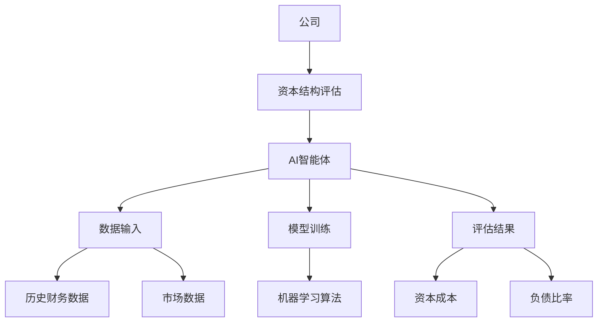
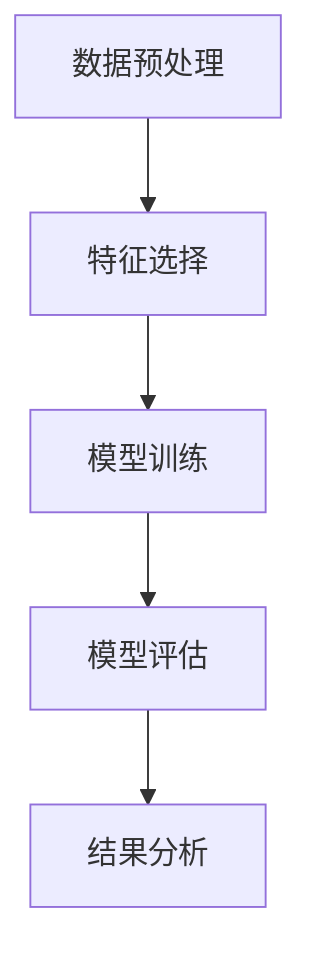
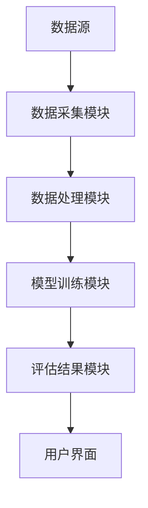
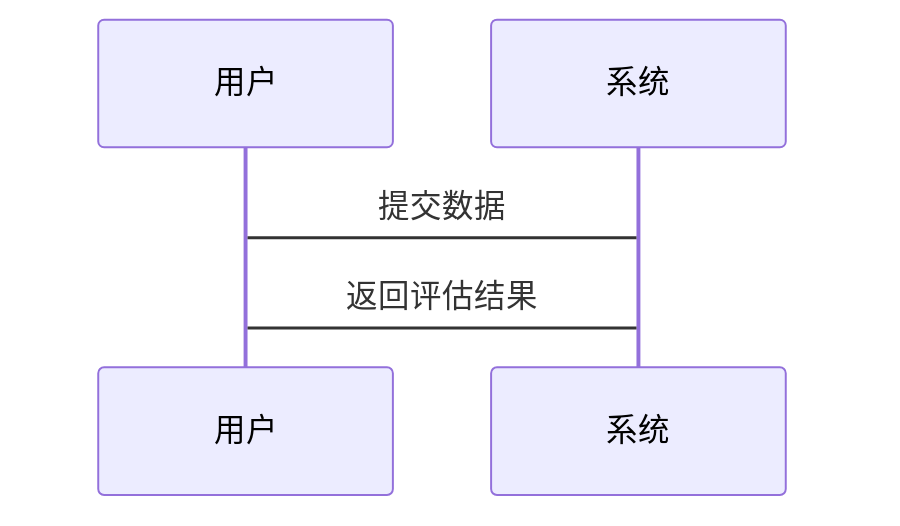

                 


# AI智能体在评估公司资本结构中的作用

> 关键词：AI智能体，资本结构，机器学习，金融分析，多智能体系统

> 摘要：本文探讨AI智能体在评估公司资本结构中的应用，分析其优势与挑战，结合算法原理和系统架构设计，提供实践案例和最佳实践。

---

## 第一部分: AI智能体在资本结构评估中的背景与基础

### 第1章: AI智能体与资本结构评估概述

#### 1.1 AI智能体的定义与核心概念

##### 1.1.1 AI智能体的基本定义
AI智能体（Artificial Intelligence Agent）是能够感知环境、执行任务以实现目标的实体。在金融领域，AI智能体通常用于数据处理、预测和决策支持。

##### 1.1.2 资本结构评估的背景与重要性
资本结构评估是公司财务管理的核心，涉及资本成本、负债比率等关键指标，直接影响企业价值和风险水平。

##### 1.1.3 AI技术在金融领域的应用现状
AI技术广泛应用于金融数据处理、风险评估和投资决策等领域，其强大的数据处理能力和预测准确性使其成为资本结构评估的理想工具。

#### 1.2 AI智能体与资本结构评估的结合

##### 1.2.1 资本结构评估的基本概念
资本结构指公司负债与权益资本的比例，影响资本成本和企业价值。传统的评估方法包括加权平均资本成本（WACC）和资本资产定价模型（CAPM）。

##### 1.2.2 AI智能体在资本结构评估中的作用
AI智能体通过机器学习算法分析大量数据，优化资本结构模型，提供实时动态评估，提升准确性。

##### 1.2.3 当前研究与应用的现状分析
当前研究集中在机器学习算法的应用，如支持向量机（SVM）和神经网络，但实际应用中仍面临数据质量和模型解释性等挑战。

### 第2章: AI智能体的核心概念与理论基础

#### 2.1 多智能体系统（MAS）概述

##### 2.1.1 多智能体系统的定义与特点
多智能体系统由多个相互作用的智能体组成，每个智能体负责特定任务，协同完成复杂目标。

##### 2.1.2 多智能体系统在金融领域的应用
在金融领域，MAS用于风险管理、投资组合优化和市场预测，多个智能体协同工作提升整体性能。

#### 2.2 机器学习与深度学习在资本结构评估中的应用

##### 2.2.1 机器学习的基本原理
机器学习通过数据训练模型，识别模式和关系，应用于分类、回归和聚类问题。

##### 2.2.2 深度学习在金融分析中的优势
深度学习，如神经网络，能够处理非线性关系，捕捉复杂数据特征，适用于金融时间序列分析。

##### 2.2.3 资本结构评估中的机器学习模型
常用的模型包括线性回归、随机森林和梯度提升树（XGBoost），用于预测资本成本和负债比率。

#### 2.3 资本结构评估的关键因素分析

##### 2.3.1 资本成本的计算方法
资本成本是公司获取资金的总成本，包括债务成本和股权成本，通常使用WACC模型计算。

##### 2.3.2 负债比率的影响因素
负债比率反映公司负债在资产中的比例，受行业、企业规模和财务状况影响。

##### 2.3.3 公司价值与资本结构的关系
资本结构影响公司价值，最优资本结构平衡风险与收益，提升企业价值。

### 第3章: AI智能体与资本结构评估的核心联系

#### 3.1 AI智能体在资本结构评估中的优势

##### 3.1.1 提高数据处理能力
AI智能体能够处理海量数据，提取关键特征，提升模型的准确性和鲁棒性。

##### 3.1.2 增强预测准确性
通过机器学习算法，AI智能体能够发现数据中的非线性关系，提高预测精度。

##### 3.1.3 实现实时动态评估
AI智能体实时更新数据，动态调整模型，提供及时的资本结构评估结果。

#### 3.2 AI智能体与传统资本结构评估方法的对比分析

##### 3.2.1 传统资本结构评估方法的局限性
传统方法依赖经验判断，计算复杂且耗时，难以处理大数据和动态变化。

##### 3.2.2 AI智能体方法的优势与创新
AI智能体通过自动化数据处理和模型优化，提高效率和准确性，降低人为误差。

##### 3.2.3 综合评估方法的可行性
结合AI智能体和传统方法，利用AI优化模型参数，传统方法验证结果，提升整体评估的可靠性和可解释性。

#### 3.3 实体关系图与AI智能体的架构设计



---

## 第4章: AI智能体评估资本结构的算法原理

### 4.1 机器学习算法在资本结构评估中的应用

#### 4.1.1 线性回归模型

##### 4.1.1.1 算法原理
线性回归模型假设目标变量与特征变量之间存在线性关系，通过最小化预测误差平方和来求解模型参数。

##### 4.1.1.2 优缺点分析
优点：简单易懂，计算速度快；缺点：假设线性关系，可能无法捕捉复杂模式。

##### 4.1.1.3 应用场景
适用于资本成本与单一因素（如负债比率）之间的线性关系分析。

#### 4.1.2 支持向量机（SVM）

##### 4.1.2.1 算法原理
SVM通过构建超平面将数据分为两类，适用于分类和回归问题。

##### 4.1.2.2 优缺点分析
优点：适用于高维数据，泛化能力强；缺点：计算复杂，参数选择敏感。

##### 4.1.2.3 应用场景
用于分类资本结构的健康状况，如高风险或低风险。

#### 4.1.3 神经网络

##### 4.1.3.1 算法原理
神经网络通过多层非线性激活函数，学习复杂数据特征，适用于复杂资本结构评估。

##### 4.1.3.2 优缺点分析
优点：能力强，能捕捉复杂模式；缺点：计算资源消耗大，解释性差。

##### 4.1.3.3 应用场景
用于预测资本成本和负债比率的复杂关系。

### 4.2 基于机器学习的资本结构评估流程



#### 4.2.1 数据预处理

##### 数据清洗
处理缺失值、异常值和重复数据，确保数据质量。

##### 数据标准化
将特征数据标准化或归一化，适用于机器学习算法。

#### 4.2.2 特征选择

##### 主成分分析（PCA）
通过PCA降维，减少特征数量，降低模型复杂度。

##### 相关性分析
剔除高度相关特征，避免多重共线性问题。

#### 4.2.3 模型训练

##### 训练数据划分
将数据划分为训练集和验证集，评估模型泛化能力。

##### 超参数调优
使用网格搜索或随机搜索，优化模型参数，提升性能。

#### 4.2.4 模型评估

##### 评估指标
采用均方误差（MSE）、R平方值等指标评估模型性能。

##### 模型验证
通过交叉验证评估模型稳定性，避免过拟合。

#### 4.2.5 结果分析

##### 结果可视化
绘制预测值与真实值对比图，直观展示模型效果。

##### 业务解释
将模型结果转化为业务见解，指导资本结构优化。

### 4.3 资本结构评估的数学模型

#### 4.3.1 资本资产定价模型（CAPM）

$$ E(r_i) = r_f + \beta_i (E(r_m) - r_f) $$

其中，$E(r_i)$是资产i的预期收益，$r_f$是无风险利率，$\beta_i$是资产i的贝塔系数，$E(r_m)$是市场预期收益。

#### 4.3.2 加权平均资本成本（WACC）

$$ WACC = \left( \frac{D}{V} \times r_d \times (1 - t) \right) + \left( \frac{E}{V} \times r_e \right) $$

其中，$D$是债务，$E$是权益，$V = D + E$，$r_d$是债务成本，$r_e$是权益成本，$t$是税率。

---

## 第5章: 基于AI智能体的资本结构评估系统架构设计

### 5.1 系统功能设计

#### 5.1.1 数据采集模块
从财务报表、市场数据等来源获取输入数据，进行数据清洗和预处理。

#### 5.1.2 模型训练模块
选择机器学习算法，训练模型并优化参数，保存最佳模型。

#### 5.1.3 评估结果模块
输出资本结构评估结果，包括资本成本和负债比率，并生成可视化报告。

### 5.2 系统架构设计



#### 5.2.1 数据源
包括财务报表、市场数据和行业基准数据。

#### 5.2.2 数据采集模块
负责数据的获取和初步处理，确保数据格式和一致性。

#### 5.2.3 数据处理模块
执行数据清洗、特征选择和数据标准化，为模型训练准备数据。

#### 5.2.4 模型训练模块
选择算法，训练模型，调优参数，保存最优模型。

#### 5.2.5 评估结果模块
应用训练好的模型，评估资本结构，生成结果报告。

### 5.3 系统接口设计

#### 5.3.1 API接口
定义RESTful API，供其他系统调用评估结果。

#### 5.3.2 数据接口
与数据库或其他数据源对接，确保数据流畅传输。

#### 5.3.3 用户接口
提供友好的用户界面，方便用户输入数据和查看结果。

### 5.4 系统交互设计



---

## 第6章: 项目实战

### 6.1 环境安装与配置

#### 6.1.1 安装Python
安装最新版本的Python，确保兼容性。

#### 6.1.2 安装依赖库
使用pip安装numpy、pandas、scikit-learn、xgboost等库。

### 6.2 核心代码实现

#### 6.2.1 数据预处理

```python
import pandas as pd
import numpy as np

# 读取数据
data = pd.read_csv('capital_structure.csv')

# 数据清洗
data.dropna()
data.drop_duplicates()

# 标准化处理
from sklearn.preprocessing import StandardScaler
scaler = StandardScaler()
scaled_features = scaler.fit_transform(data.drop('target', axis=1))
```

#### 6.2.2 模型训练与评估

```python
from sklearn.model_selection import train_test_split
from sklearn.linear_model import LinearRegression
from sklearn.metrics import mean_squared_error

# 划分数据集
X_train, X_test, y_train, y_test = train_test_split(scaled_features, data['target'], test_size=0.2)

# 训练模型
model = LinearRegression()
model.fit(X_train, y_train)

# 评估模型
y_pred = model.predict(X_test)
mse = mean_squared_error(y_test, y_pred)
print(f'MSE: {mse}')
```

### 6.3 实际案例分析与结果解读

#### 6.3.1 案例分析
以某公司为例，分析其资本结构，使用模型预测资本成本和负债比率。

#### 6.3.2 结果解读
解释模型预测结果，与实际值对比，评估模型准确性。

### 6.4 项目总结与优化建议

#### 6.4.1 项目总结
总结项目成果，模型性能和实际应用效果。

#### 6.4.2 优化建议
提出可能的优化方向，如引入更复杂的算法或增加数据维度。

---

## 第7章: 最佳实践与小结

### 7.1 最佳实践

#### 7.1.1 数据质量的重要性
确保数据准确性和完整性，选择合适的特征。

#### 7.1.2 模型选择与调优
根据数据特点选择模型，通过交叉验证调优参数。

#### 7.1.3 结果解释与可解释性
重视模型结果的业务解释，保持结果的可解释性。

### 7.2 小结

AI智能体通过强大的数据处理能力和机器学习算法，显著提升了资本结构评估的效率和准确性。然而，实际应用中仍需关注数据质量和模型解释性，结合业务需求优化系统设计。

### 7.3 注意事项

- 数据隐私和安全问题
- 模型的可解释性
- 算法的实时性和响应速度

### 7.4 拓展阅读

- 《机器学习实战》
- 《深入浅出人工智能》
- 《资本结构与企业价值》

---

# 结语

AI智能体在资本结构评估中的应用前景广阔，通过不断的技术创新和实践积累，将为金融领域带来更多突破和变革。

