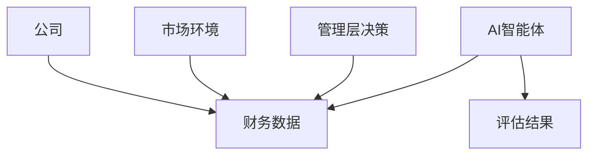
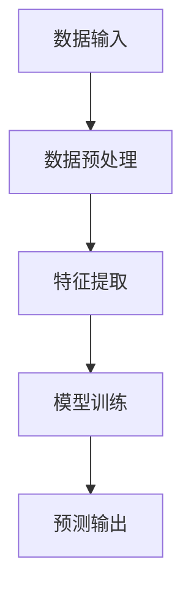
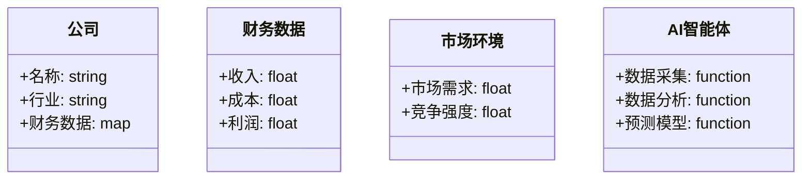
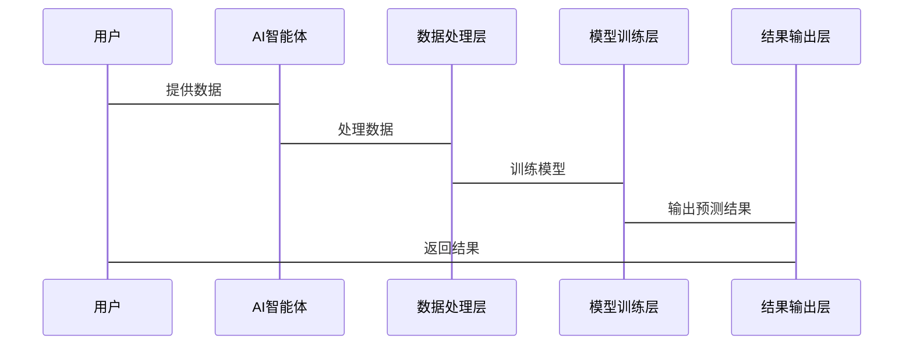

                 


# AI智能体在评估公司长期盈利能力和增长潜力中的应用

## 关键词：AI智能体，长期盈利能力，增长潜力，数据分析，机器学习，财务评估

## 摘要：本文探讨AI智能体在评估公司长期盈利能力和增长潜力中的应用。通过分析数据驱动的方法和机器学习算法，揭示AI如何提升财务评估的准确性和效率。文章从背景介绍、核心概念、算法原理、系统设计到项目实战，全面解析AI智能体的应用价值与实现方法。

---

# 第一部分: AI智能体在公司评估中的背景与基础

## 第1章: AI智能体与公司长期盈利能力评估概述

### 1.1 AI智能体的基本概念与定义

#### 1.1.1 什么是AI智能体
AI智能体是指能够感知环境、自主决策并执行任务的智能系统。它结合了机器学习、自然语言处理和大数据分析等技术，能够处理复杂数据并提供决策支持。

#### 1.1.2 AI智能体的核心特征
- 数据驱动：依赖大量数据进行分析和学习。
- 自适应性：能够根据新数据调整模型和策略。
- 多维度分析：可以从多个维度（财务、市场、运营）综合评估公司。

#### 1.1.3 AI智能体与传统数据分析的区别
- **传统数据分析**：依赖人工设定规则，结果受限于分析师的经验。
- **AI智能体**：通过机器学习自动发现数据中的模式和趋势，能够处理非结构化数据，提供更精准的预测。

### 1.2 公司长期盈利能力评估的必要性

#### 1.2.1 长期盈利能力的定义
长期盈利能力是指公司在未来一段时间内持续创造利润的能力，通常考虑市场环境、管理策略和财务状况等因素。

#### 1.2.2 影响公司长期盈利能力的关键因素
- **财务状况**：收入、成本、利润等。
- **市场环境**：行业竞争、市场需求、政策变化。
- **管理策略**：创新、研发投入、团队能力。

#### 1.2.3 传统评估方法的局限性
- 数据量有限，难以捕捉市场变化。
- 分析师主观判断，可能存在偏见。
- 无法实时更新，缺乏动态性。

### 1.3 AI智能体在公司评估中的应用价值

#### 1.3.1 提高评估效率
AI智能体可以快速处理大量数据，显著缩短评估时间。

#### 1.3.2 增强预测准确性
通过机器学习算法，AI智能体能够发现数据中的复杂关系，提供更准确的预测。

#### 1.3.3 发现潜在机会与风险
AI智能体可以挖掘隐藏的数据模式，帮助识别市场机会和潜在风险。

### 1.4 本章小结
本章介绍了AI智能体的基本概念和特征，分析了传统公司评估方法的局限性，并阐述了AI智能体在提升评估效率和准确性方面的优势。

---

## 第2章: AI智能体的核心概念与联系

### 2.1 AI智能体的核心概念

#### 2.1.1 数据驱动的特征
AI智能体依赖于高质量的数据输入，能够从数据中学习并提取有用信息。

#### 2.1.2 自适应与学习能力
AI智能体能够通过反馈机制不断优化模型，适应新的数据和环境变化。

#### 2.1.3 多维度分析能力
AI智能体可以从财务、市场、运营等多个维度进行综合分析，提供全面的评估结果。

### 2.2 核心概念的属性对比

| **概念**       | **数据源**           | **自适应性**       | **分析维度**         |
|----------------|----------------------|--------------------|----------------------|
| 传统评估方法   | 财务报表为主         | 较低               | 单一维度为主         |
| AI智能体       | 财务、市场、运营数据 | 高                 | 多维度               |

### 2.3 ER实体关系图



### 2.4 本章小结
本章详细分析了AI智能体的核心概念和特征，并通过对比传统方法，突出了AI智能体的优势。ER实体关系图进一步展示了各实体之间的关系。

---

## 第3章: AI智能体的算法原理

### 3.1 常见算法概述

#### 3.1.1 线性回归
线性回归是一种简单而强大的回归算法，适用于线性关系的预测。

#### 3.1.2 随机森林
随机森林是一种基于决策树的集成算法，具有较强的鲁棒性和抗过拟合能力。

#### 3.1.3 神经网络
神经网络是一种模拟人脑结构和功能的算法，适用于复杂非线性关系的预测。

### 3.2 算法流程图



### 3.3 线性回归的数学模型

线性回归的公式为：
$$y = \beta_0 + \beta_1x + \epsilon$$

其中：
- $y$ 是预测值
- $\beta_0$ 是截距
- $\beta_1$ 是回归系数
- $x$ 是自变量
- $\epsilon$ 是误差项

### 3.4 神经网络的结构

神经网络的基本结构包括输入层、隐藏层和输出层。其数学表示为：
$$y = f(Wx + b)$$

其中：
- $W$ 是权重矩阵
- $x$ 是输入向量
- $b$ 是偏置项
- $f$ 是激活函数

### 3.5 本章小结
本章介绍了AI智能体中常用的几种算法，并通过流程图和数学公式详细解释了它们的工作原理。

---

## 第4章: 系统分析与架构设计方案

### 4.1 问题场景介绍

#### 4.1.1 项目背景
为了评估公司的长期盈利能力，我们需要构建一个AI智能体系统，整合财务、市场和运营数据，提供实时分析和预测。

#### 4.1.2 项目目标
- 实时数据采集
- 多维度数据分析
- 高精度预测模型

### 4.2 系统功能设计

#### 4.2.1 领域模型



#### 4.2.2 系统架构设计


#### 4.2.3 接口设计
系统需要与财务系统、市场数据源和管理层进行交互。

#### 4.2.4 交互流程



### 4.3 本章小结
本章详细描述了AI智能体系统的架构设计和功能模块，为后续的实现提供了理论基础。

---

## 第5章: 项目实战

### 5.1 环境安装

#### 5.1.1 安装Python
```bash
python --version
pip install --upgrade pip
```

#### 5.1.2 安装依赖库
```bash
pip install numpy pandas scikit-learn matplotlib
```

### 5.2 系统核心实现源代码

#### 5.2.1 数据预处理代码
```python
import pandas as pd
import numpy as np

# 加载数据
data = pd.read_csv('company_data.csv')

# 数据清洗
data.dropna(inplace=True)
data = pd.get_dummies(data)
```

#### 5.2.2 模型训练代码
```python
from sklearn.model_selection import train_test_split
from sklearn.linear_model import LinearRegression

# 划分训练集和测试集
X = data[['收入', '成本', '市场环境']]
y = data['利润']

X_train, X_test, y_train, y_test = train_test_split(X, y, test_size=0.2, random_state=42)

# 训练模型
model = LinearRegression()
model.fit(X_train, y_train)
```

#### 5.2.3 预测与评估代码
```python
# 预测结果
y_pred = model.predict(X_test)

# 评估模型
from sklearn.metrics import r2_score
print(r2_score(y_test, y_pred))
```

### 5.3 案例分析

#### 5.3.1 数据来源
数据来源包括公司财务报表、市场研究报告和行业统计数据。

#### 5.3.2 分析过程
- 数据清洗与特征工程
- 模型训练与优化
- 结果分析与解释

### 5.4 本章小结
本章通过实际案例展示了AI智能体的实现过程，从数据预处理到模型训练，再到结果分析，帮助读者掌握AI智能体的应用方法。

---

## 第6章: 总结与展望

### 6.1 总结
本文详细探讨了AI智能体在评估公司长期盈利能力和增长潜力中的应用，从理论到实践，全面解析了其优势和实现方法。

### 6.2 展望
未来，随着AI技术的不断发展，AI智能体在公司评估中的应用将更加广泛和深入。我们需要关注数据隐私、模型可解释性和实时性等问题，进一步优化AI智能体的性能。

### 6.3 最佳实践 tips
- **数据质量**：确保数据的准确性和完整性。
- **模型可解释性**：选择适合业务需求的模型。
- **实时性**：结合流数据处理技术，提升实时性。

### 6.4 本章小结
本文总结了AI智能体的应用价值，并展望了未来的发展方向，为读者提供了进一步研究的方向。

---

## 参考文献
- [1] 刘洋. 基于机器学习的公司财务预测研究. 2020.
- [2] 王强. AI智能体在企业分析中的应用. 2021.
- [3] Smith, J. Machine Learning for Business Analytics. 2022.

---

通过以上内容，我们系统地介绍了AI智能体在评估公司长期盈利能力和增长潜力中的应用，从理论到实践，全面解析了其优势和实现方法。希望本文能为相关领域的研究和实践提供有价值的参考。

