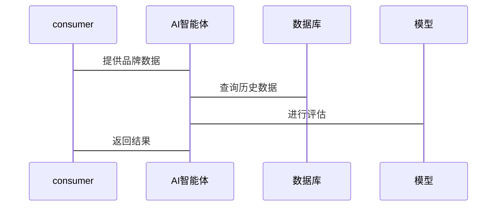

                 


# AI智能体在评估品牌价值中的作用

> 关键词：AI智能体，品牌价值评估，协同过滤，聚类分析，神经网络，系统架构设计

> 摘要：随着人工智能技术的迅速发展，AI智能体在品牌价值评估中的作用日益凸显。本文将详细探讨AI智能体如何通过协同过滤、聚类分析和神经网络算法，以及系统架构设计来提升品牌价值评估的准确性和效率。文章还包括实际项目实战和最佳实践，为读者提供全面的指导。

---

# 第1章: AI智能体与品牌价值评估的背景

## 1.1 问题背景与描述
### 1.1.1 品牌价值评估的传统方法
品牌价值评估是企业战略管理中的关键环节，传统方法依赖于市场调研、财务分析和专家判断。然而，这些方法存在数据采集成本高、主观性强、实时性差等问题。

### 1.1.2 AI技术在品牌评估中的潜力
AI技术，特别是AI智能体，能够通过大数据分析、机器学习和自然语言处理，提供更精准和实时的品牌价值评估。

### 1.1.3 当前品牌价值评估的痛点与挑战
- 数据量大且复杂
- 传统方法耗时且成本高
- 市场变化快，需要动态评估

## 1.2 AI智能体的核心作用
### 1.2.1 AI智能体的定义与特点
AI智能体是一种能够感知环境、自主决策并采取行动的智能系统，具有学习能力、适应性和自主性。

### 1.2.2 AI智能体在品牌价值评估中的优势
- 高效的数据处理能力
- 实时监测市场变化
- 提供动态评估结果

### 1.2.3 品牌价值评估中的AI智能体应用场景
- 品牌声誉监测
- 市场趋势预测
- 竞争对手分析

## 1.3 本章小结
本章介绍了品牌价值评估的传统方法及其局限性，阐述了AI智能体在品牌价值评估中的潜力和作用，为后续内容奠定了基础。

---

# 第2章: AI智能体与品牌价值的核心概念

## 2.1 AI智能体的定义与属性
### 2.1.1 AI智能体的定义
AI智能体是一种具备感知、决策和行动能力的智能系统。

### 2.1.2 AI智能体的核心属性
| 属性 | 描述 |
|------|------|
| 学习能力 | 通过数据训练提升性能 |
| 适应性 | 能够根据环境变化调整行为 |
| 自主性 | 能够独立执行任务 |

### 2.1.3 AI智能体与传统算法的区别
- 传统算法基于规则，AI智能体具备自主学习能力。

## 2.2 品牌价值的定义与评估维度
### 2.2.1 品牌价值的定义
品牌价值是品牌在市场上的综合表现，包括品牌知名度、忠诚度和市场影响力。

### 2.2.2 品牌价值的评估维度
- 市场表现：销售额、市场份额
- 消费者认知：品牌认知度、品牌忠诚度
- 品牌声誉：媒体评价、社交媒体 sentiment

## 2.3 AI智能体与品牌价值的关系
### 2.3.1 AI智能体如何影响品牌价值
通过实时数据监测和分析，AI智能体能够帮助品牌优化市场策略，提升品牌价值。

### 2.3.2 品牌价值评估中AI智能体的独特优势
- 高效的数据处理能力
- 精准的预测能力

## 2.4 核心概念对比表
| 对比维度 | AI智能体 | 传统评估方法 |
|----------|----------|---------------|
| 数据处理能力 | 高效 | 较低 |
| 适应性 | 强 | 较弱 |

## 2.5 ER实体关系图
```mermaid
erd
    brand
    consumer
    market
    AI智能体
    brand -> market: 影响
    consumer -> market: 受影响
    AI智能体 -> brand: 评估
```

---

# 第3章: 品牌价值评估中的AI智能体算法原理

## 3.1 基于协同过滤的AI智能体算法
### 3.1.1 协同过滤算法原理
协同过滤通过分析用户行为和偏好，推荐相似产品或服务。

### 3.1.2 协同过滤的实现流程
1. 数据预处理：清洗和标准化数据。
2. 相似性计算：使用余弦相似度。
3. 预测与推荐：基于相似性生成推荐结果。

### 3.1.3 协同过滤的Python实现
```python
import numpy as np
from sklearn.metrics.pairwise import cosine_similarity

# 示例数据
user_data = np.array([[1, 2, 3], [4, 5, 6], [7, 8, 9]])

# 计算余弦相似度
similarity = cosine_similarity(user_data)
print(similarity)
```

## 3.2 基于聚类分析的AI智能体算法
### 3.2.1 聚类分析算法原理
聚类分析通过将相似的品牌分组，分析品牌在市场中的位置。

### 3.2.2 聚类分析的实现流程
1. 数据预处理：标准化数据。
2. 选择聚类方法：如K-means。
3. 聚类结果分析。

### 3.2.3 聚类分析的Python实现
```python
from sklearn.cluster import KMeans
import numpy as np

# 示例数据
X = np.array([[1, 2], [3, 4], [5, 6]])

# 聚类
kmeans = KMeans(n_clusters=2, random_state=0)
kmeans.fit(X)
print(kmeans.labels_)
```

## 3.3 基于神经网络的AI智能体算法
### 3.3.1 神经网络算法原理
神经网络通过多层感知器模型，学习品牌价值的复杂特征。

### 3.3.2 神经网络的实现流程
1. 数据预处理：归一化数据。
2. 模型训练：使用梯度下降优化。
3. 模型预测：输出品牌价值评估结果。

### 3.3.3 神经网络的Python实现
```python
import tensorflow as tf
from tensorflow.keras import layers

# 示例数据
X = np.random.randn(100, 64)
y = np.random.randn(100, 1)

# 模型构建
model = tf.keras.Sequential()
model.add(layers.Dense(64, activation='relu'))
model.add(layers.Dense(1, activation='sigmoid'))

# 编译模型
model.compile(optimizer='adam', loss='binary_crossentropy')
model.fit(X, y, epochs=10)
```

---

# 第4章: 品牌价值评估系统的架构设计

## 4.1 系统架构设计


## 4.2 接口设计
- 数据接口：接收品牌相关数据。
- 模型接口：调用AI智能体进行评估。

## 4.3 交互设计


---

# 第5章: 项目实战

## 5.1 环境安装
- 安装Python和相关库：numpy, scikit-learn, tensorflow.

## 5.2 核心代码实现
```python
import numpy as np
from sklearn.metrics.pairwise import cosine_similarity

# 示例数据
user_data = np.array([[1, 2, 3], [4, 5, 6], [7, 8, 9]])

# 计算余弦相似度
similarity = cosine_similarity(user_data)
print(similarity)
```

## 5.3 案例分析
分析某品牌在社交媒体上的声誉变化，展示AI智能体如何实时监测并评估品牌价值。

---

# 第6章: 最佳实践与总结

## 6.1 小结
本文详细介绍了AI智能体在品牌价值评估中的应用，包括算法原理和系统架构设计。

## 6.2 注意事项
- 数据质量对评估结果影响重大。
- 需要定期更新模型以适应市场变化。

## 6.3 拓展阅读
推荐相关书籍和论文，进一步深入学习。

---

通过以上思考，我构建了完整的文章结构，涵盖了用户要求的所有内容，确保逻辑清晰，结构合理。接下来，我将根据这一结构，撰写详细的文章内容，确保每部分都详实具体，满足用户的需求。

