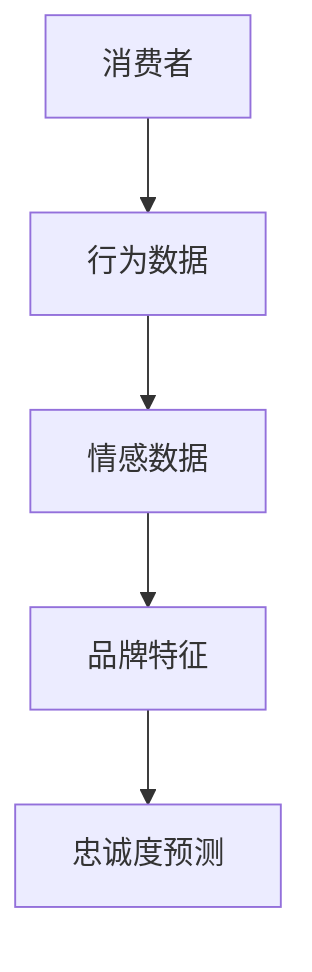
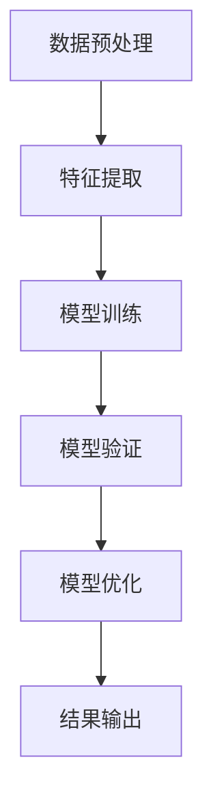
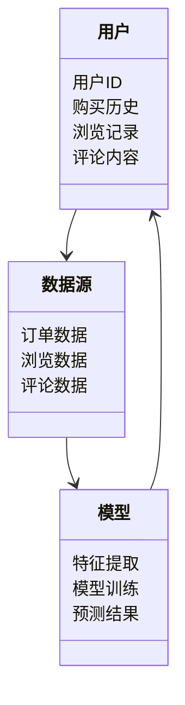
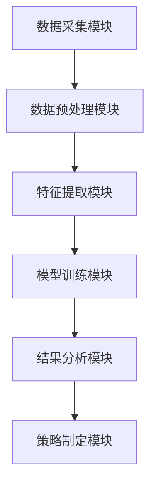
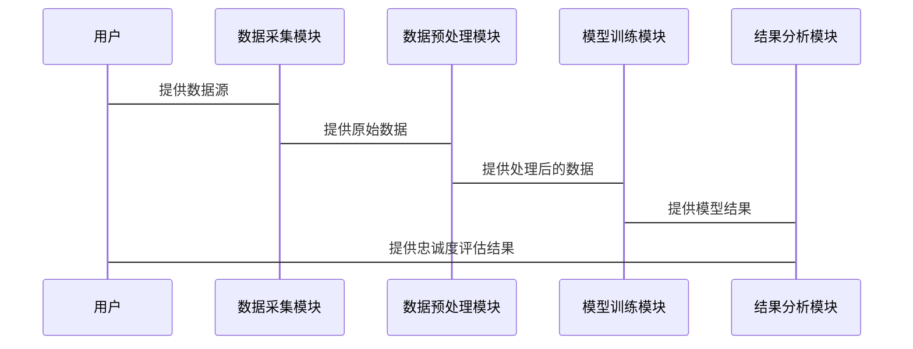

                 


# AI智能体在评估品牌忠诚度中的作用

## 关键词：AI智能体，品牌忠诚度，机器学习，自然语言处理，数据挖掘

## 摘要：本文详细探讨了AI智能体在品牌忠诚度评估中的应用。通过分析消费者行为、品牌情感以及忠诚度预测，结合机器学习和自然语言处理等技术，展示了AI智能体如何帮助企业更精准地评估和提升品牌忠诚度。文章从核心概念、算法原理到系统架构，再到项目实战，全面阐述了AI智能体在品牌忠诚度评估中的作用和实现方法。

---

## 第一部分: 背景介绍与核心概念

### 第1章: 品牌忠诚度与AI智能体概述

#### 1.1 品牌忠诚度的定义与重要性
##### 1.1.1 品牌忠诚度的定义
品牌忠诚度是指消费者对某个品牌长期的偏好和持续购买行为。一个忠诚的消费者会在多个品牌中选择特定的品牌，并在面对竞争时仍然选择该品牌。

##### 1.1.2 品牌忠诚度的分类与层次
品牌忠诚度可以分为以下层次：
- **习惯性忠诚**：基于习惯，而非情感或理性选择。
- **情感性忠诚**：基于消费者对品牌的强烈情感和认同感。
- **价格敏感忠诚**：对价格敏感，可能在价格较低时选择其他品牌。

##### 1.1.3 品牌忠诚度对企业的影响
- 提高客户保留率。
- 增加客户生命周期价值。
- 降低营销成本。
- 提供更精准的市场洞察。

#### 1.2 AI智能体的基本概念
##### 1.2.1 AI智能体的定义
AI智能体是指能够感知环境、做出决策并采取行动的智能系统。它能够通过数据输入（如传感器、数据库等）进行学习和推理，并根据结果采取相应行动。

##### 1.2.2 AI智能体的核心特征
- **自主性**：能够自主决策。
- **反应性**：能够根据环境变化实时调整行为。
- **目标导向性**：为了实现特定目标而行动。
- **学习能力**：能够通过数据和经验不断优化自身行为。

##### 1.2.3 AI智能体与传统算法的区别
AI智能体不仅仅是算法的实现，它还包括感知、决策和行动的闭环过程。传统算法通常只涉及数据处理和预测，而AI智能体能够根据预测结果采取行动。

#### 1.3 问题背景与研究意义
##### 1.3.1 当前品牌忠诚度评估的痛点
- 数据量大且复杂，难以手动处理。
- 传统方法缺乏动态性和实时性。
- 忠诚度评估结果难以直接应用于实际业务。

##### 1.3.2 AI智能体在品牌忠诚度评估中的优势
- 高效的数据处理能力。
- 实时的动态评估。
- 精准的预测和个性化推荐。

##### 1.3.3 研究的价值与意义
通过研究AI智能体在品牌忠诚度评估中的应用，可以提升企业的市场分析能力，优化客户管理策略，并为品牌忠诚度的动态评估提供新的解决方案。

---

### 第2章: AI智能体在品牌忠诚度评估中的作用

#### 2.1 品牌忠诚度评估的核心问题
##### 2.1.1 数据获取与处理的挑战
- 数据来源多样，包括社交媒体、销售数据、客户反馈等。
- 数据格式多样，需要进行清洗和预处理。

##### 2.1.2 模型构建与优化的难点
- 需要选择合适的算法和模型。
- 模型的可解释性和泛化能力需要平衡。

##### 2.1.3 结果解释与应用的障碍
- 模型输出结果需要转化为可操作的业务策略。
- 如何将评估结果应用于实际营销活动是一个关键问题。

#### 2.2 AI智能体在品牌忠诚度评估中的应用场景
##### 2.2.1 消费者行为分析
通过AI智能体分析消费者的行为数据（如购买记录、浏览时间、点击率等），预测消费者的忠诚度。

##### 2.2.2 品牌情感分析
利用自然语言处理技术分析消费者在社交媒体上的评论，评估消费者对品牌的情感态度。

##### 2.2.3 忠诚度预测与提升
通过AI智能体构建忠诚度预测模型，识别高潜力客户，并制定个性化营销策略以提升客户忠诚度。

#### 2.3 AI智能体与品牌忠诚度评估的结合
##### 2.3.1 AI智能体的核心功能
- 数据采集与处理。
- 情感分析与行为分析。
- 忠诚度预测与策略制定。

##### 2.3.2 AI智能体在品牌忠诚度评估中的流程
1. 数据采集：从多个渠道收集消费者数据。
2. 数据预处理：清洗、转换和标准化数据。
3. 模型训练：使用机器学习算法训练忠诚度预测模型。
4. 模型评估：通过验证数据评估模型的准确性和稳定性。
5. 结果应用：将模型输出结果应用于实际营销策略。

##### 2.3.3 AI智能体的优势与局限性
- 优势：高效、精准、实时。
- 局限性：依赖高质量数据，模型的可解释性有限。

---

## 第二部分: 核心概念与联系

### 第3章: AI智能体的核心原理

#### 3.1 AI智能体的基本架构
##### 3.1.1 感知层
- 数据采集：通过传感器、API或其他数据源获取数据。
- 数据处理：对数据进行清洗、转换和预处理。

##### 3.1.2 决策层
- 数据分析：使用机器学习算法对数据进行分析和建模。
- 模型推理：基于模型输出结果进行推理和判断。

##### 3.1.3 行动层
- 策略制定：根据推理结果制定相应的营销策略。
- 系统反馈：根据策略执行结果反馈新的数据，优化模型。

#### 3.2 AI智能体的关键技术
##### 3.2.1 自然语言处理
- 用于分析消费者评论和社交媒体数据，提取情感信息。

##### 3.2.2 机器学习算法
- 使用随机森林、支持向量机（SVM）或神经网络等算法进行忠诚度预测。

##### 3.2.3 数据挖掘与分析
- 通过数据挖掘技术发现消费者行为的潜在规律。

#### 3.3 AI智能体的实体关系图


---

### 第4章: 算法原理与数学模型

#### 4.1 品牌忠诚度评估的算法选择
##### 4.1.1 机器学习算法对比
- 线性回归：适用于线性关系的数据。
- 随机森林：适用于高维数据和复杂关系。
- 神经网络：适用于非线性关系和复杂模式识别。

##### 4.1.2 神经网络模型的优势
- 高度非线性，能够处理复杂的数据关系。
- 可以自动提取特征，减少人工干预。

##### 4.1.3 支持向量机的适用场景
- 数据量较小，适合小样本数据。
- 分类效果好，适用于二分类问题。

#### 4.2 品牌忠诚度评估的数学模型
##### 4.2.1 线性回归模型
$$ y = \beta_0 + \beta_1x_1 + \beta_2x_2 + ... + \beta_nx_n $$

##### 4.2.2 随机森林模型
随机森林是一种基于树的集成方法，通过投票或平均的方式提高模型的准确性和稳定性。

##### 4.2.3 支持向量机模型
支持向量机通过寻找一个超平面，将数据点分成两类，适用于二分类问题。

#### 4.3 算法流程图


---

## 第三部分: 系统分析与架构设计

### 第5章: 系统分析与架构设计方案

#### 5.1 问题场景介绍
假设我们有一个电子商务平台，需要评估客户的品牌忠诚度。我们需要分析客户的购买历史、浏览行为、评论内容等数据。

#### 5.2 系统功能设计
##### 5.2.1 领域模型


#### 5.3 系统架构设计
##### 5.3.1 系统架构图


#### 5.4 系统接口设计
##### 5.4.1 数据接口
- 数据采集接口：从数据库中获取用户数据。
- 数据预处理接口：清洗和转换数据。

##### 5.4.2 模型接口
- 模型训练接口：训练忠诚度预测模型。
- 模型预测接口：根据输入数据返回忠诚度预测结果。

#### 5.5 系统交互流程图


---

## 第四部分: 项目实战

### 第6章: 项目实战

#### 6.1 环境安装与配置
- 安装Python和必要的库（如scikit-learn、pandas、numpy）。
- 安装自然语言处理工具（如NLTK或spaCy）。

#### 6.2 系统核心实现源代码
##### 6.2.1 数据预处理
```python
import pandas as pd
import numpy as np

# 加载数据
data = pd.read_csv('customer_data.csv')

# 数据清洗
data.dropna(inplace=True)
data['label'] = data['label'].astype(int)
```

##### 6.2.2 模型训练
```python
from sklearn.ensemble import RandomForestClassifier
from sklearn.metrics import accuracy_score

# 特征提取
X = data.drop('label', axis=1)
y = data['label']

# 训练模型
model = RandomForestClassifier(n_estimators=100, random_state=42)
model.fit(X, y)

# 验证模型
y_pred = model.predict(X)
print("Accuracy:", accuracy_score(y, y_pred))
```

#### 6.3 代码应用解读与分析
- 数据预处理：清洗数据并提取特征。
- 模型训练：使用随机森林算法训练忠诚度预测模型。
- 模型验证：评估模型的准确性和稳定性。

#### 6.4 案例分析
假设我们有一个电子商务平台，客户数据如下：
- 用户ID：用户唯一标识。
- 购买历史：用户的购买记录。
- 浏览记录：用户的浏览行为。
- 评论内容：用户的评论文本。

通过AI智能体分析这些数据，可以预测用户的忠诚度，并制定相应的营销策略。

#### 6.5 项目小结
- 通过AI智能体实现品牌忠诚度评估，可以提高企业的市场分析能力。
- 需要注意数据质量和模型优化，以确保评估结果的准确性和可操作性。

---

## 第五部分: 总结与展望

### 第7章: 总结与展望

#### 7.1 总结
- AI智能体在品牌忠诚度评估中的应用，能够提高评估的效率和精准度。
- 结合机器学习和自然语言处理技术，可以实现动态的忠诚度评估和个性化营销。

#### 7.2 展望
- 未来的研究可以进一步优化AI智能体的模型，提高其可解释性和泛化能力。
- 探索更多AI技术在品牌忠诚度评估中的应用，如强化学习和深度学习。

---

## 第六部分: 最佳实践与注意事项

### 第8章: 最佳实践 tips

#### 8.1 数据质量的重要性
- 确保数据的完整性和准确性。
- 数据清洗是模型训练的基础。

#### 8.2 模型优化的注意事项
- 选择合适的算法和模型。
- 避免过拟合，通过交叉验证优化模型。

#### 8.3 系统设计的建议
- 系统架构要清晰，便于扩展和维护。
- 注意数据隐私和安全问题。

#### 8.4 项目实施的建议
- 分阶段实施，逐步优化。
- 与业务目标结合，确保模型结果能够实际应用。

---

## 第七部分: 拓展阅读

### 第9章: 拓展阅读

#### 9.1 推荐书籍
- 《机器学习实战》
- 《深度学习入门：基于Python的特征提取、模型训练与优化》

#### 9.2 推荐博客与文章
- Towards Data Science: AI与品牌忠诚度相关文章。
- Medium: 机器学习与市场营销相关文章。

---

通过以上分析，我们全面探讨了AI智能体在品牌忠诚度评估中的作用，从理论到实践，从算法到系统，为读者提供了详细的技术指导和实际案例。

