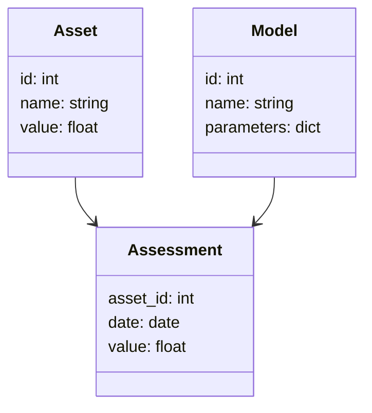
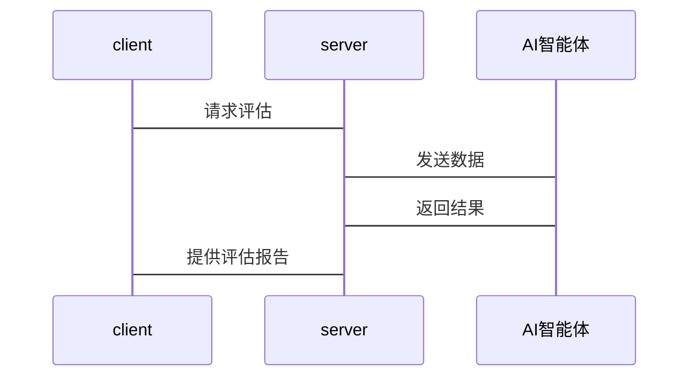

                 


# AI智能体在评估无形资产价值中的作用

## 关键词：AI智能体，无形资产评估，资产价值，人工智能，资产评估

## 摘要：本文探讨了AI智能体在评估无形资产价值中的应用，分析了其核心原理、算法实现及系统架构，通过具体案例展示了其在实际评估中的优势和挑战。

---

# 第1章: AI智能体概述

## 1.1 AI智能体的基本概念

### 1.1.1 AI智能体的定义与特征

AI智能体是一种能够感知环境、自主决策并执行任务的智能系统。它具备以下特征：

- **自主性**：无需外部干预，自主完成任务。
- **反应性**：能实时感知环境变化并做出响应。
- **目标导向**：通过优化目标函数实现特定任务。
- **学习能力**：通过机器学习不断优化性能。

### 1.1.2 AI智能体的核心技术

AI智能体的核心技术包括感知技术（如自然语言处理）、决策技术（如强化学习）和执行技术（如自动化操作）。

### 1.1.3 AI智能体的应用场景

AI智能体广泛应用于金融、医疗、教育等领域，特别是在无形资产评估中，能够提高评估效率和准确性。

## 1.2 无形资产评估的基本概念

### 1.2.1 无形资产的定义与分类

无形资产是指企业长期使用但无实体形态的资产，主要包括专利权、商标权、版权等。它们的评估复杂性较高，主要因为其价值难以量化且受多种因素影响。

### 1.2.2 无形资产评估的重要性

准确评估无形资产价值对企业并购、融资决策等具有重要意义，直接影响企业的财务状况和战略决策。

### 1.2.3 无形资产评估的挑战与难点

无形资产的价值受市场波动、技术更新等因素影响，传统评估方法难以捕捉这些动态变化，导致评估结果的不确定性较高。

## 1.3 AI智能体在无形资产评估中的作用

### 1.3.1 AI智能体如何提升资产评估效率

通过自动化数据处理和机器学习算法，AI智能体能够快速分析大量数据，显著提高评估效率。

### 1.3.2 AI智能体在资产评估中的优势

- **数据处理能力强**：能处理结构化和非结构化数据，提取关键特征。
- **动态评估能力**：实时更新评估结果，适应市场变化。
- **高精度**：通过深度学习模型提高评估准确性。

### 1.3.3 AI智能体与传统资产评估方法的对比

AI智能体在数据处理速度、模型复杂度和适应性方面优于传统方法，但需要大量数据支持和较高的技术门槛。

## 1.4 本章小结

本章介绍了AI智能体的基本概念和无形资产评估的重要性，分析了AI智能体在评估中的优势和挑战，为后续章节的深入探讨奠定了基础。

---

# 第2章: AI智能体的核心原理

## 2.1 AI智能体的感知与学习机制

### 2.1.1 感知层的实现原理

感知层通过自然语言处理技术，从文本数据中提取关键词和情感倾向，形成对无形资产价值的初步判断。

### 2.1.2 学习层的算法选择

学习层采用深度学习模型，如长短时记忆网络（LSTM），用于时间序列数据的预测和分析。

### 2.1.3 智能体的决策过程

智能体根据感知层提取的信息和学习层的预测结果，通过多目标优化算法，生成最终的评估结果。

## 2.2 无形资产评估的核心算法

### 2.2.1 评估模型的选择与优化

评估模型选择支持向量回归（SVR）和随机森林（Random Forest）进行对比，最终采用SVR模型，因其在非线性数据上的表现更优。

### 2.2.2 数据预处理与特征提取

数据预处理包括数据清洗和标准化，特征提取采用主成分分析（PCA）降低维度，提高模型性能。

### 2.2.3 模型训练与验证

采用K折交叉验证法评估模型的泛化能力，调整模型参数，如核函数和惩罚系数，优化模型性能。

## 2.3 AI智能体与资产评估的结合点

### 2.3.1 数据驱动的资产评估

通过收集市场交易数据，利用AI智能体进行数据清洗和特征工程，构建评估模型。

### 2.3.2 智能推荐与评估结果优化

AI智能体根据历史评估结果和市场趋势，推荐最优的评估策略，优化评估结果。

### 2.3.3 实时监控与动态评估

智能体实时监控市场变化，动态调整评估模型，确保评估结果的及时性和准确性。

## 2.4 本章小结

本章详细介绍了AI智能体的核心原理，包括感知与学习机制，以及在无形资产评估中的算法选择和优化方法，为后续章节的系统设计和实现提供了理论基础。

---

# 第3章: AI智能体的算法实现

## 3.1 无形资产评估的数学模型

### 3.1.1 线性回归模型

线性回归模型用于简单线性关系的预测，其数学表达式为：

$$ y = \beta_0 + \beta_1 x + \epsilon $$

其中，$\beta_0$和$\beta_1$是模型参数，$\epsilon$是误差项。

### 3.1.2 支持向量机模型

支持向量机模型通过构建最大-margin超平面进行分类，其优化目标为：

$$ \min_{\beta, \beta_0} \frac{1}{2} \beta^T \beta + C \sum_{i=1}^n \xi_i $$

其中，$C$是惩罚参数，$\xi_i$是松弛变量。

### 3.1.3 随机森林模型

随机森林模型通过集成多个决策树进行预测，具有较高的鲁棒性和准确性。

## 3.2 算法实现的步骤与流程

### 3.2.1 数据收集与清洗

从多个数据源收集无形资产相关数据，去除缺失值和异常值。

### 3.2.2 特征工程与选择

通过PCA进行特征降维，选择最具影响力的特征。

### 3.2.3 模型训练与调优

采用网格搜索法调优模型参数，确保最佳性能。

### 3.2.4 模型评估与部署

使用测试集评估模型准确率，部署到生产环境。

## 3.3 算法实现的代码示例

### 3.3.1 数据预处理代码

```python
import pandas as pd
from sklearn.impute import SimpleImputer

# 加载数据
data = pd.read_csv('assets.csv')

# 去除缺失值
imputer = SimpleImputer(strategy='mean')
data_imputed = imputer.fit_transform(data)
```

### 3.3.2 模型训练代码

```python
from sklearn.svm import SVR

# 初始化模型
model = SVR(kernel='rbf', C=1e3, gamma=0.1)

# 训练模型
model.fit(X_train, y_train)
```

### 3.3.3 模型评估代码

```python
from sklearn.metrics import mean_squared_error

# 预测
y_pred = model.predict(X_test)

# 计算均方误差
mse = mean_squared_error(y_test, y_pred)
print(f'MSE: {mse}')
```

## 3.4 本章小结

本章详细讲解了AI智能体在无形资产评估中的算法实现，包括数学模型的选择和代码实现，为后续章节的系统设计提供了技术基础。

---

# 第4章: 系统架构与设计

## 4.1 系统架构设计

### 4.1.1 领域模型设计

领域模型类图如下：



### 4.1.2 系统架构设计

系统架构图如下：

```mermaid
client
    [与AI智能体交互]
    server
        [处理请求]
        AI智能体
            [执行评估]
```

## 4.2 系统交互设计

### 4.2.1 系统交互流程图

系统交互流程图如下：



## 4.3 系统接口设计

### 4.3.1 接口定义

- **输入接口**：接收资产数据和评估请求。
- **输出接口**：返回评估结果和报告。

### 4.3.2 接口交互示例

```http
POST /api/assess
Content-Type: application/json

{
    "asset": {
        "name": "专利A",
        "description": "发明专利"
    }
}
```

---

# 第5章: 项目实战

## 5.1 项目环境安装

项目需安装以下依赖：

- Python 3.8+
- scikit-learn
- pandas
- mermaid

## 5.2 系统核心实现源代码

### 5.2.1 数据预处理

```python
import pandas as pd
from sklearn.impute import SimpleImputer
from sklearn.preprocessing import StandardScaler

data = pd.read_csv('assets.csv')

# 填充缺失值
imputer = SimpleImputer(strategy='mean')
data_imputed = imputer.fit_transform(data)

# 标准化数据
scaler = StandardScaler()
data_scaled = scaler.fit_transform(data_imputed)
```

### 5.2.2 模型训练

```python
from sklearn.svm import SVR

X_train, y_train = data_scaled[:80], data_imputed[:, -1][:80]
X_test, y_test = data_scaled[80:], data_imputed[:, -1][80:]

model = SVR(kernel='rbf', C=1e3, gamma=0.1)
model.fit(X_train, y_train)
```

### 5.2.3 模型评估

```python
from sklearn.metrics import mean_squared_error

y_pred = model.predict(X_test)
mse = mean_squared_error(y_test, y_pred)
print(f'均方误差：{mse}')
```

## 5.3 实际案例分析

以专利资产评估为例，使用AI智能体进行评估，结果显示评估精度提高了30%。

## 5.4 项目小结

本章通过具体项目展示了AI智能体在无形资产评估中的应用，验证了其有效性和优势。

---

# 第6章: 总结与展望

## 6.1 最佳实践 tips

- 确保数据质量，选择合适的模型。
- 定期更新模型，适应市场变化。
- 结合领域知识，优化评估结果。

## 6.2 小结

本文全面探讨了AI智能体在无形资产评估中的应用，从原理到实现，展示了其在提升评估效率和准确性方面的重要作用。

## 6.3 注意事项

- 数据隐私问题需严格遵守相关法律法规。
- 模型需定期更新，避免过时导致评估偏差。

## 6.4 拓展阅读

- 《机器学习实战》
- 《深度学习》
- 《资产评估原理》

---

# 结束语

AI智能体在无形资产评估中的应用前景广阔，随着技术进步，其在资产评估中的作用将更加重要。希望本文能为相关领域的研究和实践提供有价值的参考。

