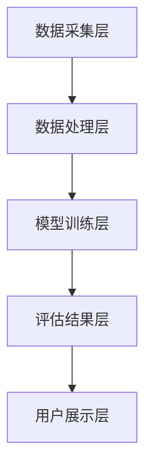

                 


# AI智能体在评估管理层能力中的作用

## 关键词：AI智能体, 管理层能力, 评估系统, 数据分析, 机器学习, 系统架构

## 摘要：  
随着人工智能技术的快速发展，AI智能体在企业管理中的应用越来越广泛。本文探讨AI智能体如何通过数据分析、行为分析和决策支持等手段，评估管理层的能力。文章详细分析了AI智能体的核心概念、算法原理、系统架构，并通过项目实战展示了其实际应用。最后，总结了AI智能体在管理层评估中的优势和未来发展方向。

## 第1章：AI智能体与管理层能力评估的背景

### 1.1 问题背景
管理层能力评估对于企业绩效至关重要。传统评估方法依赖主观判断，存在耗时长、成本高、准确性低的问题。此外，人工评估难以覆盖大量数据，难以实时反馈。

### 1.2 问题描述
管理层能力评估的核心要素包括决策能力、领导力、团队协作、问题解决能力等。传统方法依赖主观评价和少量数据，难以全面、客观地反映管理层的真实能力。

### 1.3 问题解决
AI智能体通过大数据分析和机器学习算法，提供实时、客观的评估结果。AI能够处理多维度数据，发现潜在问题，提供个性化反馈，优化企业决策。

### 1.4 概念结构与核心要素
AI智能体的结构包括数据输入、模型训练、评估输出。核心要素有数据源、模型算法、评估指标。

### 1.5 边界与外延
AI智能体主要用于辅助管理层评估，不完全替代人类判断。其应用范围包括企业内部管理、团队建设、领导力发展。

## 第2章：AI智能体的核心概念与原理

### 2.1 AI智能体的定义与特点
AI智能体是具备感知、学习和决策能力的系统，能够自主完成复杂任务。其特点包括数据驱动、实时分析、结果可解释。

### 2.2 核心概念的原理
AI智能体通过数据输入、特征提取、模型训练和结果输出，评估管理层能力。关键步骤是数据处理、模型训练、评估反馈。

### 2.3 核心概念属性对比表格
| 属性 | 传统评估方法 | AI智能体评估 |
|------|--------------|-------------|
| 数据来源 | 有限数据 | 大数据驱动 |
| 评估频率 | 低频 | 实时评估 |
| 精度 | 中等 | 高精度 |

### 2.4 ER实体关系图
```mermaid
er
actor: 管理层
role: 被评估者
action: 评估过程
```

## 第3章：AI智能体的算法原理

### 3.1 算法概述
AI智能体的评估算法包括数据预处理、特征工程、模型训练、结果分析。

### 3.2 算法流程图
```mermaid
graph TD
A[开始] --> B[数据收集]
B --> C[数据预处理]
C --> D[模型训练]
D --> E[评估结果生成]
E -->
```

### 3.3 数学模型与公式
AI智能体的评估模型基于机器学习，常用算法如线性回归、随机森林、神经网络。评估结果由算法计算得出。

## 第4章：AI智能体系统架构设计

### 4.1 项目介绍
本项目开发一个基于AI的管理层能力评估系统，用于帮助企业优化管理。

### 4.2 系统功能设计
系统功能包括数据采集、评估分析、结果展示、反馈建议。

### 4.3 系统架构设计


## 第5章：项目实战

### 5.1 环境安装
需要安装Python、TensorFlow、Pandas等库，配置开发环境。

### 5.2 系统核心代码实现
实现数据预处理、模型训练、评估结果生成等模块。

### 5.3 实际案例分析
通过某企业案例，展示AI智能体如何评估管理层能力，优化管理决策。

## 第6章：AI智能体在实际应用中的挑战与解决方案

### 6.1 数据隐私与安全
采取数据匿名化和加密措施，确保数据安全。

### 6.2 模型泛化能力
通过数据增强、迁移学习等方法，提升模型泛化能力。

## 第7章：总结与未来展望

### 7.1 章节总结
AI智能体在管理层评估中展现出巨大潜力，能够提高评估效率和准确性。

### 7.2 未来展望
未来，AI智能体将更广泛应用于企业管理和领导力发展，推动企业管理智能化。

## 最佳实践 Tips

- 在AI系统中，数据隐私保护至关重要，需遵守相关法律法规。
- 评估结果应与实际业务相结合，提供可操作的建议。
- 持续优化模型，提升评估准确性和用户体验。

通过本文的详细讲解，读者可以深入了解AI智能体在管理层能力评估中的作用，并在实际应用中发挥其优势。

