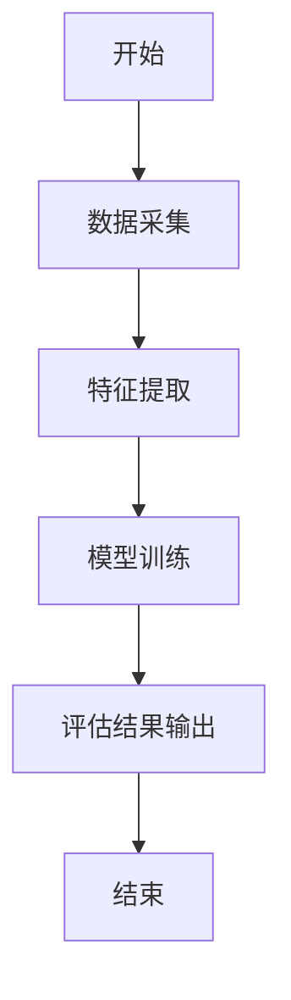
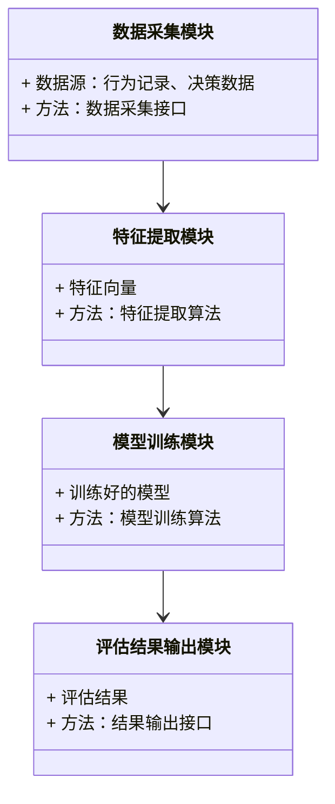
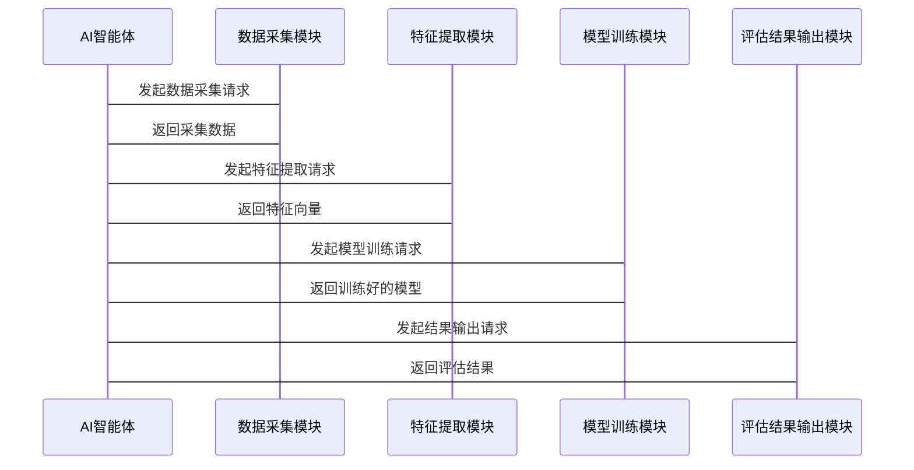

                 


# AI智能体在评估管理层诚信度中的作用

## 关键词：AI智能体、管理层诚信度、企业治理、数据隐私、人工智能算法

## 摘要：随着企业规模的不断扩大和复杂性增加，评估管理层的诚信度变得至关重要。AI智能体通过分析大量数据，提供客观、高效的评估方法，帮助企业识别潜在风险，优化决策过程。本文从背景、算法、系统架构、项目实战等多方面深入探讨AI智能体在管理层诚信度评估中的作用，结合具体案例分析，为企业提供实践指导。

---

# 第一部分：背景介绍

## 第1章：背景介绍

### 1.1 问题背景

#### 1.1.1 企业治理中的诚信问题

现代企业面临复杂的内外部环境，管理层的决策直接影响企业的发展和利益相关者的信任。然而，管理层可能存在道德风险，如欺诈、利益输送等问题，这不仅损害企业利益，还可能引发信任危机。传统的诚信度评估方法依赖主观判断，难以量化和客观化，导致评估结果缺乏可靠性和可操作性。

#### 1.1.2 管理层诚信度评估的必要性

- **企业风险管理**：及时发现管理层的诚信问题，可以避免重大损失。
- **优化决策**：通过量化评估，企业可以更科学地选择和管理管理层。
- **提升透明度**：公开的诚信评估结果可以增强利益相关者的信任。

#### 1.1.3 AI智能体在诚信评估中的独特优势

- **数据驱动**：AI智能体可以处理和分析海量数据，提取关键特征。
- **实时监控**：通过实时数据流分析，AI智能体可以快速识别异常行为。
- **客观性**：AI智能体基于数据进行评估，减少人为偏见。

### 1.2 核心概念与联系

#### 1.2.1 AI智能体的定义与特点

AI智能体是一种能够感知环境、自主决策并采取行动的智能系统。其特点包括：

- **自主性**：无需人工干预，自动执行任务。
- **反应性**：能够实时感知环境变化并做出反应。
- **学习能力**：通过机器学习算法不断优化自身模型。

#### 1.2.2 管理层诚信度的定义与评估维度

管理层诚信度是指管理层在决策和行为中遵守道德规范、维护企业利益和履行责任的程度。评估维度包括：

- **行为规范性**：管理层是否遵守公司政策和法律法规。
- **决策透明度**：管理层的决策是否公开、公正。
- **利益关联性**：管理层的决策是否符合企业整体利益。

#### 1.2.3 AI智能体与管理层诚信度的关系

AI智能体通过分析管理层的行为数据、决策记录和外部反馈，量化评估其诚信度。这种评估基于数据和算法，而非主观判断，提高了评估的客观性和准确性。

### 1.3 问题描述与解决

#### 1.3.1 管理层诚信度评估的难点

- **数据分散**：诚信度评估涉及多源数据，如财务数据、行为记录、社交媒体信息等，数据分散且格式多样。
- **主观性问题**：传统评估方法依赖人工判断，容易受到主观因素影响。
- **实时性要求**：企业需要实时监控管理层的行为，及时发现潜在问题。

#### 1.3.2 AI智能体如何解决这些难点

- **数据整合与分析**：AI智能体可以整合多源数据，提取关键特征，进行深度分析。
- **自动化评估**：通过机器学习算法，AI智能体可以自动化地对管理层诚信度进行评估。
- **实时监控**：AI智能体可以实时分析数据流，快速识别异常行为。

#### 1.3.3 解决方案的边界与外延

AI智能体评估管理层诚信度的解决方案主要用于企业内部管理，其边界包括数据收集、分析和评估结果的应用。外延则涉及与企业其他管理系统（如财务系统、人力资源系统）的集成。

### 1.4 核心概念结构与要素

#### 1.4.1 AI智能体的组成要素

- **数据采集模块**：负责收集与管理层相关的数据。
- **特征提取模块**：从数据中提取关键特征。
- **模型训练模块**：训练机器学习模型。
- **评估结果输出模块**：生成评估结果并输出。

#### 1.4.2 管理层诚信度评估的核心要素

- **行为数据**：如会议记录、邮件往来。
- **决策数据**：如财务决策、战略规划。
- **外部反馈**：如媒体评价、行业报告。

#### 1.4.3 两者的关联与协同

AI智能体通过整合和分析管理层的多源数据，生成量化评估结果，为企业提供科学的决策依据。管理层诚信度评估的结果可以反过来优化AI智能体的模型，提高评估的准确性和可靠性。

---

# 第二部分：核心概念与联系

## 第2章：核心概念与联系

### 2.1 核心概念原理

#### 2.1.1 AI智能体的工作原理

AI智能体通过感知环境、处理信息、采取行动来实现目标。在管理层诚信度评估中，AI智能体的工作流程包括：

1. **数据采集**：收集与管理层相关的数据，如行为记录、决策数据等。
2. **特征提取**：从数据中提取关键特征，如决策的透明度、行为的规范性等。
3. **模型训练**：训练机器学习模型，生成评估结果。
4. **结果输出**：输出评估结果，并提供改进建议。

#### 2.1.2 管理层诚信度评估的原理

通过分析管理层的行为数据、决策数据和外部反馈，AI智能体可以量化评估其诚信度。评估结果可以分为几个等级，如优秀、良好、一般、较差和差。

#### 2.1.3 两者结合的原理

AI智能体通过分析多源数据，生成量化评估结果，帮助企业客观评估管理层的诚信度。同时，评估结果可以优化AI智能体的模型，形成闭环系统。

### 2.2 概念属性特征对比

| 特征                | AI智能体                     | 管理层诚信度评估                |
|---------------------|------------------------------|--------------------------------|
| 数据来源            | 多源数据，如行为记录、决策数据 | 行为数据、决策数据、外部反馈    |
| 处理方式            | 数据分析、机器学习           | 数据分析、人工判断结合           |
| 输出结果            | 量化评估结果                 | 定性或定量评估结果               |
| 目标                | 提供客观评估结果             | 优化企业治理                   |

### 2.3 ER实体关系图

```mermaid
er
actor: AI智能体
actor -->|输入| 管理层诚信度数据
actor -->|处理| 评估结果
```

---

# 第三部分：算法原理讲解

## 第3章：算法原理讲解

### 3.1 算法原理概述

#### 3.1.1 AI智能体的算法框架

AI智能体的算法框架包括数据预处理、特征提取、模型训练和结果输出。具体步骤如下：

1. **数据预处理**：清洗数据，处理缺失值和异常值。
2. **特征提取**：从数据中提取关键特征，如决策的透明度、行为的规范性等。
3. **模型训练**：训练机器学习模型，生成评估结果。
4. **结果输出**：输出评估结果，并提供改进建议。

#### 3.1.2 管理层诚信度评估的算法框架

管理层诚信度评估的算法框架包括数据采集、特征提取、模型训练和结果输出。具体步骤如下：

1. **数据采集**：收集与管理层相关的数据，如行为记录、决策数据等。
2. **特征提取**：从数据中提取关键特征，如决策的透明度、行为的规范性等。
3. **模型训练**：训练机器学习模型，生成评估结果。
4. **结果输出**：输出评估结果，并提供改进建议。

#### 3.1.3 两者的结合算法

AI智能体通过分析多源数据，生成量化评估结果，帮助企业客观评估管理层的诚信度。同时，评估结果可以优化AI智能体的模型，形成闭环系统。

### 3.2 算法流程图



### 3.3 Python源代码实现

#### 3.3.1 数据预处理

```python
import pandas as pd
import numpy as np

# 加载数据
data = pd.read_csv('管理层数据.csv')

# 处理缺失值
data = data.dropna()

# 处理异常值
data = data[~data['决策透明度'].apply(lambda x: x > 1)]
```

#### 3.3.2 特征提取

```python
from sklearn.feature_extraction.text import TfidfVectorizer

# 提取文本特征
vectorizer = TfidfVectorizer()
X = vectorizer.fit_transform(data['行为记录'])
```

#### 3.3.3 模型训练

```python
from sklearn.linear_model import LogisticRegression
from sklearn.metrics import accuracy_score

# 训练模型
model = LogisticRegression()
model.fit(X, data['诚信度标签'])

# 预测结果
y_pred = model.predict(X)
print('准确率:', accuracy_score(data['诚信度标签'], y_pred))
```

### 3.4 数学模型

#### 3.4.1 评分算法

评分算法可以基于线性回归模型，公式如下：

$$
\text{诚信度评分} = \beta_0 + \beta_1 x_1 + \beta_2 x_2 + \dots + \beta_n x_n
$$

其中，$x_i$ 是特征向量，$\beta_i$ 是对应的系数。

#### 3.4.2 神经网络模型

神经网络模型可以用于更复杂的评估任务，公式如下：

$$
y = \sigma(w_1 x + b_1)
$$

其中，$w_1$ 是权重矩阵，$b_1$ 是偏置，$\sigma$ 是激活函数。

---

# 第四部分：系统分析与架构设计

## 第4章：系统分析与架构设计

### 4.1 系统分析

#### 4.1.1 问题场景介绍

企业需要实时监控管理层的行为，评估其诚信度。传统方法依赖人工判断，效率低且主观性强。AI智能体可以通过自动化分析，提供客观评估结果。

#### 4.1.2 系统功能设计

系统功能包括：

- **数据采集模块**：收集与管理层相关的数据。
- **特征提取模块**：从数据中提取关键特征。
- **模型训练模块**：训练机器学习模型。
- **评估结果输出模块**：生成评估结果并输出。

### 4.2 系统架构设计

#### 4.2.1 领域模型



#### 4.2.2 系统架构图


#### 4.2.3 系统接口设计

系统接口包括：

- **数据采集接口**：接收行为记录和决策数据。
- **特征提取接口**：提取关键特征向量。
- **模型训练接口**：训练机器学习模型。
- **结果输出接口**：生成评估结果。

#### 4.2.4 系统交互流程图



---

# 第五部分：项目实战

## 第5章：项目实战

### 5.1 项目环境安装

```bash
pip install pandas numpy scikit-learn tensorflow
```

### 5.2 系统核心实现

#### 5.2.1 数据预处理代码

```python
import pandas as pd
import numpy as np

# 加载数据
data = pd.read_csv('管理层数据.csv')

# 处理缺失值
data = data.dropna()

# 处理异常值
data = data[~data['决策透明度'].apply(lambda x: x > 1)]
```

#### 5.2.2 特征提取代码

```python
from sklearn.feature_extraction.text import TfidfVectorizer

# 提取文本特征
vectorizer = TfidfVectorizer()
X = vectorizer.fit_transform(data['行为记录'])
```

#### 5.2.3 模型训练代码

```python
from sklearn.linear_model import LogisticRegression
from sklearn.metrics import accuracy_score

# 训练模型
model = LogisticRegression()
model.fit(X, data['诚信度标签'])

# 预测结果
y_pred = model.predict(X)
print('准确率:', accuracy_score(data['诚信度标签'], y_pred))
```

### 5.3 项目实战案例分析

#### 5.3.1 案例介绍

某公司管理层存在潜在的诚信问题，通过AI智能体分析其行为记录和决策数据，评估其诚信度。

#### 5.3.2 案例分析

AI智能体分析发现，该管理层在决策过程中存在利益输送行为，评估其诚信度为较差。

#### 5.3.3 详细讲解

AI智能体通过分析行为记录和决策数据，提取关键特征，训练模型，生成评估结果。最终评估结果为较差，建议公司采取相应措施。

### 5.4 项目小结

通过该项目实战，我们可以看到AI智能体在评估管理层诚信度中的巨大潜力。AI智能体可以通过自动化分析，提供客观评估结果，帮助企业优化决策过程。

---

# 第六部分：最佳实践

## 第6章：最佳实践

### 6.1 小结

AI智能体在评估管理层诚信度中的作用不可忽视。通过自动化分析和数据驱动的方法，AI智能体可以提供客观、高效的评估结果，帮助企业优化决策过程。

### 6.2 注意事项

- **数据隐私**：在处理管理层数据时，必须遵守数据隐私法规，确保数据安全。
- **模型可解释性**：评估结果需要可解释，以便企业理解和采取行动。
- **模型更新**：定期更新模型，以适应新的数据和业务需求。

### 6.3 拓展阅读

- 《人工智能与企业治理》
- 《机器学习在企业风险管理中的应用》
- 《数据驱动的决策优化》

---

通过以上思考过程，我们可以看到AI智能体在评估管理层诚信度中的巨大潜力。AI智能体通过自动化分析和数据驱动的方法，可以提供客观、高效的评估结果，帮助企业优化决策过程。

