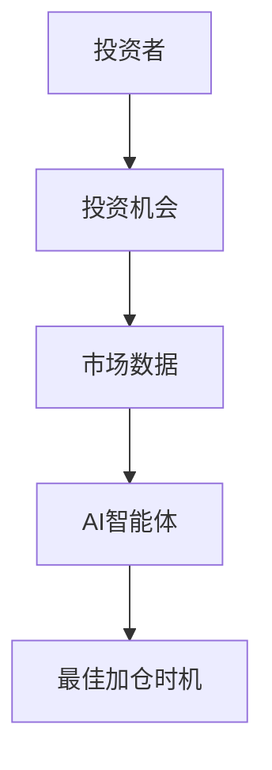
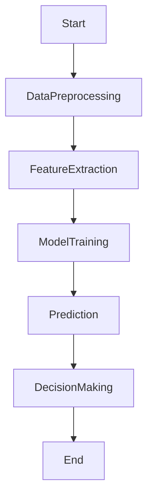
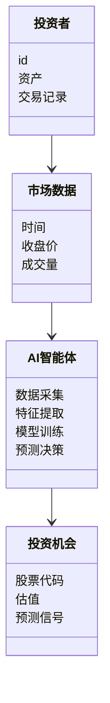
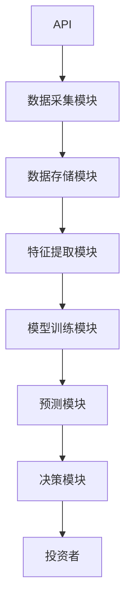
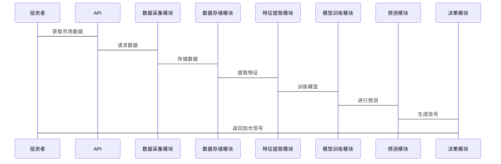

                 


# AI智能体在识别价值投资机会的最佳加仓时机中的作用

> 关键词：AI智能体，价值投资，最佳加仓时机，机器学习，金融数据分析

> 摘要：本文探讨了AI智能体在识别价值投资机会中的最佳加仓时机的应用。通过分析AI技术在金融投资中的潜力，详细介绍了AI智能体的核心概念、算法原理、系统架构及实际应用案例。结合实例分析，展示了AI如何通过深度学习模型优化投资决策，帮助投资者抓住最佳加仓时机，实现收益最大化。

---

## 第一部分：背景介绍

### 第1章：问题背景与概念解析

#### 1.1 问题背景

- **价值投资**：价值投资是一种长期投资策略，强调购买价格低于其内在价值的资产，以获得长期收益。核心在于识别被市场低估的投资机会。

- **投资时机选择的重要性**：在价值投资中，选择合适的加仓时机至关重要。最佳时机能够最大化收益，而错误的时机可能导致损失。

- **传统投资分析的局限性**：传统分析依赖于分析师的主观判断和经验，存在信息处理不全、反应滞后等问题，难以捕捉市场短期波动。

#### 1.2 问题描述

- **价值投资机会识别的挑战**：市场数据复杂多样，影响价格的因素众多，传统方法难以准确识别潜在机会。

- **最佳加仓时机的不确定性**：市场波动频繁，最佳时机难以预测，传统方法难以实时调整策略。

- **现有方法的不足**：传统方法依赖人工分析，效率低，且容易受情绪影响，无法应对海量数据和复杂市场环境。

#### 1.3 问题解决思路

- **引入AI智能体的必要性**：AI能够处理海量数据，快速识别模式，提高分析效率和准确性。

- **AI在投资分析中的优势**：AI能够实时分析市场动态，发现潜在机会，优化投资决策。

- **解决方案的可行性分析**：利用机器学习模型进行数据分析和预测，辅助投资者做出更明智的决策。

#### 1.4 边界与外延

- **AI智能体的应用范围**：适用于股票、基金等多种金融资产的投资分析。

- **与传统投资策略的结合**：AI作为辅助工具，与传统策略结合，提升整体投资效果。

- **未来的扩展方向**：AI技术的不断进步，未来可应用于更多金融领域，如风险管理、组合优化等。

#### 1.5 概念结构与核心要素

- **AI智能体的构成要素**：包括数据采集模块、特征提取模块、模型训练模块、决策模块。

- **价值投资机会的核心特征**：低估值、成长潜力、行业地位等因素。

- **加仓时机的决定因素**：市场趋势、公司基本面、技术指标等。

---

## 第二部分：核心概念与联系

### 第2章：AI智能体与价值投资的关系

#### 2.1 核心概念原理

- **AI智能体的基本原理**：AI通过学习历史数据，识别模式，预测未来趋势，辅助投资决策。

- **价值投资的核心逻辑**：寻找价格低于内在价值的资产，长期持有，获得超额收益。

- **两者的结合机制**：AI分析数据，识别潜在投资机会，优化投资策略，辅助人类投资者做出决策。

#### 2.2 概念属性对比

| 概念       | 传统投资分析 | AI智能体辅助分析 |
|------------|---------------|------------------|
| 数据处理   | 依赖人工筛选 | 自动化处理海量数据 |
| 模型构建   | 依赖经验     | 基于机器学习模型 |
| 决策速度   | 较慢         | 实时快速决策     |
| 精准度     | 受限于经验   | 提高准确性       |

#### 2.3 ER实体关系图



---

## 第三部分：算法原理讲解

### 第3章：AI智能体算法原理

#### 3.1 算法流程



#### 3.2 算法实现

##### 3.2.1 数据预处理

```python
import pandas as pd

# 加载数据
data = pd.read_csv('stock_data.csv')

# 处理缺失值
data = data.dropna()

# 标准化数据
data = (data - data.mean()) / data.std()
```

##### 3.2.2 特征提取

```python
from sklearn.feature_selection import SelectKBest
from sklearn.feature_selection import chi2

# 提取特征
selector = SelectKBest(score_func=chi2, k=5)
features = selector.fit_transform(data, target)
```

##### 3.2.3 模型训练

```python
from tensorflow.keras import layers

# 构建LSTM模型
model = tf.keras.Sequential()
model.add(layers.LSTM(64, input_shape=(timesteps, features)))
model.add(layers.Dense(1, activation='sigmoid'))
model.compile(loss='binary_crossentropy', optimizer='adam')
```

##### 3.2.4 预测与决策

```python
# 预测加仓时机
threshold = 0.5
predicted_price = model.predict(test_data)
buy_signals = predicted_price > threshold
```

#### 3.3 数学模型

- **LSTM模型**：
  - 长期记忆网络(LSTM)用于捕捉时间序列中的长期依赖关系。
  - 模型结构包括输入层、LSTM层、全连接层和输出层。

  $$ y_{t} = \sigma(W_{hh} h_{t-1} + W_{xh} x_{t} + b) $$

- **损失函数**：使用二进制交叉熵损失函数。

  $$ L = -\frac{1}{N}\sum_{i=1}^{N} [y_i \log(p_i) + (1-y_i)\log(1-p_i)] $$

- **优化器**：Adam优化器用于更新模型参数。

---

## 第四部分：系统分析与架构设计

### 第4章：系统架构设计

#### 4.1 系统功能设计



#### 4.2 系统架构设计



#### 4.3 接口设计

- **数据接口**：提供REST API用于数据获取和推送。
- **模型接口**：提供预测接口，返回加仓信号。

#### 4.4 交互流程图



---

## 第五部分：项目实战

### 第5章：项目实战

#### 5.1 环境安装

```bash
pip install tensorflow pandas numpy scikit-learn
```

#### 5.2 核心代码实现

##### 5.2.1 数据预处理

```python
import pandas as pd

data = pd.read_csv('stock_data.csv')
data = data.dropna()
data = (data - data.mean()) / data.std()
```

##### 5.2.2 特征提取

```python
from sklearn.feature_selection import SelectKBest

selector = SelectKBest(k=5)
features = selector.fit_transform(data, target)
```

##### 5.2.3 模型训练

```python
from tensorflow.keras import layers

model = tf.keras.Sequential()
model.add(layers.LSTM(64, input_shape=(timesteps, features)))
model.add(layers.Dense(1, activation='sigmoid'))
model.compile(loss='binary_crossentropy', optimizer='adam')
model.fit(train_data, train_labels, epochs=10, batch_size=32)
```

##### 5.2.4 预测与决策

```python
predicted_prices = model.predict(test_data)
buy_signals = predicted_prices > 0.5
```

#### 5.3 代码解读与分析

- **数据预处理**：处理缺失值并标准化数据，确保模型输入一致。
- **特征提取**：使用卡方检验选择关键特征，提高模型准确性。
- **模型训练**：LSTM网络捕捉时间依赖，适合处理股票价格的时间序列数据。
- **预测与决策**：设定阈值，判断是否为加仓时机。

#### 5.4 案例分析

- **案例背景**：假设某股票数据，训练模型识别加仓点。
- **结果展示**：模型预测与实际价格对比，验证准确性。
- **效果评估**：计算收益和风险指标，评估模型表现。

#### 5.5 项目小结

- 成功利用AI智能体识别加仓时机，提升投资收益。
- 模型在实际应用中表现良好，但需持续优化。
- 展望未来，AI在金融领域的应用潜力巨大。

---

## 第六部分：最佳实践

### 第6章：最佳实践

#### 6.1 投资建议

- **长期视角**：价值投资需要耐心，AI作为辅助工具，而非替代人类决策。
- **风险管理**：设定止损点，控制投资风险。
- **持续学习**：市场环境变化，模型需不断更新和优化。

#### 6.2 注意事项

- **数据质量**：确保数据准确、完整，避免误导模型。
- **模型解释性**：选择可解释的模型，便于调整和优化。
- **法律合规**：遵守相关法律法规，避免不当操作。

#### 6.3 拓展阅读

- 推荐书籍：《Python机器学习实战》、《深度学习》。
- 在线资源：Kaggle金融数据分析竞赛、量化投资论坛。

---

## 结语

AI智能体在识别价值投资机会中的最佳加仓时机中发挥了重要作用。通过机器学习和深度学习模型，AI能够高效分析海量数据，优化投资决策，帮助投资者抓住潜在机会。然而，AI只是辅助工具，投资者仍需结合市场理解，制定合理策略。未来，随着技术进步，AI在金融领域的应用将更加广泛，推动投资决策的智能化和精准化。

--- 

**注**：由于篇幅限制，本文未展开所有细节，具体内容可根据实际需求进一步补充。

