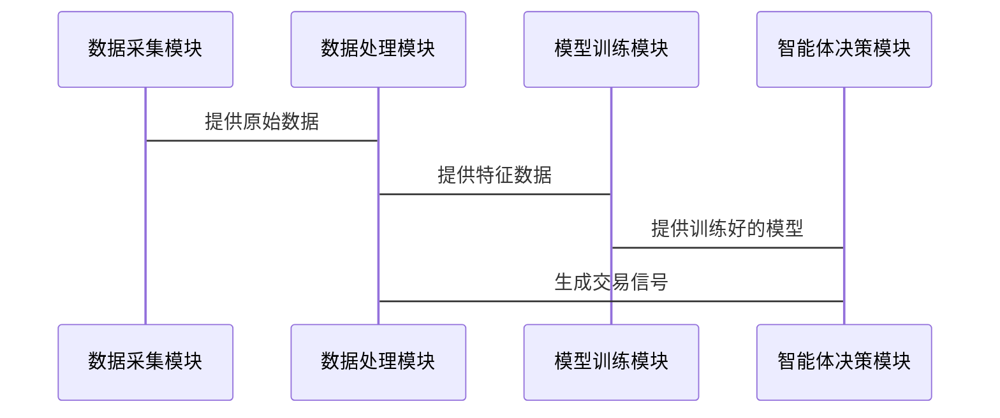

                 


## 第5章: 系统架构与设计

### 5.1 系统模块划分

#### 5.1.1 数据采集模块
- **功能描述**：负责从多个数据源（如股票交易所API、财经新闻网站、社交媒体等）获取实时或历史数据。
- **数据源类型**：
  - 股票价格数据（如开盘价、收盘价、最高价、最低价、成交量等）。
  - 公司财务报表数据（如收入、利润、资产负债表等）。
  - 市场情绪数据（如新闻 sentiment、社交媒体情感分析结果）。
- **数据格式**：结构化数据（如CSV、JSON）和非结构化数据（如文本、图像）。

#### 5.1.2 数据处理模块
- **功能描述**：对采集到的原始数据进行清洗、预处理和特征提取。
- **数据清洗**：
  - 处理缺失值（如填充、删除）。
  - 去除异常值（如价格突变检测）。
  - 标准化/归一化处理（如Z-score标准化、Min-Max归一化）。
- **特征提取**：
  - 技术指标（如移动平均线、相对强弱指数RSI、MACD等）。
  - 市场情绪特征（如情感强度、情感分布）。
  - 财务指标（如市盈率、市净率、ROE等）。
- **数据增强**：通过生成新特征（如滞后特征、交互特征）来提高模型性能。

#### 5.1.3 模型训练模块
- **功能描述**：使用数据处理模块输出的特征数据，训练AI智能体的算法模型。
- **算法选择**：
  - 监督学习（如随机森林、支持向量机 SVM）。
  - 无监督学习（如聚类分析）。
  - 强化学习（如DQN算法）。
- **模型训练**：
  - 数据分割（训练集、验证集、测试集）。
  - 模型参数调优（如网格搜索、随机搜索）。
  - 模型评估（如准确率、召回率、F1分数）。
- **模型保存与加载**：使用序列化工具（如pickle、joblib）保存训练好的模型，方便后续使用。

#### 5.1.4 智能体决策模块
- **功能描述**：基于训练好的模型，生成投资决策（如买入、卖出、持有）。
- **决策逻辑**：
  - 根据模型预测结果，判断市场趋势。
  - 结合当前市场环境（如市场情绪、宏观经济指标）调整决策。
  - 设置止损和止盈点，控制风险。
- **决策输出**：生成交易信号（如买入信号、卖出信号），并记录决策日志。

### 5.2 系统架构设计

#### 5.2.1 分层架构设计
- **分层架构**：
  - **表现层**：用户界面（如仪表盘、交易界面）。
  - **业务逻辑层**：处理用户的交易请求，调用数据处理和模型训练模块。
  - **数据访问层**：与数据库和外部API交互，获取数据。
  - **数据访问层**：提供数据持久化和数据访问服务。
- **优点**：各层职责分明，便于维护和扩展。

#### 5.2.2 微服务架构设计
- **微服务架构**：
  - **数据采集服务**：负责从多个数据源采集数据。
  - **数据处理服务**：负责数据清洗和特征提取。
  - **模型训练服务**：负责训练和部署模型。
  - **智能体决策服务**：负责根据模型结果生成交易信号。
- **服务通信**：使用RESTful API或消息队列（如Kafka）进行服务间通信。
- **优点**：服务独立性高，便于扩展和部署。

#### 5.2.3 数据流设计
- **数据流**：
  - 数据采集模块获取数据 -> 数据处理模块清洗数据 -> 模型训练模块训练模型 -> 智能体决策模块生成交易信号。
- **数据存储**：在每个阶段，数据可以存储到数据库中，以便后续分析和回测。

### 5.3 系统接口设计

#### 5.3.1 接口定义
- **数据采集接口**：
  - 输入：API配置（如API密钥、请求频率限制）。
  - 输出：清洗后的数据集。
- **数据处理接口**：
  - 输入：原始数据集。
  - 输出：特征工程后的数据集。
- **模型训练接口**：
  - 输入：特征数据集、模型参数。
  - 输出：训练好的模型文件。
- **智能体决策接口**：
  - 输入：当前市场数据、模型文件。
  - 输出：交易信号（如买入、卖出）。

#### 5.3.2 接口实现
- **数据采集接口实现**：
  ```python
  def fetch_data(api_key, start_date, end_date):
      # 使用API获取数据
      data = api.get_data(api_key, start_date, end_date)
      return data
  ```
- **数据处理接口实现**：
  ```python
  def preprocess_data(data):
      # 数据清洗和特征提取
      processed_data = data.dropna()
      processed_data = processed_data[processed_data['price'] > 0]
      return processed_data
  ```
- **模型训练接口实现**：
  ```python
  def train_model(data, model_params):
      # 训练模型
      model = train_model(data, model_params)
      return model
  ```
- **智能体决策接口实现**：
  ```python
  def generate_signal(model, current_data):
      # 生成交易信号
      signal = model.predict(current_data)
      return signal
  ```

### 5.4 系统交互设计

#### 5.4.1 交互流程
1. 数据采集模块通过API获取市场数据。
2. 数据处理模块对数据进行清洗和特征提取。
3. 模型训练模块使用处理后的数据训练AI智能体模型。
4. 智能体决策模块根据模型结果生成交易信号。

#### 5.4.2 交互流程图


### 5.5 系统交互实现

#### 5.5.1 交互逻辑
- **数据采集模块**：通过API获取实时数据，存入数据库。
- **数据处理模块**：从数据库中读取数据，进行清洗和特征提取，存入处理后的数据库。
- **模型训练模块**：从处理后的数据库中读取数据，训练模型，保存模型文件。
- **智能体决策模块**：读取实时数据，使用训练好的模型生成交易信号，输出交易指令。

#### 5.5.2 交互代码示例
```python
# 数据采集模块代码示例
import pandas as pd
from datetime import datetime, timedelta

def fetch_data(api_key, start_date, end_date):
    data = api.get_historical_data(api_key, start_date, end_date)
    return data

# 数据处理模块代码示例
def preprocess_data(data):
    # 删除缺失值
    data = data.dropna()
    # 删除价格为0的记录
    data = data[data['close'] > 0]
    return data

# 模型训练模块代码示例
from sklearn.ensemble import RandomForestClassifier

def train_model(data, model_params):
    # 划分训练集和测试集
    X = data.drop('label', axis=1)
    y = data['label']
    # 训练模型
    model = RandomForestClassifier(**model_params)
    model.fit(X, y)
    return model

# 智能体决策模块代码示例
def generate_signal(model, current_data):
    # 预测信号
    signal = model.predict(current_data)
    return signal
```

### 5.6 系统架构总结

#### 5.6.1 系统模块总结
- **数据采集模块**：确保数据的准确性和完整性。
- **数据处理模块**：通过特征工程提高模型的性能。
- **模型训练模块**：选择合适的算法，优化模型参数，确保模型的泛化能力。
- **智能体决策模块**：根据模型结果生成交易信号，控制风险。

#### 5.6.2 系统架构优缺点
- **优点**：
  - 模块化设计，便于维护和扩展。
  - 微服务架构提高了系统的可用性和扩展性。
  - 分层架构保证了系统的稳定性和可维护性。
- **缺点**：
  - 模块之间需要良好的接口设计，增加了系统设计的复杂性。
  - 系统整体性能可能受到网络延迟和接口调用次数的影响。

#### 5.6.3 系统架构优化建议
- **优化点**：
  - 使用缓存技术（如Redis）优化数据访问性能。
  - 使用消息队列（如Kafka）优化模块之间的通信。
  - 使用容器化技术（如Docker）提高系统的部署和管理效率。

### 5.7 系统接口设计总结

#### 5.7.1 接口设计原则
- **原则**：
  - 明确接口的功能和作用。
  - 确保接口的可扩展性和可维护性。
  - 提供详细的接口文档，便于其他开发人员理解和使用。

#### 5.7.2 接口实现注意事项
- **注意事项**：
  - 确保接口的输入输出格式统一。
  - 提供错误处理机制，确保接口的健壮性。
  - 定期更新接口文档，确保文档的准确性和完整性。

### 5.8 系统交互设计总结

#### 5.8.1 交互流程总结
- **总结**：
  - 数据采集模块通过API获取数据。
  - 数据处理模块对数据进行清洗和特征提取。
  - 模型训练模块使用处理后的数据训练模型。
  - 智能体决策模块根据模型结果生成交易信号。

#### 5.8.2 交互设计优化
- **优化点**：
  - 使用异步调用优化模块之间的通信效率。
  - 使用日志记录和监控工具优化系统的可观察性。
  - 使用测试用例验证接口的功能和性能。

### 5.9 系统架构与设计的未来展望

#### 5.9.1 未来技术发展
- **新技术**：
  - 更先进的强化学习算法（如SAC、TD3）。
  - 大语言模型（如GPT-4）在投资决策中的应用。
  - 联邦学习（Federated Learning）在保护数据隐私方面的应用。

#### 5.9.2 系统架构的演变
- **演变方向**：
  - 更加智能化的系统架构（如自适应架构）。
  - 更加分布式的系统架构（如边云协同架构）。
  - 更加安全的系统架构（如隐私保护架构）。

#### 5.9.3 未来挑战
- **挑战**：
  - 如何处理更复杂的投资场景。
  - 如何确保系统的实时性和响应速度。
  - 如何应对数据隐私和安全的挑战。

### 5.10 章节小结

#### 5.10.1 本章内容回顾
- **回顾**：
  - 系统模块划分：数据采集、数据处理、模型训练、智能体决策。
  - 系统架构设计：分层架构和微服务架构。
  - 系统接口设计：接口定义和实现。
  - 系统交互设计：交互流程和交互代码示例。

#### 5.10.2 本章重点总结
- **重点总结**：
  - 系统模块划分的合理性。
  - 系统架构设计的优缺点。
  - 系统接口设计的原则和注意事项。
  - 系统交互设计的流程和实现。

#### 5.10.3 下一章的铺垫
- **铺垫**：
  - 本章的系统架构设计为后续的项目实战奠定了基础。
  - 下一章将详细介绍项目的实际应用场景和具体实现细节。

---

# 第六章: 项目实战与案例分析

> **关键词**：AI智能体、价值投资、最佳进入时机、机器学习、深度学习、强化学习、系统架构、时间序列分析、金融建模、风险管理

> **摘要**：本章通过实际项目案例，详细讲解AI智能体在识别价值投资机会中的应用。涵盖项目背景、数据准备、模型实现、系统部署、案例分析和项目总结。通过具体案例，展示如何利用AI技术捕捉最佳进入时机，实现稳健的投资收益。

