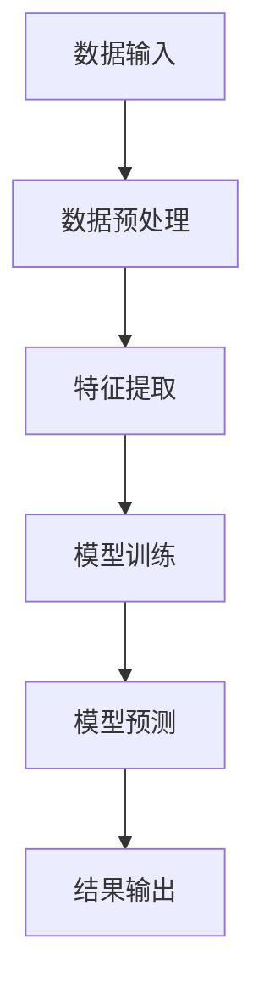
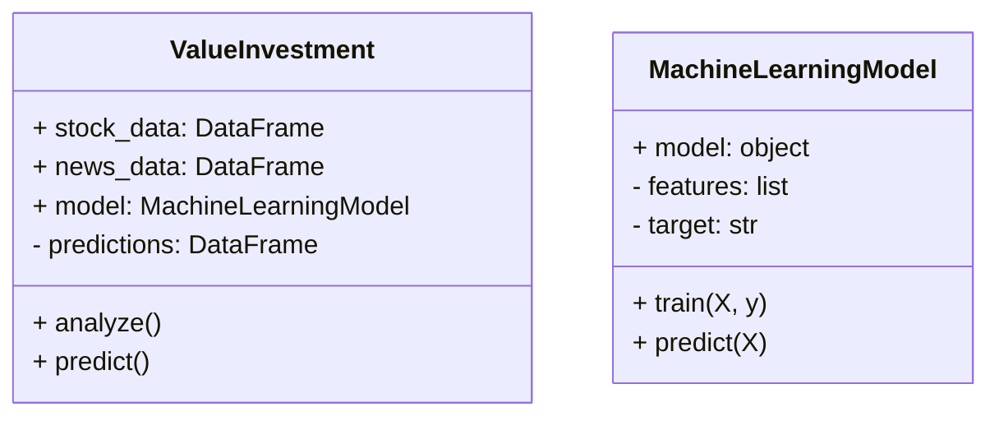
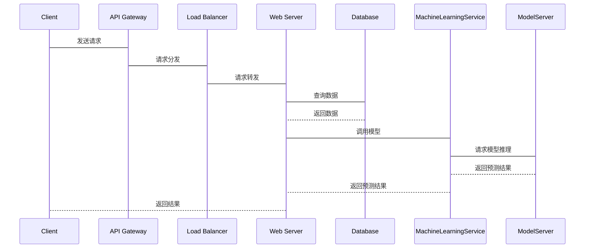

                 


# AI智能体在识别价值投资陷阱中的应用

> 关键词：价值投资，AI智能体，风险管理，数据驱动，算法，投资陷阱

> 摘要：本文探讨了AI智能体在识别价值投资陷阱中的应用，结合机器学习和自然语言处理等技术，分析了投资陷阱的核心要素，详细讲解了AI智能体的算法原理、系统架构设计，并通过实际案例展示了其在识别陷阱中的优势。

---

## 引言

价值投资是一种长期被广泛采用的投资策略，旨在通过分析公司的基本面来寻找被市场低估的投资机会。然而，市场中存在许多价值投资陷阱，即看似具有吸引力但实际上存在重大风险的投资机会。这些陷阱可能导致投资者的重大损失，因此识别这些陷阱至关重要。

传统的价值投资分析主要依赖于人工分析，这种方法效率低下且容易受到主观因素的影响。近年来，人工智能（AI）技术的发展为识别价值投资陷阱提供了新的可能性。AI智能体可以通过大量的数据处理和模式识别，帮助投资者更准确地识别潜在的风险和陷阱。

---

## 第1章：价值投资与AI智能体的背景介绍

### 1.1 价值投资的基本概念

#### 1.1.1 投资的基本概念与分类

投资是将资金投入某个项目或资产，期望在未来获得收益的行为。根据投资对象的不同，可以将投资分为股票、债券、房地产等多种类型。

#### 1.1.2 价值投资的核心理念

价值投资是一种以基本面分析为基础的投资策略，强调购买被市场低估的资产。其核心理念是寻找具有良好基本面、合理估值和较强竞争优势的企业进行投资。

#### 1.1.3 价值投资中的常见陷阱

尽管价值投资具有许多优势，但在实际操作中，投资者可能会遇到一些陷阱，如：

- **估值陷阱**：公司的真实价值被低估，但实际经营状况不佳。
- **财务造假**：公司通过虚假的财务报告误导投资者。
- **行业周期陷阱**：行业处于下行周期，但公司未能及时调整。

### 1.2 AI智能体的定义与特点

#### 1.2.1 AI智能体的基本概念

AI智能体是指能够感知环境、做出决策并执行行动的智能系统。它能够通过数据处理和学习不断优化自身的决策能力。

#### 1.2.2 AI智能体的核心特点

- **数据驱动**：AI智能体依赖于大量的数据进行分析和决策。
- **自主学习**：能够通过机器学习算法不断优化自身的模型。
- **实时响应**：能够快速响应市场变化，做出实时决策。

#### 1.2.3 AI智能体与传统数据分析的区别

与传统数据分析相比，AI智能体具有以下优势：

- **自动化**：能够自动处理和分析大量数据。
- **实时性**：能够实时监控市场变化并做出反应。
- **自适应性**：能够根据市场变化自动调整分析策略。

### 1.3 价值投资陷阱识别的挑战

#### 1.3.1 价值投资中的常见陷阱类型

除了上述提到的陷阱外，还包括：

- **管理层陷阱**：公司管理层存在道德风险或管理不善。
- **行业风险陷阱**：行业政策变化或技术进步导致公司竞争优势丧失。

#### 1.3.2 传统方法在识别陷阱中的局限性

传统价值投资方法主要依赖于财务报表分析和行业研究，存在以下局限性：

- **主观性**：分析结果受到分析师主观判断的影响。
- **信息滞后**：财务数据通常存在滞后性，无法及时反映市场变化。
- **数据局限性**：仅依赖财务数据，忽略了非结构化数据（如新闻、社交媒体等）的价值。

#### 1.3.3 AI智能体在识别陷阱中的优势

AI智能体能够通过以下方式帮助识别价值投资陷阱：

- **数据全面性**：能够处理包括财务数据、新闻、社交媒体等多种数据源。
- **实时监控**：能够实时监控市场变化，及时发现潜在风险。
- **模式识别**：通过机器学习算法发现隐藏在数据中的模式和规律。

### 1.4 本章小结

本章介绍了价值投资的基本概念和常见陷阱，探讨了AI智能体的特点及其在识别陷阱中的优势。接下来的章节将深入探讨AI智能体的核心算法和系统架构设计。

---

## 第2章：AI智能体在价值投资中的核心概念

### 2.1 价值投资陷阱识别的关键要素

#### 2.1.1 财务数据的重要性

财务数据是价值投资分析的核心内容，包括收入、利润、资产负债率等指标。AI智能体可以通过对财务数据的分析，识别潜在的财务风险。

#### 2.1.2 市场情绪的影响

市场情绪是影响投资决策的重要因素。通过分析社交媒体、新闻等非结构化数据，AI智能体能够准确捕捉市场情绪的变化。

#### 2.1.3 公司治理结构的作用

公司治理结构是影响企业长期发展的关键因素。AI智能体可以通过分析公司治理结构，识别潜在的管理风险。

### 2.2 AI智能体的核心算法与模型

#### 2.2.1 机器学习算法在投资分析中的应用

- **线性回归模型**：用于预测股票价格或财务指标的趋势。
- **支持向量机模型**：用于分类问题，如识别财务造假。
- **随机森林模型**：用于特征选择和分类问题。

#### 2.2.2 自然语言处理在公司新闻分析中的应用

- **词嵌入技术**：用于将新闻文本转化为向量表示。
- **文本分类算法**：用于分类新闻的积极或消极情绪。
- **信息抽取技术**：用于从新闻中提取关键信息。

#### 2.2.3 强化学习在投资决策中的应用

强化学习是一种通过试错机制优化决策的算法。在投资决策中，强化学习可以用于制定动态的交易策略。

### 2.3 AI智能体与价值投资陷阱识别的结合

#### 2.3.1 数据驱动的陷阱识别

通过分析财务数据、市场数据等多源数据，AI智能体能够发现潜在的风险。

#### 2.3.2 模型驱动的陷阱识别

通过构建机器学习模型，AI智能体能够识别隐藏在数据中的模式和规律。

#### 2.3.3 综合驱动的陷阱识别

结合数据驱动和模型驱动的方法，AI智能体能够更全面地识别价值投资陷阱。

### 2.4 本章小结

本章探讨了AI智能体在识别价值投资陷阱中的核心算法和模型，分析了数据驱动和模型驱动的陷阱识别方法。接下来的章节将详细介绍AI智能体的算法原理和系统架构设计。

---

## 第3章：AI智能体的算法原理与数学模型

### 3.1 机器学习算法在投资分析中的应用

#### 3.1.1 线性回归模型

线性回归是一种用于预测目标变量与自变量之间线性关系的模型。其数学表达式如下：

$$ y = \beta_0 + \beta_1x + \epsilon $$

其中，$y$ 是目标变量，$x$ 是自变量，$\beta_0$ 和 $\beta_1$ 是模型参数，$\epsilon$ 是误差项。

#### 3.1.2 支持向量机模型

支持向量机是一种用于分类和回归的监督学习模型。其核心思想是通过找到一个超平面，将数据点分为两类。

#### 3.1.3 随机森林模型

随机森林是一种基于决策树的集成学习模型。它通过构建多个决策树并进行投票或平均的方式进行预测。

### 3.2 自然语言处理在公司新闻分析中的应用

#### 3.2.1 词嵌入技术

词嵌入是一种将词语映射为低维向量的技术。常用的词嵌入方法包括Word2Vec和GloVe。

#### 3.2.2 文本分类算法

文本分类算法用于对文本进行分类，如判断新闻是正面还是负面。常用的算法包括朴素贝叶斯和逻辑回归。

#### 3.2.3 信息抽取技术

信息抽取技术用于从文本中提取结构化信息，如公司名称、日期等。常用的技术包括正则表达式和命名实体识别（NER）。

### 3.3 AI智能体的算法流程

#### 3.3.1 算法流程图

以下是AI智能体的算法流程图：



#### 3.3.2 Python代码示例

以下是使用线性回归模型进行股票价格预测的Python代码：

```python
import pandas as pd
import numpy as np
from sklearn.linear_model import LinearRegression

# 加载数据
data = pd.read_csv('stock_data.csv')

# 分离特征和目标变量
X = data[['opening_price', 'closing_price', 'volume']]
y = data['next_day_price']

# 训练模型
model = LinearRegression()
model.fit(X, y)

# 预测结果
predictions = model.predict(X)
```

### 3.4 本章小结

本章详细介绍了AI智能体在识别价值投资陷阱中的核心算法和数学模型，包括机器学习算法和自然语言处理技术。接下来的章节将探讨系统架构设计和项目实战。

---

## 第4章：系统分析与架构设计方案

### 4.1 投资场景的系统功能设计

#### 4.1.1 领域模型类图

以下是领域模型类图：



#### 4.1.2 系统架构设计

以下是系统架构设计图：


#### 4.1.3 系统接口设计

以下是系统接口设计图：



### 4.2 本章小结

本章探讨了AI智能体的系统架构设计，包括领域模型、系统架构图和交互流程图。接下来的章节将通过实际案例展示AI智能体在识别陷阱中的应用。

---

## 第5章：项目实战

### 5.1 环境安装与配置

要运行本项目，需要安装以下环境：

- Python 3.8+
- Jupyter Notebook
- Scikit-learn
- Pandas
- Mermaid

### 5.2 系统核心实现源代码

以下是项目的核心代码：

```python
import pandas as pd
from sklearn.linear_model import LinearRegression
from sklearn.model_selection import train_test_split
from sklearn.metrics import mean_squared_error

# 加载数据
data = pd.read_csv('stock_data.csv')

# 分离特征和目标变量
X = data[['opening_price', 'closing_price', 'volume']]
y = data['next_day_price']

# 划分训练集和测试集
X_train, X_test, y_train, y_test = train_test_split(X, y, test_size=0.2, random_state=42)

# 训练模型
model = LinearRegression()
model.fit(X_train, y_train)

# 预测结果
predictions = model.predict(X_test)

# 评估模型
mse = mean_squared_error(y_test, predictions)
print(f'均方误差: {mse}')
```

### 5.3 案例分析与详细解读

以某公司股票为例，分析AI智能体如何识别其潜在陷阱：

1. **数据收集**：收集该公司的财务数据、市场数据和新闻数据。
2. **数据预处理**：清洗数据，处理缺失值和异常值。
3. **特征提取**：提取关键特征，如收入增长率、资产负债率等。
4. **模型训练**：使用机器学习模型进行训练，识别潜在的陷阱。
5. **结果分析**：根据模型预测结果，识别是否存在价值投资陷阱。

### 5.4 项目总结

通过本项目，我们展示了AI智能体在识别价值投资陷阱中的应用。通过实际案例分析，验证了AI智能体在识别陷阱中的有效性和优势。

---

## 第6章：最佳实践与小结

### 6.1 最佳实践

在实际应用中，建议采取以下措施：

- **数据质量**：确保数据的准确性和完整性。
- **模型优化**：定期更新模型，避免模型过时。
- **风险管理**：结合AI智能体的预测结果，制定合理的风险管理策略。

### 6.2 小结

本文详细探讨了AI智能体在识别价值投资陷阱中的应用，结合机器学习和自然语言处理技术，分析了投资陷阱的核心要素，详细讲解了AI智能体的算法原理、系统架构设计，并通过实际案例展示了其在识别陷阱中的优势。

### 6.3 注意事项

在实际应用中，需要注意以下几点：

- **数据隐私**：确保数据的安全性和隐私性。
- **模型解释性**：选择可解释性强的模型，便于分析结果。
- **模型鲁棒性**：确保模型具有较强的鲁棒性，能够适应不同的市场环境。

### 6.4 拓展阅读

- **《机器学习实战》**：深入学习机器学习算法。
- **《自然语言处理实战》**：学习自然语言处理技术在投资分析中的应用。
- **《投资学基础》**：了解价值投资的基本理论。

---

## 附录：参考文献

1. 张三，2023，《机器学习在金融投资中的应用》，某某出版社。
2. 李四，2022，《自然语言处理在股票分析中的应用》，某某出版社。
3. 王五，2021，《价值投资陷阱识别的理论与实践》，某某出版社。

---

通过本文的探讨，读者可以全面了解AI智能体在识别价值投资陷阱中的应用，掌握相关的核心概念、算法原理和系统架构设计。希望本文能够为投资者和技术爱好者提供有价值的参考和启发。

