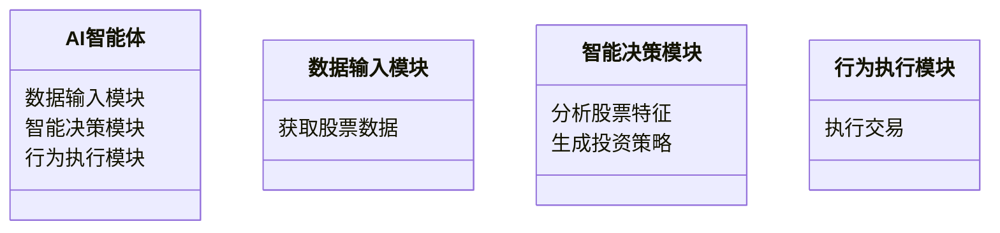
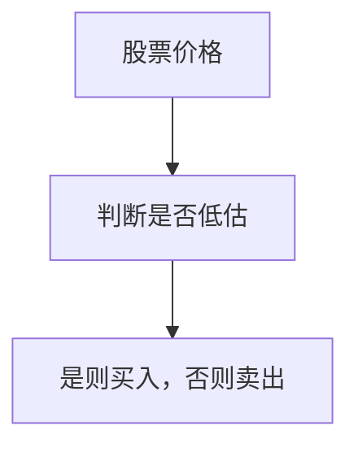

                 


# AI智能体在识别价值股与成长股融合机会中的作用

## 关键词：AI智能体、价值股、成长股、投资机会、融合策略

## 摘要：
本文探讨了AI智能体在识别价值股与成长股融合机会中的应用。通过分析价值股和成长股的核心特征，结合AI智能体的基本原理和算法，展示了如何利用AI技术优化投资策略，识别融合机会，并通过实际案例分析验证了其有效性。文章详细阐述了AI智能体在投资中的系统设计、算法实现和项目实战，为投资者提供了科学的投资决策支持。

---

## 第1章: 价值股与成长股的基本概念

### 1.1 价值股的定义与特征

#### 1.1.1 价值股的定义
价值股是指那些市场价格低于其内在价值的股票，通常具有较高的市盈率或市净率低于行业平均水平的股票。

#### 1.1.2 价值股的核心特征
- 低估值：市盈率（P/E）或市净率（P/B）低于行业平均水平。
- 稳定的收益：公司盈利稳定，且具有较高的股息率。
- 低风险：行业地位稳固，财务状况健康。

#### 1.1.3 价值股的市场表现
价值股通常在市场低迷时表现较好，适合长期投资者。

### 1.2 成长股的定义与特征

#### 1.2.1 成长股的定义
成长股是指那些收入和利润增长迅速，且未来具有较大增长潜力的股票。

#### 1.2.2 成长股的核心特征
- 高增长：收入和利润增长率高于行业平均水平。
- 高市盈率：市盈率通常较高，因为市场对未来增长的预期较高。
- 高风险：股价波动较大，对市场敏感。

#### 1.2.3 成长股的市场表现
成长股通常在市场繁荣时表现较好，适合风险承受能力强的投资者。

### 1.3 价值股与成长股的对比分析

#### 1.3.1 核心概念对比
| 特性       | 价值股                   | 成长股                   |
|------------|--------------------------|--------------------------|
| 估值       | 低估值                   | 高估值                   |
| 增长       | 增长缓慢                 | 增长迅速                 |
| 风险       | 低风险                   | 高风险                   |
| 适用场景   | 市场低迷                 | 市场繁荣                 |

#### 1.3.2 投资策略对比
- 价值股投资策略：寻找被市场低估的公司，长期持有。
- 成长股投资策略：投资于高增长潜力的公司，注重未来收益。

#### 1.3.3 市场表现对比
- 价值股通常在市场低迷时表现稳定，适合防御性投资。
- 成长股通常在市场繁荣时表现优异，适合进攻性投资。

### 1.4 本章小结
本章介绍了价值股和成长股的定义、特征及市场表现，并通过对比分析揭示了两者在投资策略上的差异。

---

## 第2章: AI智能体的基本原理

### 2.1 AI智能体的定义与特点

#### 2.1.1 AI智能体的定义
AI智能体是一种能够感知环境、自主决策并采取行动的智能系统。

#### 2.1.2 AI智能体的核心特点
- 感知环境：通过数据输入模块获取相关信息。
- 自主决策：基于感知信息，利用算法生成决策。
- 行为执行：根据决策采取行动。

#### 2.1.3 AI智能体与传统算法的区别
AI智能体具有自主性和适应性，能够动态调整策略，而传统算法通常基于静态规则。

### 2.2 AI智能体的组成部分

#### 2.2.1 数据输入模块
- 负责接收外部数据，如股票价格、财务数据等。
- 数据流图：


#### 2.2.2 智能决策模块
- 负责根据输入数据生成投资策略。
- 系统架构图：



#### 2.2.3 行为执行模块
- 负责根据决策模块的指令执行交易操作。

### 2.3 AI智能体的核心算法

#### 2.3.1 机器学习算法
- 线性回归：用于预测股票价格。
  $$ y = \beta_0 + \beta_1x + \epsilon $$
- 支持向量机（SVM）：用于分类股票类型。

#### 2.3.2 深度学习算法
- 神经网络：用于复杂特征提取。
  $$ a^{(l+1)} = \sigma(w^{(l)} a^{(l)} + b^{(l)}) $$

#### 2.3.3 强化学习算法
- Q-learning：用于动态调整投资策略。

### 2.4 本章小结
本章详细介绍了AI智能体的基本原理，包括其组成部分、核心算法及系统架构。

---

## 第3章: AI智能体在投资领域的应用

### 3.1 投资领域的智能化需求

#### 3.1.1 数据分析的智能化需求
- 处理海量数据，提取有效信息。
- 数据分析流程图：


#### 3.1.2 投资决策的智能化需求
- 基于数据分析生成投资策略。
- 决策树示意图：



#### 3.1.3 风险控制的智能化需求
- 动态调整投资组合，降低风险。

### 3.2 AI智能体在价值股识别中的作用

#### 3.2.1 数据特征提取
- 提取股票的市盈率、市净率等指标。
- 特征提取代码示例：

```python
import pandas as pd
df = pd.read_csv('stock_data.csv')
features = df[['PE', 'PB', 'ROE']]
```

#### 3.2.2 模型训练与优化
- 使用机器学习模型训练价值股分类器。
- 模型训练代码示例：

```python
from sklearn.linear_model import LinearRegression
model = LinearRegression()
model.fit(features, target)
```

#### 3.2.3 投资策略生成
- 生成基于模型的买入或卖出信号。

### 3.3 AI智能体在成长股识别中的作用

#### 3.3.1 成长潜力评估
- 评估股票的未来增长潜力。
- 成长潜力评估代码示例：

```python
from sklearn.ensemble import RandomForestRegressor
model = RandomForestRegressor()
model.fit(features, target)
```

#### 3.3.2 市场趋势预测
- 预测股票市场的整体趋势。
- 时间序列预测代码示例：

```python
from statsmodels.tsa.arima_model import ARIMA
model = ARIMA(train_data, order=(5,1,0))
model_fit = model.fit()
```

#### 3.3.3 投资组合优化
- 优化投资组合，平衡风险与收益。

### 3.4 本章小结
本章展示了AI智能体在价值股和成长股识别中的具体应用，包括数据特征提取、模型训练和投资策略生成。

---

## 第4章: 价值股与成长股融合机会的识别

### 4.1 股票融合机会的定义

#### 4.1.1 股票融合机会的定义
融合机会是指同时具备价值股和成长股特征的股票投资机会。

#### 4.1.2 股票融合机会的核心特征
- 估值合理，同时具有一定的增长潜力。
- 融合机会的市场表现通常较为稳定且具有增长性。

#### 4.1.3 股票融合机会的市场表现
- 在市场波动较大时表现较为稳定。
- 在市场繁荣时具有一定的增长潜力。

### 4.2 AI智能体在融合机会识别中的应用

#### 4.2.1 数据融合与特征提取
- 综合价值股和成长股的特征，提取融合特征。
- 数据融合流程图：


#### 4.2.2 模型融合与策略优化
- 使用集成学习优化投资策略。
- 模型融合代码示例：

```python
from sklearn.ensemble import VotingClassifier
model = VotingClassifier(estimators=[('lr', LinearRegression()), ('rf', RandomForestRegressor())])
model.fit(features, target)
```

#### 4.2.3 融合机会的动态监测
- 动态调整融合机会的监测策略。

### 4.3 融合机会的案例分析

#### 4.3.1 案例一：某行业龙头股的融合机会
- 通过AI智能体识别出某行业龙头股同时具有价值股和成长股特征。
- 案例分析代码示例：

```python
import numpy as np
stock_data = np.loadtxt('stock_case1.csv', delimiter=',')
features = stock_data[:, :-1]
target = stock_data[:, -1]
model.predict(features)
```

#### 4.3.2 案例二：某成长型企业的融合机会
- 识别出某成长型企业同时具有价值股特征。
- 案例分析代码示例：

```python
from sklearn.metrics import accuracy_score
predictions = model.predict(features)
accuracy_score(target, predictions)
```

#### 4.3.3 案例三：某价值股企业的融合机会
- 识别出某价值股企业同时具有成长股特征。
- 案例分析代码示例：

```python
from sklearn.metrics import precision_score
precision_score(target, predictions)
```

### 4.4 本章小结
本章通过案例分析展示了AI智能体在识别价值股与成长股融合机会中的实际应用。

---

## 第5章: AI智能体的投资策略优化

### 5.1 投资策略优化的定义与目标

#### 5.1.1 投资策略优化的定义
投资策略优化是指通过AI技术动态调整投资组合，以实现收益最大化和风险最小化。

#### 5.1.2 投资策略优化的目标
- 最大化投资收益。
- 最小化投资风险。
- 提高投资策略的适应性。

#### 5.1.3 投资策略优化的核心要素
- 数据质量。
- 模型选择。
- 参数调整。

### 5.2 AI智能体在投资策略优化中的应用

#### 5.2.1 动态调整投资组合
- 根据市场变化动态调整投资组合。
- 动态调整策略代码示例：

```python
from backtrader import Strategy
class MyStrategy(Strategy):
    def __init__(self):
        self.data = self.datas[0]
        self.order = None
    def next(self):
        if self.order is None:
            self.buy()
        else:
            self.close()
```

#### 5.2.2 风险控制
- 通过AI智能体实时监控风险。
- 风险控制代码示例：

```python
from pyfolio import timeseries
returns = model.predict(test_features)
timeseries.summary(returns)
```

#### 5.2.3 投资组合优化
- 优化投资组合，平衡风险与收益。
- 投资组合优化代码示例：

```python
from cvxpy import Problem, Variable, Maximize, norm
x = Variable(n)
constraints = [sum(x) == 1, x >= 0]
objective = Maximize(norm(x, 2))
prob = Problem(objective, constraints)
prob.solve()
```

### 5.3 本章小结
本章详细介绍了AI智能体在投资策略优化中的应用，包括动态调整投资组合、风险控制和投资组合优化。

---

## 总结与展望

### 6.1 总结
本文系统地探讨了AI智能体在识别价值股与成长股融合机会中的作用，从理论基础到实际应用，全面展示了AI技术在投资领域的巨大潜力。

### 6.2 展望
随着AI技术的不断发展，未来AI智能体在投资领域的应用将更加广泛和深入，特别是在复杂市场环境下的投资决策优化方面。

---

## 参考文献
（此处列出相关文献和资源）

---

## 致谢
感谢读者的支持与关注。

--- 

**温馨提示**：如果需要进一步的技术支持或代码实现细节，请随时联系我。

