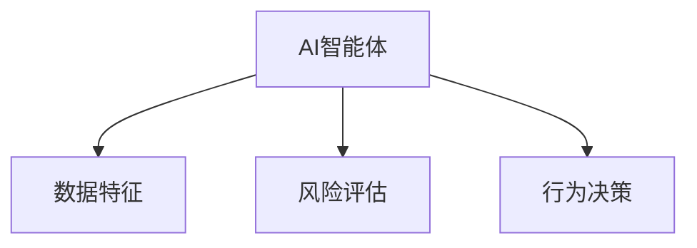
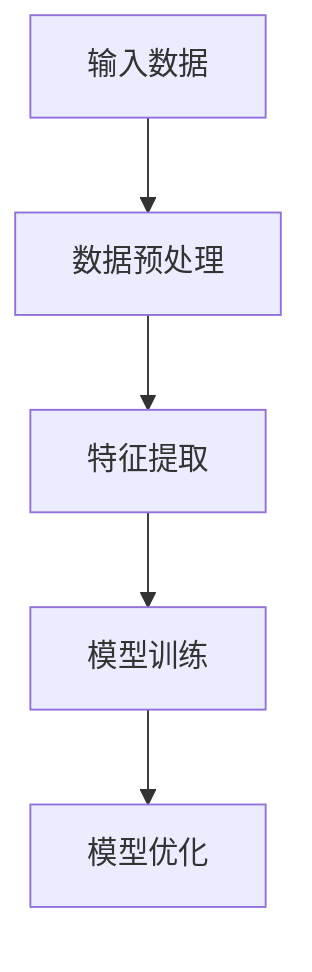
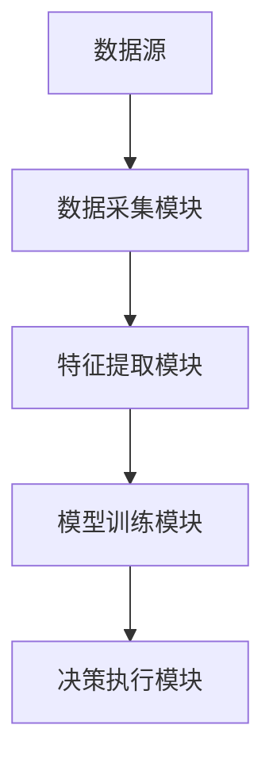

                 


# AI智能体在识别价值陷阱中的应用

> 关键词：AI智能体，价值陷阱，风险识别，深度学习，决策系统，智能体架构

> 摘要：本文探讨了AI智能体在识别价值陷阱中的应用，分析了其核心概念、算法原理、系统架构，并通过案例展示了其实战应用。文章详细介绍了AI智能体如何通过数据特征提取、风险评估模型和行为决策机制来识别隐藏的风险，帮助用户避免潜在的损失。

---

## 第一部分：价值陷阱与AI智能体概述

### 第1章：价值陷阱的定义与特征

#### 1.1 价值陷阱的定义
价值陷阱是指那些表面上看似有利可图，实则隐藏着重大风险或潜在问题的情况。例如，在金融市场中，某些股票可能因虚假的财务报告或隐藏的债务问题而看似具有吸引力，但实际上暗藏危机。

#### 1.2 价值陷阱的核心特征
- **表面吸引力**：通常表现为高收益、低风险或市场表现优异。
- **潜在风险**：隐藏着财务问题、法律纠纷或其他可能导致重大损失的因素。
- **复杂性**：风险因素可能涉及多个方面，需要深入分析才能识别。

#### 1.3 价值陷阱的分类
- **金融类**：如虚假财务报告、隐藏债务。
- **商业类**：如虚假商业模式、过度扩张。
- **技术类**：如技术缺陷、专利纠纷。

### 第2章：AI智能体的基本概念

#### 2.1 AI智能体的定义
AI智能体是一种具备自主决策能力的智能系统，能够感知环境、处理信息并做出决策，以实现特定目标。

#### 2.2 AI智能体的核心属性
- **感知能力**：通过传感器或数据输入获取环境信息。
- **决策能力**：基于获取的信息进行推理和决策。
- **自适应能力**：能够根据环境变化调整策略。

### 第3章：价值陷阱识别的背景与意义

#### 3.1 价值陷阱识别的背景
在金融、投资等领域，识别价值陷阱变得尤为重要，因为这些领域涉及大量复杂的数据和潜在的风险因素。

#### 3.2 价值陷阱识别的意义
- **保护投资者利益**：帮助投资者避免因虚假信息或隐藏风险而造成的损失。
- **提升决策效率**：通过自动化分析，快速识别潜在风险，提高决策效率。

---

## 第二部分：AI智能体的核心概念与联系

### 第4章：AI智能体的核心概念与联系

#### 4.1 AI智能体的核心概念
- **感知与决策机制**：通过数据输入感知环境，并基于感知结果做出决策。
- **知识表示与推理**：将知识表示为数据结构，并通过推理过程得出结论。
- **自适应学习能力**：通过机器学习算法不断优化自身模型。

#### 4.2 价值陷阱识别的核心要素
- **数据特征提取**：从大量数据中提取有助于识别价值陷阱的特征。
- **风险评估模型**：构建模型，评估潜在风险。
- **行为决策机制**：根据风险评估结果做出决策。

#### 4.3 实体关系图


---

## 第三部分：AI智能体的算法原理与数学模型

### 第5章：AI智能体的算法原理

#### 5.1 价值陷阱识别的算法流程
- **数据预处理**：清洗数据，处理缺失值和异常值。
- **特征提取**：从数据中提取有助于识别价值陷阱的特征。
- **模型训练与优化**：使用训练数据训练模型，并进行优化。

#### 5.2 基于深度学习的识别算法
- **神经网络模型**：如循环神经网络（RNN）和卷积神经网络（CNN）。
- **注意力机制**：用于关注重要的数据特征，提高模型性能。

#### 5.3 算法流程图


### 第6章：数学模型与公式

#### 6.1 风险评估模型
$$ R = \sum_{i=1}^{n} w_i x_i $$
其中，$R$ 表示风险值，$w_i$ 表示特征 $x_i$ 的权重。

#### 6.2 注意力机制
$$ \text{Attention}(Q, K, V) = \text{softmax}\left(\frac{QK^T}{\sqrt{d_k}}\right)V $$
其中，$Q$ 是查询向量，$K$ 是键向量，$V$ 是值向量，$d_k$ 是维度。

---

## 第四部分：系统分析与架构设计

### 第7章：系统分析与架构设计方案

#### 7.1 问题场景介绍
在金融投资领域，识别价值陷阱是投资者面临的重大挑战。AI智能体可以通过分析历史数据和实时数据，帮助投资者识别潜在风险。

#### 7.2 系统功能设计
- **数据采集模块**：收集市场数据、公司财务数据等。
- **特征提取模块**：从数据中提取特征，如财务指标、市场表现等。
- **模型训练模块**：训练风险评估模型，并进行优化。
- **决策执行模块**：根据模型输出结果，做出投资决策。

#### 7.3 系统架构设计


---

## 第五部分：项目实战

### 第8章：项目实战

#### 8.1 环境安装
- **安装Python**：确保安装了Python 3.6及以上版本。
- **安装依赖库**：如TensorFlow、Pandas、Scikit-learn等。

#### 8.2 核心代码实现
```python
import pandas as pd
import numpy as np
from sklearn.model import model_from_json

# 加载数据
data = pd.read_csv('value_traps.csv')

# 特征提取
X = data.drop('target', axis=1)
y = data['target']

# 模型训练
model = model_from_json('model.json')
model.compile(optimizer='adam', loss='binary_crossentropy')

# 模型预测
predictions = model.predict(X)
```

#### 8.3 代码解读与分析
- **数据加载**：使用Pandas加载数据。
- **特征提取**：从数据中提取特征，用于模型训练。
- **模型训练**：加载预训练模型，并进行预测。

#### 8.4 案例分析
通过分析一个具体的案例，展示AI智能体如何识别价值陷阱，并帮助投资者避免潜在损失。

---

## 第六部分：最佳实践与小结

### 第9章：最佳实践

#### 9.1 小结
本文详细介绍了AI智能体在识别价值陷阱中的应用，从核心概念到算法原理，再到系统架构和项目实战，为读者提供了全面的视角。

#### 9.2 注意事项
- 数据质量是关键，确保数据的准确性和完整性。
- 模型的可解释性也很重要，便于分析和优化。
- 定期更新模型，以适应市场变化。

#### 9.3 拓展阅读
推荐一些进一步阅读的资料，如《深度学习实战》、《机器学习算法与应用》等。

---

通过以上步骤，您可以逐步深入了解AI智能体在识别价值陷阱中的应用，掌握其实战技巧，并在实际工作中应用这些知识。

