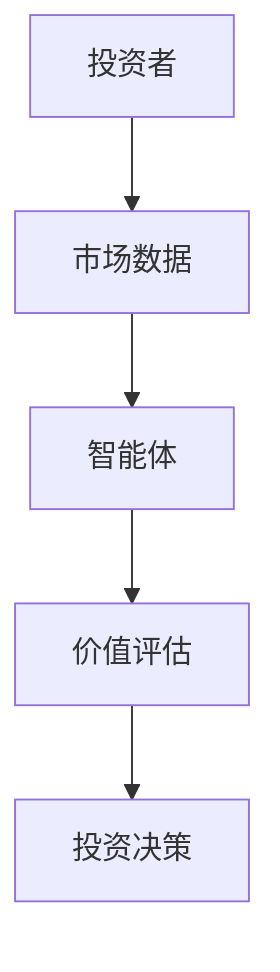
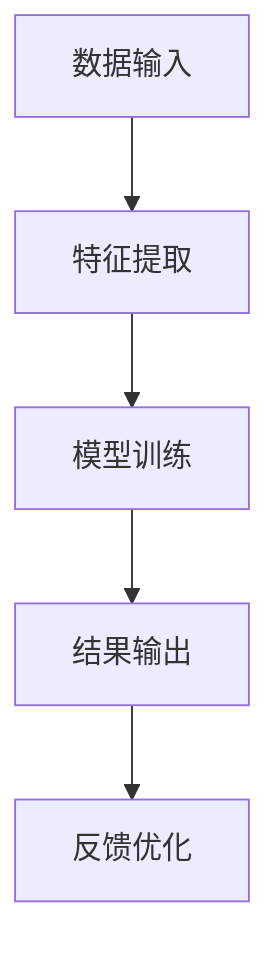
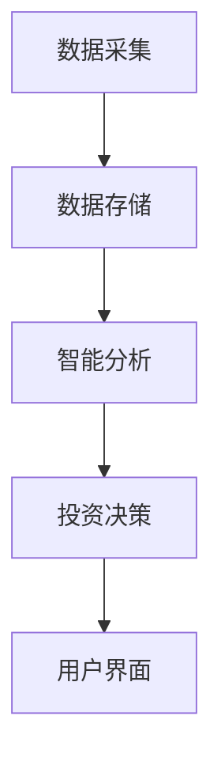

                 


# AI智能体在识别价值陷阱和价值机会中的作用

> 关键词：AI智能体，价值陷阱，价值机会，强化学习，深度学习，金融分析

> 摘要：本文探讨了AI智能体在识别市场中的价值陷阱和价值机会中的应用。通过分析传统投资分析的局限性，介绍了AI智能体的基本原理、算法实现、系统架构设计以及项目实战。文章结合数学模型和代码实现，详细阐述了如何利用AI技术提高投资决策的准确性。

---

# 第一部分: 问题背景与核心概念

## 第1章: 问题背景

### 1.1 价值陷阱与价值机会的定义

- **价值陷阱**：指市场中某些表面上看似有吸引力，但实际上存在隐藏风险或缺陷的投资标的。例如，一家公司可能看似有高增长潜力，但实际上可能存在财务造假或管理问题。
- **价值机会**：指市场中那些被低估，但具有长期增长潜力的投资标的。例如，一家公司可能在某个周期性底部，但具备强大的核心竞争力和良好的财务状况。

### 1.2 传统投资分析的局限性

- 传统投资分析依赖于人工判断，容易受到主观情绪和认知偏差的影响。
- 数据量大且复杂，人工分析效率低，难以捕捉短期波动。
- 市场环境变化快，传统方法难以及时调整策略。

### 1.3 AI技术在金融分析中的潜力

- AI技术能够处理海量数据，发现隐藏的模式和趋势。
- 通过机器学习算法，AI可以实时分析市场动态，帮助投资者做出更明智的决策。
- AI能够自动化识别价值陷阱和机会，减少人为错误。

---

## 第2章: 核心概念与联系

### 2.1 AI智能体的基本原理

- **定义**：AI智能体是一种能够感知环境并采取行动以实现目标的智能系统。
- **特征对比表**：

| 属性 | 价值陷阱 | 价值机会 |
|------|----------|----------|
| 表现 | 低估值、高风险 | 高估值、低风险 |
| 模型识别 | 异常值、负面信号 | 正常值、正面信号 |
| 投资策略 | 避免 | 介入 |

### 2.2 ER实体关系图



### 2.3 算法流程图



---

# 第二部分: AI智能体的核心算法原理

## 第3章: 算法原理概述

### 3.1 强化学习的基本原理

- **定义**：强化学习是一种通过试错机制，让智能体在与环境交互中学习策略的方法。
- **数学模型**：

$$ Q(s, a) = Q(s, a) + \alpha (r + \max_{a'} Q(s', a') - Q(s, a)) $$

其中：
- \( Q(s, a) \)：状态-动作值函数
- \( \alpha \)：学习率
- \( r \)：奖励
- \( s' \)：下一状态

### 3.2 深度学习模型的应用

- **DNN（深度神经网络）**：
  - 输入：市场数据（如价格、成交量、财务指标）
  - 输出：价值评估（如风险等级、投资建议）
  - 模型结构：输入层 → 隐藏层（多个） → 输出层

### 3.3 联合概率模型的构建

- **联合概率模型**：
  - 通过概率论描述市场数据之间的关系。
  - 示例公式：

$$ P(A|B) = \frac{P(B|A)P(A)}{P(B)} $$

---

## 第4章: 算法实现流程

### 4.1 数据收集与预处理

- 数据来源：股票价格、财务报表、行业新闻、社交媒体情绪等。
- 数据清洗：去除缺失值、异常值，标准化处理。

### 4.2 特征提取与选择

- 特征提取：使用NLP技术分析新闻标题和社交媒体情绪。
- 特征选择：使用PCA（主成分分析）降维。

### 4.3 模型训练与优化

- 算法选择：使用强化学习中的Q-Learning算法。
- 模型优化：调整学习率、折扣因子等超参数。

### 4.4 结果评估与反馈

- 评估指标：准确率、召回率、F1分数。
- 反馈机制：根据实际投资结果调整模型参数。

---

# 第三部分: 系统分析与架构设计

## 第5章: 系统架构设计

### 5.1 项目场景介绍

- 系统目标：开发一个基于AI智能体的投资分析工具。
- 项目范围：支持股票、基金、期货等多种金融产品。

### 5.2 功能设计

- 数据采集模块：实时抓取市场数据。
- 智能分析模块：识别价值陷阱和机会。
- 投资决策模块：生成投资建议。

### 5.3 系统架构图



### 5.4 系统接口设计

- API接口：
  - `/api/data`：获取市场数据
  - `/api/analyze`：进行智能分析
  - `/api/decision`：获取投资建议

---

## 第6章: 项目实战

### 6.1 环境安装

- 安装Python和必要的库（如TensorFlow、Keras、Pandas）。
- 安装Jupyter Notebook用于开发和测试。

### 6.2 核心代码实现

```python
import numpy as np
import pandas as pd
from tensorflow import keras

# 数据加载
data = pd.read_csv('market_data.csv')

# 特征提取
features = data[['price', 'volume', 'profit_margin']]
labels = data['value_label']

# 模型构建
model = keras.Sequential([
    keras.layers.Dense(64, activation='relu', input_shape=(3,)),
    keras.layers.Dense(1, activation='sigmoid')
])

model.compile(optimizer='adam', loss='binary_crossentropy', metrics=['accuracy'])

# 模型训练
model.fit(features, labels, epochs=100, batch_size=32)

# 模型预测
new_data = np.array([[50, 1000, 0.2], [100, 500, 0.5]])
predictions = model.predict(new_data)
print(predictions)
```

### 6.3 代码解读与分析

- 数据加载：使用Pandas读取CSV文件。
- 特征提取：选择关键特征（价格、成交量、利润率）。
- 模型构建：使用Keras构建简单的神经网络。
- 模型训练：使用Adam优化器和二进制交叉熵损失函数。
- 模型预测：输入新数据，输出预测结果。

### 6.4 实际案例分析

- 数据准备：从实际市场中获取数据。
- 模型训练：使用历史数据训练模型。
- 案例分析：识别某只股票的价值陷阱或机会。

---

## 第7章: 总结与展望

### 7.1 总结

- AI智能体在识别价值陷阱和机会中的作用：
  - 提高投资决策的准确性。
  - 降低人为错误和认知偏差。
  - 实现自动化和实时分析。

### 7.2 注意事项

- 数据质量：确保输入数据的准确性和完整性。
- 模型调优：根据实际效果不断优化模型参数。
- 风险控制：结合AI建议，制定合理的风险管理策略。

### 7.3 拓展阅读

- 推荐书籍：《深度学习》（Ian Goodfellow等著）
- 推荐博客：Tech Insights（技术洞察）

---

通过以上章节的详细讲解，我们系统地探讨了AI智能体在识别价值陷阱和价值机会中的作用，从理论到实践，帮助读者全面理解并掌握相关技术。

