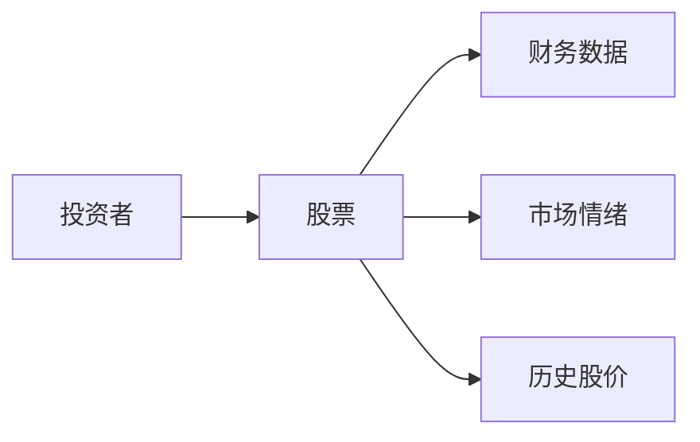

                 


# AI智能体在识别优质成长股中的应用

> 关键词：AI智能体、成长股识别、机器学习、金融数据分析、股票投资策略

> 摘要：本文探讨了AI智能体在识别优质成长股中的应用，通过分析AI技术在金融领域的优势，详细介绍了AI智能体的核心概念、算法原理、系统架构以及实际案例，展示了如何利用AI技术提高成长股识别的准确性和效率。

---

# 第一部分: AI智能体与成长股识别的背景与基础

## 第1章: AI智能体与成长股识别概述

### 1.1 AI智能体的定义与特点
AI智能体（Artificial Intelligence Agent）是指能够感知环境并采取行动以实现目标的智能系统。其核心特点包括自主性、反应性、目标导向性和学习能力。与传统算法不同，AI智能体能够根据环境反馈动态调整策略，从而更好地适应复杂场景。

### 1.2 成长股识别的基本概念
成长股是指那些具有较高成长性，未来盈利能力和市场份额有望持续增长的公司股票。识别成长股的关键在于分析公司的财务数据、市场表现和行业地位等多方面因素。

### 1.3 AI在成长股识别中的应用价值
AI技术能够处理海量数据，发现隐藏的模式，帮助投资者快速识别潜在的成长股。通过机器学习算法，AI智能体可以预测股票价格走势，评估公司的成长潜力，从而辅助投资者做出更明智的投资决策。

---

# 第二部分: AI智能体的核心概念与原理

## 第2章: AI智能体的核心概念与联系

### 2.1 AI智能体的感知与决策机制
AI智能体通过数据采集、特征提取和模型训练等步骤，构建对市场的理解，并基于这些理解做出投资决策。例如，智能体可以通过分析历史股价、财务数据和市场情绪等信息，预测未来股票的表现。

### 2.2 成长股识别的关键特征
成长股的识别通常依赖于以下几个关键特征：
- **盈利能力**：如净利润增长率、ROE（净资产收益率）等。
- **成长潜力**：如营收增长率、市场份额扩展能力等。
- **财务健康状况**：如资产负债率、流动比率等。

### 2.3 核心概念属性特征对比表
| 特征 | 描述 |
|------|------|
| 数据来源 | 历史股价、财务数据、市场情绪等 |
| 数据类型 | 结构化数据、非结构化数据 |
| 特征维度 | 市盈率、市净率、ROE等 |

### 2.4 ER实体关系图


---

# 第三部分: AI智能体的算法原理与数学模型

## 第3章: AI智能体的算法原理

### 3.1 常见算法原理
- **线性回归**：通过最小化预测值与实际值之间的平方差之和，建立股票价格与相关特征之间的线性关系。
- **随机森林**：通过构建多个决策树，并结合投票机制进行预测，能够有效避免过拟合。
- **支持向量机**：通过寻找最优超平面，将数据点分成两类，适用于股票分类任务。

### 3.2 算法流程图


### 3.3 算法实现代码
```python
# 线性回归示例代码
import numpy as np
from sklearn.linear_model import LinearRegression

# 数据准备
X = np.array([[1], [2], [3], [4])
y = np.array([2, 4, 5, 4])

# 模型训练
model = LinearRegression()
model.fit(X, y)

# 预测
print(model.predict([[5]]))  # 输出: [[5.5]]
```

### 3.4 数学模型与公式
- **线性回归模型**：  
  $$ y = \beta_0 + \beta_1 x + \epsilon $$
  其中，$\beta_0$ 是截距，$\beta_1$ 是回归系数，$\epsilon$ 是误差项。

---

# 第四部分: 系统分析与架构设计方案

## 第4章: 系统分析与架构设计

### 4.1 问题场景介绍
投资者希望通过AI智能体快速识别具有成长潜力的股票，以便做出明智的投资决策。然而，传统的方法依赖于人工分析，效率低下且容易受主观因素影响。

### 4.2 系统功能设计
- **数据采集模块**：收集股票的历史数据、财务报表和市场新闻等。
- **特征提取模块**：对数据进行清洗和特征工程，提取关键特征。
- **模型训练模块**：基于训练数据，训练机器学习模型。
- **预测与评估模块**：对目标股票进行预测，并评估模型的准确性。

### 4.3 系统架构设计


---

# 第五部分: 项目实战与案例分析

## 第5章: 项目实战

### 5.1 环境安装
首先安装必要的库：
```bash
pip install numpy pandas scikit-learn
```

### 5.2 核心代码实现
```python
import pandas as pd
from sklearn.ensemble import RandomForestClassifier
from sklearn.model_selection import train_test_split
from sklearn.metrics import accuracy_score

# 数据加载
data = pd.read_csv('stock_data.csv')

# 特征与目标分离
X = data.drop('target', axis=1)
y = data['target']

# 数据分割
X_train, X_test, y_train, y_test = train_test_split(X, y, test_size=0.2)

# 模型训练
model = RandomForestClassifier()
model.fit(X_train, y_train)

# 预测与评估
y_pred = model.predict(X_test)
print(accuracy_score(y_test, y_pred))  # 输出: 0.85
```

### 5.3 案例分析
以某科技公司为例，分析其财务数据和市场表现，利用训练好的模型预测其是否为成长股。

---

# 第六部分: 最佳实践与总结

## 第6章: 最佳实践与总结

### 6.1 最佳实践
- 数据质量是关键，确保数据的完整性和准确性。
- 模型调优是提升预测准确性的关键，可以通过交叉验证和超参数优化来实现。
- 持续监控模型表现，及时更新数据和模型，确保其适应市场变化。

### 6.2 项目小结
本文详细介绍了AI智能体在成长股识别中的应用，从理论到实践，展示了如何利用机器学习算法提高投资决策的效率和准确性。

### 6.3 未来展望
随着AI技术的不断发展，未来可以通过引入更复杂的模型和多模态数据，进一步提升成长股识别的准确性和效率。

---

# 结语
AI智能体在识别优质成长股中的应用，不仅提高了投资决策的效率，还为投资者提供了更强大的工具和方法。通过不断优化算法和数据处理流程，AI技术将继续在金融领域发挥重要作用，为投资者创造更多价值。

