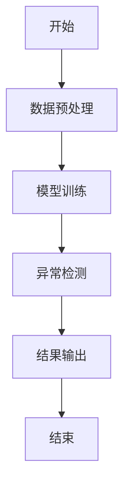
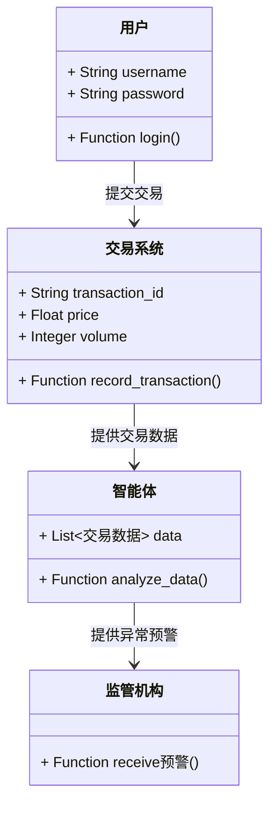
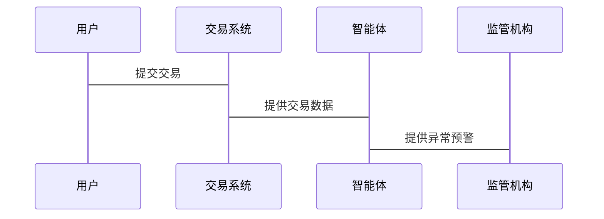

                 


```markdown
# AI智能体在识别市场异常交易模式中的作用

## 关键词
- AI智能体, 异常交易模式, 金融市场, 交易数据, 智能异常检测

## 摘要
随着金融市场日益复杂化和数字化，异常交易模式的识别变得越来越重要。本文探讨了AI智能体在识别市场异常交易模式中的作用，详细分析了其核心概念、算法原理、系统架构以及实际应用案例。通过理论与实践相结合的方式，本文揭示了AI智能体如何有效提升金融市场的安全性和稳定性。

---

## 第一部分: 异常交易模式识别的背景与挑战

### 第1章: 问题背景

#### 1.1 问题背景
金融市场是一个高度复杂且动态变化的环境，异常交易模式的识别对于维护市场公平性和稳定性至关重要。本文从以下几个方面分析异常交易模式识别的背景与挑战。

##### 1.1.1 异常交易模式的定义与分类
异常交易模式是指在正常市场条件下，交易活动出现显著偏离预期的行为。这些模式可能包括市场操纵、内幕交易、洗售交易等，严重破坏市场秩序。

##### 1.1.2 异常交易模式识别的重要性
识别异常交易模式有助于维护市场公平性，保护投资者利益，防止金融市场的系统性风险。

##### 1.1.3 异常交易模式识别的难点
- 数据量大且复杂
- 异常模式具有隐蔽性
- 市场环境不断变化

#### 1.2 问题解决
##### 1.2.1 AI智能体在异常交易模式识别中的作用
AI智能体通过实时分析交易数据，能够快速识别异常模式，提供预警和决策支持。

##### 1.2.2 异常交易模式识别的解决方案框架
1. 数据采集与预处理
2. 异常检测算法选择
3. 系统架构设计
4. 结果分析与反馈

##### 1.2.3 异常交易模式识别的核心要素与组成
- 数据源：交易数据、市场数据、用户行为数据
- 分析模型：基于机器学习的异常检测算法
- 系统架构：分层架构，包括数据层、业务逻辑层、表现层

---

## 第二部分: AI智能体的核心概念与原理

### 第2章: 核心概念与原理

#### 2.1 AI智能体的定义与特点
##### 2.1.1 AI智能体的基本概念
AI智能体是一种能够感知环境、做出决策并执行操作的智能系统，具备学习和适应能力。

##### 2.1.2 AI智能体的核心特点
- 智能性：能够理解和分析复杂数据
- 自适应性：能够根据环境变化调整策略
- 实时性：能够快速响应交易数据

#### 2.2 异常交易模式识别的核心概念
##### 2.2.1 异常交易模式识别的原理
通过机器学习算法，对历史交易数据进行训练，建立模型识别异常模式。

##### 2.2.2 异常交易模式识别的属性特征对比
| 特征       | 正常交易模式 | 异常交易模式 |
|------------|--------------|--------------|
| 交易频率   | 稳定         | 剧烈波动     |
| 价格变动   | 无明显异常   | 明显异常     |
| 交易量     | 稳定         | 突然激增或骤减 |

##### 2.2.3 异常交易模式识别的ER实体关系图
```mermaid
er
    actor 用户
    actor 监管机构
    actor 交易系统
    entity 交易数据
    entity 异常交易模式
    entity 智能体
    用户 --> 交易系统: 提交交易
    交易系统 --> 交易数据: 记录交易
    交易数据 --> 智能体: 分析数据
    智能体 --> 监管机构: 提供异常预警
```

---

## 第三部分: 算法原理

### 第3章: 异常交易模式识别的算法原理

#### 3.1 算法选择与实现
##### 3.1.1 算法选择
选择基于时间序列的异常检测算法，如ARIMA模型和Isolation Forest。

##### 3.1.2 算法流程
1. 数据预处理：清洗、归一化
2. 模型训练：使用历史交易数据训练模型
3. 异常检测：实时监控交易数据，识别异常模式

##### 3.1.3 算法实现


##### 3.1.4 Python代码实现
```python
import pandas as pd
from sklearn.ensemble import IsolationForest

# 数据预处理
data = pd.read_csv('transaction_data.csv')
data = data[['time', 'price', 'volume']]

# 模型训练
model = IsolationForest(n_estimators=100, random_state=42)
model.fit(data[['price', 'volume']])

# 异常检测
data['is_anomaly'] = model.predict(data[['price', 'volume']])
```

#### 3.2 数学模型
##### 3.2.1 ARIMA模型
$$ ARIMA(p, d, q) $$
- p: 自回归阶数
- d: 差分阶数
- q: 移动平均阶数

##### 3.2.2 案例分析
使用ARIMA模型预测股票价格波动，识别异常交易模式。

---

## 第四部分: 系统分析与架构设计

### 第4章: 系统架构设计

#### 4.1 系统功能设计
##### 4.1.1 功能模块
- 数据采集模块：实时采集交易数据
- 异常检测模块：识别异常交易模式
- 预警模块：向监管机构发送预警

##### 4.1.2 领域模型


#### 4.2 系统架构设计
##### 4.2.1 分层架构
1. 数据层：处理交易数据
2. 业务逻辑层：执行异常检测
3. 表现层：展示结果

##### 4.2.2 系统架构图


#### 4.3 接口设计
##### 4.3.1 接口定义
- 数据采集接口：`GET /api/transaction_data`
- 异常检测接口：`POST /api/anomaly_detection`
- 预警接口：`POST /api/send_warning`

##### 4.3.2 序列图


---

## 第五部分: 项目实战

### 第5章: 项目实战

#### 5.1 环境搭建
- 安装Python、Pandas、Scikit-learn等库
- 数据库搭建（MySQL或MongoDB）

#### 5.2 核心代码实现
##### 5.2.1 数据采集模块
```python
import pymysql

# 数据库连接
conn = pymysql.connect(host='localhost', user='root', password='password', db='transaction_db')
cursor = conn.cursor()

# 查询交易数据
cursor.execute('SELECT * FROM transaction_data LIMIT 1000')
data = cursor.fetchall()
```

##### 5.2.2 异常检测模块
```python
from sklearn.ensemble import IsolationForest

# 训练模型
model = IsolationForest(n_estimators=100, random_state=42)
model.fit(data[['price', 'volume']])

# 预测异常
data['is_anomaly'] = model.predict(data[['price', 'volume']])
```

##### 5.2.3 预警模块
```python
import smtplib

# 发送邮件预警
server = smtplib.SMTP('smtp.gmail.com', 587)
server.starttls()
server.login('your_email@gmail.com', 'your_password')
server.sendmail('your_email@gmail.com', '监管机构邮箱', '检测到异常交易模式')
server.quit()
```

#### 5.3 案例分析
##### 5.3.1 数据训练
使用历史交易数据训练异常检测模型。

##### 5.3.2 异常识别
实时监控交易数据，识别并标记异常交易模式。

##### 5.3.3 结果分析
分析异常交易模式的特征，提出优化建议。

---

## 第六部分: 总结与展望

### 第6章: 总结

#### 6.1 核心内容回顾
- 异常交易模式识别的重要性
- AI智能体的核心概念与原理
- 算法原理与系统架构设计
- 项目实战与案例分析

#### 6.2 最佳实践 tips
- 数据预处理是关键
- 选择合适的算法模型
- 系统架构设计要合理

#### 6.3 小结
通过本文的分析与实践，AI智能体在识别市场异常交易模式中发挥了重要作用，为金融市场的安全性和稳定性提供了有力支持。

#### 6.4 注意事项
- 数据隐私和安全问题
- 算法的可解释性
- 系统的实时性和稳定性

#### 6.5 拓展阅读
- 《机器学习在金融中的应用》
- 《AI智能体的设计与实现》
- 《金融市场数据分析与建模》

---

## 附录

### 附录A: 相关术语解释
- AI智能体：具备智能性和自适应性的智能系统
- 异常交易模式：偏离正常交易行为的模式
- 机器学习：通过数据训练模型进行预测和分类

### 附录B: 工具与库
- Python：编程语言
- Pandas：数据分析库
- Scikit-learn：机器学习库
- pymysql：数据库连接库

### 附录C: 数据格式与接口规范
- 数据格式：CSV、JSON
- 接口协议：HTTP、RESTful API

---

## 结语

通过本文的详细讲解，读者可以全面了解AI智能体在识别市场异常交易模式中的作用，掌握其核心概念、算法原理和系统架构设计，并通过实际案例分析提升对金融市场的认知和分析能力。
```

