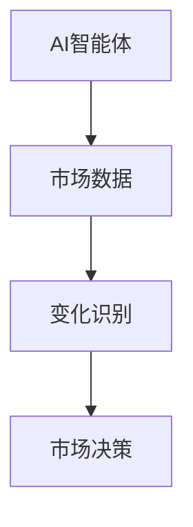
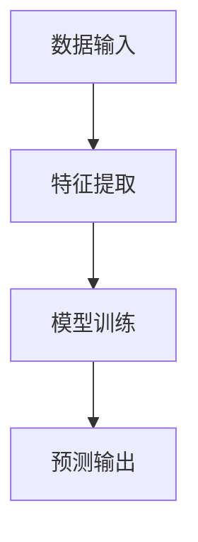
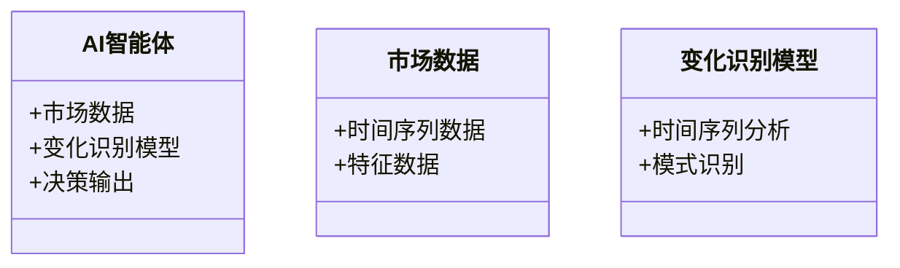
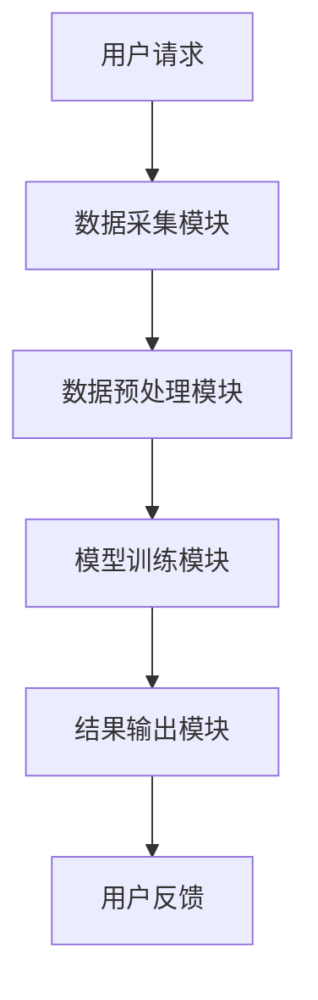

                 


# AI智能体在识别市场结构性变化中的作用

## 关键词：AI智能体、市场变化、时间序列分析、系统架构、项目实战

## 摘要：  
本文系统阐述了AI智能体在识别市场结构性变化中的作用，从概念解析、算法原理到系统架构，结合实际案例和项目实现，深入分析了AI智能体在市场分析与预测中的应用。通过理论与实践相结合，全面展示如何利用AI技术捕捉市场变化，为企业决策提供支持。

---

# 第一部分：AI智能体与市场结构性变化概述

## 第1章：AI智能体与市场结构性变化概述

### 1.1 AI智能体的定义与核心概念  
AI智能体（AI Agent）是指能够感知环境、自主决策并执行任务的智能系统。它具备数据驱动、自适应性和可解释性等特性，能够在复杂环境中识别模式和趋势。  

#### 1.1.1 市场结构性变化的定义  
市场结构性变化指市场中的关键要素（如需求、供给、价格、竞争格局等）发生显著变化，可能导致市场格局的重新洗牌。  

#### 1.1.2 AI智能体的作用  
AI智能体通过实时数据分析、模式识别和预测建模，能够快速捕捉市场变化，为企业提供数据支持和决策建议。  

---

## 第2章：AI智能体与市场变化的核心概念模型

### 2.1 核心概念原理  
AI智能体与市场变化的交互模型包括数据输入、特征提取、模式识别和决策输出四个环节。  

### 2.2 概念属性对比表  
| 概念       | 数据驱动 | 自适应性 | 可解释性 |  
|------------|----------|----------|----------|  
| AI智能体    | 高       | 强       | 中       |  
| 市场变化    | 中       | 弱       | 低       |  

### 2.3 ER实体关系图  


---

# 第二部分：AI智能体的算法原理

## 第3章：AI智能体的算法原理与实现

### 3.1 算法原理概述  
AI智能体采用时间序列分析和强化学习算法，结合数据特征提取和模型训练，实现对市场变化的预测和识别。  

#### 3.2 时间序列分析模型的数学公式  
##### 3.2.1 ARIMA模型  
$$ ARIMA(p, d, q) $$  
##### 3.2.2 LSTM网络  
$$ \text{LSTM}(t, h_{t-1}, c_{t-1}) $$  

#### 3.3 算法流程图  


### 3.4 算法实现代码  
```python
import numpy as np
from sklearn.metrics import mean_squared_error

def arima_model(train, test):
    # ARIMA模型训练
    model = ARIMA(train, order=(1, 1, 1))
    model_fit = model.fit()
    # 预测
    forecast = model_fit.forecast(len(test))[0]
    return forecast, test
```

---

## 第4章：系统分析与架构设计

### 4.1 系统场景介绍  
系统旨在通过AI智能体实时监控市场数据，识别潜在的变化趋势，并为企业提供决策支持。  

### 4.2 系统功能设计  
#### 4.2.1 领域模型  


### 4.3 系统架构图  


---

## 第5章：项目实战

### 5.1 环境安装  
安装所需的Python库，如numpy、pandas、scikit-learn和keras。  

### 5.2 核心代码实现  
```python
import pandas as pd
from sklearn.preprocessing import MinMaxScaler
from keras.models import Sequential
from keras.layers import LSTM, Dense

# 数据预处理
data = pd.read_csv('market_data.csv')
scaler = MinMaxScaler()
data_scaled = scaler.fit_transform(data)

# 模型构建
model = Sequential()
model.add(LSTM(128, input_shape=(timesteps, features)))
model.add(Dense(1))
model.compile(loss='mean_squared_error', optimizer='adam')

# 训练
model.fit(X_train, y_train, epochs=100, batch_size=32)
```

### 5.3 案例分析  
以电商行业的销售数据为例，利用LSTM模型预测销售趋势，识别市场变化。  

---

## 第6章：总结与展望

### 6.1 本章小结  
AI智能体通过先进的算法和系统架构，能够有效识别市场结构性变化，为企业提供数据支持和决策建议。  

### 6.2 最佳实践  
- 数据质量是关键，确保数据的完整性和准确性。  
- 结合业务场景，选择合适的算法和模型。  
- 定期更新模型，适应市场变化。  

### 6.3 注意事项  
- 数据隐私和安全问题需严格控制。  
- 模型的可解释性需满足业务需求。  
- 系统的实时性和稳定性需保证。  

### 6.4 拓展阅读  
推荐阅读《时间序列分析》和《强化学习实战》等书籍，深入理解相关算法和技术。

---

# 结语  
AI智能体在识别市场结构性变化中的应用前景广阔，随着技术的不断进步，其作用将更加重要。希望本文能够为读者提供有价值的参考和启示。

