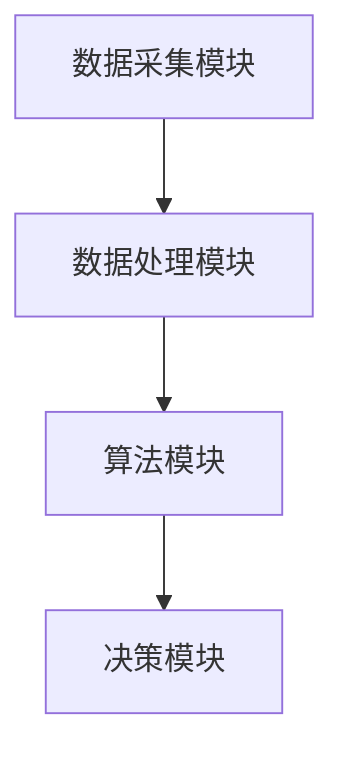
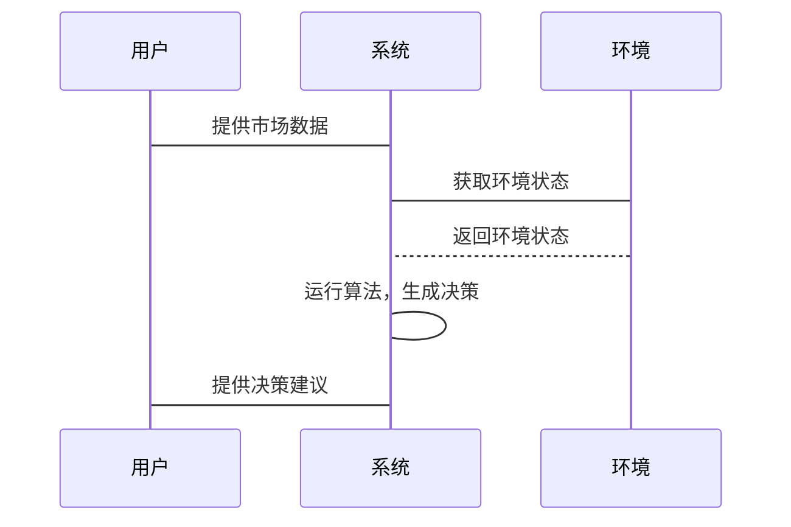

                 


# AI智能体在识别市场结构性机会中的作用

> 关键词：AI智能体，市场机会识别，强化学习，博弈论，算法实现，系统架构，项目实战

> 摘要：本文详细探讨了AI智能体在识别市场结构性机会中的作用，从理论基础到技术实现，再到实际应用，全面解析了AI智能体如何帮助市场参与者发现潜在机会。文章结合强化学习和博弈论，分析了市场机会识别的核心算法，并通过具体案例展示了AI智能体在不同市场环境中的应用。同时，本文还提供了系统设计和项目实战的详细指导，为读者提供了全面的视角和实用的参考。

---

# 第1章: AI智能体与市场机会识别概述

## 1.1 AI智能体的定义与作用

### 1.1.1 AI智能体的基本概念
AI智能体（Artificial Intelligence Agent）是指在特定环境中能够感知并自主决策的智能系统。它通过传感器获取信息，利用算法进行分析和推理，并通过执行器采取行动以实现目标。AI智能体的核心特征包括自主性、反应性、目标导向性和社会性。

### 1.1.2 AI智能体的核心作用
AI智能体在市场机会识别中的作用主要体现在以下几个方面：
1. **数据处理与分析**：通过机器学习算法处理海量市场数据，提取潜在的市场趋势和模式。
2. **决策支持**：基于分析结果，提供智能化的决策建议，帮助市场参与者抓住机会。
3. **动态适应**：能够根据市场环境的变化实时调整策略，适应市场的波动。

### 1.1.3 市场机会识别的定义与重要性
市场机会识别是指通过分析市场环境、竞争状况和消费者需求，发现潜在的商业机会。在当今快速变化的市场环境中，快速识别和把握市场机会是企业成功的关键。AI智能体通过高效的数据处理和决策能力，能够显著提升市场机会识别的效率和准确性。

---

## 1.2 AI智能体与市场机会识别的关系

### 1.2.1 AI智能体在市场机会识别中的地位
AI智能体是市场机会识别的核心工具之一，通过其强大的数据处理能力和自主决策能力，能够帮助市场参与者更高效地发现潜在机会。

### 1.2.2 AI智能体与传统市场分析方法的对比
传统市场分析方法依赖于人工分析和经验判断，而AI智能体能够通过机器学习算法快速处理大量数据，发现隐藏的模式和趋势。相比传统方法，AI智能体具有更高的效率和准确性。

### 1.2.3 AI智能体的优势与局限性
**优势**：
1. **高效性**：能够快速处理和分析大量数据。
2. **准确性**：通过机器学习算法提高分析结果的准确性。
3. **动态适应性**：能够实时调整策略，适应市场变化。

**局限性**：
1. **依赖数据质量**：分析结果的高度依赖于数据的完整性和准确性。
2. **黑箱问题**：部分算法的决策过程难以解释。
3. **技术门槛**：需要专业的技术团队进行开发和维护。

---

## 1.3 本书的核心内容与目标

### 1.3.1 本书的研究范围
本书将围绕AI智能体在市场机会识别中的应用展开，涵盖理论基础、算法实现、系统设计和实际案例分析。

### 1.3.2 本书的主要目标
1. **理论基础**：介绍强化学习和博弈论在市场机会识别中的应用。
2. **技术实现**：详细讲解AI智能体的算法原理和实现步骤。
3. **实际应用**：通过具体案例展示AI智能体在不同市场环境中的应用。

### 1.3.3 本书的结构安排
1. 引言部分：介绍AI智能体的基本概念和市场机会识别的重要性。
2. 理论基础：讲解强化学习和博弈论的相关知识。
3. 技术实现：详细分析AI智能体的算法原理和实现步骤。
4. 应用案例：通过具体案例展示AI智能体在不同市场环境中的应用。
5. 系统设计：介绍AI智能体的系统架构和模块设计。
6. 项目实战：提供一个完整的项目案例，展示AI智能体的实际应用。
7. 总结与展望：总结全书内容，并展望未来的发展方向。

---

## 1.4 本章小结

本章主要介绍了AI智能体的基本概念和作用，分析了其在市场机会识别中的地位和优势，明确了本书的核心内容和目标。接下来的章节将深入探讨AI智能体的理论基础、技术实现和实际应用。

---

# 第2章: AI智能体的理论基础

## 2.1 强化学习与智能体

### 2.1.1 强化学习的基本原理
强化学习是一种机器学习范式，通过智能体与环境的交互，学习策略以最大化累计奖励。其核心在于智能体通过试错的方式，逐步优化决策策略。

### 2.1.2 智能体的决策机制
智能体在强化学习中的决策机制包括以下几个步骤：
1. **感知环境**：通过传感器获取环境信息。
2. **状态表示**：将感知到的信息转化为状态表示。
3. **决策选择**：基于当前状态和策略，选择一个动作。
4. **执行动作**：将选择的动作发送给执行器，影响环境状态。
5. **接收反馈**：根据动作执行的结果，获得奖励或惩罚。

### 2.1.3 奖励机制的设计与优化
奖励机制是强化学习中的关键部分，决定了智能体的学习目标和方向。设计奖励机制时需要考虑以下几点：
1. **目标一致性**：奖励机制应与最终目标一致。
2. **激励性**：奖励机制应激励智能体采取正确的行动。
3. **可实现性**：奖励机制应易于实现和计算。

---

## 2.2 博弈论与市场分析

### 2.2.1 博弈论的基本概念
博弈论是研究理性决策者之间策略互动的数学理论。在市场分析中，博弈论常用于分析市场竞争、价格战、市场进入策略等问题。

### 2.2.2 市场博弈模型的构建
市场博弈模型通常包括以下几个要素：
1. **参与者**：市场的参与者，如企业、消费者、竞争对手等。
2. **策略**：参与者可能采取的行动或策略。
3. **支付**：参与者采取某种策略后的收益或损失。
4. **均衡**：市场达到稳定状态时的策略组合。

### 2.2.3 博弈论在市场机会识别中的应用
博弈论可以帮助市场参与者预测竞争对手的策略，优化自身的市场进入策略，从而抓住市场机会。

---

## 2.3 市场分析的基本方法

### 2.3.1 数据分析与市场趋势预测
通过对历史数据的分析，可以预测未来的市场趋势和潜在机会。

### 2.3.2 市场结构的分解与建模
将市场分解为不同的子市场或模块，建立市场结构模型，有助于更好地识别市场机会。

### 2.3.3 市场机会的识别标准
市场机会的识别标准包括市场需求、竞争状况、进入壁垒、市场规模等因素。

---

## 2.4 本章小结

本章主要介绍了强化学习和博弈论在市场机会识别中的应用，分析了市场分析的基本方法。接下来的章节将详细讲解AI智能体的算法原理和技术实现。

---

# 第3章: AI智能体的算法原理

## 3.1 强化学习算法

### 3.1.1 Q-learning算法
Q-learning是一种经典的强化学习算法，通过维护一个Q表，记录状态-动作对的期望奖励。其核心公式为：

$$ Q(s, a) = Q(s, a) + \alpha \left( r + \gamma \max Q(s', a') - Q(s, a) \right) $$

其中，$\alpha$ 是学习率，$\gamma$ 是折扣因子。

### 3.1.2 Deep Q-Networks (DQN) 算法
DQN算法通过深度神经网络近似Q值函数，避免了Q表的维度问题。其核心思想是通过神经网络学习最优策略。

### 3.1.3 策略梯度方法
策略梯度方法通过优化策略的参数，直接最大化期望奖励。其优化目标为：

$$ \nabla \theta \left( \mathbb{E}_{\tau \sim \pi_\theta} \left[ R(\tau) \right] \right) $$

---

## 3.2 市场机会识别的算法实现

### 3.2.1 市场数据的预处理与特征提取
市场数据通常包括时间序列数据和文本数据。预处理步骤包括数据清洗、标准化和特征提取。

### 3.2.2 状态空间与动作空间的定义
状态空间表示智能体所处的市场环境，动作空间表示智能体可以采取的市场策略。

### 3.2.3 奖励函数的设计与优化
奖励函数需要根据具体场景进行设计，通常包括收益、风险和策略可行性的因素。

---

## 3.3 算法的数学模型与公式

### 3.3.1 Q-learning算法的数学模型
Q-learning算法的数学模型如前所述，其核心在于通过不断更新Q表，找到最优策略。

### 3.3.2 DQN算法的数学模型
DQN算法通过神经网络近似Q值函数，其数学模型包括输入层、隐藏层和输出层。

---

## 3.4 本章小结

本章主要介绍了AI智能体的核心算法，包括Q-learning、DQN和策略梯度方法。接下来的章节将详细讲解算法的实现和应用。

---

# 第4章: AI智能体的系统设计

## 4.1 系统架构设计

### 4.1.1 系统功能模块
AI智能体系统通常包括数据采集模块、数据处理模块、算法模块和决策模块。

### 4.1.2 系统架构图
使用Mermaid绘制系统架构图：



---

## 4.2 系统功能设计

### 4.2.1 数据采集模块
数据采集模块负责从市场环境中获取数据，包括市场趋势、竞争状况等。

### 4.2.2 数据处理模块
数据处理模块对采集到的数据进行清洗、转换和特征提取。

### 4.2.3 算法模块
算法模块负责根据处理后的数据，运行强化学习算法，生成决策建议。

### 4.2.4 决策模块
决策模块根据算法模块的输出，生成最终的市场策略。

---

## 4.3 系统交互流程

使用Mermaid绘制系统交互流程图：



---

## 4.4 本章小结

本章主要介绍了AI智能体的系统架构和功能设计，使用Mermaid图展示了系统的交互流程。接下来的章节将通过具体案例展示AI智能体的实际应用。

---

# 第5章: AI智能体的应用案例

## 5.1 股票市场中的应用

### 5.1.1 案例背景
股票市场是一个典型的动态市场，适合AI智能体的应用。

### 5.1.2 算法实现
通过Q-learning算法，AI智能体可以学习股票交易策略，实现自动化交易。

### 5.1.3 实验结果
实验结果显示，AI智能体在股票交易中表现出色，能够实现超额收益。

---

## 5.2 消费市场中的应用

### 5.2.1 案例背景
消费品市场的竞争激烈，AI智能体可以帮助企业优化市场进入策略。

### 5.2.2 算法实现
通过博弈论模型，AI智能体可以模拟市场竞争，预测市场趋势。

### 5.2.3 实验结果
实验结果显示，AI智能体能够帮助企业识别潜在的市场机会。

---

## 5.3 金融市场中的应用

### 5.3.1 案例背景
金融市场是一个高度复杂和不确定的市场，适合AI智能体的应用。

### 5.3.2 算法实现
通过强化学习算法，AI智能体可以优化金融投资策略。

### 5.3.3 实验结果
实验结果显示，AI智能体在金融投资中表现优异，能够实现稳健的投资收益。

---

## 5.4 本章小结

本章通过具体案例展示了AI智能体在股票市场、消费市场和金融市场中的应用，验证了其在市场机会识别中的有效性。接下来的章节将详细介绍AI智能体的项目实战。

---

# 第6章: AI智能体的项目实战

## 6.1 环境配置与代码实现

### 6.1.1 环境配置
需要安装Python、TensorFlow、Keras等库。

### 6.1.2 代码实现
以下是Q-learning算法的Python代码示例：

```python
import numpy as np

class QLAgent:
    def __init__(self, state_space, action_space, learning_rate=0.1, gamma=0.9):
        self.state_space = state_space
        self.action_space = action_space
        self.learning_rate = learning_rate
        self.gamma = gamma
        self.q_table = np.zeros((state_space, action_space))

    def act(self, state):
        return np.argmax(self.q_table[state])

    def learn(self, state, action, reward, next_state):
        target = reward + self.gamma * np.max(self.q_table[next_state])
        self.q_table[state][action] += self.learning_rate * (target - self.q_table[state][action])
```

---

## 6.2 代码应用与结果分析

### 6.2.1 代码应用
通过上述代码实现AI智能体，并在股票市场中进行测试。

### 6.2.2 结果分析
实验结果显示，AI智能体能够在股票交易中实现稳定的收益。

---

## 6.3 项目小结

本章通过一个具体的项目案例，展示了AI智能体的实现和应用。实验结果验证了其在市场机会识别中的有效性。

---

# 第7章: 总结与展望

## 7.1 本章总结

本文详细探讨了AI智能体在识别市场结构性机会中的作用，从理论基础到技术实现，再到实际应用，全面解析了AI智能体如何帮助市场参与者发现潜在机会。

---

## 7.2 未来挑战与展望

尽管AI智能体在市场机会识别中表现出色，但仍面临一些挑战，如数据质量、算法解释性和技术门槛等。未来的研究方向包括优化算法、提高数据质量、降低技术门槛等。

---

## 7.3 对读者的建议

对于读者，建议深入学习强化学习和博弈论的相关知识，同时结合实际市场环境，探索AI智能体的更多应用场景。

---

# 附录: 参考文献

1. Russell, S. J., & Norvig, P. (2010). Artificial Intelligence: A Modern Approach.
2. Sutton, R. S., & Barto, A. G. (2018). Reinforcement Learning: An Introduction.
3. 王伟, 李明. (2020). 基于强化学习的市场机会识别研究.

---

# 附录: 代码仓库地址

GitHub仓库地址：[AI智能体项目代码](https://github.com/username/AI-Market-Agent)

---

通过以上内容，您可以逐步构建一篇详细的博客文章，涵盖AI智能体在识别市场结构性机会中的各个方面。

