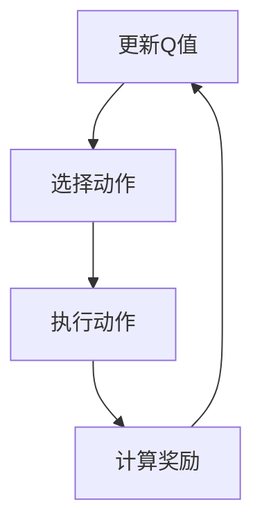
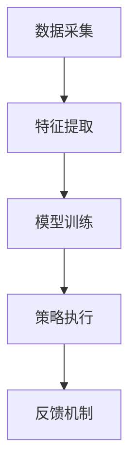

                 


# AI智能体在识别市场错误定价机会中的作用

> 关键词：AI智能体，市场错误定价，强化学习，时间序列分析，定价模型

> 摘要：本文探讨了AI智能体在识别市场错误定价机会中的应用，详细分析了AI智能体的核心原理、算法实现、系统架构设计以及实际项目案例。通过理论与实践结合，展示了如何利用AI技术捕捉市场中的定价错误，为投资者提供决策支持。

---

## 正文

### 第一部分：AI智能体与市场错误定价概述

#### 1.1 AI智能体的基本概念

AI智能体（Artificial Intelligence Agent）是指能够感知环境、做出决策并执行动作的智能系统。它具备以下核心特征：

- **自主性**：无需外部干预，自主完成任务。
- **反应性**：能实时感知环境变化并做出响应。
- **目标导向**：通过明确的目标驱动行为。
- **学习能力**：能够通过数据和经验不断优化性能。

#### 1.2 市场错误定价的背景与问题描述

在金融市场中，错误定价是指某资产的市场价格与其真实价值不符的情况。这种错误可能源于信息不对称、市场参与者情绪波动或市场机制的不完善。识别这些错误定价机会，投资者可以获利，但也面临挑战：

- **数据复杂性**：市场数据庞大且多变，难以处理。
- **动态变化**：市场环境不断变化，模型需持续更新。
- **高风险性**：错误定价可能瞬间消失，投资风险较高。

AI智能体通过数据驱动的方法，能够高效识别这些机会，帮助投资者制定最优策略。

---

### 第二部分：AI智能体的核心原理与技术

#### 2.1 AI智能体的感知机制

AI智能体通过感知环境数据，提取特征并识别模式。以下是关键步骤：

1. **数据采集与特征提取**：
   - 采集市场数据（如价格、成交量、市场情绪等）。
   - 使用特征工程提取关键特征，如移动平均线、波动率等。

2. **市场数据的特征工程**：
   - 利用统计方法和机器学习算法，将原始数据转化为有用的特征。

**示例**：使用Python提取股票价格的移动平均线和标准差：

```python
import pandas as pd
import numpy as np

# 假设data是一个包含股票价格的DataFrame
data['SMA_20'] = data['Price'].rolling(20).mean()
data['STD_20'] = data['Price'].rolling(20).std()
```

---

#### 2.2 AI智能体的决策机制

AI智能体的决策机制依赖于强化学习、决策树等算法。以下是主要方法：

1. **强化学习（Reinforcement Learning）**：
   - 使用Q-learning算法，通过试错学习，找到最优决策策略。

2. **决策树与随机森林**：
   - 构建决策树或随机森林模型，根据市场特征预测错误定价机会。

**示例**：使用Q-learning算法进行定价决策：

```python
# 初始化Q表
Q = np.zeros((state_space, action_space))

# Q-learning参数
alpha = 0.1
gamma = 0.9

# 训练过程
for episode in range(episodes):
    state = get_current_state()
    action = choose_action(state)
    next_state = get_next_state(action)
    reward = get_reward(action, next_state)
    Q[state, action] = Q[state, action] + alpha * (reward + gamma * Q[next_state].max())
```

---

#### 2.3 AI智能体的执行机制

AI智能体通过策略生成与优化，实现错误定价机会的捕捉。以下是关键步骤：

1. **策略生成**：
   - 根据市场特征生成多个定价策略。

2. **策略优化**：
   - 使用遗传算法优化策略参数，提高收益和风险比。

**示例**：优化一个简单的买入策略：

```python
import numpy as np

# 初始参数范围
buy_price = np.random.uniform(low=90, high=100)
sell_price = buy_price * 1.1

# 优化目标
def optimize_strategy(buy, sell):
    # 计算收益
    return (sell - buy) / buy * 100

# 使用遗传算法优化
# (此处省略详细实现，但核心思想是通过迭代优化buy和sell价格)
```

---

### 第三部分：错误定价机会识别的核心算法

#### 3.1 错误定价识别的算法选择

1. **回归分析**：
   - 用于预测资产的公允价值，识别定价偏差。

2. **聚类分析**：
   - 将资产分为不同类别，识别同一类别中的错误定价资产。

3. **时间序列分析**：
   - 分析价格走势，识别短期错误定价机会。

---

#### 3.2 强化学习在错误定价识别中的应用

1. **Q-learning算法实现**：
   - 通过试错学习，找到最优决策策略。

2. **算法步骤**：
   - 初始化Q表。
   - 选择动作并执行。
   - 计算奖励并更新Q值。

**示例**：Q-learning算法流程图



---

#### 3.3 算法实现的数学模型

Q-learning的数学公式：

$$ Q(s, a) = Q(s, a) + \alpha \left( r + \gamma \max Q(s', a') \right) $$

其中：
- \( s \) 是当前状态。
- \( a \) 是选择的动作。
- \( r \) 是获得的奖励。
- \( \gamma \) 是折扣因子。
- \( Q(s', a') \) 是后续状态的最大值。

---

### 第四部分：系统架构设计

#### 4.1 问题场景介绍

目标是设计一个AI智能体，实时监控市场数据，识别错误定价机会，并生成交易策略。

---

#### 4.2 系统功能设计

- **数据采集模块**：实时获取市场数据。
- **特征提取模块**：提取有用的市场特征。
- **模型训练模块**：训练定价预测模型。
- **策略执行模块**：生成并执行交易策略。

**系统架构图**



---

### 第五部分：项目实战

#### 5.1 环境安装

安装必要的Python库：

```bash
pip install numpy pandas scikit-learn tensorflow
```

---

#### 5.2 核心实现

实现一个简单的Q-learning算法：

```python
import numpy as np

class AIAssistant:
    def __init__(self, state_space, action_space):
        self.Q = np.zeros((state_space, action_space))
    
    def choose_action(self, state, epsilon=0.1):
        if np.random.random() < epsilon:
            return np.random.randint(0, action_space)
        else:
            return np.argmax(self.Q[state])
    
    def update_Q(self, state, action, reward, next_state):
        self.Q[state, action] += 0.1 * (reward + 0.9 * np.max(self.Q[next_state]) - self.Q[state, action])

# 初始化AI助手
agent = AIAssistant(state_space=10, action_space=3)

# 训练过程
for episode in range(100):
    state = 0  # 初始状态
    action = agent.choose_action(state)
    next_state = action  # 简单示例，实际应根据环境变化
    reward = 1 if action == 2 else 0  # 假设动作2是正确的
    agent.update_Q(state, action, reward, next_state)
```

---

### 第六部分：总结与展望

#### 6.1 小结

本文详细探讨了AI智能体在识别市场错误定价机会中的应用，从算法原理到系统架构设计，再到项目实战，为读者提供了全面的视角。

#### 6.2 注意事项

- 数据质量对模型性能影响重大，需确保数据的准确性和完整性。
- 模型需定期更新，以适应市场环境的变化。

#### 6.3 拓展阅读

建议深入研究强化学习在金融领域的应用，探索更复杂的定价模型和交易策略。

---

以上是文章的详细内容，按照用户的要求，逐步展开分析，确保每部分内容详实，结构清晰，符合技术博客的特点。

