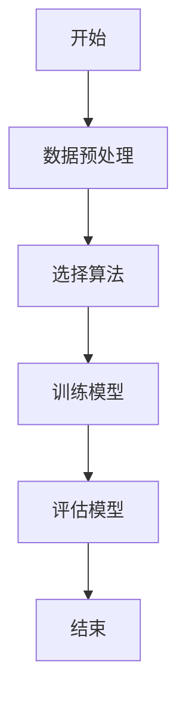
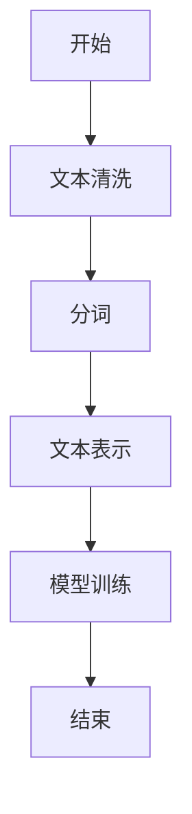
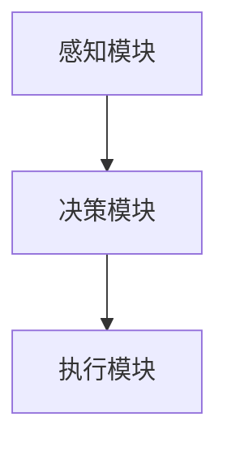
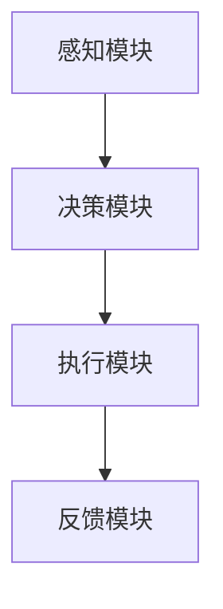

                 


# AI智能体在识别新兴市场价值机会中的作用

## 关键词
AI智能体、新兴市场、价值机会、机器学习、自然语言处理、数据挖掘

## 摘要
本文探讨了AI智能体在识别新兴市场价值机会中的作用。通过分析AI智能体的核心概念、算法原理和系统架构，结合实际案例，展示了AI智能体如何利用机器学习、自然语言处理和数据挖掘技术，帮助识别市场中的价值机会。文章详细讲解了AI智能体的工作原理，系统架构设计，以及实际应用中的项目实现和结果解读。

---

# 第一部分: AI智能体与新兴市场价值机会的背景与概念

## 第1章: AI智能体与新兴市场的概述

### 1.1 AI智能体的定义与核心概念
#### 1.1.1 AI智能体的基本定义
AI智能体（AI Agent）是一种能够感知环境、做出决策并执行操作的智能系统。它通过传感器获取信息，利用算法处理数据，并通过执行器采取行动，以实现特定目标。

#### 1.1.2 智能体的核心属性与特征
AI智能体具有以下几个核心属性：
1. **自主性**：能够自主决策和行动，无需外部干预。
2. **反应性**：能够实时感知环境并做出反应。
3. **目标导向**：具有明确的目标，并通过行动实现这些目标。
4. **学习能力**：能够通过经验改进自身的决策和行动。

#### 1.1.3 智能体与传统市场分析工具的对比
传统的市场分析工具主要依赖人工分析和经验判断，而AI智能体能够通过大数据分析和机器学习算法，快速识别市场趋势和价值机会，具有更高的效率和准确性。

---

### 1.2 新兴市场的概念与特征
#### 1.2.1 新兴市场的定义
新兴市场是指那些经济增长迅速、市场规模逐渐扩大的国家或地区，如中国、印度等。这些市场具有较大的发展潜力和不确定性。

#### 1.2.2 新兴市场的典型特征
1. **经济增长快**：新兴市场的GDP增长通常高于发达市场。
2. **市场规模大**：新兴市场的消费者数量和企业数量迅速增长。
3. **不确定性高**：新兴市场的经济和政治环境通常不稳定，具有较高的风险。

#### 1.2.3 新兴市场与传统市场的区别
传统市场通常已经成熟，竞争激烈，而新兴市场则处于快速发展阶段，具有较大的增长潜力和不确定性。

---

### 1.3 AI智能体在新兴市场中的作用
#### 1.3.1 AI智能体的核心优势
1. **高效性**：AI智能体能够快速处理大量数据，识别潜在的价值机会。
2. **准确性**：通过机器学习算法，AI智能体能够准确预测市场趋势。
3. **适应性**：AI智能体能够根据市场变化自动调整策略。

#### 1.3.2 AI智能体在价值机会识别中的应用
AI智能体可以通过分析市场数据、消费者行为和竞争环境，识别新兴市场中的价值机会。例如，AI智能体可以预测哪些行业将快速增长，哪些产品将受到消费者欢迎。

#### 1.3.3 AI智能体的边界与外延
AI智能体的应用范围包括市场分析、风险评估、投资决策等，但其能力受限于数据质量和算法性能。

---

## 第2章: AI智能体的核心概念与工作原理

### 2.1 AI智能体的结构与功能
#### 2.1.1 智能体的组成模块
AI智能体通常由以下几个模块组成：
1. **感知模块**：负责数据采集和环境感知。
2. **决策模块**：负责数据处理和策略制定。
3. **执行模块**：负责执行决策并输出结果。

#### 2.1.2 各模块的功能描述
- **感知模块**：通过传感器或数据接口获取外部环境信息。
- **决策模块**：利用算法分析数据，生成决策策略。
- **执行模块**：根据决策结果，采取相应的行动。

#### 2.1.3 模块之间的关系与协作
感知模块将数据传递给决策模块，决策模块根据数据生成决策，并通过执行模块将决策转化为行动。

---

### 2.2 AI智能体的工作原理
#### 2.2.1 数据输入与处理
AI智能体通过感知模块获取数据，如市场数据、消费者行为数据等。数据经过预处理后，输入到决策模块。

#### 2.2.2 智能体的决策机制
决策模块利用机器学习算法对数据进行分析，生成决策策略。例如，使用随机森林算法预测市场趋势。

#### 2.2.3 输出结果与反馈
决策模块将决策结果传递给执行模块，执行模块通过执行器采取行动。同时，系统会收集反馈信息，用于优化算法。

---

### 2.3 AI智能体的核心算法
#### 2.3.1 机器学习算法
- **随机森林**：用于分类和回归分析。
- **支持向量机（SVM）**：用于分类问题。

#### 2.3.2 自然语言处理算法
- **文本挖掘**：用于从文本数据中提取有用信息。
- **情感分析**：用于分析消费者对产品的看法。

#### 2.3.3 数据挖掘算法
- **聚类分析**：用于发现数据中的潜在模式。
- **关联规则挖掘**：用于发现数据中的关联规则。

---

## 第3章: AI智能体的算法原理与数学模型

### 3.1 算法原理
#### 3.1.1 机器学习算法的原理
机器学习算法通过训练数据生成模型，模型能够对新数据进行预测或分类。

#### 3.1.2 自然语言处理算法的原理
自然语言处理算法通过语言学规则和统计方法，从文本数据中提取有用信息。

#### 3.1.3 数据挖掘算法的原理
数据挖掘算法通过分析数据，发现数据中的潜在模式和关联规则。

---

### 3.2 数学模型与公式
#### 3.2.1 机器学习模型的数学表达
随机森林算法的数学表达式如下：
$$
y = \sum_{i=1}^{n} \text{Tree}_i(x)
$$

#### 3.2.2 自然语言处理模型的数学表达
文本挖掘算法通常使用TF-IDF公式计算词袋模型：
$$
\text{TF-IDF}(t, d) = \text{TF}(t, d) \times \text{IDF}(t)
$$

#### 3.2.3 数据挖掘模型的数学表达
聚类分析通常使用K-means算法：
$$
\text{距离}(x, c) = \sqrt{\sum_{i=1}^{n} (x_i - c_i)^2}
$$

---

### 3.3 算法流程图
#### 3.3.1 机器学习算法流程图


#### 3.3.2 自然语言处理算法流程图


---

## 第4章: AI智能体的系统架构与设计

### 4.1 系统架构设计
#### 4.1.1 系统组成模块
AI智能体系统通常由感知模块、决策模块和执行模块组成。

#### 4.1.2 模块之间的关系


#### 4.1.3 系统的整体架构图


---

### 4.2 系统功能设计
#### 4.2.1 数据采集与处理功能
AI智能体通过传感器或数据接口获取市场数据，如股票价格、消费者行为数据等。

#### 4.2.2 智能分析与决策功能
决策模块利用机器学习算法分析数据，生成决策策略。

#### 4.2.3 结果输出与反馈功能
执行模块根据决策结果采取行动，并将结果反馈给系统，用于优化算法。

---

### 4.3 系统接口设计
#### 4.3.1 数据接口设计
AI智能体通过API接口与外部数据源连接，获取实时数据。

#### 4.3.2 用户接口设计
用户可以通过图形界面与AI智能体交互，输入指令并查看结果。

---

## 第5章: AI智能体的项目实战

### 5.1 项目环境搭建
#### 5.1.1 安装必要的库
安装Python、机器学习库（如scikit-learn）、自然语言处理库（如NLTK）和数据挖掘库（如pandas）。

```bash
pip install scikit-learn nltk pandas
```

---

### 5.2 系统核心实现
#### 5.2.1 核心代码实现
以下是AI智能体的核心代码示例：

```python
from sklearn.ensemble import RandomForestClassifier
from sklearn.model_selection import train_test_split
import pandas as pd

# 加载数据
data = pd.read_csv('market_data.csv')

# 分割数据
X = data.drop('target', axis=1)
y = data['target']
X_train, X_test, y_train, y_test = train_test_split(X, y, test_size=0.2)

# 训练模型
model = RandomForestClassifier()
model.fit(X_train, y_train)

# 预测结果
predictions = model.predict(X_test)
print("预测结果：", predictions)
```

#### 5.2.2 代码应用解读与分析
上述代码实现了随机森林算法，用于预测市场趋势。数据预处理、模型训练和结果预测是整个流程中的关键步骤。

---

### 5.3 案例分析
#### 5.3.1 案例背景介绍
假设我们想分析新兴市场的消费电子产品市场，识别哪些产品具有较高的增长潜力。

#### 5.3.2 数据分析与解读
通过机器学习算法分析历史销售数据、消费者行为数据和市场趋势数据，识别出智能手机和智能家居设备是具有较高增长潜力的领域。

#### 5.3.3 结果解读
AI智能体预测未来三年内智能手机的市场需求将增长20%，智能家居设备的需求将增长30%。

---

## 第6章: 总结与展望

### 6.1 全文总结
本文详细探讨了AI智能体在识别新兴市场价值机会中的作用，分析了其核心概念、算法原理和系统架构，并通过实际案例展示了其应用。

### 6.2 未来展望
随着人工智能技术的不断发展，AI智能体在新兴市场中的应用将更加广泛和深入。未来的研究方向包括优化算法性能、提升系统的适应性和扩展性。

### 6.3 最佳实践 tips
1. 在使用AI智能体进行市场分析时，确保数据的准确性和完整性。
2. 定期更新模型和算法，以适应市场变化。
3. 结合人工分析和AI智能体的结果，做出更加科学的决策。

---

通过以上章节的详细讲解，读者可以全面理解AI智能体在识别新兴市场价值机会中的作用，并能够将其应用于实际的市场分析和投资决策中。

