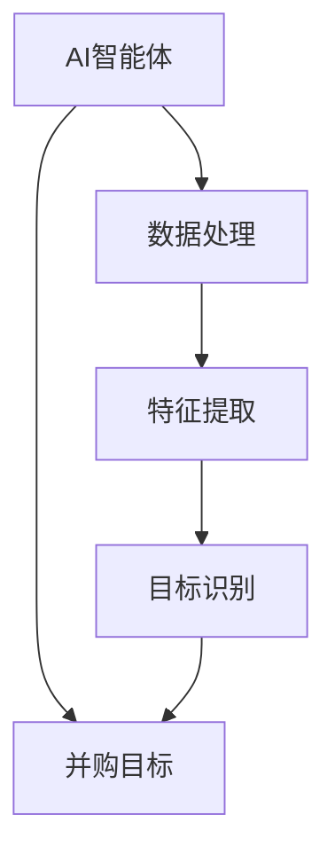
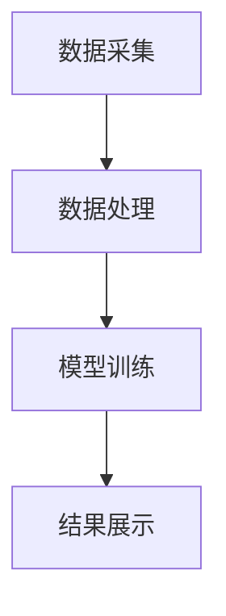
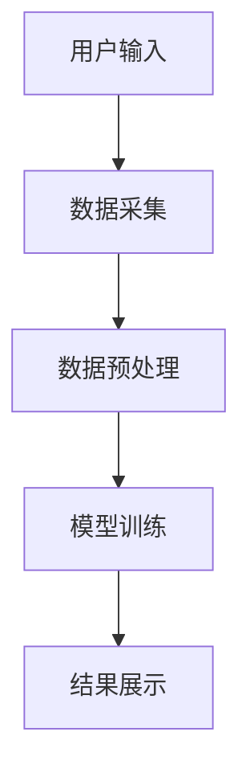

                 


# AI智能体在识别潜在并购目标中的应用

> 关键词：AI智能体，潜在并购目标，数据处理，机器学习，系统架构设计

> 摘要：本文探讨了AI智能体在识别潜在并购目标中的应用，详细分析了数据处理、算法原理、系统架构设计以及项目实战等关键环节，展示了如何利用AI技术提升并购决策的效率和准确性。

---

# 第1章: AI智能体与潜在并购目标概述

## 1.1 问题背景与目标识别
### 1.1.1 并购目标识别的背景与挑战
企业并购是企业发展的重要战略之一，然而传统的并购目标识别过程依赖于人工分析，存在效率低、成本高等问题。AI智能体的引入可以显著提高目标识别的效率和准确性。

### 1.1.2 AI智能体在并购中的应用价值
AI智能体能够通过数据分析、模式识别等技术，快速筛选出符合企业战略目标的潜在并购对象，减少人为错误，提高决策效率。

### 1.1.3 问题解决的边界与外延
本文将重点探讨AI智能体在数据驱动的并购目标识别中的应用，不涉及企业内部决策过程和法律尽职调查等后续步骤。

## 1.2 核心概念与概念结构
### 1.2.1 AI智能体的定义与特征
AI智能体是指具有感知环境、自主决策和执行任务能力的智能系统，其核心特征包括数据驱动、自我学习和适应性。

### 1.2.2 并购目标识别的核心要素
- 企业规模与财务状况
- 市场地位与竞争优势
- 技术创新与研发能力
- 法律合规性与风险评估

### 1.2.3 概念结构与核心要素关系图


## 1.3 本章小结
### 1.3.1 核心概念回顾
AI智能体通过数据处理和特征提取，帮助识别潜在并购目标，显著提升并购效率。

### 1.3.2 问题解决框架总结
本文提出了一种基于AI智能体的并购目标识别框架，涵盖了数据处理、特征提取和目标识别三个关键步骤。

---

# 第2章: 数据收集与处理

## 2.1 数据来源与预处理
### 2.1.1 并购数据的来源渠道
- 公开市场数据（如股票价格、财务报表）
- 行业研究报告
- 新闻报道与专利信息

### 2.1.2 数据清洗与特征提取
数据清洗步骤包括去除缺失值、处理异常值等。特征提取则涉及财务指标、市场表现、技术专利等多维度数据。

### 2.1.3 数据标注与格式化
将数据格式化为适合机器学习的结构，如向量化表示。

## 2.2 数据分析与特征工程
### 2.2.1 数据分析方法
- 描述性分析：识别行业趋势和市场动态
- 统计分析：挖掘数据分布特征
- 关联性分析：发现关键特征与并购目标的相关性

### 2.2.2 特征选择与优化
通过统计检验和模型评估，选择最具预测性的特征。

### 2.2.3 数据特征与并购目标的关系
通过散点图和热力图展示特征与目标之间的关系。

## 2.3 数据存储与管理
### 2.3.1 数据库设计与存储方案
采用关系型数据库存储结构化数据，非结构化数据则使用NoSQL数据库。

### 2.3.2 数据安全与隐私保护
确保数据处理过程中的隐私保护，符合GDPR等相关法规。

### 2.3.3 数据版本控制与管理
使用版本控制工具管理数据集的迭代更新。

---

# 第3章: 算法原理与数学模型

## 3.1 算法原理概述
### 3.1.1 机器学习算法选择
- 分类算法：如随机森林、支持向量机（SVM）
- 回归算法：用于预测目标的价值

### 3.1.2 深度学习模型的应用
- 神经网络模型：如卷积神经网络（CNN）和循环神经网络（RNN）
- 自然语言处理模型：用于分析文本数据

### 3.1.3 混合模型的优势与劣势
混合模型结合了机器学习和深度学习的优点，但在计算资源和模型复杂性方面存在挑战。

## 3.2 数学模型与公式推导
### 3.2.1 分类模型的数学基础
分类模型的目标函数通常包括损失函数和正则化项：
$$
L = -\sum_{i=1}^{n} y_i \log(p_i) + (1-\alpha)\lambda
$$
其中，$\alpha$ 是正则化参数，$\lambda$ 是正则化强度。

### 3.2.2 回归模型的应用
线性回归模型用于预测目标的价值：
$$
y = \beta_0 + \beta_1x_1 + \beta_2x_2 + \dots + \beta_kx_k + \epsilon
$$

### 3.2.3 聚类算法的数学表达
K-means聚类算法的损失函数：
$$
L = \sum_{i=1}^{k} \sum_{j \in C_i} (x_j - \mu_i)^2
$$
其中，$C_i$ 是第i个簇，$\mu_i$ 是簇中心。

## 3.3 算法流程与实现
### 3.3.1 数据预处理流程
1. 数据清洗
2. 特征提取
3. 数据标准化

### 3.3.2 模型训练与优化
- 划分训练集和测试集
- 调参与交叉验证
- 模型评估与优化

### 3.3.3 模型评估与调优
使用准确率、召回率和F1分数评估模型性能。

---

# 第4章: 系统架构与设计

## 4.1 系统功能设计
### 4.1.1 系统功能模块划分
- 数据采集模块
- 数据处理模块
- 模型训练模块
- 结果展示模块

### 4.1.2 模块之间的交互关系


### 4.1.3 系统功能流程图


## 4.2 系统架构设计
### 4.2.1 分层架构设计
- 表现层：用户界面
- 业务逻辑层：处理用户请求
- 数据访问层：与数据库交互

### 4.2.2 微服务架构实现
采用微服务架构，提高系统的扩展性和可维护性。

### 4.2.3 系统扩展性与可维护性
通过模块化设计和容器化部署，确保系统的可扩展性和可维护性。

## 4.3 系统接口设计
### 4.3.1 API接口定义
- RESTful API设计
- 接口文档编写

### 4.3.2 接口调用流程
1. 用户发起请求
2. 系统处理请求
3. 返回响应结果

### 4.3.3 接口安全与权限控制
使用JWT进行身份验证和权限控制。

---

# 第5章: 项目实战与案例分析

## 5.1 项目环境搭建
### 5.1.1 开发环境安装与配置
- 安装Python和相关库（如TensorFlow、Pandas）
- 配置开发环境（如Jupyter Notebook）

## 5.2 系统核心实现源代码
### 5.2.1 数据处理代码
```python
import pandas as pd
data = pd.read_csv('并购数据.csv')
```

### 5.2.2 模型训练代码
```python
from sklearn.ensemble import RandomForestClassifier
model = RandomForestClassifier()
model.fit(X_train, y_train)
```

### 5.2.3 结果展示代码
```python
from sklearn.metrics import accuracy_score
print("准确率：", accuracy_score(y_test, model.predict(X_test)))
```

## 5.3 实际案例分析
### 5.3.1 案例背景介绍
分析一家科技公司的潜在并购目标。

### 5.3.2 数据分析与特征提取
识别关键特征，如技术专利数量和市场占有率。

### 5.3.3 模型训练与结果展示
训练模型并展示结果，如准确率和召回率。

## 5.4 项目小结
### 5.4.1 核心实现总结
详细说明系统实现的关键步骤和遇到的问题。

### 5.4.2 项目经验与注意事项
分享项目实施中的经验教训和注意事项。

---

# 第6章: 最佳实践与未来展望

## 6.1 最佳实践
### 6.1.1 数据质量管理
确保数据的准确性和完整性。

### 6.1.2 模型调优
通过交叉验证和网格搜索优化模型性能。

## 6.2 未来展望
### 6.2.1 新兴技术的影响
如生成式AI和大语言模型的应用。

### 6.2.2 未来研究方向
探索多模态数据驱动的并购目标识别方法。

---

# 结语

AI智能体在识别潜在并购目标中的应用为企业的并购决策提供了强有力的支持。通过数据处理、算法优化和系统设计的综合应用，企业可以更高效、更准确地识别并购目标，提升整体竞争力。

--- 

# Tips

- **注意事项**：在实际应用中，需注意数据隐私和合规性问题。
- **小结**：本文系统地介绍了AI智能体在并购目标识别中的应用，从数据处理到系统设计，再到项目实战，为读者提供了全面的指导。
- **拓展阅读**：建议深入学习机器学习和深度学习的相关知识，以更好地理解模型优化和系统设计的细节。

