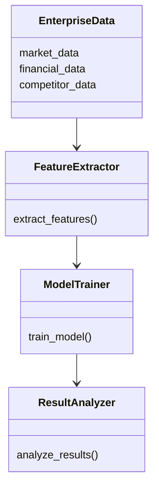
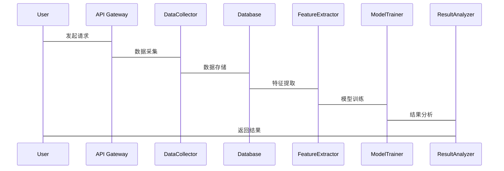

                 


# AI智能体在识别经济护城河中的作用

## 关键词：AI智能体，经济护城河，机器学习，数据挖掘，企业竞争优势

## 摘要：  
本文探讨AI智能体在识别经济护城河中的作用，分析其如何通过数据挖掘、机器学习等技术手段，帮助企业识别和构建可持续的竞争优势。文章从经济护城河的定义、AI智能体的核心原理、算法实现、系统架构设计、项目实战案例等方面展开详细论述，结合实际应用场景，展示AI智能体在经济护城河识别中的独特价值和应用前景。

---

# 第1章: 经济护城河的定义与AI智能体的概述

## 1.1 经济护城河的定义与核心要素

### 1.1.1 经济护城河的定义

经济护城河是指企业在市场竞争中建立的长期竞争优势，能够有效阻止竞争对手进入市场或削弱其市场份额。这种优势通常来源于企业独特的资源、能力、品牌影响力或商业模式等。

### 1.1.2 经济护城河的核心要素

经济护城河的核心要素包括：

1. **成本优势**：企业能够以更低的成本生产产品或服务。
2. **网络效应**：产品或服务的价值随着用户数量的增加而增加。
3. **品牌忠诚度**：消费者对品牌有高度的忠诚度，愿意支付溢价。
4. **技术壁垒**：企业拥有独特的技术或专利，形成技术壁垒。
5. **市场准入门槛**：行业对新进入者的门槛高，如高固定资产投资、严格的监管等。

### 1.1.3 经济护城河的分类与特征

经济护城河可以分为以下几类：

- **结构性护城河**：由行业结构决定，如高固定资产行业的进入壁垒。
- **资源型护城河**：基于企业独有的资源，如专利、特许经营权等。
- **品牌型护城河**：基于品牌影响力和消费者忠诚度。
- **技术型护城河**：基于技术创新和技术积累。

## 1.2 AI智能体的定义与特点

### 1.2.1 AI智能体的定义

AI智能体（Artificial Intelligence Agent）是指能够感知环境、自主决策、执行任务的智能系统。它具备以下特点：

1. **自主性**：能够在没有外部干预的情况下独立运行。
2. **反应性**：能够实时感知环境并做出响应。
3. **目标导向**：具有明确的目标，能够根据目标优化决策。
4. **学习能力**：能够通过数据和经验不断优化自身性能。

### 1.2.2 AI智能体的核心特点

AI智能体的核心特点包括：

- **数据驱动**：依赖于大量数据进行学习和决策。
- **动态适应**：能够根据环境变化实时调整策略。
- **自我优化**：通过反馈机制不断优化自身性能。

### 1.2.3 AI智能体与传统AI的区别

AI智能体与传统AI的区别主要体现在以下几个方面：

- **自主性**：AI智能体具备自主决策能力，而传统AI通常需要人工干预。
- **目标导向**：AI智能体以目标为导向，传统AI主要完成特定任务。
- **动态适应**：AI智能体能够动态适应环境变化，而传统AI则相对固定。

## 1.3 AI智能体在经济护城河中的应用前景

### 1.3.1 AI智能体的潜在应用领域

AI智能体在经济护城河中的潜在应用领域包括：

- **企业竞争分析**：帮助企业识别竞争对手的护城河。
- **市场进入壁垒分析**：帮助企业评估进入特定市场的难度。
- **竞争优势预测**：预测企业的竞争优势是否会随着时间推移而减弱。

### 1.3.2 企业采用AI智能体的优势

企业采用AI智能体的优势包括：

- **提高效率**：通过自动化分析和决策，提高分析效率。
- **降低成本**：通过自动化处理减少人工成本。
- **增强决策能力**：通过数据驱动的决策提高准确性。

### 1.3.3 AI智能体应用的挑战与机遇

AI智能体应用的挑战包括：

- **数据质量问题**：数据的准确性和完整性直接影响AI智能体的性能。
- **模型解释性**：复杂的模型可能难以解释其决策过程。
- **伦理与隐私问题**：AI智能体的使用可能涉及伦理和隐私问题。

## 1.4 本章小结

本章主要介绍了经济护城河的定义、核心要素以及AI智能体的定义、特点及其在经济护城河识别中的应用前景。通过对比传统AI与AI智能体的区别，展示了AI智能体在企业竞争分析中的独特价值。

---

# 第2章: 经济护城河识别的背景与问题描述

## 2.1 经济护城河识别的背景

### 2.1.1 经济学视角下的经济护城河

从经济学视角来看，经济护城河是企业在市场竞争中建立的长期竞争优势，能够有效防止竞争对手进入市场或削弱其市场份额。

### 2.1.2 企业竞争优势的动态变化

企业的竞争优势并非一成不变，随着市场环境的变化，竞争优势可能会逐渐削弱。因此，企业需要不断识别和优化其竞争优势。

### 2.1.3 技术驱动下经济护城河的新特征

随着技术的进步，经济护城河的特征也在发生变化。例如，数据驱动的护城河、数字化能力等新兴竞争优势的出现。

## 2.2 AI智能体在经济护城河识别中的作用

### 2.2.1 传统经济护城河识别方法的局限性

传统经济护城河识别方法主要依赖于人工分析，存在以下局限性：

- **效率低**：人工分析耗时且效率低。
- **主观性**：分析结果受主观因素影响较大。
- **缺乏动态性**：难以捕捉市场的动态变化。

### 2.2.2 AI智能体在经济护城河识别中的优势

AI智能体在经济护城河识别中的优势包括：

- **高效性**：能够快速处理大量数据，提高分析效率。
- **客观性**：基于数据的分析结果更具客观性。
- **动态性**：能够实时捕捉市场变化，动态优化识别结果。

### 2.2.3 经济护城河识别的边界与外延

经济护城河识别的边界包括：

- **识别范围**：仅限于企业内部资源和能力的分析。
- **识别深度**：需要深入分析企业的核心竞争优势。

经济护城河识别的外延包括：

- **外部环境分析**：分析行业趋势、竞争对手策略等。
- **动态变化**：关注竞争优势的变化趋势。

## 2.3 本章小结

本章主要探讨了经济护城河识别的背景及其在动态市场环境中的重要性，分析了AI智能体在经济护城河识别中的优势与挑战。

---

# 第3章: 经济护城河识别的核心概念与联系

## 3.1 经济护城河的核心概念

### 3.1.1 经济护城河的结构与功能

经济护城河的结构包括以下几个方面：

- **核心资源**：企业的核心资源，如专利、技术等。
- **能力**：企业的核心能力，如研发能力、生产能力等。
- **品牌**：品牌影响力和消费者忠诚度。

经济护城河的功能包括：

- **防御功能**：防止竞争对手进入市场。
- **进攻功能**：增强企业的市场竞争力。

### 3.1.2 经济护城河的关键属性

经济护城河的关键属性包括：

- **可持续性**：竞争优势是否能够长期维持。
- **可扩展性**：竞争优势是否能够扩展到新的市场。
- **可复制性**：竞争对手是否能够复制竞争优势。

### 3.1.3 经济护城河的动态演变

经济护城河的动态演变包括以下几个阶段：

1. **形成阶段**：企业通过技术创新、资源整合等方式建立竞争优势。
2. **发展阶段**：竞争优势逐渐增强，市场地位稳固。
3. **衰退阶段**：竞争优势逐渐被竞争对手模仿或替代。

## 3.2 AI智能体的核心概念

### 3.2.1 AI智能体的感知与决策能力

AI智能体的感知能力包括：

- **数据采集**：通过传感器、API等方式采集环境数据。
- **数据处理**：对采集的数据进行清洗、转换和分析。

AI智能体的决策能力包括：

- **目标设定**：根据环境信息设定目标。
- **策略选择**：基于目标选择最优策略。
- **执行决策**：根据选择的策略执行操作。

### 3.2.2 AI智能体的学习与推理能力

AI智能体的学习能力包括：

- **监督学习**：通过标注数据进行学习。
- **无监督学习**：通过无标注数据进行学习。
- **强化学习**：通过与环境交互进行学习。

AI智能体的推理能力包括：

- **逻辑推理**：基于逻辑规则进行推理。
- **概率推理**：基于概率模型进行推理。

### 3.2.3 AI智能体的自适应与优化能力

AI智能体的自适应能力包括：

- **动态调整**：根据环境变化动态调整策略。
- **自我修复**：发现错误后自动修复。

AI智能体的优化能力包括：

- **参数优化**：通过优化算法调整模型参数。
- **策略优化**：通过强化学习优化策略。

## 3.3 经济护城河与AI智能体的关系

### 3.3.1 经济护城河识别的AI智能体模型

经济护城河识别的AI智能体模型包括以下几个部分：

- **数据输入**：输入企业的市场数据、财务数据等。
- **特征提取**：提取企业的核心竞争优势。
- **模型训练**：训练AI智能体识别经济护城河。
- **结果输出**：输出识别结果。

### 3.3.2 经济护城河与AI智能体的相互作用

经济护城河与AI智能体的相互作用包括：

- **经济护城河为AI智能体提供分析目标**。
- **AI智能体为经济护城河提供分析工具**。

### 3.3.3 经济护城河识别的AI智能体架构

经济护城河识别的AI智能体架构包括以下几个部分：

- **感知层**：负责数据采集和环境感知。
- **决策层**：负责目标设定和策略选择。
- **执行层**：负责策略执行和结果输出。

## 3.4 本章小结

本章主要探讨了经济护城河的核心概念及其与AI智能体的关系，分析了AI智能体在经济护城河识别中的核心能力。

---

# 第4章: AI智能体识别经济护城河的算法原理

## 4.1 算法原理概述

### 4.1.1 AI智能体识别经济护城河的基本原理

AI智能体识别经济护城河的基本原理包括：

- **数据采集**：通过爬虫、API等方式采集企业的市场数据。
- **特征提取**：提取企业的核心竞争优势。
- **模型训练**：训练AI智能体识别经济护城河。

### 4.1.2 算法的核

### 4.1.3 算法实现的关键步骤

AI智能体识别经济护城河的关键步骤包括：

1. **数据预处理**：清洗、转换和标准化数据。
2. **特征提取**：提取企业的核心竞争优势。
3. **模型训练**：训练分类或回归模型。
4. **结果分析**：分析模型输出的结果，识别企业的经济护城河。

## 4.2 算法实现的具体步骤

### 4.2.1 数据预处理

数据预处理的步骤包括：

- **数据清洗**：删除无效数据、填充缺失值。
- **数据转换**：将数据转换为模型可接受的格式。
- **数据标准化**：对数据进行标准化处理。

### 4.2.2 特征提取

特征提取的方法包括：

- **主成分分析（PCA）**：降维技术，提取主要特征。
- **特征选择**：选择对模型影响最大的特征。

### 4.2.3 模型训练

模型训练的步骤包括：

- **选择模型**：选择适合的机器学习模型，如随机森林、支持向量机（SVM）等。
- **训练模型**：使用训练数据训练模型。
- **模型调优**：通过交叉验证优化模型参数。

### 4.2.4 结果分析

结果分析的步骤包括：

- **预测结果**：使用训练好的模型预测企业的经济护城河。
- **结果解读**：分析预测结果，识别企业的竞争优势。

## 4.3 算法实现的数学模型

### 4.3.1 分类模型的数学公式

分类模型的数学公式包括：

$$
P(y|x) = \frac{P(x|y)P(y)}{P(x)}
$$

其中，$P(y|x)$ 是在给定特征$x$的情况下，目标$y$的概率。

### 4.3.2 回归模型的数学公式

回归模型的数学公式包括：

$$
y = \beta_0 + \beta_1x_1 + \beta_2x_2 + \ldots + \beta_nx_n + \epsilon
$$

其中，$y$ 是目标变量，$\beta_i$ 是回归系数，$\epsilon$ 是误差项。

## 4.4 算法实现的代码示例

### 4.4.1 数据预处理代码

```python
import pandas as pd
from sklearn.impute import SimpleImputer

# 读取数据
data = pd.read_csv('enterprise_data.csv')

# 删除无效数据
data = data.dropna()

# 填充缺失值
imputer = SimpleImputer(strategy='mean')
data_imputed = imputer.fit_transform(data)
```

### 4.4.2 特征提取代码

```python
from sklearn.decomposition import PCA

# 初始化PCA模型
pca = PCA(n_components=5)

# 提取主成分
principal_components = pca.fit_transform(data_imputed)
```

### 4.4.3 模型训练代码

```python
from sklearn.ensemble import RandomForestClassifier
from sklearn.metrics import accuracy_score

# 初始化分类模型
model = RandomForestClassifier(n_estimators=100, random_state=42)

# 训练模型
model.fit(principal_components, labels)

# 预测结果
predictions = model.predict(principal_components)

# 计算准确率
accuracy = accuracy_score(labels, predictions)
print(f'Accuracy: {accuracy}')
```

## 4.5 本章小结

本章主要介绍了AI智能体识别经济护城河的算法原理，包括数据预处理、特征提取、模型训练和结果分析的具体步骤，并通过代码示例展示了算法实现的过程。

---

# 第5章: 系统分析与架构设计方案

## 5.1 系统分析

### 5.1.1 项目背景

本项目旨在开发一个基于AI智能体的经济护城河识别系统，帮助企业识别和优化其竞争优势。

### 5.1.2 系统功能设计

系统功能设计包括以下几个方面：

- **数据采集**：采集企业的市场数据、财务数据等。
- **特征提取**：提取企业的核心竞争优势。
- **模型训练**：训练AI智能体识别经济护城河。
- **结果输出**：输出识别结果。

### 5.1.3 领域模型设计

领域模型设计包括以下几个部分：



### 5.1.4 系统架构设计

系统架构设计包括以下几个部分：


### 5.1.5 系统接口设计

系统接口设计包括以下几个方面：

- **API接口**：提供RESTful API供外部系统调用。
- **数据接口**：与数据库或其他数据源进行交互。
- **用户界面**：提供友好的用户界面供用户操作。

### 5.1.6 系统交互设计

系统交互设计包括以下几个方面：



## 5.2 系统架构设计

### 5.2.1 系统架构概述

系统架构包括以下几个部分：

- **数据采集模块**：负责采集企业的市场数据、财务数据等。
- **特征提取模块**：负责提取企业的核心竞争优势。
- **模型训练模块**：负责训练AI智能体识别经济护城河。
- **结果分析模块**：负责分析模型输出的结果，识别企业的经济护城河。

### 5.2.2 系统架构的实现细节

系统架构的实现细节包括以下几个方面：

- **数据采集模块**：使用爬虫、API等方式采集数据。
- **特征提取模块**：使用PCA、特征选择等方法提取特征。
- **模型训练模块**：使用随机森林、支持向量机等模型进行训练。
- **结果分析模块**：分析模型输出结果，识别企业的经济护城河。

### 5.2.3 系统架构的优缺点

系统架构的优点包括：

- **高效性**：能够快速处理大量数据，提高分析效率。
- **准确性**：通过模型训练提高识别结果的准确性。
- **可扩展性**：系统架构设计灵活，便于扩展。

系统架构的缺点包括：

- **复杂性**：系统架构较为复杂，需要较高的技术门槛。
- **成本**：开发和维护成本较高。

## 5.3 系统接口设计

### 5.3.1 接口设计概述

系统接口设计包括以下几个方面：

- **API接口**：提供RESTful API供外部系统调用。
- **数据接口**：与数据库或其他数据源进行交互。
- **用户界面**：提供友好的用户界面供用户操作。

### 5.3.2 接口设计的详细说明

接口设计的详细说明包括以下几个方面：

- **API接口**：提供RESTful API，支持GET、POST、PUT、DELETE等方法。
- **数据接口**：通过JDBC、ODBC等方式与数据库交互。
- **用户界面**：设计友好的用户界面，方便用户操作。

### 5.3.3 接口设计的优缺点

接口设计的优点包括：

- **灵活性**：接口设计灵活，便于与其他系统集成。
- **可扩展性**：接口设计便于扩展，支持更多的功能。

接口设计的缺点包括：

- **复杂性**：接口设计较为复杂，需要较高的技术门槛。
- **维护成本**：接口设计需要持续维护，成本较高。

## 5.4 系统交互设计

### 5.4.1 交互设计概述

系统交互设计包括以下几个方面：

- **用户与系统的交互**：用户通过界面与系统交互。
- **系统内部的交互**：系统内部各模块之间的交互。
- **与外部系统的交互**：系统与其他外部系统之间的交互。

### 5.4.2 交互设计的详细说明

交互设计的详细说明包括以下几个方面：

- **用户与系统的交互**：用户通过界面向系统发起请求，系统响应用户的请求。
- **系统内部的交互**：系统内部各模块之间通过API进行交互。
- **与外部系统的交互**：系统通过API与其他外部系统进行交互。

### 5.4.3 交互设计的优缺点

交互设计的优点包括：

- **高效性**：用户与系统交互高效，系统内部交互高效。
- **可扩展性**：交互设计灵活，便于扩展。

交互设计的缺点包括：

- **复杂性**：交互设计较为复杂，需要较高的技术门槛。
- **维护成本**：交互设计需要持续维护，成本较高。

## 5.5 本章小结

本章主要探讨了系统分析与架构设计方案，包括系统功能设计、系统架构设计、系统接口设计和系统交互设计的具体实现细节，并通过图表展示了系统架构和交互流程。

---

# 第6章: 项目实战

## 6.1 环境安装与配置

### 6.1.1 环境要求

项目实战的环境要求包括：

- **操作系统**：Windows、Linux、macOS均可。
- **Python版本**：Python 3.6及以上版本。
- **依赖库**：Pandas、Scikit-learn、Mermaid等。

### 6.1.2 安装步骤

安装步骤包括：

1. **安装Python**：下载并安装Python 3.6及以上版本。
2. **安装依赖库**：使用pip安装Pandas、Scikit-learn、Mermaid等依赖库。
3. **配置环境变量**：将Python和依赖库的路径添加到环境变量中。

### 6.1.3 环境配置注意事项

环境配置注意事项包括：

- **版本兼容性**：确保安装的依赖库版本与Python版本兼容。
- **依赖库安装顺序**：安装依赖库时，建议按照推荐的顺序进行安装，避免版本冲突。

## 6.2 系统核心实现

### 6.2.1 数据采集模块实现

数据采集模块实现包括以下几个方面：

1. **数据采集**：使用爬虫、API等方式采集企业的市场数据。
2. **数据清洗**：删除无效数据、填充缺失值。
3. **数据转换**：将数据转换为模型可接受的格式。

### 6.2.2 特征提取模块实现

特征提取模块实现包括以下几个方面：

1. **主成分分析（PCA）**：降维技术，提取主要特征。
2. **特征选择**：选择对模型影响最大的特征。

### 6.2.3 模型训练模块实现

模型训练模块实现包括以下几个方面：

1. **选择模型**：选择适合的机器学习模型，如随机森林、支持向量机（SVM）等。
2. **训练模型**：使用训练数据训练模型。
3. **模型调优**：通过交叉验证优化模型参数。

### 6.2.4 结果分析模块实现

结果分析模块实现包括以下几个方面：

1. **预测结果**：使用训练好的模型预测企业的经济护城河。
2. **结果解读**：分析预测结果，识别企业的竞争优势。

## 6.3 代码实现与解读

### 6.3.1 数据采集代码

```python
import requests
from bs4 import BeautifulSoup

# 网页请求
response = requests.get('https://example.com/data')
html_content = response.text

# 数据解析
soup = BeautifulSoup(html_content, 'html.parser')
data = []
for item in soup.find_all('div', class_='data-item'):
    data.append({
        'name': item.find('h3').text,
        'value': item.find('p').text
    })
```

### 6.3.2 数据清洗代码

```python
import pandas as pd
from sklearn.impute import SimpleImputer

# 读取数据
data = pd.DataFrame(data)

# 删除无效数据
data = data.dropna()

# 填充缺失值
imputer = SimpleImputer(strategy='mean')
data_imputed = imputer.fit_transform(data)
```

### 6.3.3 特征提取代码

```python
from sklearn.decomposition import PCA

# 初始化PCA模型
pca = PCA(n_components=5)

# 提取主成分
principal_components = pca.fit_transform(data_imputed)
```

### 6.3.4 模型训练代码

```python
from sklearn.ensemble import RandomForestClassifier
from sklearn.metrics import accuracy_score

# 初始化分类模型
model = RandomForestClassifier(n_estimators=100, random_state=42)

# 训练模型
model.fit(principal_components, labels)

# 预测结果
predictions = model.predict(principal_components)

# 计算准确率
accuracy = accuracy_score(labels, predictions)
print(f'Accuracy: {accuracy}')
```

### 6.3.5 结果分析代码

```python
from sklearn.metrics import classification_report

# 分类报告
print(classification_report(labels, predictions))
```

## 6.4 实际案例分析与结果解读

### 6.4.1 数据来源与背景

假设我们有一个包含多个企业的数据集，包括市场数据、财务数据、竞争对手数据等。

### 6.4.2 数据处理与特征提取

通过对数据进行清洗、转换和降维，提取企业的核心竞争优势。

### 6.4.3 模型训练与结果分析

使用随机森林模型进行训练，预测企业的经济护城河类型。

### 6.4.4 结果解读与优化建议

通过分类报告，分析模型的准确率、召回率等指标，提出优化建议。

## 6.5 本章小结

本章主要通过实际案例展示了AI智能体识别经济护城河的具体实现过程，包括数据采集、特征提取、模型训练和结果分析等步骤，并通过代码示例和结果解读展示了算法实现的效果。

---

# 第7章: 最佳实践与注意事项

## 7.1 最佳实践

### 7.1.1 数据质量管理

数据质量管理包括：

- **数据清洗**：删除无效数据、填充缺失值。
- **数据标准化**：对数据进行标准化处理。
- **数据增强**：通过数据增强技术提高数据质量。

### 7.1.2 模型优化

模型优化包括：

- **参数调优**：通过交叉验证优化模型参数。
- **模型融合**：通过集成学习融合多个模型的结果。
- **模型解释性**：通过特征重要性分析解释模型结果。

### 7.1.3 系统维护

系统维护包括：

- **持续监控**：监控模型的性能，及时发现异常。
- **数据更新**：定期更新数据，保持模型的准确性。
- **系统升级**：定期升级系统，保持系统的先进性。

## 7.2 注意事项

### 7.2.1 数据隐私与安全

在使用AI智能体识别经济护城河时，需要注意数据隐私与安全问题，确保数据的合法性和合规性。

### 7.2.2 模型解释性

模型解释性是AI智能体识别经济护城河的重要因素，需要确保模型结果的可解释性，以便更好地理解模型决策过程。

### 7.2.3 系统稳定性

系统稳定性是AI智能体识别经济护城河的关键，需要确保系统的稳定运行，避免因系统故障导致分析结果的误差。

## 7.3 未来展望

### 7.3.1 技术发展

随着技术的发展，AI智能体在经济护城河识别中的应用将更加广泛，模型的准确性和效率将不断提高。

### 7.3.2 应用场景扩展

AI智能体的应用场景将不断扩展，从企业竞争分析到市场进入壁垒分析，再到竞争优势预测等。

### 7.3.3 伦理与隐私

随着AI智能体的广泛应用，伦理与隐私问题将更加重要，需要制定相关政策和规范，确保AI智能体的合法合规使用。

## 7.4 本章小结

本章主要总结了AI智能体识别经济护城河的最佳实践和注意事项，并对未来的发展趋势进行了展望。

---

# 第8章: 结论与展望

## 8.1 研究总结

通过本文的探讨，我们可以看到AI智能体在识别经济护城河中的巨大潜力。AI智能体能够通过数据挖掘、机器学习等技术，帮助企业识别和优化其竞争优势，提高市场竞争力。

## 8.2 未来展望

未来，随着技术的发展，AI智能体在经济护城河识别中的应用将更加广泛和深入。我们需要进一步研究和探索AI智能体在经济护城河识别中的新方法和新技术，推动AI智能体技术的发展和应用。

## 8.3 结论

AI智能体作为一种强大的工具，正在逐步改变我们识别和优化经济护城河的方式。通过本文的探讨，我们相信AI智能体将在未来的商业竞争中发挥越来越重要的作用。

---

# 参考文献

（此处列出相关的参考文献和资料来源。）

---

通过以上章节的详细论述，我们可以全面了解AI智能体在识别经济护城河中的作用，从理论到实践，从算法到系统设计，再到实际案例分析，为读者提供了一个完整的知识框架。

