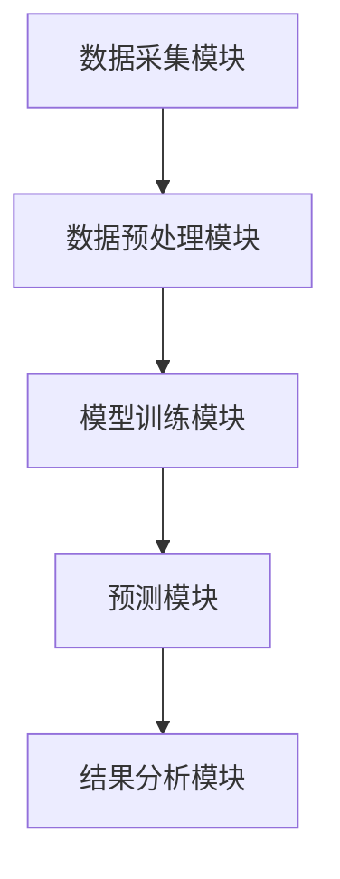
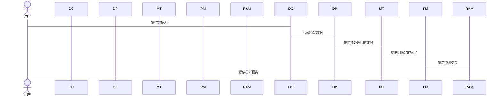

                 


# AI智能体在识别长期增长潜力中的应用

## 关键词：AI智能体，长期增长潜力，算法原理，系统架构，项目实战

## 摘要：  
本文系统地探讨了AI智能体在识别长期增长潜力中的应用，从理论基础到实际应用进行全面分析。通过介绍AI智能体的核心概念、算法原理、系统架构设计、项目实战以及最佳实践，帮助读者深入了解如何利用AI技术预测和优化长期增长潜力。

---

# 第一部分: AI智能体与长期增长潜力的背景与概念

## 第1章: AI智能体与长期增长潜力概述

### 1.1 AI智能体的基本概念
#### 1.1.1 什么是AI智能体
AI智能体（Artificial Intelligence Agent）是一种能够感知环境、做出决策并采取行动的智能系统。它具备以下核心特征：
- **自主性**：无需外部干预，自主完成任务。
- **反应性**：能够实时感知环境并做出反应。
- **目标导向**：基于目标驱动行为。
- **学习能力**：通过数据和经验不断优化性能。

#### 1.1.2 AI智能体的核心特征
- **感知能力**：通过传感器、数据输入等方式获取环境信息。
- **决策能力**：基于感知信息，利用算法做出最优决策。
- **执行能力**：通过执行机构将决策转化为实际操作。

#### 1.1.3 AI智能体的应用场景
- **金融投资**：用于股票、基金等金融产品的预测与交易。
- **商业分析**：帮助企业预测市场趋势和优化运营。
- **智能推荐**：在电商、媒体等领域提供个性化推荐服务。

### 1.2 长期增长潜力的定义
#### 1.2.1 什么是长期增长潜力
长期增长潜力是指某个实体（如企业、资产、项目等）在未来一段时间内持续增长的可能性。它通常与市场环境、竞争优势、资源储备等因素相关。

#### 1.2.2 长期增长潜力的评估标准
- **市场规模**：目标市场的容量和增长空间。
- **竞争优势**：产品或服务的独特性和竞争力。
- **财务健康**：企业的盈利能力、现金流和资产负债状况。
- **创新能力**：持续创新的能力和意愿。

#### 1.2.3 长期增长潜力的计算方法
长期增长潜力的计算通常涉及多维度的指标，可以通过以下步骤进行：
1. **数据收集**：收集相关的历史数据和市场信息。
2. **指标分析**：对各维度指标进行量化分析。
3. **模型构建**：使用回归分析、时间序列分析等方法建立预测模型。
4. **结果解读**：根据模型输出结果评估增长潜力。

### 1.3 AI智能体在识别长期增长潜力中的作用
#### 1.3.1 AI智能体如何帮助识别增长潜力
AI智能体通过以下方式帮助识别长期增长潜力：
- **数据挖掘**：从大量数据中提取潜在的模式和趋势。
- **预测建模**：利用机器学习算法预测未来的增长趋势。
- **实时监控**：持续跟踪市场变化，及时调整预测结果。

#### 1.3.2 AI智能体的优势与局限性
- **优势**：
  - 高效性：能够快速处理大量数据。
  - 精准性：通过复杂算法提高预测的准确性。
  - 实时性：能够实时更新预测结果。
- **局限性**：
  - 数据依赖性：预测结果高度依赖数据质量和数量。
  - 黑箱问题：部分算法的决策过程难以解释。
  - 环境适应性：需要根据具体场景进行定制化调整。

#### 1.3.3 AI智能体在不同领域的应用案例
- **金融领域**：用于股票价格预测和投资组合优化。
- **商业领域**：帮助企业预测销售趋势和优化供应链。
- **科技领域**：用于技术路线图制定和研发投入优化。

---

## 第2章: AI智能体的核心概念与联系

### 2.1 AI智能体的核心原理
#### 2.1.1 AI智能体的感知机制
AI智能体通过传感器或数据输入接口获取环境信息，常见的感知方式包括：
- **视觉感知**：通过摄像头或图像识别技术获取视觉信息。
- **听觉感知**：通过麦克风或语音识别技术获取音频信息。
- **触觉感知**：通过触摸传感器获取物理触感信息。

#### 2.1.2 AI智能体的决策机制
AI智能体的决策机制通常基于以下步骤：
1. **状态识别**：分析当前环境状态。
2. **目标设定**：明确决策目标。
3. **策略选择**：根据当前状态和目标选择最优策略。
4. **行动执行**：将决策转化为具体行动。

#### 2.1.3 AI智能体的学习机制
AI智能体通过学习算法不断优化自身的感知和决策能力，常见的学习方式包括：
- **监督学习**：通过标注数据进行训练。
- **无监督学习**：通过非标注数据发现隐藏模式。
- **强化学习**：通过试错机制获得最大化的累积奖励。

### 2.2 AI智能体与长期增长潜力的关系
#### 2.2.1 AI智能体如何影响长期增长潜力
AI智能体通过以下方式影响长期增长潜力：
- **数据驱动决策**：利用AI智能体分析数据，帮助做出更科学的决策。
- **预测与优化**：通过预测模型优化资源配置，提高增长潜力。
- **实时监控与调整**：实时跟踪增长潜力的变化，及时调整策略。

#### 2.2.2 长期增长潜力对AI智能体的反馈作用
长期增长潜力的实现过程为AI智能体提供了大量反馈数据，这些数据可以进一步优化AI智能体的算法和模型。

#### 2.2.3 AI智能体与长期增长潜力的协同进化
AI智能体与长期增长潜力之间存在协同进化关系，即AI智能体通过优化增长潜力，反过来增长潜力的实现也为AI智能体提供了更丰富的数据和场景。

### 2.3 核心概念对比表格
| 概念 | 描述 |
|------|------|
| AI智能体 | 具备感知、决策和执行能力的智能系统 |
| 长期增长潜力 | 未来一段时间内持续增长的可能性 |
| 两者关系 | AI智能体用于识别和预测长期增长潜力 |

### 2.4 ER实体关系图
```mermaid
er
actor(AI智能体) -|> entity(长期增长潜力)
```

---

## 第3章: AI智能体识别长期增长潜力的算法原理

### 3.1 算法原理概述
#### 3.1.1 强化学习算法
强化学习是一种通过试错机制学习策略的算法，广泛应用于游戏、机器人控制等领域。其核心是通过最大化累积奖励来优化决策策略。

#### 3.1.2 监督学习算法
监督学习是一种基于标注数据进行学习的算法，常用于分类和回归问题。例如，可以通过监督学习算法预测股票价格的涨跌。

#### 3.1.3 无监督学习算法
无监督学习是一种基于非标注数据进行学习的算法，常用于聚类和降维问题。例如，可以通过无监督学习算法发现市场中的潜在客户群体。

### 3.2 强化学习算法的详细讲解
#### 3.2.1 强化学习的基本原理
强化学习的核心是通过试错机制找到最优策略。智能体通过与环境交互，获得奖励信号，并根据奖励信号调整行为以最大化累积奖励。

#### 3.2.2 Q-learning算法的数学模型
Q-learning是一种常见的强化学习算法，其数学模型如下：
$$ Q(s, a) = r + \gamma \max_{a'} Q(s', a') $$
其中：
- $Q(s, a)$ 表示在状态 $s$ 下采取动作 $a$ 的价值。
- $r$ 表示当前动作获得的奖励。
- $\gamma$ 表示折扣因子。
- $s'$ 表示下一步的状态。
- $a'$ 表示下一步的动作。

#### 3.2.3 Q-learning算法的实现步骤
1. 初始化Q值表，通常为全零。
2. 进入循环：
   - 选择当前状态下的动作（探索与利用策略）。
   - 执行动作，观察下一个状态和获得的奖励。
   - 更新Q值表：
     $$ Q(s, a) = Q(s, a) + \alpha (r + \gamma \max Q(s', a') - Q(s, a)) $$
     其中，$\alpha$ 表示学习率。
3. 重复步骤2，直到满足终止条件。

#### 3.2.4 Q-learning算法的优缺点
- **优点**：
  - 简单易实现。
  - 能够处理离散动作空间。
- **缺点**：
  - 无法处理连续动作空间。
  - 收敛速度较慢。

### 3.3 监督学习算法的详细讲解
#### 3.3.1 线性回归算法
线性回归是一种简单但强大的监督学习算法，适用于回归问题。其数学模型如下：
$$ y = \beta_0 + \beta_1 x + \epsilon $$
其中：
- $y$ 表示目标变量。
- $x$ 表示自变量。
- $\beta_0$ 和 $\beta_1$ 表示回归系数。
- $\epsilon$ 表示误差项。

#### 3.3.2 线性回归的实现步骤
1. 数据准备：收集并整理数据，确保数据的完整性和准确性。
2. 模型训练：通过最小二乘法或其他优化方法求解回归系数。
3. 模型验证：通过交叉验证等方法评估模型的性能。
4. 模型预测：利用训练好的模型进行预测。

#### 3.3.3 线性回归的优缺点
- **优点**：
  - 简单易实现。
  - 解释性强。
- **缺点**：
  - 无法处理非线性关系。
  - 易受异常值影响。

### 3.4 无监督学习算法的详细讲解
#### 3.4.1 K-means聚类算法
K-means是一种常见的无监督学习算法，适用于聚类问题。其数学模型如下：
$$ \arg \min_{K} \sum_{i=1}^{n} \min_{1 \leq j \leq K} \|x_i - c_j\|^2 $$
其中：
- $n$ 表示样本数量。
- $K$ 表示聚类数。
- $c_j$ 表示第$j$个聚类的中心。
- $\|x_i - c_j\|$ 表示第$i$个样本与第$j$个聚类中心的距离。

#### 3.4.2 K-means算法的实现步骤
1. 数据准备：收集并整理数据，确保数据的完整性和准确性。
2. 初始化聚类中心：随机选择$K$个初始聚类中心。
3. 聚类过程：
   - 将每个样本分配到最近的聚类中心。
   - 计算新的聚类中心。
   - 重复步骤，直到聚类中心不再变化或达到预设的迭代次数。
4. 结果分析：根据聚类结果进行进一步分析。

#### 3.4.3 K-means算法的优缺点
- **优点**：
  - 简单易实现。
  - 聚类效果较好。
- **缺点**：
  - 对初始聚类中心敏感。
  - 无法处理噪声数据。

---

## 第4章: AI智能体识别长期增长潜力的系统架构设计

### 4.1 系统功能设计
AI智能体识别长期增长潜力的系统通常包括以下功能模块：
- **数据采集模块**：负责采集相关数据。
- **数据预处理模块**：对数据进行清洗和转换。
- **模型训练模块**：基于预处理后的数据训练预测模型。
- **预测模块**：利用训练好的模型进行预测。
- **结果分析模块**：对预测结果进行分析和解读。

### 4.2 系统架构设计


### 4.3 接口设计
- **数据输入接口**：接收外部数据源提供的数据。
- **模型训练接口**：与训练数据和标签进行交互。
- **预测接口**：接收输入数据，返回预测结果。
- **结果分析接口**：接收预测结果，进行分析和解读。

### 4.4 交互流程


---

## 第5章: AI智能体识别长期增长潜力的项目实战

### 5.1 项目背景与目标
本项目旨在利用AI智能体技术，预测某公司的长期增长潜力。我们希望通过以下步骤实现：
1. 数据收集与预处理。
2. 模型训练与优化。
3. 预测与结果分析。

### 5.2 核心代码实现
#### 5.2.1 数据预处理
```python
import pandas as pd
import numpy as np

# 读取数据
data = pd.read_csv('growth_potential.csv')

# 数据清洗
data.dropna(inplace=True)
data = pd.get_dummies(data)
```

#### 5.2.2 模型训练
```python
from sklearn.model

