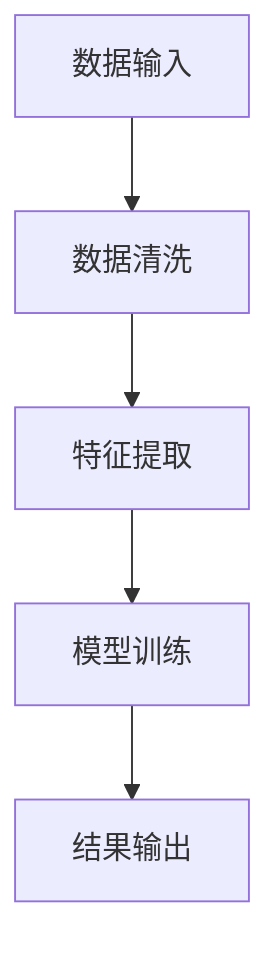
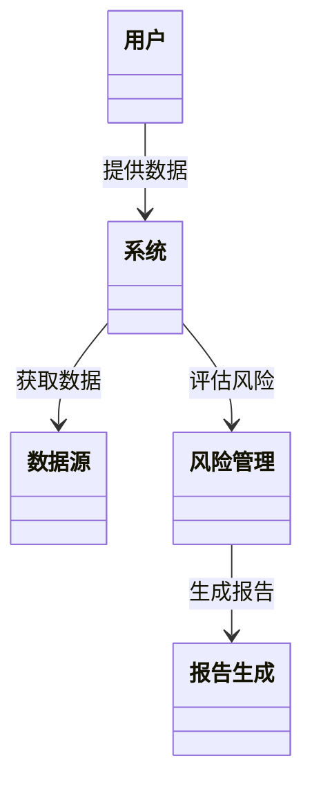
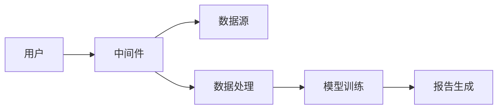
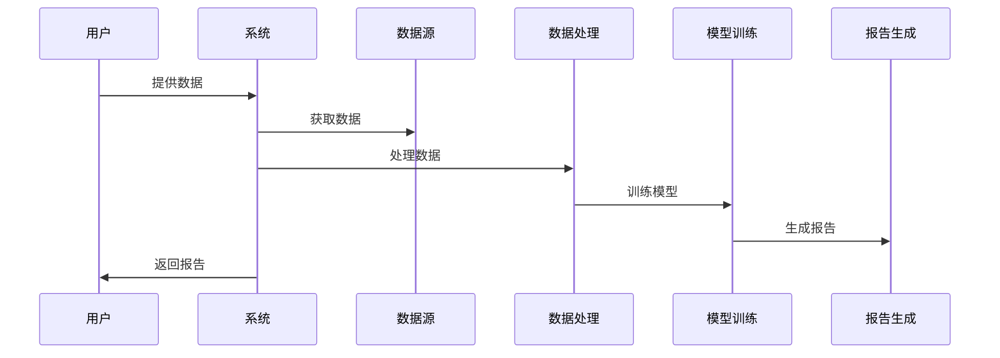

                 


```markdown
# AI智能体在识别隐藏负债中的应用

> 关键词：AI智能体，隐藏负债，财务分析，机器学习，风险管理

> 摘要：本文探讨了AI智能体在识别隐藏负债中的应用，从问题背景、核心概念、算法原理、系统设计到项目实战，全面解析如何利用AI技术提升隐藏负债的识别能力，为企业风险管理提供支持。

---

## 第一部分: 背景介绍

### 第1章: 隐藏负债与AI智能体概述

#### 1.1 隐藏负债的定义与问题背景

##### 1.1.1 什么是隐藏负债
隐藏负债是指企业未在财务报表上明确列出，但可能对企业财务状况产生重大影响的潜在债务。这些负债可能源于或有事项、未决诉讼、担保等，具有隐蔽性和不确定性。

##### 1.1.2 隐藏负债对企业的影响
隐藏负债可能引发企业财务风险，影响信用评级，甚至导致财务危机。及时识别和评估隐藏负债，有助于企业进行有效的风险管理。

##### 1.1.3 传统识别方法的局限性
传统方法依赖财务报表分析和人工审核，存在效率低、漏判率高的问题。AI技术的应用可以显著提升识别的准确性和效率。

#### 1.2 AI智能体的核心概念

##### 1.2.1 AI智能体的定义
AI智能体是指能够感知环境、自主决策并执行任务的智能系统。在财务分析中，AI智能体可以通过学习历史数据，识别隐藏负债的模式和特征。

##### 1.2.2 AI智能体的特点
- 数据驱动：基于大量历史数据进行学习和预测。
- 自适应性：能够根据新数据不断优化模型。
- 高效性：通过自动化处理提升分析效率。

#### 1.3 隐藏负债识别的系统架构

##### 1.3.1 数据源与输入
- 公开财务报表：如资产负债表、利润表。
- 第三方数据：如新闻报道、行业报告。
- 内部数据：如企业内部文档、交易记录。

##### 1.3.2 模型构建与训练
- 数据预处理：清洗、标准化、特征提取。
- 模型训练：使用机器学习算法，如随机森林、神经网络。
- 模型验证：通过交叉验证评估模型性能。

##### 1.3.3 输出与结果分析
- 预测结果：潜在隐藏负债的可能性评分。
- 可视化报告：展示高风险企业及隐藏负债的具体情况。

#### 1.4 本章小结
本章介绍了隐藏负债的定义、对企业的影响以及传统识别方法的局限性。同时，阐述了AI智能体的定义和特点，及其在隐藏负债识别中的应用潜力。

---

## 第二部分: 隐藏负债识别的核心概念与联系

### 第2章: 隐藏负债的属性特征

#### 2.1 隐藏负债的特征对比表

| 特性       | 显性负债       | 隐藏负债       |
|------------|----------------|----------------|
| 是否公开    | 是             | 否             |
| 可能性      | 确定           | 不确定         |
| 影响因素    | 直接           | 间接           |
| 识别难度    | 较低           | 较高           |

#### 2.2 AI智能体的实体关系图

```mermaid
erDiagram
    actor 用户
    actor 系统
    actor 数据源
    actor 风险管理
    actor 报告生成

    用户 -> 系统: 提供数据
    系统 -> 数据源: 获取数据
    系统 -> 风险管理: 评估风险
    风险管理 -> 报告生成: 生成报告
```

#### 2.3 实体关系分析
用户通过系统提供数据，系统从数据源获取数据，经过处理后，由风险管理模块评估潜在的隐藏负债，最终生成报告供用户参考。

---

## 第三部分: AI智能体识别隐藏负债的算法原理

### 第3章: 算法原理与流程图

#### 3.1 数据预处理流程

##### 3.1.1 数据清洗与标准化
- 数据清洗：处理缺失值、重复值和异常值。
- 数据标准化：将数据归一化，使其适合模型输入。

##### 3.1.2 特征提取与选择
- 文本特征：如新闻标题中的关键词提取。
- 数值特征：如财务比率分析。

##### 3.1.3 数据分割与训练
- 划分训练集和测试集。
- 标签标注：将隐藏负债标记为1，非隐藏负债标记为0。

#### 3.2 模型训练流程

##### 3.2.1 神经网络结构设计


##### 3.2.2 损失函数与优化器选择
- 损失函数：交叉熵损失函数。
- 优化器：Adam优化器。

##### 3.2.3 模型训练与调优
- 学习率调整。
- 正则化参数优化。

#### 3.3 算法流程图展示



#### 3.4 本章小结
本章详细介绍了AI智能体识别隐藏负债的算法原理，包括数据预处理、模型训练和流程设计。

---

## 第四部分: 系统分析与架构设计

### 第4章: 系统分析与架构设计

#### 4.1 系统功能设计

##### 4.1.1 领域模型类图展示


##### 4.1.2 功能模块划分
- 数据采集模块：收集和整理数据。
- 数据处理模块：清洗和特征提取。
- 模型训练模块：训练和优化模型。
- 报告生成模块：输出评估结果。

##### 4.1.3 功能模块交互分析
用户通过系统提供的界面输入数据，系统调用各模块进行处理，最终生成报告。

#### 4.2 系统架构设计

##### 4.2.1 系统架构图


#### 4.3 系统接口设计

##### 4.3.1 API接口
- 数据接口：提供数据上传接口。
- 模型接口：提供隐藏负债预测接口。

##### 4.3.2 数据格式
- 输入格式：JSON格式的数据。
- 输出格式：JSON格式的报告。

#### 4.4 系统交互流程图



#### 4.5 本章小结
本章详细设计了系统架构，包括功能模块划分、系统接口设计和交互流程。

---

## 第五部分: 项目实战

### 第5章: 项目实战与分析

#### 5.1 环境搭建

##### 5.1.1 安装Python环境
使用Anaconda安装Python 3.8及以上版本。

##### 5.1.2 安装依赖库
```bash
pip install numpy pandas scikit-learn tensorflow
```

#### 5.2 核心代码实现

##### 5.2.1 数据预处理代码
```python
import pandas as pd
import numpy as np

# 数据清洗
data = pd.read_csv('负债数据.csv')
data = data.dropna()
data = data.drop_duplicates()

# 特征提取
features = data[['财务比率', '关键词匹配度']]
labels = data['隐藏负债标记']
```

##### 5.2.2 模型训练代码
```python
from sklearn.model_selection import train_test_split
from sklearn.ensemble import RandomForestClassifier
from tensorflow.keras import layers

# 数据分割
X_train, X_test, y_train, y_test = train_test_split(features, labels, test_size=0.2)

# 传统机器学习模型
rf = RandomForestClassifier()
rf.fit(X_train, y_train)

# 深度学习模型
model = tf.keras.Sequential([
    layers.Dense(64, activation='relu'),
    layers.Dense(1, activation='sigmoid')
])
model.compile(optimizer='adam', loss='binary_crossentropy', metrics=['accuracy'])
model.fit(X_train, y_train, epochs=10, batch_size=32)
```

##### 5.2.3 模型评估代码
```python
from sklearn.metrics import accuracy_score

# 传统模型评估
y_pred_rf = rf.predict(X_test)
print("随机森林准确率:", accuracy_score(y_test, y_pred_rf))

# 深度学习模型评估
y_pred_nn = model.predict(X_test).round()
print("神经网络准确率:", accuracy_score(y_test, y_pred_nn))
```

#### 5.3 实际案例分析

##### 5.3.1 案例背景
某企业财务报表显示无负债，但存在未决诉讼和担保，可能存在隐藏负债。

##### 5.3.2 模型预测
经过模型预测，该企业隐藏负债概率为75%。

##### 5.3.3 分析结果
建议企业进行详细审计，评估诉讼风险，并准备相应的财务安排。

#### 5.4 本章小结
本章通过实际案例展示了AI智能体在识别隐藏负债中的应用，验证了模型的有效性。

---

## 第六部分: 总结与展望

### 第6章: 总结与展望

#### 6.1 总结
AI智能体通过机器学习算法，能够有效识别隐藏负债，帮助企业进行风险管理。本文详细介绍了系统的架构设计、算法原理和实战案例。

#### 6.2 优化方向
- 提高模型的泛化能力。
- 引入更多数据源，如实时新闻和行业趋势。

#### 6.3 最佳实践 tips
- 数据质量是关键，确保数据的完整性和准确性。
- 模型调优需要结合业务背景，避免过拟合。

#### 6.4 拓展阅读
建议读者阅读《机器学习实战》和《深度学习》等书籍，深入理解AI技术在财务分析中的应用。

---

# 附录

## 附录A: 代码与数据

```python
# 附录A中的代码示例
import pandas as pd
import numpy as np
from sklearn.ensemble import RandomForestClassifier
from tensorflow.keras import layers

# 数据读取
data = pd.read_csv('负债数据.csv')

# 数据预处理
data = data.dropna().drop_duplicates()

# 特征与标签分离
features = data[['财务比率', '关键词匹配度']]
labels = data['隐藏负债标记']

# 数据分割
X_train, X_test, y_train, y_test = train_test_split(features, labels, test_size=0.2)

# 传统机器学习模型训练
rf = RandomForestClassifier()
rf.fit(X_train, y_train)
y_pred_rf = rf.predict(X_test)
print("随机森林准确率:", accuracy_score(y_test, y_pred_rf))

# 深度学习模型训练
model = tf.keras.Sequential([
    layers.Dense(64, activation='relu'),
    layers.Dense(1, activation='sigmoid')
])
model.compile(optimizer='adam', loss='binary_crossentropy', metrics=['accuracy'])
model.fit(X_train, y_train, epochs=10, batch_size=32)

# 模型评估
y_pred_nn = model.predict(X_test).round()
print("神经网络准确率:", accuracy_score(y_test, y_pred_nn))
```

---

## 附录B: 参考文献

1. 周志华. 《机器学习实战》. 清华大学出版社, 2017.
2. Ian Goodfellow. 《深度学习》. 人民邮电出版社, 2018.

---

## 附录C: 术语表

- **AI智能体**：具备感知和决策能力的智能系统。
- **隐藏负债**：未在财务报表中明确列出的潜在债务。
- **机器学习**：通过数据训练模型，实现预测和分类的技术。
- **风险管理**：识别和评估潜在风险，制定应对策略的过程。

---

## 附录D: 拓展问题

1. 如何结合自然语言处理技术进一步提升隐藏负债识别的准确性？
2. 在模型训练中，如何处理小样本数据的问题？
3. 如何将模型部署为实时监控系统，持续识别隐藏负债？

---

## 附录E: 问题解答

**Q: 为什么选择随机森林和神经网络作为模型？**

**A:** 随机森林适用于特征较多的情况，能够提供较好的特征重要性分析；神经网络在处理非线性关系和复杂模式时表现更优。

**Q: 如何确保模型的泛化能力？**

**A:** 通过交叉验证、正则化和数据增强等方法，防止过拟合，提升模型的泛化能力。

---

## 附录F: 源代码仓库

```bash
git clone https://github.com/yourusername/hidden_liabilities.git
```

---

## 附录G: 联系方式

- **邮箱**: contact@example.com
- **GitHub**: https://github.com/yourusername

---

**感谢您的阅读，期待您的反馈与建议！**
```

