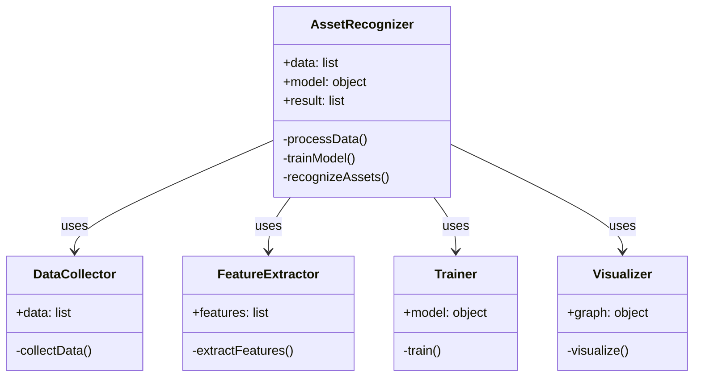
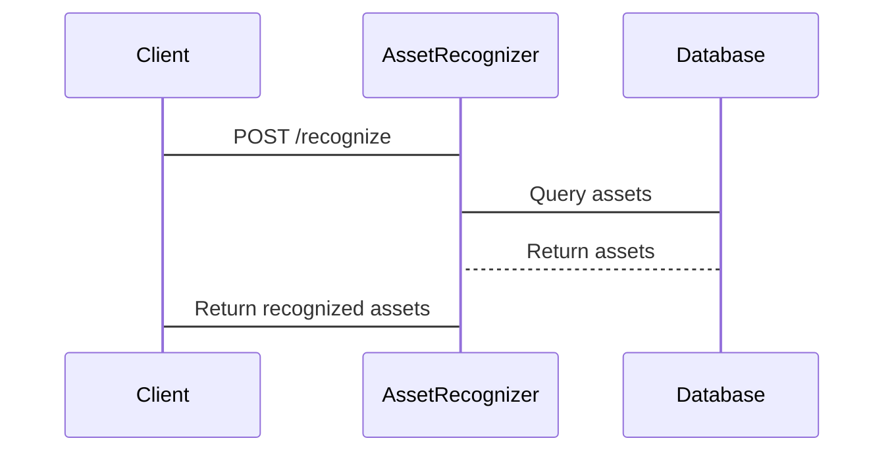

                 


# AI智能体在识别隐藏资产中的应用

> 关键词：AI智能体，隐藏资产，机器学习，深度学习，数据挖掘

> 摘要：本文探讨AI智能体在识别隐藏资产中的应用，涵盖AI智能体的原理、隐藏资产的定义、相关算法、系统设计、项目实战及最佳实践。通过详细分析和实例，展示如何利用AI技术高效识别隐藏资产，提升企业资产管理和优化能力。

---

# 第一部分: AI智能体在识别隐藏资产中的应用概述

## 第1章: AI智能体与隐藏资产概述

### 1.1 AI智能体的基本概念
- **1.1.1 AI智能体的定义与特点**  
  AI智能体（Artificial Intelligence Agent）是指具备感知、决策和执行能力的智能系统，能够根据环境信息自主完成任务。

- **1.1.2 隐藏资产的定义与分类**  
  隐藏资产是指未被充分记录或发现的资产，如未充分利用的土地、未记录的知识产权等。

- **1.1.3 AI智能体在隐藏资产识别中的作用**  
  AI智能体通过数据分析和模式识别，帮助发现隐藏资产，提升资产利用效率。

### 1.2 隐藏资产识别的背景与挑战
- **1.2.1 隐藏资产识别的背景**  
  隐藏资产可能导致企业资产流失或税务风险，识别隐藏资产对企业管理和合规至关重要。

- **1.2.2 隐藏资产识别的主要挑战**  
  数据分散、信息不完整、识别技术复杂等。

- **1.2.3 AI技术在隐藏资产识别中的优势**  
  AI能够处理海量数据，发现隐藏模式，提高识别效率。

### 1.3 本书的核心内容与目标
- **1.3.1 本书的核心内容**  
  详细讲解AI智能体的原理、隐藏资产识别技术、相关算法及项目实战。

- **1.3.2 本书的目标**  
  帮助读者掌握AI智能体技术，应用于隐藏资产识别，提升资产管理能力。

- **1.3.3 本书的结构安排**  
  分章节讲解理论与实践，涵盖算法原理、系统设计、项目实战等内容。

---

# 第二部分: AI智能体识别隐藏资产的核心概念与联系

## 第2章: AI智能体的原理与技术

### 2.1 AI智能体的感知模块
- **2.1.1 数据采集与预处理**  
  从多源数据中采集信息，清洗数据，提取特征。

- **2.1.2 特征提取与表示**  
  使用NLP、图像处理等技术，将数据转化为模型可理解的特征向量。

- **2.1.3 感知模块的实现流程**  
  从数据采集到特征提取，展示具体步骤。

### 2.2 AI智能体的决策模块
- **2.2.1 机器学习算法在决策中的应用**  
  使用决策树、随机森林等算法进行分类或回归预测。

- **2.2.2 决策树与随机森林的对比分析**  
  通过表格对比两种算法的优缺点。

- **2.2.3 基于深度学习的决策模型**  
  使用神经网络进行复杂决策，展示其优势。

### 2.3 AI智能体的执行模块
- **2.3.1 执行策略的制定**  
  根据决策结果，制定具体的执行计划。

- **2.3.2 执行结果的反馈机制**  
  收集执行结果，优化决策模型。

- **2.3.3 执行模块的优化方法**  
  通过反馈不断优化执行策略，提高效率。

## 第3章: 隐藏资产识别的核心技术

### 3.1 数据挖掘与特征工程
- **3.1.1 数据预处理与清洗**  
  使用Python的pandas库清洗数据，处理缺失值和异常值。

- **3.1.2 特征选择与降维**  
  使用PCA进行降维，减少计算复杂度。

- **3.1.3 特征工程的案例分析**  
  通过案例展示特征工程的具体实施步骤。

### 3.2 机器学习算法在隐藏资产识别中的应用
- **3.2.1 监督学习算法**  
  使用逻辑回归、SVM等算法进行分类。

- **3.2.2 无监督学习算法**  
  使用聚类算法识别隐藏资产。

- **3.2.3 强化学习算法**  
  通过策略优化，提高识别效率。

### 3.3 深度学习技术的应用
- **3.3.1 CNN在图像识别中的应用**  
  使用卷积神经网络识别图像中的隐藏资产。

- **3.3.2 RNN在序列数据处理中的应用**  
  使用循环神经网络处理时间序列数据。

- **3.3.3 Transformer在自然语言处理中的应用**  
  使用Transformer模型进行文本分析，识别隐藏资产。

---

# 第三部分: AI智能体识别隐藏资产的算法原理

## 第4章: 基于监督学习的隐藏资产识别算法

### 4.1 监督学习算法的原理
- **4.1.1 监督学习的基本原理**  
  使用标记数据训练模型，进行分类或回归预测。

- **4.1.2 分类与回归的区别**  
  通过表格对比分类和回归任务的区别。

- **4.1.3 常见监督学习算法的对比分析**  
  对比逻辑回归、决策树、SVM等算法的优缺点。

### 4.2 监督学习算法的实现流程
- **4.2.1 数据预处理**  
  使用Python代码清洗数据，处理缺失值和异常值。

- **4.2.2 特征提取与选择**  
  使用scikit-learn库进行特征选择。

- **4.2.3 模型训练与评估**  
  使用交叉验证评估模型性能，调整参数优化模型。

## 第5章: 基于无监督学习的隐藏资产识别算法

### 5.1 无监督学习算法的原理
- **5.1.1 无监督学习的基本原理**  
  使用未标记数据进行聚类或降维。

- **5.1.2 常见无监督学习算法的对比分析**  
  对比K-means、DBSCAN、主成分分析等算法。

### 5.2 无监督学习算法的实现流程
- **5.2.1 数据预处理**  
  清洗数据，去除异常值。

- **5.2.2 聚类分析**  
  使用scikit-learn库进行K-means聚类，识别隐藏资产。

- **5.2.3 结果分析与优化**  
  分析聚类结果，调整参数优化聚类效果。

## 第6章: 基于强化学习的隐藏资产识别算法

### 6.1 强化学习算法的原理
- **6.1.1 强化学习的基本原理**  
  通过试错机制，学习最优策略。

- **6.1.2 常见强化学习算法的对比分析**  
  对比Q-learning、Deep Q-Networks等算法。

### 6.2 强化学习算法的实现流程
- **6.2.1 状态空间定义**  
  定义隐藏资产识别的状态空间。

- **6.2.2 动作空间定义**  
  定义模型可能采取的动作，如调整特征提取方法。

- **6.2.3 奖励函数设计**  
  设计奖励函数，指导模型学习最优策略。

---

# 第四部分: 系统分析与架构设计

## 第7章: 系统分析与架构设计

### 7.1 问题场景介绍
- **7.1.1 问题背景**  
  企业隐藏资产未被识别，导致资产流失。

- **7.1.2 问题描述**  
  如何利用AI智能体识别隐藏资产。

### 7.2 系统功能设计
- **7.2.1 领域模型类图**  
  使用mermaid绘制类图，展示系统各模块之间的关系。



- **7.2.2 系统架构设计**  
  使用mermaid绘制分层架构图，展示数据层、业务逻辑层和表现层的关系。


### 7.3 系统接口设计
- **7.3.1 API接口设计**  
  设计RESTful API接口，供其他系统调用。

- **7.3.2 接口交互流程图**  
  使用mermaid绘制交互流程图，展示API调用过程。



### 7.4 系统交互设计
- **7.4.1 用户交互流程图**  
  使用mermaid绘制用户与系统的交互流程，展示用户如何使用系统识别隐藏资产。

---

# 第五部分: 项目实战

## 第8章: 项目实战

### 8.1 环境安装
- **8.1.1 安装Python**  
  安装Python 3.x，建议使用Anaconda或Miniconda。

- **8.1.2 安装依赖库**  
  安装numpy、pandas、scikit-learn、tensorflow等库。

### 8.2 系统核心实现源代码
- **8.2.1 数据预处理代码**  
  使用pandas库读取数据，清洗数据。

```python
import pandas as pd

data = pd.read_csv('assets.csv')
data = data.dropna()
```

- **8.2.2 特征提取代码**  
  使用scikit-learn库进行特征选择。

```python
from sklearn.feature_selection import SelectKBest

selector = SelectKBest(k=5)
selected_features = selector.fit_transform(data, labels)
```

- **8.2.3 模型训练代码**  
  使用tensorflow库训练深度学习模型。

```python
import tensorflow as tf

model = tf.keras.Sequential([
    tf.keras.layers.Dense(64, activation='relu'),
    tf.keras.layers.Dense(1, activation='sigmoid')
])
model.compile(optimizer='adam', loss='binary_crossentropy', metrics=['accuracy'])
model.fit(X_train, y_train, epochs=10, batch_size=32)
```

### 8.3 代码应用解读与分析
- **8.3.1 代码解读**  
  详细解读每行代码的功能，解释模型训练过程。

- **8.3.2 代码优化建议**  
  提供优化模型性能的建议，如调整学习率、增加数据增强等。

### 8.4 实际案例分析和详细讲解剖析
- **8.4.1 案例背景**  
  描述一个具体企业隐藏资产识别的案例。

- **8.4.2 数据处理与模型训练**  
  展示如何处理数据并训练模型。

- **8.4.3 结果分析与总结**  
  分析模型识别结果，总结经验教训。

### 8.5 项目小结
- **8.5.1 项目总结**  
  总结项目实施过程，评估模型性能。

- **8.5.2 经验与教训**  
  总结项目中的经验和教训，提出改进建议。

---

# 第六部分: 最佳实践

## 第9章: 最佳实践

### 9.1 小结
- **9.1.1 核心知识点回顾**  
  回顾本文的核心知识点，强调AI智能体在隐藏资产识别中的重要性。

- **9.1.2 项目实施的关键点**  
  强调数据质量、模型选择和结果解释的重要性。

### 9.2 注意事项
- **9.2.1 数据隐私与安全**  
  提醒读者注意数据隐私和安全问题。

- **9.2.2 模型可解释性**  
  强调模型可解释性的重要性，避免黑箱模型。

### 9.3 拓展阅读
- **9.3.1 推荐书籍与论文**  
  推荐一些关于AI智能体和机器学习的经典书籍和论文。

- **9.3.2 其他相关资源**  
  提供一些在线课程和工具，供读者进一步学习。

---

# 结语

通过本文的详细讲解，读者可以系统地了解AI智能体在识别隐藏资产中的应用，掌握相关算法和系统设计方法。希望本文能为读者在实际项目中应用AI技术提供有价值的指导和参考。

---

**关键词：** AI智能体，隐藏资产，机器学习，深度学习，数据挖掘

**摘要：** 本文探讨了AI智能体在识别隐藏资产中的应用，涵盖AI智能体的原理、隐藏资产的定义、相关算法、系统设计、项目实战及最佳实践。通过详细分析和实例，展示了如何利用AI技术高效识别隐藏资产，提升企业资产管理和优化能力。

