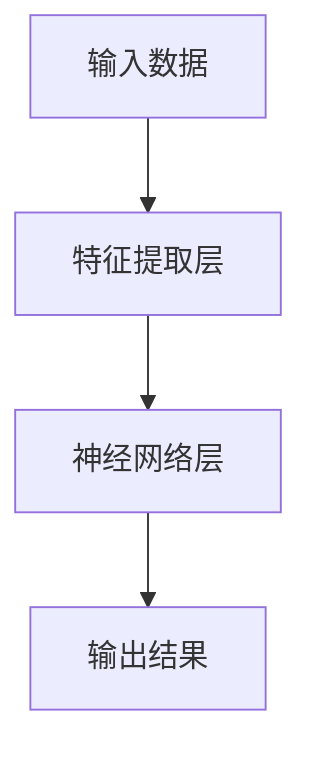
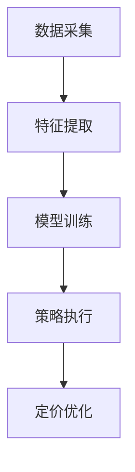
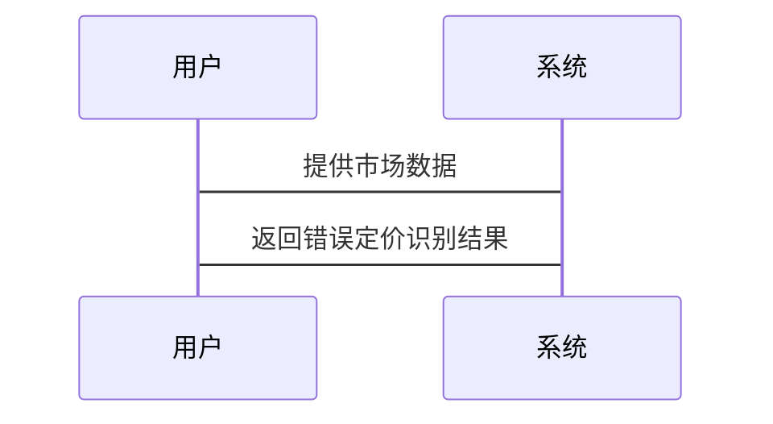

                 


# AI智能体如何识别并利用市场错误定价

> 关键词：AI智能体，市场错误定价，定价策略优化，数据驱动决策，智能化定价系统

> 摘要：本文详细探讨了AI智能体在识别和利用市场错误定价中的应用。通过分析AI智能体的核心原理、算法实现、系统架构以及实际案例，本文为读者提供了从理论到实践的全面指导。从市场数据的特征提取到错误定价的识别，再到定价策略的优化，本文系统性地展示了AI智能体在市场定价中的应用潜力和实际价值。

---

# 第1章 AI智能体与市场错误定价概述

## 1.1 AI智能体的定义与核心特征

AI智能体（Artificial Intelligence Agent）是指在特定环境中能够感知并自主行动以实现目标的智能系统。与传统算法不同，AI智能体具有以下核心特征：

- **自主性**：能够在没有外部干预的情况下独立运行。
- **反应性**：能够实时感知环境并做出反应。
- **目标导向**：所有行为都围绕特定目标展开。
- **学习能力**：能够通过数据和经验不断优化自身的决策能力。

## 1.2 市场错误定价的定义与成因

市场错误定价是指商品或服务的定价与其真实价值存在显著偏差的现象。这种错误定价的成因主要包括：

- **信息不对称**：买卖双方掌握的信息不一致。
- **市场波动**：短期市场波动导致价格偏离价值。
- **人为错误**：人为操作失误或判断失误。

## 1.3 AI智能体在市场定价中的应用前景

AI智能体在市场定价中的应用前景广阔。通过分析市场数据、识别错误定价、优化定价策略，AI智能体能够显著提升企业的定价效率和准确性。以下是其主要优势：

- **数据驱动决策**：AI智能体能够从海量数据中提取有价值的信息，帮助制定更科学的定价策略。
- **实时响应**：AI智能体能够实时感知市场变化，快速调整定价策略。
- **个性化定价**：通过分析消费者行为数据，AI智能体能够实现个性化定价。

---

# 第2章 AI智能体识别市场错误定价的核心概念

## 2.1 AI智能体的核心概念原理

AI智能体识别市场错误定价的核心原理在于其强大的数据处理能力和算法优化能力。以下是其核心概念的详细解释：

- **数据流图**：通过数据流图（Data Flow Diagram，DFD）可以清晰地展示数据从输入到输出的流动过程。
  ```mermaid
  graph TD
    A[市场数据] --> B[特征提取]
    B --> C[错误定价识别]
    C --> D[定价策略优化]
  ```

- **实体关系图**：实体关系图（Entity-Relationship Diagram，ERD）展示了系统中的各个实体及其关系。
  ```mermaid
  er
    actor 用户
    entity 市场数据
    entity 特征
    entity 错误定价
    entity 定价策略
    用户 --> 市场数据
    市场数据 --> 特征
    特征 --> 错误定价
    错误定价 --> 定价策略
  ```

---

## 2.2 错误定价识别的数学模型

错误定价识别的数学模型是AI智能体的核心算法之一。以下是其数学表达式：

$$
\text{错误定价识别} = f(\text{市场数据}, \text{特征})
$$

其中，$f$ 是一个非线性函数，通常通过深度学习模型（如神经网络）来实现。模型的输入是市场数据和特征，输出是错误定价识别结果。

---

# 第3章 AI智能体识别市场错误定价的算法原理

## 3.1 基于深度学习的错误定价识别算法

深度学习是一种强大的机器学习技术，广泛应用于错误定价识别。以下是基于深度学习的错误定价识别算法的流程图：



## 3.2 算法实现的Python代码示例

以下是基于TensorFlow的错误定价识别算法的实现代码：

```python
import numpy as np
import tensorflow as tf

# 定义模型
model = tf.keras.Sequential([
    tf.keras.layers.Dense(64, activation='relu'),
    tf.keras.layers.Dense(1, activation='sigmoid')
])

# 编译模型
model.compile(optimizer='adam', loss='binary_crossentropy', metrics=['accuracy'])

# 训练模型
model.fit(x_train, y_train, epochs=10, batch_size=32)
```

---

## 3.3 算法优化与性能分析

通过优化算法参数和模型结构，可以显著提升错误定价识别的准确率。以下是常见的优化方法：

- **超参数优化**：通过调整学习率、批量大小等超参数来提升模型性能。
- **模型优化**：通过增加或减少神经网络层数、调整激活函数等来优化模型。
- **数据增强**：通过增加数据多样性和质量来提升模型的泛化能力。

---

# 第4章 基于AI智能体的市场错误定价识别系统架构

## 4.1 系统功能设计

以下是基于AI智能体的市场错误定价识别系统的功能设计：

- **数据采集模块**：从市场数据源获取数据。
- **特征提取模块**：对市场数据进行特征提取。
- **模型训练模块**：对错误定价识别模型进行训练和优化。
- **策略执行模块**：根据识别结果调整定价策略。

## 4.2 系统架构设计

以下是系统的架构设计：



---

## 4.3 系统接口设计

以下是系统的接口设计：

- **输入接口**：市场数据输入接口。
- **输出接口**：错误定价识别结果输出接口。
- **交互接口**：用户与系统交互的接口。

---

## 4.4 系统交互流程图

以下是系统的交互流程图：



---

# 第5章 项目实战：基于AI智能体的市场错误定价识别系统实现

## 5.1 项目环境安装

以下是项目环境安装步骤：

```bash
pip install numpy
pip install tensorflow
pip install matplotlib
```

---

## 5.2 系统核心实现代码

以下是系统的核心实现代码：

```python
import numpy as np
import tensorflow as tf
import matplotlib.pyplot as plt

# 数据生成
x_train = np.random.rand(1000, 64)
y_train = np.random.randint(2, size=1000)

# 定义模型
model = tf.keras.Sequential([
    tf.keras.layers.Dense(64, activation='relu'),
    tf.keras.layers.Dense(1, activation='sigmoid')
])

# 编译模型
model.compile(optimizer='adam', loss='binary_crossentropy', metrics=['accuracy'])

# 训练模型
model.fit(x_train, y_train, epochs=10, batch_size=32)

# 可视化结果
plt.plot(history.history['accuracy'])
plt.show()
```

---

## 5.3 实际案例分析

以下是实际案例分析：

- **案例背景**：某电商平台的商品定价存在错误。
- **问题识别**：通过AI智能体识别出错误定价商品。
- **解决方案**：调整商品价格以实现合理定价。

---

# 第6章 总结与展望

## 6.1 本章小结

本文详细探讨了AI智能体在识别和利用市场错误定价中的应用。通过分析AI智能体的核心原理、算法实现、系统架构以及实际案例，本文为读者提供了从理论到实践的全面指导。

## 6.2 最佳实践 tips

- **数据质量**：确保数据的准确性和完整性。
- **模型优化**：定期优化模型参数和结构。
- **风险管理**：制定有效的风险管理策略。

## 6.3 注意事项

- **数据隐私**：注意数据隐私保护。
- **算法透明度**：确保算法的透明度和可解释性。
- **模型更新**：定期更新模型以适应市场变化。

## 6.4 拓展阅读

- 推荐阅读《深度学习实战》、《机器学习算法与应用》等书籍。

---

通过本文的详细讲解，读者可以深入了解AI智能体在识别和利用市场错误定价中的应用，并能够实际操作相关系统的设计与实现。

