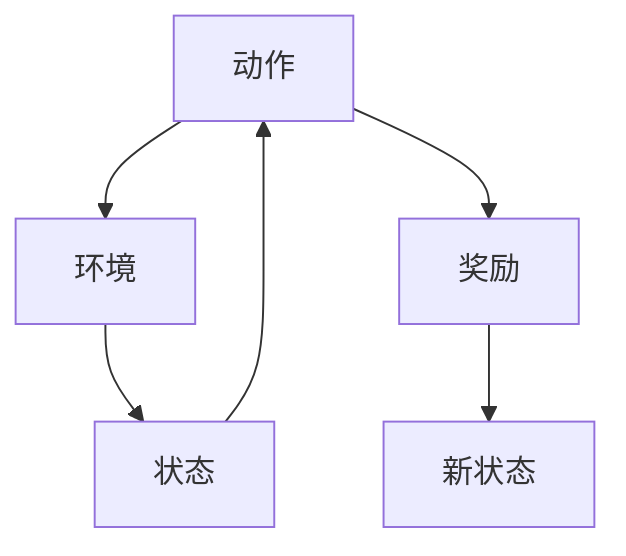
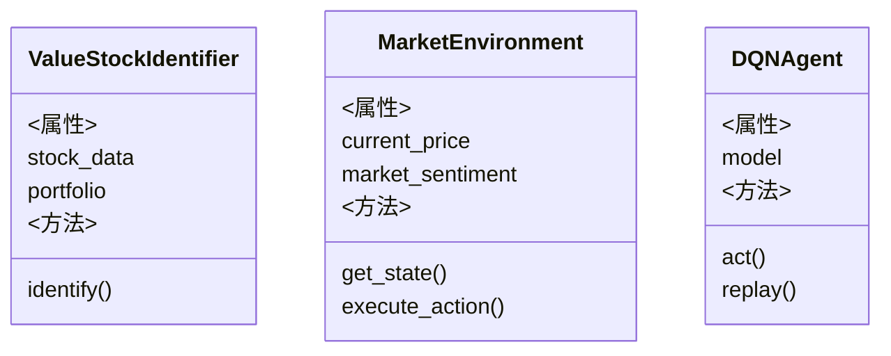
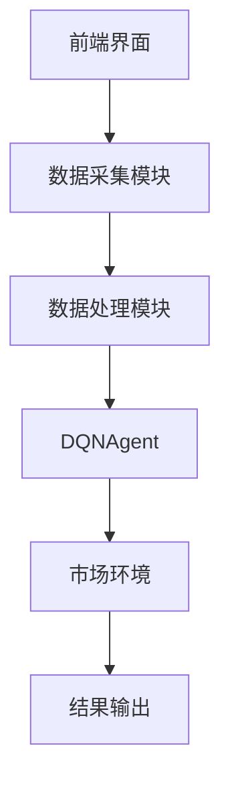
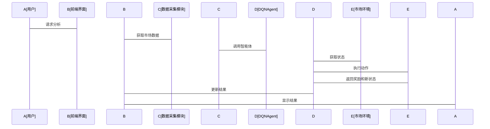

                 


# 第3章: 基于强化学习的AI智能体算法

## 3.1 强化学习的基本原理
### 3.1.1 强化学习的定义与特点
强化学习是一种机器学习范式，其中智能体通过与环境交互来学习如何做出决策。与监督学习不同，强化学习依赖于奖励信号来指导学习过程，而不是直接提供正确答案。强化学习的关键在于智能体通过试错（trial and error）来优化其策略，以最大化累计奖励。

### 3.1.2 奖励机制
奖励机制是强化学习的核心。智能体在每一步行动后会收到一个奖励信号，这个信号反映了其行动的好坏。奖励机制的设计对于算法的性能至关重要。例如，在价值股识别中，当智能体正确识别出一只低估的价值股时，给予正向奖励；反之，则给予负向奖励。

### 3.1.3 状态空间与动作空间
- 状态空间：智能体所处的环境状态。在价值股识别中，状态可能包括当前的股价、财务指标、市场情绪等。
- 动作空间：智能体可以执行的动作。例如，买入、卖出或持有股票。

## 3.2 深度强化学习
### 3.2.1 深度强化学习的优势
深度强化学习结合了深度学习的强大特征提取能力和强化学习的决策优化能力。通过深度神经网络，智能体能够处理复杂的市场数据，并做出更复杂的决策。

### 3.2.2 基于DQN的算法
DQN（Deep Q-Network）是一种常用的强化学习算法。它通过两个神经网络（主网络和目标网络）来近似最优Q值函数。主网络负责根据当前状态预测Q值，目标网络则用于稳定学习过程。

## 3.3 算法实现
### 3.3.1 环境接口设计
在价值股识别中，环境接口需要提供市场数据、处理智能体的动作，并返回新的状态和奖励。例如：
1. 获取当前市场数据。
2. 执行智能体的决策（买入、卖出或持有）。
3. 返回新的市场数据和奖励。

### 3.3.2 状态空间与动作空间设计
- 状态空间：包括股票的历史价格、财务指标、市场情绪等。
- 动作空间：包括买入、卖出或持有股票三种动作。

### 3.3.3 神经网络结构设计
主网络和目标网络都是深度神经网络，通常使用卷积神经网络（CNN）或长短时记忆网络（LSTM）来处理时间序列数据。

### 3.3.4 奖励函数设计
奖励函数需要能够反映智能体的决策质量。例如，当智能体正确识别出一只低估的价值股时，给予正向奖励；反之，则给予负向奖励。

## 3.4 投资场景模拟
以一个简单的投资场景为例，假设市场中有N只股票，每只股票都有其历史价格数据。智能体的目标是通过学习，识别出那些被低估的价值股，并在适当的时候买入，以获得最大化的收益。

## 3.5 策略网络的实现
### 3.5.1 神经网络结构
主网络和目标网络的结构设计。例如，使用两个LSTM层来处理时间序列数据，然后通过全连接层输出Q值。

### 3.5.2 DQN算法的实现
使用两个神经网络交替更新，以稳定学习过程。同时，采用经验回放机制来减少相关样本的问题。

### 3.5.3 代码示例
```python
import numpy as np
import tensorflow as tf

class DQN:
    def __init__(self, state_size, action_size):
        self.state_size = state_size
        self.action_size = action_size
        self.gamma = 0.99
        self.epsilon = 1.0
        self.epsilon_min = 0.01
        self.epsilon_decay = 0.995
        self.batch_size = 64
        self.memory = deque(maxlen=10000)
        self.model = self.build_model()
        self.target_model = self.build_model()
        
    def build_model(self):
        model = tf.keras.Sequential()
        model.add(tf.keras.layers.LSTM(64, input_shape=(None, self.state_size)))
        model.add(tf.keras.layers.Dense(32, activation='relu'))
        model.add(tf.keras.layers.Dense(self.action_size, activation='linear'))
        model.compile(optimizer=tf.keras.optimizers.Adam(lr=0.001), loss='mse')
        return model

    def remember(self, state, action, reward, next_state, done):
        self.memory.append((state, action, reward, next_state, done))

    def act(self, state):
        if np.random.random() < self.epsilon:
            return random.randint(0, self.action_size - 1)
        state = np.array([state])
        q_values = self.model.predict(state)
        return np.argmax(q_values[0])

    def replay(self):
        if len(self.memory) < self.batch_size:
            return
        minibatch = random.sample(self.memory, self.batch_size)
        states = np.array([t[0] for t in minibatch])
        actions = np.array([t[1] for t in minibatch])
        rewards = np.array([t[2] for t in minibatch])
        next_states = np.array([t[3] for t in minibatch])
        dones = np.array([t[4] for t in minibatch])
        
        target = np.zeros((self.batch_size,))
        next_q = self.target_model.predict(next_states)
        for i in range(self.batch_size):
            if dones[i]:
                target[i] = rewards[i]
            else:
                target[i] = rewards[i] + self.gamma * np.max(next_q[i])
                
        target_q = self.model.predict(states)
        target_q[:, actions] = target
        
        self.model.fit(states, target_q, epochs=1, verbose=0)
        
        if self.epsilon > self.epsilon_min:
            self.epsilon *= self.epsilon_decay
```

## 3.6 算法流程图


## 3.7 实际应用中的策略优化
在实际应用中，可以通过引入延迟收益（delayed reward）机制来优化策略。例如，在价值股识别中，智能体可能需要等待一段时间才能获得最终的收益，这使得奖励信号更加准确。

## 3.8 本章小结
本章详细介绍了基于强化学习的AI智能体算法，包括强化学习的基本原理、深度强化学习的优势、DQN算法的实现以及在价值股识别中的应用。通过具体的代码示例和流程图，读者可以更好地理解如何将这些算法应用于实际问题中。

# 第4章: 系统分析与架构设计

## 4.1 系统需求分析
### 4.1.1 问题场景介绍
在价值股识别系统中，智能体需要能够实时获取市场数据、分析数据并做出决策。

### 4.1.2 功能需求
- 数据采集与预处理
- 智能体决策
- 投资组合管理
- 风险控制

## 4.2 系统功能设计
### 4.2.1 领域模型


### 4.2.2 系统架构


### 4.2.3 接口设计
- 数据采集接口：从市场获取实时数据。
- 智能体接口：接收状态，返回动作。
- 风险控制接口：监控投资组合的风险。

### 4.2.4 交互流程


## 4.3 本章小结
本章从系统角度分析了AI智能体识别价值股的实现，包括功能需求、系统架构和交互流程的设计。

# 第5章: 项目实战

## 5.1 环境搭建
### 5.1.1 安装依赖
- Python 3.8+
- TensorFlow 2.0+
- Pandas
- Scikit-learn
- Matplotlib

## 5.2 核心实现
### 5.2.1 数据预处理
```python
import pandas as pd
import numpy as np

data = pd.read_csv('stock_data.csv')
data['returns'] = data['price'].pct_change()
data = data.dropna()
```

### 5.2.2 模型训练
```python
agent = DQNAgent(state_size=5, action_size=3)
for episode in range(1000):
    state = get_current_state()
    action = agent.act(state)
    next_state, reward, done = execute_action(action)
    agent.remember(state, action, reward, next_state, done)
    agent.replay()
```

### 5.2.3 模型评估
```python
from sklearn.metrics import accuracy_score

test_states = [get_state() for _ in range(100)]
test_actions = [agent.act(state) for state in test_states]
actual_actions = [get_actual_action(state) for state in test_states]
print(f'准确率: {accuracy_score(test_actions, actual_actions)}')
```

## 5.3 实战案例分析
### 5.3.1 案例选择
选择几只具有代表性的股票，分析智能体识别的情况。

### 5.3.2 模型表现
比较智能体识别的结果与传统价值股识别方法的差异。

## 5.4 本章小结
本章通过实际项目展示了AI智能体识别价值股的过程，包括环境搭建、模型实现和案例分析。

# 第6章: 案例分析与总结

## 6.1 案例分析
### 6.1.1 案例选择
选择一个具体的案例，例如某只股票在特定时间内的表现。

### 6.1.2 智能体识别过程
详细描述智能体如何识别出该股票为低估的价值股。

### 6.1.3 结果分析
比较智能体识别结果与实际市场表现的差异。

## 6.2 总结与展望
### 6.2.1 总结
总结本章的内容，强调AI智能体在价值股识别中的优势和局限性。

### 6.2.2 未来展望
展望未来的发展方向，例如引入更多的市场数据源、优化算法等。

# 附录

## 附录A: 术语表
列出文章中出现的专业术语及其定义。

## 附录B: 代码仓库地址
提供代码仓库的地址，方便读者获取代码。

## 附录C: 参考文献
列出文章中引用的文献和资料。

---

通过以上结构，文章内容将详细展开，确保每一部分都得到充分的讲解和分析。从理论到实践，从算法到系统设计，再到实际案例，帮助读者全面理解AI智能体如何识别被低估的价值股。

