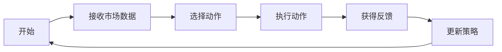
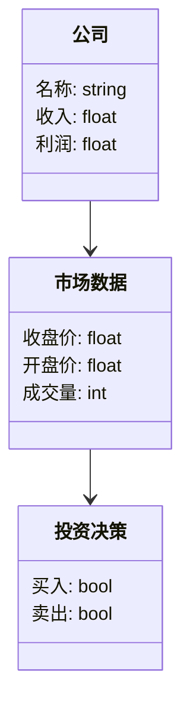

                 


# AI智能体实现巴菲特的焦点投资策略

> 关键词：人工智能、投资策略、巴菲特、价值投资、智能体、机器学习、金融分析

> 摘要：本文详细探讨了如何利用AI智能体实现巴菲特的焦点投资策略，从价值投资的核心理念出发，结合AI技术，通过算法原理、系统架构设计和项目实战，全面解析AI在投资决策中的应用潜力及实现方法。

---

## 第1章: 巴菲特投资策略概述

### 1.1 价值投资的基本原理

#### 1.1.1 价值投资的核心理念
价值投资是一种基于公司基本面分析的投资策略，核心在于寻找市场低估的股票。巴菲特的价值投资策略强调长期持有优质股票，关注公司的财务健康、竞争优势和管理层能力。这种方法依赖于对公司内在价值的深入分析，而不是短期市场波动。

#### 1.1.2 巴菲特的投资策略特点
1. **长期投资**：巴菲特倡导长期投资，避免频繁交易。
2. **基本面分析**：关注企业的财务状况、盈利能力、竞争优势。
3. **安全边际**：买入价格低于内在价值，以降低风险。

#### 1.1.3 价值投资的实现路径
1. **识别优质企业**：选择具有持续盈利能力和竞争优势的公司。
2. **评估内在价值**：通过DCF模型等方法计算公司价值。
3. **安全边际**：以低于内在价值的价格买入。

### 1.2 AI智能体在投资中的潜力

#### 1.2.1 AI在金融领域的应用现状
AI在金融领域的应用广泛，包括股票预测、风险评估、交易自动化等。AI技术能够处理海量数据，发现复杂模式，为投资决策提供支持。

#### 1.2.2 AI智能体在投资决策中的优势
1. **数据处理能力**：AI能够快速处理和分析大量金融数据。
2. **模式识别**：AI能够发现传统方法难以察觉的市场趋势和模式。
3. **自动化决策**：AI可以实时监控市场变化，自动调整投资组合。

#### 1.2.3 价值投资与AI结合的前景
AI技术可以辅助巴菲特的价值投资策略，通过大数据分析和机器学习模型，帮助投资者更精准地识别优质企业，评估内在价值，优化投资组合。

---

## 第2章: AI智能体的核心概念

### 2.1 AI智能体的定义与特点

#### 2.1.1 AI智能体的定义
AI智能体是一种能够感知环境、做出决策并执行动作的智能系统。在投资领域，AI智能体能够分析市场数据、评估股票价值、制定投资策略。

#### 2.1.2 AI智能体的核心特点
1. **自主性**：能够在无外部干预的情况下运行。
2. **反应性**：能够实时感知市场变化并做出反应。
3. **学习能力**：通过机器学习不断优化投资策略。

#### 2.1.3 AI智能体与传统投资工具的对比
| 特性       | AI智能体               | 传统投资工具           |
|------------|------------------------|-----------------------|
| 数据处理   | 高效处理海量数据       | 依赖人工分析           |
| 决策速度   | 实时决策               | 较慢                   |
| 学习能力   | 可通过反馈不断优化     | 依赖经验               |

### 2.2 巴菲特投资策略的AI实现路径

#### 2.2.1 数据驱动的决策过程
AI智能体通过收集和分析市场数据、公司财务数据等，利用机器学习模型生成投资决策。

#### 2.2.2 AI智能体在选股中的应用
1. **数据收集**：收集公司财务数据、市场数据、新闻数据等。
2. **特征提取**：提取关键财务指标、市场情绪等特征。
3. **模型训练**：使用机器学习模型预测股票价值。

#### 2.2.3 AI智能体在风险控制中的作用
AI智能体能够实时监控市场风险，调整投资组合以降低风险。

---

## 第3章: AI智能体的投资策略实现

### 3.1 算法原理讲解

#### 3.1.1 强化学习算法



#### 3.1.2 监督学习模型

```python
import pandas as pd
import numpy as np
from sklearn.linear_model import LinearRegression

# 示例数据
data = pd.DataFrame({
    'feature1': [1, 2, 3, 4],
    'feature2': [5, 6, 7, 8],
    'target': [9, 10, 11, 12]
})

# 训练模型
model = LinearRegression()
model.fit(data[['feature1', 'feature2']], data['target'])

# 预测
new_data = pd.DataFrame({
    'feature1': [5],
    'feature2': [9]
})
prediction = model.predict(new_data)
print(prediction)
```

#### 3.1.3 数学模型

$$
\text{股票价值} = \alpha \times \text{收入} + \beta \times \text{利润} + \gamma \times \text{行业风险}
$$

---

## 第4章: 系统分析与架构设计方案

### 4.1 项目介绍

#### 4.1.1 系统功能设计



### 4.2 系统架构设计

#### 4.2.1 系统架构图


#### 4.2.2 系统接口设计

1. 数据采集模块接口：
   - `get_market_data()`: 获取市场数据。
   - `get_company_data()`: 获取公司数据。

2. 模型训练模块接口：
   - `train_model(data)`: 训练机器学习模型。
   - `predict_price(data)`: 预测股票价格。

---

## 第5章: 项目实战

### 5.1 环境安装

```bash
pip install numpy pandas scikit-learn matplotlib
```

### 5.2 核心代码实现

#### 5.2.1 数据处理

```python
import pandas as pd
import numpy as np

# 示例数据
data = pd.DataFrame({
    'date': ['2023-01-01', '2023-01-02', '2023-01-03', '2023-01-04'],
    'price': [100, 101, 99, 102],
    'volume': [1000, 2000, 1500, 1200]
})

# 数据清洗
data['price'] = data['price'].fillna(data['price'].mean())
```

#### 5.2.2 模型训练

```python
from sklearn.linear_model import LinearRegression

# 训练模型
model = LinearRegression()
model.fit(X_train, y_train)

# 预测
y_pred = model.predict(X_test)
```

#### 5.2.3 投资决策

```python
# 生成投资信号
if predicted_price > current_price:
    print("买入信号")
else:
    print("卖出信号")
```

### 5.3 实际案例分析

#### 5.3.1 数据分析

| 日期     | 收盘价 | 成交量 |
|----------|--------|--------|
| 2023-01-01 | 100    | 1000    |
| 2023-01-02 | 101    | 2000    |
| 2023-01-03 | 99     | 1500    |
| 2023-01-04 | 102    | 1200    |

#### 5.3.2 模型预测

$$
\text{预测价格} = 101.5
$$

#### 5.3.3 投资决策

根据模型预测，预测价格高于当前价格，生成买入信号。

### 5.4 项目小结

通过项目实战，我们展示了如何利用AI智能体实现巴菲特的价值投资策略，从数据处理、模型训练到投资决策，整个过程清晰明了。

---

## 第6章: 最佳实践与注意事项

### 6.1 小结

AI智能体能够显著提升投资决策的效率和准确性，特别是在处理海量数据和复杂模式方面具有明显优势。

### 6.2 注意事项

1. **数据质量**：确保数据的准确性和完整性。
2. **模型调优**：持续优化模型以提高预测精度。
3. **风险管理**：制定有效的风险管理策略，避免过度依赖AI模型。

### 6.3 拓展阅读

- 《The Intelligent Investor》 - 巴菲特
- 《Hands-On Machine Learning with Scikit-Learn, Keras, and TensorFlow》 - Aurélien Géron

---

通过以上内容，我们详细探讨了如何利用AI智能体实现巴菲特的价值投资策略，从理论到实践，全面解析了AI在投资领域的应用潜力和实现方法。

