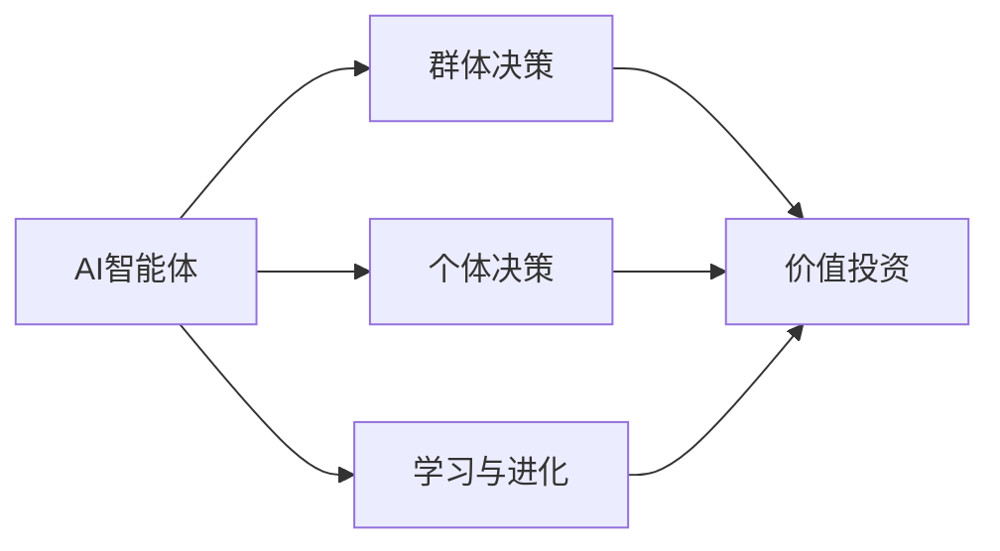
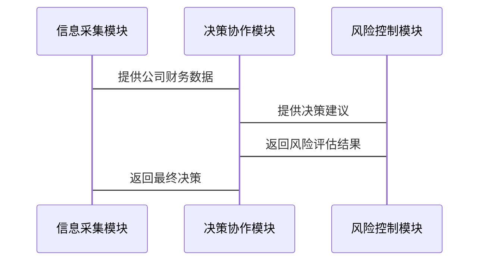

                 


# AI智能体群体决策：提高价值投资的准确性和稳定性

> 关键词：AI智能体、群体决策、价值投资、算法原理、系统架构、项目实战

> 摘要：本文详细探讨了AI智能体群体决策在价值投资中的应用，分析了其提高投资决策准确性和稳定性的核心原理。通过理论分析、算法实现和实际案例，展示了如何通过AI技术优化投资决策过程，为投资者提供更可靠的投资策略。

---

# 第1章: AI智能体群体决策的背景与意义

## 1.1 AI智能体的基本概念

### 1.1.1 什么是AI智能体
AI智能体（Artificial Intelligence Agent）是指具有感知环境、做出决策、执行动作能力的智能系统。它能够根据输入的信息（如数据、市场动态等）进行分析和推理，并输出相应的决策或行动。

### 1.1.2 AI智能体的核心特征
- **自主性**：能够自主决策，无需外部干预。
- **反应性**：能够实时感知环境变化并做出响应。
- **目标导向**：具有明确的目标，并采取行动以实现目标。
- **学习能力**：能够通过经验改进自身的决策能力。

### 1.1.3 AI智能体与传统算法的区别
AI智能体不仅仅是简单的算法，它具有更强的自主性和适应性，能够根据环境变化动态调整策略。

## 1.2 群体决策的基本概念

### 1.2.1 群体决策的定义
群体决策是指多个个体或智能体共同参与决策过程，通过协作或竞争形成最终决策的机制。

### 1.2.2 群体决策的特点
- **多样性**：不同个体或智能体的决策偏好可能不同。
- **协同性**：通过协作优化整体决策效果。
- **动态性**：群体决策过程可能会随着环境变化而动态调整。

### 1.2.3 群体决策与个体决策的对比
| 对比维度 | 个体决策 | 群体决策 |
|----------|----------|----------|
| 决策主体 | 单一主体 | 多个主体 |
| 决策过程 | 独立完成 | 协作完成 |
| 决策效果 | 可能存在片面性 | 通常更全面 |

## 1.3 AI智能体群体决策的背景

### 1.3.1 价值投资的现状与挑战
- 传统价值投资依赖个人经验和主观判断，存在较大的不确定性。
- 市场波动和信息不对称使得投资决策复杂化。

### 1.3.2 传统投资决策的局限性
- 个体决策容易受到情绪影响。
- 信息处理能力有限，难以应对复杂市场环境。

### 1.3.3 AI智能体群体决策的优势
- 能够整合多个智能体的决策信息，形成更全面的决策依据。
- 通过群体协作，提高决策的稳定性和准确性。

## 1.4 本书的核心目标

### 1.4.1 提高投资决策的准确性
通过AI智能体的协作，优化投资决策的准确性。

### 1.4.2 提高投资决策的稳定性
减少个体决策的波动性，提高整体决策的稳定性。

### 1.4.3 实现AI智能体群体决策的落地
将AI智能体群体决策技术应用于实际投资场景中，验证其效果。

---

# 第2章: 价值投资与群体决策的结合

## 2.1 价值投资的基本原理

### 2.1.1 价值投资的定义
价值投资是一种以公司基本面分析为基础的投资策略，旨在通过识别被低估的股票进行投资。

### 2.1.2 价值投资的核心原则
- **安全边际**：买入价格低于内在价值。
- **长期视角**：关注公司长期盈利能力。

### 2.1.3 价值投资的关键因素
- 公司财务状况。
- 行业地位。
- 管理团队能力。

## 2.2 群体决策在价值投资中的应用

### 2.2.1 群体决策如何提高投资决策的准确性
- 多个智能体从不同角度分析公司基本面。
- 群体决策能够整合多种信息，降低误判风险。

### 2.2.2 群体决策如何提高投资决策的稳定性
- 群体决策通过分布式协作，减少个体决策的波动性。
- 群体决策能够在市场波动中保持稳定性。

### 2.2.3 群体决策在价值投资中的具体应用场景
- **多维度分析**：多个智能体分别关注财务指标、行业趋势、管理团队等方面。
- **风险控制**：通过群体决策识别潜在风险，降低投资风险。

## 2.3 AI智能体在群体决策中的角色

### 2.3.1 AI智能体如何辅助群体决策
- **信息整合**：AI智能体能够快速整合多个来源的信息。
- **决策优化**：通过算法优化群体决策的效率和效果。

### 2.3.2 AI智能体在价值投资中的具体功能
- **数据处理**：分析公司财务数据、市场动态等。
- **决策支持**：为投资者提供决策建议。

### 2.3.3 AI智能体与人类投资者的协作模式
- **人机协作**：AI智能体辅助人类投资者做出更明智的决策。
- **独立决策**：AI智能体可以独立完成部分投资决策任务。

## 2.4 本章小结

---

# 第3章: AI智能体群体决策的核心概念与联系

## 3.1 AI智能体的核心概念

### 3.1.1 AI智能体的结构与功能
- **感知层**：获取环境信息。
- **决策层**：分析信息并做出决策。
- **执行层**：执行决策动作。

### 3.1.2 AI智能体的决策机制
- **基于规则的决策**：根据预设规则做出决策。
- **基于学习的决策**：通过机器学习模型进行决策。

### 3.1.3 AI智能体的学习与进化
- **监督学习**：通过标注数据进行学习。
- **强化学习**：通过奖励机制优化决策。

## 3.2 群体决策的核心概念

### 3.2.1 群体决策的形成过程
- **信息收集**：个体智能体收集相关信息。
- **决策协商**：个体智能体之间协商形成共识。
- **最终决策**：基于协商结果形成最终决策。

### 3.2.2 群体决策的优化方法
- **加权投票法**：根据个体智能体的权重进行投票。
- **共识算法**：通过共识算法达成一致决策。

### 3.2.3 群体决策的评估指标
- **准确性**：群体决策的正确率。
- **稳定性**：群体决策的波动性。

## 3.3 AI智能体与群体决策的关系

### 3.3.1 AI智能体如何影响群体决策
- **信息丰富性**：AI智能体能够提供更全面的信息。
- **决策效率**：AI智能体能够提高群体决策的效率。

### 3.3.2 群体决策如何提升AI智能体的性能
- **经验共享**：通过群体决策，AI智能体可以共享经验，提高个体性能。
- **协作优化**：群体决策能够优化个体决策的不足。

## 3.4 核心概念与联系的Mermaid图



---

# 第4章: AI智能体群体决策的算法原理

## 4.1 多智能体协作算法

### 4.1.1 多智能体协作的基本原理
- 多个智能体通过通信模块共享信息。
- 群体决策通过协商机制达成共识。

### 4.1.2 多智能体协作的实现流程
1. **信息收集**：每个智能体收集相关信息。
2. **信息共享**：智能体之间共享信息。
3. **决策协商**：通过协商机制形成共识。
4. **执行决策**：根据共识结果执行决策。

### 4.1.3 多智能体协作的算法实现
```python
class Agent:
    def __init__(self, id):
        self.id = id
        self.info = None

    def receive_info(self, info):
        self.info = info

    def send_info(self):
        return self.info

# 初始化多个智能体
agents = [Agent(i) for i in range(5)]

# 信息共享过程
for agent in agents:
    agent.receive_info("公司财务数据")

# 决策协商过程
consensus = agents[0].send_info()
for agent in agents[1:]:
    consensus = agent.send_info() if agent.send_info() else consensus

print("群体决策结果：", consensus)
```

---

## 4.2 群体决策算法

### 4.2.1 群体决策算法的核心原理
- 通过加权投票或共识算法达成群体决策。

### 4.2.2 群体决策算法的实现流程
1. **初始化**：设置每个智能体的权重。
2. **投票过程**：每个智能体根据权重进行投票。
3. **计算共识**：根据投票结果形成最终决策。

### 4.2.3 群体决策算法的数学模型
$$
\text{最终决策} = \sum_{i=1}^{n} w_i \cdot d_i
$$
其中，$w_i$ 是第i个智能体的权重，$d_i$ 是第i个智能体的决策。

---

## 4.3 稳定性优化算法

### 4.3.1 稳定性优化的核心原理
- 通过引入稳定性机制，减少群体决策的波动性。

### 4.3.2 稳定性优化的实现流程
1. **监控波动**：实时监控群体决策的波动性。
2. **调整权重**：根据波动性调整智能体的权重。
3. **优化决策**：通过调整权重优化决策的稳定性。

### 4.3.3 稳定性优化的数学模型
$$
w_i = \frac{1}{1 + \alpha \cdot \text{波动性}}
$$
其中，$\alpha$ 是调整系数，波动性是群体决策的波动指标。

---

# 第5章: AI智能体群体决策的系统分析与架构设计

## 5.1 问题场景介绍

### 5.1.1 价值投资中的信息处理问题
- 信息量大，复杂性高。
- 信息更新速度快。

### 5.1.2 传统决策系统中的不足
- 依赖个体经验，决策效率低。
- 风险控制能力有限。

### 5.1.3 AI智能体群体决策的解决方案
- 利用AI智能体的协作能力，提高决策效率。
- 通过群体决策优化风险控制。

## 5.2 系统功能设计

### 5.2.1 系统功能模块
- **信息采集模块**：采集公司财务数据、市场动态等。
- **决策协作模块**：实现智能体之间的协作决策。
- **风险控制模块**：监控决策过程中的风险。

### 5.2.2 系统功能流程
1. **信息采集**：智能体采集相关信息。
2. **信息共享**：智能体之间共享信息。
3. **决策协商**：通过协商机制形成共识。
4. **执行决策**：根据共识结果执行投资决策。
5. **风险监控**：实时监控决策过程中的风险。

## 5.3 系统架构设计

### 5.3.1 系统架构图


### 5.3.2 系统接口设计
- **信息采集接口**：用于采集公司财务数据。
- **决策协作接口**：用于智能体之间的协作决策。
- **风险控制接口**：用于监控投资风险。

### 5.3.3 系统交互流程图


---

# 第6章: AI智能体群体决策的项目实战

## 6.1 环境安装与配置

### 6.1.1 安装Python环境
```bash
python --version
pip install numpy matplotlib
```

### 6.1.2 安装依赖库
```bash
pip install numpy matplotlib
```

## 6.2 系统核心功能实现

### 6.2.1 多智能体协作实现
```python
import numpy as np

class Agent:
    def __init__(self, id):
        self.id = id
        self.info = None

    def receive_info(self, info):
        self.info = info

    def send_info(self):
        return self.info

# 初始化多个智能体
agents = [Agent(i) for i in range(5)]

# 信息共享过程
for agent in agents:
    agent.receive_info("公司财务数据")

# 决策协商过程
consensus = agents[0].send_info()
for agent in agents[1:]:
    consensus = agent.send_info() if agent.send_info() else consensus

print("群体决策结果：", consensus)
```

### 6.2.2 群体决策算法实现
```python
class ConsensusAlgorithm:
    def __init__(self, agents):
        self.agents = agents

    def compute_consensus(self):
        info_list = [agent.send_info() for agent in self.agents]
        if not info_list:
            return None
        return max(info_list, key=lambda x: x[1])

# 初始化多个智能体
agents = [Agent(i) for i in range(5)]

# 初始化共识算法
consensus_algorithm = ConsensusAlgorithm(agents)

# 计算共识
consensus = consensus_algorithm.compute_consensus()
print("群体决策结果：", consensus)
```

## 6.3 项目实战案例分析

### 6.3.1 案例背景
- 投资标的：某公司股票。
- 数据来源：公司财务报表、行业趋势、市场动态。

### 6.3.2 案例分析
1. **信息采集**：智能体采集公司财务数据、行业趋势等信息。
2. **信息共享**：智能体之间共享信息。
3. **决策协商**：通过协商机制形成共识。
4. **执行决策**：根据共识结果执行投资决策。
5. **风险监控**：实时监控投资风险。

## 6.4 代码解读与分析

### 6.4.1 多智能体协作实现
- 每个智能体都有自己的ID和信息。
- 智能体之间通过发送和接收信息实现协作。

### 6.4.2 群体决策算法实现
- 通过计算每个智能体的信息，形成最终共识。

## 6.5 项目小结

---

# 第7章: 总结与展望

## 7.1 本章总结

### 7.1.1 核心内容回顾
- AI智能体群体决策的基本概念。
- 群体决策在价值投资中的应用。
- 群体决策算法的核心原理。

### 7.1.2 技术实现总结
- 多智能体协作算法的实现。
- 群体决策算法的优化。
- 系统架构设计的要点。

## 7.2 未来展望

### 7.2.1 技术发展
- 更复杂的群体决策算法。
- 更高效的多智能体协作机制。

### 7.2.2 应用场景扩展
- 更多金融领域的应用。
- 更广泛的投资场景应用。

## 7.3 最佳实践 tips

### 7.3.1 系统设计建议
- 选择合适的算法和架构。
- 确保系统的可扩展性。

### 7.3.2 实践中的注意事项
- 定期更新算法和模型。
- 重视数据质量和完整性。

---

# 附录: 更多资源与参考资料

## 附录A: 相关论文与书籍

## 附录B: 开源项目与工具

---

通过以上内容，我们系统地介绍了AI智能体群体决策的核心概念、算法原理、系统架构和实际应用，为读者提供了一个全面的视角去理解和实现AI智能体群体决策在价值投资中的应用。

