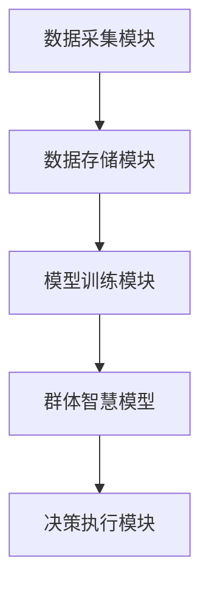

                 


# AI智能体群体智慧：集体决策在价值投资中的应用

> 关键词：AI智能体，群体智慧，集体决策，价值投资，算法原理，系统架构，投资策略

> 摘要：本文探讨了AI智能体群体智慧在集体决策中的应用，特别是如何将这一技术应用于价值投资领域。通过分析群体决策的算法原理、系统架构设计以及实际项目实现，展示了AI智能体如何通过群体智慧提升投资决策的准确性和稳定性。本文还结合实际案例，详细讲解了系统的设计思路和实现过程，为读者提供了从理论到实践的全面指导。

---

# 第一部分：AI智能体群体智慧概述

## 第1章：AI智能体与群体智慧基础

### 1.1 AI智能体的基本概念

#### 1.1.1 什么是AI智能体
AI智能体（Artificial Intelligence Agent）是指能够感知环境、自主决策并采取行动的智能实体。它可以是一个软件程序、机器人或其他形式的智能系统。AI智能体的核心目标是通过感知和行动来优化其目标函数。

#### 1.1.2 AI智能体的核心特征
- **自主性**：能够独立决策，无需外部干预。
- **反应性**：能够实时感知环境并做出反应。
- **目标导向性**：所有行为都以优化目标函数为导向。
- **学习能力**：能够通过经验改进自身决策能力。

#### 1.1.3 群体智慧的定义与特点
群体智慧是指多个个体通过协同合作所表现出的智能。与个体智能相比，群体智慧能够通过个体之间的信息共享和协作，形成超越个体能力的集体决策能力。其特点包括：
- **去中心化**：没有单一的控制中心。
- **分布式计算**：个体之间通过分布式计算实现协同。
- **涌现性**：群体智慧的结果是通过个体行为的“涌现”产生的。

### 1.2 集体决策的背景与意义

#### 1.2.1 集体决策的定义
集体决策是指通过多个个体的协同合作，共同做出决策的过程。与个体决策相比，集体决策能够利用更多个体的信息和知识，从而提高决策的准确性和稳定性。

#### 1.2.2 集体决策的优势与挑战
- **优势**：
  - 提高决策的全面性。
  - 减少个体偏见的影响。
  - 增强决策的鲁棒性。
- **挑战**：
  - 信息同步与协调的难度。
  - 如何避免“羊群效应”。
  - 如何设计有效的决策机制。

#### 1.2.3 集体决策在投资中的应用潜力
在投资领域，集体决策可以通过整合多个投资者的决策信息，形成更稳定的决策结果。尤其是在价值投资中，集体决策可以通过多个AI智能体的协同，实现对市场信息的更全面分析。

---

## 第2章：价值投资与集体决策的结合

### 2.1 价值投资的基本原理

#### 2.1.1 价值投资的定义
价值投资是一种投资策略，强调通过分析企业的基本面，寻找被市场低估的投资标的。其核心理念是“买便宜的，而不是买上涨的”。

#### 2.1.2 价值投资的核心理念
- **长期视角**：关注企业的长期价值，而非短期价格波动。
- **安全边际**：寻找市场价格低于内在价值的投资标的。
- **深度分析**：通过对企业财务状况、行业地位等多方面的分析，做出投资决策。

#### 2.1.3 价值投资的关键要素
- **企业基本面**：包括财务状况、盈利能力、行业地位等。
- **市场估值**：市场价格与内在价值的对比。
- **风险控制**：通过分散投资降低风险。

### 2.2 集体决策在价值投资中的应用场景

#### 2.2.1 投资决策中的信息整合
通过多个AI智能体的协同，可以整合不同个体的市场信息、财务数据和投资建议，形成更全面的投资决策依据。

#### 2.2.2 群体智慧在风险控制中的作用
群体智慧可以通过多个个体的风险评估结果，综合形成更稳定的决策，从而降低投资风险。

#### 2.2.3 集体决策对投资收益的提升
通过集体决策，可以避免个体决策中的偏见和误判，从而提高投资决策的准确性和收益。

---

## 第3章：AI智能体群体智慧的核心概念

### 3.1 AI智能体的群体行为模型

#### 3.1.1 群体行为的基本特征
- **协作性**：个体之间通过协作实现共同目标。
- **竞争性**：个体之间可能存在竞争关系。
- **适应性**：能够根据环境变化调整行为。

#### 3.1.2 AI智能体的协同机制
- **通信机制**：个体之间通过通信共享信息。
- **协调机制**：通过某种规则实现行为的协调。
- **学习机制**：通过经验改进协同效果。

#### 3.1.3 群体智慧的数学模型
群体智慧可以通过数学模型进行描述。例如，可以通过加权投票模型来表示群体决策的过程：

$$
\text{最终决策} = \sum_{i=1}^{n} w_i \cdot x_i
$$

其中，$w_i$ 是第 $i$ 个个体的权重，$x_i$ 是第 $i$ 个个体的决策。

### 3.2 集体决策的算法原理

#### 3.2.1 基于共识的决策算法
基于共识的决策算法是一种通过多个个体的投票或协商达成一致决策的算法。其流程如下：

1. **信息收集**：每个个体根据自身信息做出决策。
2. **信息共享**：个体之间共享决策信息。
3. **共识达成**：通过某种机制达成一致决策。

#### 3.2.2 基于投票的决策算法
基于投票的决策算法是一种通过统计个体的投票结果来做出集体决策的方法。其流程如下：

1. **个体决策**：每个个体根据自身信息做出决策。
2. **投票统计**：统计所有个体的投票结果。
3. **决策输出**：根据投票结果确定最终决策。

#### 3.2.3 基于加权的决策算法
基于加权的决策算法是一种通过给不同个体赋予不同的权重，从而做出集体决策的方法。其流程如下：

1. **个体决策**：每个个体根据自身信息做出决策。
2. **权重分配**：根据个体的能力或历史表现分配权重。
3. **加权计算**：根据权重计算最终决策。

---

## 第4章：群体智慧在价值投资中的数学模型

### 4.1 群体决策的数学表达

#### 4.1.1 集体决策的投票函数
集体决策的投票函数可以通过以下公式表示：

$$
f(x) = \sum_{i=1}^{n} w_i \cdot x_i
$$

其中，$w_i$ 是第 $i$ 个个体的权重，$x_i$ 是第 $i$ 个个体的决策。

#### 4.1.2 集体决策的权重分配
权重分配可以通过多种方式进行，例如：

- **均匀分配**：每个个体的权重相同。
- **基于能力分配**：根据个体的能力分配权重。
- **基于历史表现分配**：根据个体的历史表现分配权重。

#### 4.1.3 集体决策的优化模型
集体决策的优化模型可以通过以下公式表示：

$$
\max \sum_{i=1}^{n} w_i \cdot x_i \quad \text{subject to} \quad \sum_{i=1}^{n} w_i = 1
$$

---

## 第5章：群体智慧系统的系统架构设计

### 5.1 系统功能设计

#### 5.1.1 数据采集模块
数据采集模块负责收集市场数据、企业信息等。

#### 5.1.2 模型训练模块
模型训练模块负责训练群体智慧模型。

#### 5.1.3 决策执行模块
决策执行模块负责根据模型输出做出投资决策。

### 5.2 系统架构图

#### 5.2.1 系统架构的Mermaid图



#### 5.2.2 模块之间的交互关系
数据采集模块负责采集数据，存储模块负责存储数据，模型训练模块负责训练模型，群体智慧模型负责生成决策，决策执行模块负责执行决策。

---

## 第6章：群体智慧系统的项目实战

### 6.1 环境安装与配置

#### 6.1.1 Python环境的安装
安装Python 3.8及以上版本。

#### 6.1.2 相关库的安装
安装以下库：
- `numpy`
- `pandas`
- `scikit-learn`
- `mermaid`

#### 6.1.3 开发工具的配置
安装Jupyter Notebook或其他开发工具。

### 6.2 核心代码实现

#### 6.2.1 群体决策算法的实现

```python
import numpy as np

def collective_decision(x, weights):
    return np.dot(weights, x)

# 示例
x = np.array([0.8, 0.6, 0.7])
weights = np.array([0.4, 0.3, 0.3])
decision = collective_decision(x, weights)
print("最终决策结果：", decision)
```

#### 6.2.2 价值投资模型

```python
import pandas as pd

# 假设df是包含股票数据的DataFrame
def value_investment_model(df):
    # 计算内在价值
    intrinsic_value = df['净利润'] / df['市盈率']
    # 计算安全边际
    margin_of_safety = intrinsic_value / df['股价'] - 1
    return margin_of_safety

# 示例
df = pd.DataFrame({
    '股价': [10, 20, 30],
    '净利润': [5, 10, 15],
    '市盈率': [20, 15, 10]
})
result = value_investment_model(df)
print("安全边际：", result)
```

### 6.3 项目实战小结

通过以上代码实现，我们可以看到，群体智慧在价值投资中的应用是可行的。通过多个AI智能体的协同，可以实现对市场信息的更全面分析，从而提高投资决策的准确性和稳定性。

---

## 第7章：群体智慧在价值投资中的最佳实践

### 7.1 小结
群体智慧在价值投资中的应用具有显著的优势，例如提高决策的准确性和稳定性。然而，同时也需要关注数据质量和模型的鲁棒性。

### 7.2 注意事项
- 数据质量是关键，需要确保数据的准确性和全面性。
- 模型的鲁棒性需要通过多次测试和优化来保证。
- 需要结合具体的投资策略进行调整和优化。

### 7.3 拓展阅读
- 《群体智慧入门》
- 《价值投资实战指南》
- 《AI在金融中的应用》

---

通过以上内容，我们可以看到，群体智慧在价值投资中的应用是一个充满潜力的领域。通过AI智能体的协同合作，可以实现更高效的决策过程，从而为投资者带来更大的收益。

