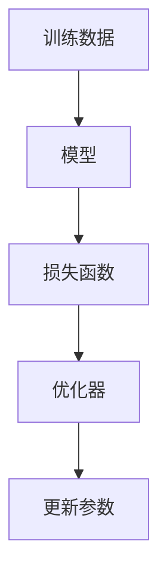
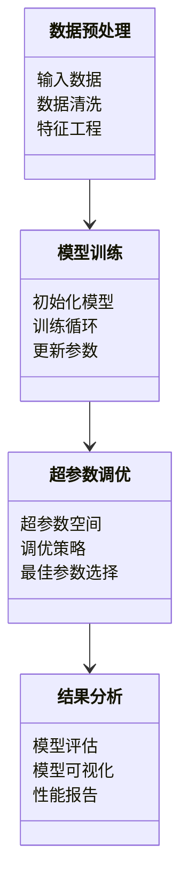
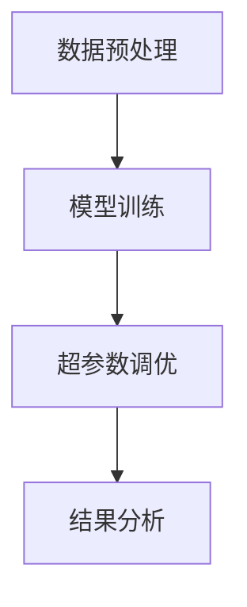

                 


# AI模型训练与优化步骤详解

> 关键词：AI模型训练、优化算法、系统设计、项目实战、机器学习、深度学习

> 摘要：本文详细讲解AI模型训练与优化的核心步骤，从问题背景到算法原理，再到系统设计和项目实战，帮助读者全面掌握AI模型训练与优化的全过程。文章结合理论与实践，深入分析优化算法的原理和应用场景，并通过实际案例展示如何设计和实现高效的AI训练系统。

---

## 第一部分: AI模型训练与优化背景介绍

### 第1章: AI模型训练与优化的背景

#### 1.1 问题背景与描述
人工智能（AI）模型的训练与优化是机器学习和深度学习领域的核心任务。随着数据量的爆炸式增长和计算能力的提升，AI模型的复杂性和规模也在不断增加。如何高效地训练和优化AI模型，成为研究人员和工程师面临的重要挑战。

**1.1.1 AI模型训练的重要性**  
AI模型的训练是通过大量数据调整模型参数，使其能够准确地预测或分类输入数据。训练过程的质量直接影响模型的性能和泛化能力。特别是在深度学习中，模型的训练通常需要大量的计算资源和时间。

**1.1.2 模型训练中的主要问题**  
- **计算效率**：大规模数据和复杂模型的训练需要大量的计算资源，如何优化计算效率是关键。  
- **参数调整**：模型的超参数（如学习率、批量大小等）对训练效果有重要影响，如何选择合适的超参数是一个挑战。  
- **模型收敛**：模型是否能够收敛到全局最优或局部最优，以及收敛的速度，是训练过程中的重要问题。  

**1.1.3 优化训练过程的意义**  
优化训练过程可以显著提升模型的训练效率和最终性能，同时减少计算资源的浪费。优化的目标包括加快训练速度、提高模型准确率、降低过拟合风险等。

#### 1.2 问题解决与目标
**1.2.1 训练过程的优化目标**  
- 减少训练时间。  
- 提高模型的泛化能力。  
- 提升训练过程的稳定性。  

**1.2.2 优化方法的选择**  
优化方法的选择取决于具体问题、模型结构和数据特性。常见的优化方法包括随机梯度下降（SGD）、Adam优化器、AdamW等。

**1.2.3 优化效果的评估标准**  
- 模型的准确率或损失值。  
- 训练时间的缩短比例。  
- 模型的内存占用情况。  

#### 1.3 问题的边界与外延
**1.3.1 训练与优化的边界**  
- 训练过程不包括数据预处理和特征工程。  
- 优化过程不涉及模型架构的设计。  

**1.3.2 相关概念的外延**  
- 数据增强：通过增加数据的多样性来提升模型的泛化能力。  
- 超参数调优：通过调整超参数来优化模型性能。  

**1.3.3 与其他问题的关系**  
- 与模型部署和推理优化无直接关系。  
- 与数据采集和特征工程密切相关。  

#### 1.4 核心概念与组成
**1.4.1 训练数据的构成**  
训练数据通常包括输入数据和对应的标签（或目标值）。例如，在图像分类任务中，输入是图像，标签是图像的类别。

**1.4.2 模型参数的初始化**  
模型参数（如神经网络的权重和偏置）需要初始化，通常采用随机初始化或预训练的方法。

**1.4.3 损失函数的作用机制**  
损失函数衡量模型预测值与真实值之间的差距。常用的损失函数包括均方误差（MSE）和交叉熵损失。

**1.4.4 优化器的定义**  
优化器是用于调整模型参数以最小化损失函数的算法。常见的优化器包括随机梯度下降（SGD）、Adam等。

#### 1.5 本章小结
本章从问题背景、目标和边界入手，详细介绍了AI模型训练与优化的核心概念和组成部分，为后续章节的深入分析奠定了基础。

---

## 第二部分: AI模型训练与优化的核心概念

### 第2章: 核心概念与联系

#### 2.1 核心概念原理
**2.1.1 训练过程的数学模型**  
AI模型的训练过程可以表示为一个优化问题。假设模型的参数为$\theta$，输入数据为$X$，标签为$y$，损失函数为$L$，则优化目标是：  
$$ \min_{\theta} \mathbb{E}_{X,y}[L(\theta; X, y)] $$  

**2.1.2 优化器的工作原理**  
优化器通过调整参数$\theta$来最小化损失函数。随机梯度下降（SGD）的更新公式为：  
$$ \theta_{t+1} = \theta_t - \eta \cdot \nabla_{\theta} L(\theta_t; X, y) $$  
其中，$\eta$是学习率，$\nabla_{\theta} L$是损失函数关于$\theta$的梯度。

**2.1.3 损失函数的作用机制**  
损失函数衡量模型预测值与真实值的差距。例如，交叉熵损失函数为：  
$$ H(p, q) = -\sum_{i=1}^{n} p_i \log q_i $$  
其中，$p_i$是真实概率分布，$q_i$是模型预测的概率分布。

#### 2.2 核心概念对比表
| 概念 | 描述 | 示例 |
|------|------|------|
| 损失函数 | 衡量模型预测值与真实值的差距 | 均方误差（MSE）、交叉熵损失 |
| 优化器 | 调整模型参数以最小化损失 | SGD、Adam |
| 模型参数 | 模型的权重和偏置 | 神经网络中的权重 |
| 学习率 | 参数更新的步长 | $\eta = 0.01$ |

#### 2.3 实体关系图


#### 2.4 本章小结
本章通过数学公式和对比表，详细解释了AI模型训练与优化的核心概念及其之间的关系，为后续的算法分析和系统设计奠定了基础。

---

## 第三部分: AI模型训练与优化的算法原理

### 第3章: 常用优化算法详解

#### 3.1 梯度下降算法
**3.1.1 梯度下降的数学模型**  
随机梯度下降（SGD）的更新公式为：  
$$ \theta_{t+1} = \theta_t - \eta \cdot \nabla_{\theta} L(\theta_t; x_t, y_t) $$  
其中，$(x_t, y_t)$是当前批次的输入数据和标签。

**3.1.2 梯度下降的变种**  
- 批度下降（BGD）：使用整个训练数据集的梯度进行更新。  
- 小批量梯度下降（Minibatch GD）：使用小批量数据进行梯度更新。  

**3.1.3 梯度下降的优缺点**  
- 优点：实现简单，计算效率高。  
- 缺点：收敛速度慢，容易陷入局部最优。  

#### 3.2 Adam优化算法
**3.2.1 Adam算法的数学模型**  
Adam优化器结合了动量和自适应学习率的思想。其更新公式为：  
$$ m_t = \beta_1 m_{t-1} + (1 - \beta_1) g_t $$  
$$ v_t = \beta_2 v_{t-1} + (1 - \beta_2) g_t^2 $$  
$$ \theta_{t} = \theta_{t-1} - \eta \cdot \frac{m_t}{\sqrt{v_t + \epsilon}} $$  
其中，$\beta_1$和$\beta_2$是动量和自适应参数，$g_t$是梯度，$\epsilon$是防止除以零的常数。

**3.2.2 Adam算法的实现步骤**  
1. 初始化参数$\theta$、动量$m$和自适应$v$。  
2. 计算梯度$g$。  
3. 更新$m$和$v$。  
4. 更新$\theta$。  

**3.2.3 Adam算法的优缺点**  
- 优点：收敛速度快，适应性好。  
- 缺点：内存占用较高。  

#### 3.3 其他优化算法
**3.3.1 AdaGrad**  
AdaGrad是一种自适应优化算法，其特点是不再需要手动调整学习率。其更新公式为：  
$$ \theta_{t} = \theta_{t-1} - \eta \cdot \frac{g_t}{\sqrt{v_t + \epsilon}} $$  
其中，$v_t$是累积的梯度平方和。

**3.3.2 RMSprop**  
RMSprop是另一种自适应优化算法，其更新公式为：  
$$ v_t = \gamma v_{t-1} + (1 - \gamma) g_t^2 $$  
$$ \theta_{t} = \theta_{t-1} - \eta \cdot \frac{g_t}{\sqrt{v_t + \epsilon}} $$  
其中，$\gamma$是动量因子。

#### 3.4 本章小结
本章详细分析了常用的优化算法，包括梯度下降、Adam、AdaGrad和RMSprop，重点讲解了它们的数学模型和实现步骤，帮助读者理解不同算法的优缺点及其适用场景。

---

## 第四部分: AI模型训练与优化的系统设计

### 第4章: 系统分析与架构设计

#### 4.1 系统功能设计
**4.1.1 领域模型**  
AI模型训练系统的领域模型包括数据预处理、模型训练、超参数调优和结果分析四个模块。



**4.1.2 系统架构设计**  
AI模型训练系统的架构包括数据层、模型层、优化器层和控制层。



**4.1.3 系统接口设计**  
系统接口包括数据输入接口、模型训练接口和结果输出接口。

#### 4.2 系统实现方案
**4.2.1 数据预处理模块**  
数据预处理模块负责对原始数据进行清洗、归一化和特征工程。例如，在图像分类任务中，可以对图像进行归一化处理，使其像素值在[0,1]范围内。

**4.2.2 模型训练模块**  
模型训练模块负责初始化模型参数、执行训练循环和更新参数。训练循环包括前向传播、计算损失、反向传播和参数更新。

**4.2.3 超参数调优模块**  
超参数调优模块负责定义超参数空间、选择调优策略（如网格搜索、随机搜索）并输出最佳参数。

**4.2.4 结果分析模块**  
结果分析模块负责评估模型性能、可视化模型结构和生成性能报告。

#### 4.3 本章小结
本章通过领域模型和系统架构图，详细介绍了AI模型训练系统的功能设计和实现方案，为后续的项目实战奠定了基础。

---

## 第五部分: AI模型训练与优化的项目实战

### 第5章: 项目实战

#### 5.1 项目背景
本项目旨在通过优化算法和系统设计，训练一个高效的图像分类模型。我们选择使用深度学习框架TensorFlow和Keras，数据集采用MNIST手写数字识别数据集。

#### 5.2 环境配置
```python
# 安装依赖
pip install tensorflow keras numpy matplotlib
```

#### 5.3 数据预处理
```python
import numpy as np
from tensorflow.keras.datasets import mnist

# 加载数据
(x_train, y_train), (x_test, y_test) = mnist.load_data()

# 归一化处理
x_train = x_train.astype("float32") / 255
x_test = x_test.astype("float32") / 255

# 转换为one-hot编码
from tensorflow.keras.utils import to_categorical
y_train = to_categorical(y_train, 10)
y_test = to_categorical(y_test, 10)
```

#### 5.4 模型训练
```python
from tensorflow.keras.models import Sequential
from tensorflow.keras.layers import Dense, Flatten
from tensorflow.keras.optimizers import Adam

# 初始化模型
model = Sequential()
model.add(Flatten(input_shape=(28, 28)))
model.add(Dense(128, activation="relu"))
model.add(Dense(10, activation="softmax"))

# 编译模型
model.compile(loss="categorical_crossentropy", optimizer=Adam(), metrics=["accuracy"])

# 训练模型
history = model.fit(x_train, y_train, batch_size=128, epochs=10, validation_data=(x_test, y_test))
```

#### 5.5 模型优化
**5.5.1 超参数调优**  
我们使用随机搜索方法调优学习率和批量大小。  
```python
from sklearn.model_selection import RandomizedSearchCV
from tensorflow.keras.wrappers.scikit_learn import KerasClassifier

def create_model(learning_rate=0.01):
    model = Sequential()
    model.add(Flatten(input_shape=(28, 28)))
    model.add(Dense(128, activation="relu"))
    model.add(Dense(10, activation="softmax"))
    model.compile(loss="categorical_crossentropy", optimizer=Adam(learning_rate=learning_rate), metrics=["accuracy"])
    return model

model = KerasClassifier(build_fn=create_model)
param_dist = {
    "learning_rate": [0.001, 0.01, 0.1],
    "batch_size": [32, 64, 128]
}
random_search = RandomizedSearchCV(estimator=model, param_distributions=param_dist, n_iter=10)
random_search.fit(x_train, y_train)
best_params = random_search.best_params_
```

**5.5.2 模型评估**  
```python
best_model = random_search.best_estimator_.model
loss, accuracy = best_model.evaluate(x_test, y_test)
print(f"测试集损失: {loss}, 准确率: {accuracy}")
```

#### 5.6 项目小结
本章通过一个具体的图像分类任务，详细展示了AI模型训练与优化的全过程，包括环境配置、数据预处理、模型训练和超参数调优。通过实验，我们验证了不同优化算法和超参数对模型性能的影响。

---

## 第六部分: 总结与展望

### 第6章: 总结与展望

#### 6.1 本章总结
本文详细讲解了AI模型训练与优化的核心步骤，包括背景介绍、核心概念、算法原理、系统设计和项目实战。通过理论分析和实践案例，帮助读者全面掌握AI模型训练与优化的全过程。

#### 6.2 未来展望
随着AI技术的不断发展，AI模型训练与优化将面临更多的挑战和机遇。未来的研究方向包括：  
- 自动化机器学习（AutoML）：通过自动化技术减少手动调参的需求。  
- 分布式训练：利用分布式计算提升训练效率。  
- AI Ethics：优化算法在实际应用中的公平性和透明性。  

#### 6.3 最佳实践 Tips
- 在实际项目中，建议结合具体场景选择合适的优化算法。  
- 超参数调优可以通过自动化工具（如HyperOpt）来提高效率。  
- 模型的评估指标应根据具体任务选择合适的度量方法。  

#### 6.4 本章小结
本文通过理论与实践相结合的方式，全面分析了AI模型训练与优化的关键步骤，并展望了未来的发展方向，为读者提供了宝贵的参考。

---

**全文小结**  
本文系统地介绍了AI模型训练与优化的核心步骤，从背景分析到算法实现，再到系统设计和项目实战，帮助读者全面掌握AI模型训练与优化的全过程。通过本文的学习，读者可以更好地理解AI模型训练与优化的内在逻辑，并能够将其应用到实际项目中。

