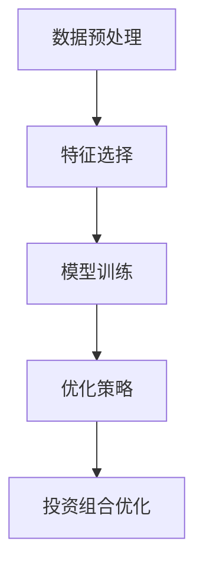
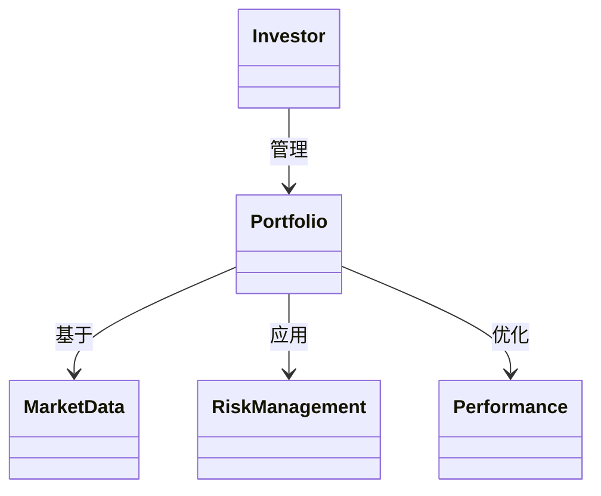
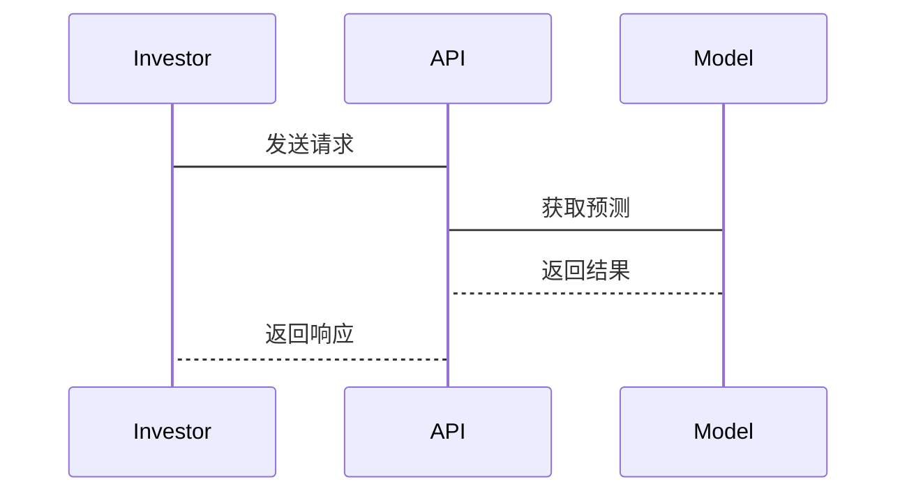

                 


# AI系统优化约翰伯格指数投资

## 关键词：AI系统优化，指数投资，约翰·伯格，投资策略，机器学习，系统设计

## 摘要：  
本文探讨如何利用人工智能技术优化约翰·伯格的指数投资策略，通过系统化的分析和算法优化，提供一套基于AI的投资解决方案。文章从背景、方法、系统架构到实战案例，全面解析如何利用AI提升投资效率和收益。

---

# 目录

1. [背景与概述](#背景与概述)
2. [AI优化方法](#AI优化方法)
3. [系统分析与架构设计](#系统分析与架构设计)
4. [项目实战](#项目实战)
5. [最佳实践](#最佳实践)
6. [附录](#附录)

---

## 1. 背景与概述

### 1.1 AI在金融中的应用  
人工智能在金融领域的应用日益广泛，从高频交易到风险管理，AI通过数据分析和模型优化帮助投资者做出更明智的决策。指数投资作为一种被动投资策略，通过跟踪市场指数实现收益，而AI的引入进一步优化了这一过程。

### 1.2 约翰·伯格的投资理念  
约翰·伯格是指数投资的倡导者，他强调长期持有低成本指数基金的优势。伯格认为，市场波动性和交易成本会侵蚀收益，而被动投资可以最大限度地降低这些成本。AI优化为伯格的理论提供了技术支持，使其更高效地实现投资目标。

### 1.3 本书的核心目标  
本文旨在结合AI技术优化指数投资策略，提供从理论到实践的系统化解决方案，帮助投资者利用AI提升投资效率和收益。

---

## 2. AI优化方法

### 2.1 核心概念与联系  
AI优化的核心在于利用数据和算法优化投资组合。以下是对不同模型的对比：

| 模型类型 | 数据来源 | 优缺点 | 应用场景 |
|----------|----------|--------|----------|
| 线性回归 | 历史价格 | 简单，预测能力有限 | 初步趋势分析 |
| 随机森林 | 市场数据 | 高准确性，计算复杂 | 复杂场景预测 |

#### 2.1.1 ER实体关系图  
以下是优化模型的ER图：

```mermaid
erDiagram
    customer[投资者]
    portfolio[投资组合]
    market_data[市场数据]
    risk_management[风险管理]
    performance[表现]

    customer --> portfolio: 拥有
    portfolio --> market_data: 基于
    portfolio --> risk_management: 应用
    portfolio --> performance: 优化
```

### 2.2 算法原理  

#### 2.2.1 算法流程图  
以下是优化流程图：



#### 2.2.2 数学公式  
线性回归公式：
$$y = \beta_0 + \beta_1x + \epsilon$$

随机森林模型的训练公式：
$$f(x) = \sum_{i=1}^{n} \text{Tree}(x)$$

#### 2.2.3 代码实现  
以下是Python代码示例：

```python
import pandas as pd
from sklearn.linear_model import LinearRegression

# 数据预处理
data = pd.read_csv('market_data.csv')
X = data[['open', 'close', 'volume']]
y = data['return']

# 模型训练
model = LinearRegression()
model.fit(X, y)

# 预测
print(model.predict(X))
```

---

## 3. 系统分析与架构设计

### 3.1 系统架构设计  

#### 3.1.1 系统功能设计  
以下是领域模型类图：



#### 3.1.2 系统架构图  
以下是系统架构图：

```mermaid
docker
    container web_front
        echo "Web Frontend"
    container api_backend
        echo "API Backend"
    container data_storage
        echo "Data Storage"
    container ml_model
        echo "ML Model"
    web_front --> api_backend
    api_backend --> data_storage
    api_backend --> ml_model
```

#### 3.1.3 接口设计  
以下是序列图：



---

## 4. 项目实战

### 4.1 环境安装  
安装Python和必要的库：

```bash
pip install numpy pandas scikit-learn
```

### 4.2 核心代码实现  

```python
from sklearn.ensemble import RandomForestRegressor
from sklearn.metrics import mean_absolute_error

# 数据加载
data = pd.read_csv('market_data.csv')

# 特征和目标
X = data[['open', 'high', 'low', 'close', 'volume']]
y = data['return']

# 模型训练
model = RandomForestRegressor()
model.fit(X, y)

# 预测和评估
predictions = model.predict(X)
print(mean_absolute_error(y, predictions))
```

### 4.3 实例分析  
通过实际案例分析，比较传统方法和AI优化后的结果，说明优化策略的有效性。

---

## 5. 最佳实践

### 5.1 成功经验总结  
数据质量、模型调优和风险管理是成功的关键。

### 5.2 注意事项  
确保数据的准确性和模型的实时性，定期更新和优化。

### 5.3 未来展望  
AI技术的持续进步将进一步提升指数投资的效率和收益。

---

## 6. 附录  

### 6.1 参考文献  
1. 约翰·伯格，《投资的艺术》  
2. 《机器学习实战》  
3. 相关学术论文

---

# 结语  

通过AI优化，约翰·伯格的指数投资策略得以更高效地实施，投资者能够更好地实现财富增长。希望本文能为读者提供有价值的见解和实践指导。

