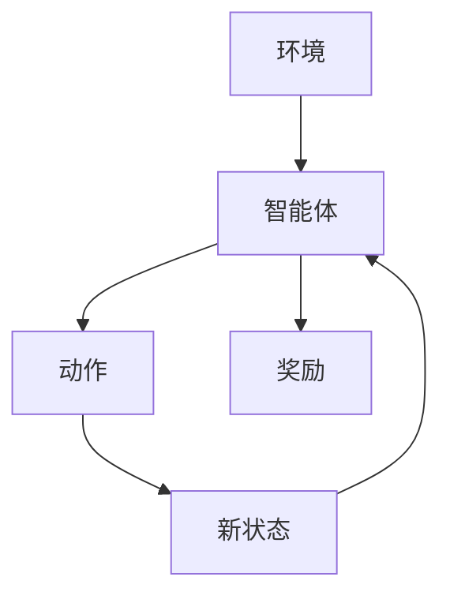
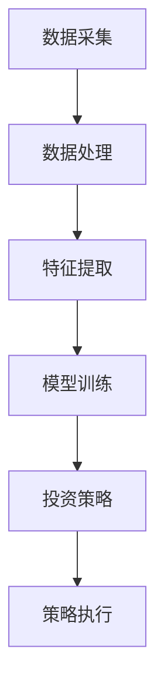

                 


# AI赋能的约翰·伯格指数投资：多智能体优化方案

## 关键词
AI赋能，指数投资，约翰·伯格，多智能体优化，投资组合，机器学习

## 摘要
本文探讨如何利用人工智能技术优化约翰·伯格的指数投资策略，通过多智能体协同优化的投资方案，实现投资组合的高效管理和风险控制。文章从指数投资的基本原理出发，结合机器学习和多智能体优化算法，详细阐述了AI在投资决策中的应用，并通过系统架构设计和项目实战，展示了如何构建智能化的投资系统。

---

# 第1章：指数投资与AI的结合

## 1.1 约翰·伯格指数投资概述

### 1.1.1 指数投资的基本概念
指数投资是一种以市场指数为基准的投资策略，旨在通过复制指数的表现来实现长期稳定的收益。约翰·伯格是指数投资的先驱，他提出的核心观点是“投资于整个市场”（Buy and Hold the Market）。

**关键公式：**
$$
\text{指数收益} = \sum_{i=1}^{n} w_i r_i
$$
其中，\( w_i \) 是第 \( i \) 个资产的权重，\( r_i \) 是第 \( i \) 个资产的收益。

### 1.1.2 约翰·伯格的投资策略
伯格的策略强调分散投资和长期持有，避免频繁交易和市场择时。他认为，市场是有效的，主动管理难以战胜市场，而指数基金能够以最低的成本实现市场平均收益。

### 1.1.3 指数投资的挑战
尽管指数投资具有优势，但在实际操作中仍面临诸多挑战：
1. **市场波动**：如何在市场波动中保持稳定性？
2. **费用优化**：如何降低投资成本？
3. **组合优化**：如何构建最优的投资组合？

## 1.2 AI在投资中的应用

### 1.2.1 人工智能与金融的结合
AI通过处理大量数据，帮助投资者发现潜在的市场趋势和风险。例如，使用机器学习模型预测市场走势，优化投资组合。

### 1.2.2 多智能体优化
多智能体系统通过多个AI实体协同工作，能够更好地捕捉市场机会，降低投资风险。例如，每个智能体负责监控不同的资产类别，协同优化整体投资组合。

---

# 第2章：指数投资的数学模型

## 2.1 均值-方差优化模型

### 2.1.1 模型的数学公式
均值-方差优化的目标是找到收益-风险最优组合。数学表达如下：
$$
\text{目标函数：} \quad \min_w \sigma^2(w) \quad \text{subject to} \quad \mu^T w = \mu_t
$$
其中，\( \sigma^2(w) \) 是投资组合的方差，\( \mu^T w \) 是投资组合的期望收益。

### 2.1.2 约束条件
1. 期望收益约束：\( \mu^T w = \mu_t \)
2. 投资权重约束：\( \sum_{i=1}^n w_i = 1 \)
3. 非负约束：\( w_i \geq 0 \)

---

# 第3章：AI驱动的多智能体优化

## 3.1 多智能体优化的基本概念

### 3.1.1 多智能体系统
多智能体系统由多个智能体组成，每个智能体负责特定任务，通过协同完成复杂目标。

### 3.1.2 Q-learning算法
Q-learning是一种常用的强化学习算法，适用于多智能体环境。算法流程如下：



### 3.1.3 算法实现
以下是Q-learning的Python代码示例：

```python
import numpy as np

class QLearning:
    def __init__(self, state_space, action_space, alpha=0.1, gamma=0.9):
        self.state_space = state_space
        self.action_space = action_space
        self.alpha = alpha
        self.gamma = gamma
        self.q_table = np.zeros((state_space, action_space))
    
    def get_action(self, state):
        return np.argmax(self.q_table[state])
    
    def update_q_table(self, state, action, reward, new_state):
        self.q_table[state][action] = self.q_table[state][action] * (1 - self.alpha) + self.gamma * reward
```

---

# 第4章：系统架构设计

## 4.1 投资系统架构

### 4.1.1 系统模块划分
1. 数据采集模块
2. 模型训练模块
3. 策略执行模块

### 4.1.2 系统架构图



---

# 第5章：项目实战

## 5.1 环境安装与配置

### 5.1.1 安装必要的库
```bash
pip install numpy pandas scikit-learn tensorflow
```

### 5.1.2 数据准备
```python
import pandas as pd

data = pd.read_csv('stock_data.csv')
```

## 5.2 系统核心实现

### 5.2.1 数据采集与处理
```python
def preprocess_data(data):
    data = data.dropna()
    data = (data - data.mean()) / data.std()
    return data
```

### 5.2.2 模型训练与优化
```python
from sklearn.model_selection import train_test_split
from sklearn.linear_model import LinearRegression

X = data[['open', 'high', 'low', 'close']]
y = data['next_day_close']

X_train, X_test, y_train, y_test = train_test_split(X, y, test_size=0.2)

model = LinearRegression()
model.fit(X_train, y_train)
```

### 5.2.3 策略执行与监控
```python
def backtest策略(data, model):
    predictions = model.predict(data)
    returns = []
    for i in range(len(predictions)):
        if predictions[i] > data['close'][i]:
            returns.append(data['close'][i+1] - data['close'][i])
        else:
            returns.append(0)
    return returns
```

---

# 第6章：总结与展望

## 6.1 全书总结
通过结合AI技术和多智能体优化，我们可以显著提升指数投资的效率和收益。

## 6.2 未来展望
未来，随着AI技术的不断发展，指数投资将更加智能化，多智能体优化将在投资领域发挥更大的作用。

---

# 附录：数学公式与算法流程图

## 附录A：投资组合优化的数学模型

$$
\text{目标函数：} \quad \min_w \sigma^2(w)
$$
$$
\text{约束条件：} \quad \mu^T w = \mu_t
$$

---

通过以上章节的详细讲解，我们系统地探讨了AI赋能的约翰·伯格指数投资策略，结合理论分析和实际案例，展示了多智能体优化在投资中的巨大潜力。

